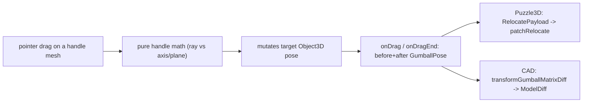

# Unified Gumball

## Goal

Replace the single-mode drei `TransformControls` (one of translate / rotate / scale at a time) used by Puzzle 3D and CAD with one shared, custom gumball that shows **all** handles simultaneously:

- 3 axis move arrows (X / Y / Z)
- 3 plane move handles (XY / YZ / XZ)
- 3 rotate rings (around X / Y / Z)
- 3 axis scale handles (X / Y / Z)
- 1 uniform scale handle (center)

Each dimension is independently draggable. The widget lives in `ui/react` (the adapter layer, the only place allowed to touch THREE/R3F behind `sceneHostPort`) and is consumed by both domains.

## Why a custom widget

drei `TransformControls` only renders one mode at a time and cannot show move+rotate+scale together. The repo already drives it via a target `THREE.Object3D` and reads back `position/quaternion/scale` (`GumballMatrixSnapshot` in [cad/js/renderer/index.tsx](cad/js/renderer/index.tsx) lines 1585-1600; before/after pose in [puzzle/3d/react/index.tsx](puzzle/3d/react/index.tsx) lines 4549-4596). Both consumers already speak the exact same pose shape `{position, quaternion, scale}`, so a custom widget that drives a pivot `Object3D` and emits before/after poses is a drop-in replacement.

## Data flow

## 1. New shared component in `ui/react/index.tsx`

Add a `🔖️UnifiedGumball` region near the scene-host exports.

Public surface:

- `type GumballPose = { position: Vec3; quaternion: [number,number,number,number]; scale: Vec3 }`
- `type GumballHandleKind = "moveX|moveY|moveZ|moveXY|moveYZ|moveXZ|rotateX|rotateY|rotateZ|scaleX|scaleY|scaleZ|scaleUniform"`
- `interface GumballConfig` — booleans `moveAxes`, `movePlanes`, `rotate`, `scaleAxes`, `scaleUniform` (all default `true`); optional `translationSnap`, `rotationSnap`, `scaleSnap`, `size`.
- `function UnifiedGumball(props: { target: THREE.Object3D; config?: GumballConfig; onDragStart?(kind, pose); onDrag?(kind, pose); onDragEnd?(kind, before, after); onDraggingChanged?(active: boolean) })`

Behavior:

- Renders handle meshes via `sceneHostPort.three` primitives (cylinder+cone arrows, plane quads, torus rings, scale cubes, center cube), portaled into the scene like the existing pattern, in a group synced each frame (`sceneHostPort.fiber.useFrame`) to `target` world position+quaternion, scaled to a constant screen size from camera distance.
- Pointer down on a handle: `setPointerCapture`, snapshot `before` pose, add window `pointermove`/`pointerup`, set `controls.enabled=false` via `useThree(s=>s.controls)` (OrbitControls uses `makeDefault`, see [puzzle/3d/react/index.tsx](puzzle/3d/react/index.tsx) line 6082), call `onDraggingChanged(true)`.
- `pointermove`: compute pointer NDC from `gl.domElement` rect + `camera`, run the matching pure math helper, mutate `target` pose, call `onDrag`.
- `pointerup`: emit `onDragEnd(kind, before, after)`, re-enable controls, `onDraggingChanged(false)`.
- Hover highlight per handle (color/opacity).

Pure, unit-testable helpers (also in this region, no THREE objects required beyond simple vector math so they test headless):

- `gumballAxisTranslate(rayOrigin, rayDir, axisPoint, axisDir, start) -> distance`
- `gumballPlaneTranslate(rayOrigin, rayDir, planePoint, planeNormal) -> point`
- `gumballAxisRotateAngle(startVec, currentVec, axisDir) -> radians`
- `gumballAxisScaleFactor(startProj, currentProj) -> factor`
- snapping helpers for each.

This file already has in-source vitest at line 16481; tests go there.

## 2. Puzzle 3D wiring — `puzzle/3d/react/index.tsx`

Replace the `<TransformControls>` inside `ObjectTransformControls` (lines 4535-4600) with `<UnifiedGumball target={props.object} ... />`.

- `onDragEnd(kind, before, after)` builds the existing `RelocatePayload` (line 4573); set `payload.mode` from the dragged handle kind (move* -> `translate`, rotate* -> `rotate`, scale\* -> `scale`) so `relocateAffectedObjectIds` (line 2159) keeps moving attracted descendants only on translate.
- Keep `puzzle3dRelocateDragActiveRef` / `cancelPuzzle3dMarqueeGesture` wiring via `onDraggingChanged`.
- Keep translate grid snap (`translationSnap`) by passing `config.translationSnap` (line 4708 logic).
- The `relocateMode` toolbar in [puzzle/3d/play/index.ts](puzzle/3d/play/index.ts) becomes group-visibility toggles (multi-select) mapped to `GumballConfig`; default all groups on.

## 3. CAD wiring — `cad/js/renderer/index.tsx`

Replace the `<TransformControls>` inside `SpatialTransformGumball` (lines 1659-1682) with `<UnifiedGumball target={tcTarget} ... />`.

- `onDragEnd` -> `transformGumballMatrixDiff(props.model, props.targets, before, after)` (line 1603, signature already matches `GumballPose`), commit if non-empty, then reset pivot group (existing lines 1675-1678).
- The per-pane transform combobox in [cad/js/renderer/play/index.tsx](cad/js/renderer/play/index.tsx) (`CadTransformGumballMode`, [cad/js/core/index.ts](cad/js/core/index.ts) line 4219) is widened to a `GumballConfig` (multi-toggle, keeping `none` to hide the gumball); `cadTransformGumballModeToControlsMode` (line 4251) is removed.

## 4. Tests (extend existing in-source blocks only)

- `ui/react/index.tsx` (line 16481 block): unit tests for the pure handle-math helpers (axis translate distance, plane intersection, rotate angle, scale factor, snapping).
- `cad/js/renderer/index.tsx` (existing `transformGumballMatrixDiff` test at line 5948): add cases for rotate/scale deltas through the same diff path.
- `puzzle/3d/react/index.tsx` (existing relocate/applyObjectPose describes): add a case asserting `RelocatePayload.mode` is derived correctly per handle kind.

## Constraints honored

- Lives behind `sceneHostPort` (no new direct external dependency); `ui/react` stays business-logic-free (pure component + math).
- Edits existing files only, uses `//#region` structuring, emoji docstrings, concise code, no in-definition comments.
- Repo MCP ticket opened before implementation; temp artifacts (if any) kept under the ticket folder.

## Open default decisions (chosen, not blocking)

- Default config shows every handle group at once (matches "everything at once").
- Pivot for both domains stays at their current origin (object group for Puzzle 3D, selection bbox center for CAD).
- Toolbars repurposed from single-mode radios to multi-toggle visibility; `none`/all-off hides the gumball.
