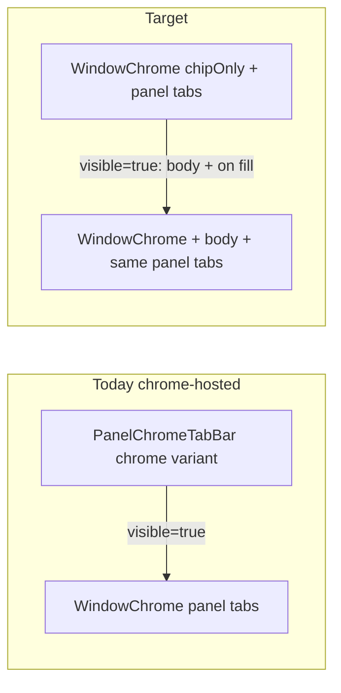

# Unify Window Chips, Buttons, and Toggles

## Problem

Chrome-hosted panel toggles **swap control families** on open:

- **Folded:** [`PanelChromeTabBar`](ui/js/react/index.tsx) → `PanelTabBar variant="chrome"` → [`panelChromeTabBarClass`](ui/js/react/index.tsx) (`border rounded-sm ui-glass` + `panelTabButtonClass` / `border-e` dividers). `showActiveColor={visible}` is **false**, so no pressed fill.
- **Open:** floating [`Panel`](ui/js/react/index.tsx) → [`WindowChrome`](ui/js/react/index.tsx) title chips → `variant="panel"` → `modeDockTabClassName` / `modeDockActiveTabClass` on a glass chip-cap.

That is why toggling a panel feels like a different widget, not “the same toggle turned on.” Navbar [`ButtonGroup`](ui/js/react/index.tsx) / [`ToggleGroup`](ui/js/react/index.tsx) use a third stack (`border divide-x` + `data-state="on"`), and [`ShellParentHover`](ui/styling/js/ui.css) styles those slots but not `panel-tab-button`.

Non-chrome panels already do the right *shape*: folded = `WindowChrome chipOnly`, open = full `WindowChrome` with the same `variant="panel"` tabs. Chrome-hosted must match that.



## Chosen approach

**One shared chrome-control vocabulary** (glass group + transparent cells + shared hover/on fill). Panel open/close only adds the body and the on/active fill—same strip classes either way. Buttons and toggles use that same vocabulary so chips / buttons / toggles read as one family.

Goal: `🎯r2602`. Prefer reopening related chrome work only if still open; otherwise open a new ticket (e.g. unify control chrome). Keep temp logs under the ticket folder. Do not mix other technologies.

## Implementation

### 1. Shared control chrome tokens (single source)

In [`ui/js/react/index.tsx`](ui/js/react/index.tsx), introduce (or collapse existing aliases into) one group + one item recipe used by chips, buttons, and toggles:

- **Group:** `h-medium`, level `ui-glass`, outer stroke (`border` + `borderNormalClass`), `divide-x` / `divide-normal`, `overflow-hidden` — same silhouette-adjacent look as a chip-cap cell when not in a U-frame.
- **Item:** transparent rest, `h-medium`, shared padding/typography (`text-xs` / icon sizing), `interactiveHoverClass` (or the existing handle-excluding hover helpers), pressed via the **same** fill token as today (`interactiveOnClass` / `interactiveActiveFillClass` / `modeDockActiveTabFillClass` — one winner, no parallel fills).
- Wire **ButtonGroup**, **ToggleGroup**, **ActionGroup** roots/items to these tokens (replace divergent `buttonGroupItemVariants` / `toggleVariants` chrome pieces that only differ cosmetically).
- Wire **window / panel / mode-dock tab cells** and control buttons to the same item tokens so a chip cell and a toggle cell are indistinguishable at rest and when on.

### 2. Folded chrome-hosted = chipOnly WindowChrome

Change [`PanelChromeTabBar`](ui/js/react/index.tsx) so folded tabs render:

```tsx
<WindowChrome chipOnly level="panel" titleChips={
  <PanelTabBar variant="panel" maxRows={1} ... />
} />
```

- Drop the `"chrome"` visual path: remove use of `panelChromeTabBarClass` / `panelAnchorTabButtonClass` as a second look (delete or reduce `variant="chrome"` to an alias of `"panel"` if still needed for host semantics).
- Keep DnD / selection / open-on-press behavior.
- When `visible`, continue returning `null` so the open `Panel` owns the strip (unfold-in-place)—but that strip must be class-identical to the folded chipOnly strip.

### 3. On-state = toggle on, not restyle

- Folded and open tab buttons share the **same** class stack; only `data-active` / active fill classes differ when the panel (or tab) is on.
- Stop treating `showActiveColor={visible}` as “no fill while folded” for chrome hosts if that makes a selected tab look “off” while the strip is still the panel’s control—pressed appearance must match ToggleGroup `data-state="on"`.
- Align shell CSS in [`ui/styling/js/ui.css`](ui/styling/js/ui.css) `ShellParentHover`: either include `panel-tab-button` with the same on/hover rules as `toggle-group-item` / `button-group-item`, or rely entirely on shared utility classes so slot-specific CSS is unnecessary.

### 4. Tests (extend existing inline vitest only)

In [`ui/js/react/index.tsx`](ui/js/react/index.tsx) tests:

- Assert folded `PanelChromeTabBar` markup contains `window-chrome-chip-cap` / `ui-glass` and the same tab button classes as an open chrome-hosted `Panel` title strip (diff only active/on + body).
- Assert ButtonGroup / ToggleGroup item classes include the shared item tokens (and no longer diverge on height/padding/hover/on fill).
- Update obsolete expectations that require `panelChromeTabBarClass` / chrome-only class strings (e.g. “middle anchors use panel level and glass chrome styling”).

### 5. Verify

Run focused `ui` react tests / typecheck via existing nx/`script.ts` targets; stash logs under the ticket folder. Confirm runtime: toggling a navbar panel only adds on-fill + body—no rounded glass strip ↔ silhouette chip morph.

## Out of scope

- wgpu parity only if React tokens already have mirrors; do not expand into unrelated technologies.
- Do not reopen goal management; do not close unrelated tickets unless this work fully supersedes them.
