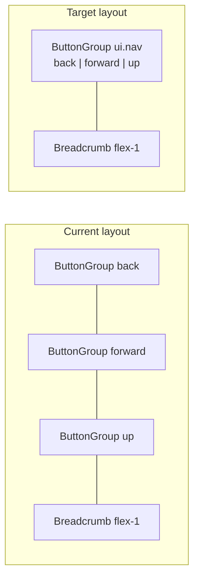

# Unify back / forward / up navigation button group

## Problem

In `[framework/product/platform/renderer/react/index.tsx](framework/product/platform/renderer/react/index.tsx)`, `PlatformView` registers **three separate navbar items**, each wrapping one control in its own `ButtonGroup`:

```4456:4478:framework/product/platform/renderer/react/index.tsx
	navbarItems.push({
		key: "navBack",
		content: (
			<ButtonGroup id="ui.nav.back">
				<ButtonGroupItem id="ui.nav.back" ... />
			</ButtonGroup>
		),
	});
	// same pattern for navForward and navUp
```

`[Navbar](ui/react/index.tsx)` lays out items with `flex gap-single` (line ~7290). Each `ButtonGroup` also carries its own full border (`border divide-x h-medium`). Result:

- Three bordered boxes with **two extra gaps** between back / forward / up
- Breadcrumb (also `border` on `[Breadcrumb](ui/react/index.tsx)`) sits immediately after the **up** group only — visually cramped / misaligned relative to the nav cluster

This matches the bug report: breadcrumb “touches” the nav controls wrongly because the nav chrome is fragmented.

## Intended pattern (already used elsewhere)

Sketchpad’s recovered shell groups all three controls in **one** navbar item and one `ButtonGroup` (see `[.repo/🎫️/26/05/24/SKETCHPAD-DECLARATIVE-UI-SHELL/recover-index.tsx](.repo/🎫️/26/05/24/SKETCHPAD-DECLARATIVE-UI-SHELL/recover-index.tsx)` ~22460–22482): single outer border, `divide-x` between items, then `flex-1` breadcrumb as the next navbar item.



## Implementation

**Single file change** (production code): `[framework/product/platform/renderer/react/index.tsx](framework/product/platform/renderer/react/index.tsx)`

1. Replace the three `navbarItems.push` blocks with **one** item, e.g. `key: "navHistory"`:

```tsx
navbarItems.push({
 key: "navHistory",
 content: (
  <ButtonGroup id="ui.nav">
   <ButtonGroupItem id="ui.nav.back" onClick={onGoBack} className={cn(!canGoBackProp && "opacity-30 pointer-events-none")} icon={<Icon icon="arrow-left" size="small" />} />
   <ButtonGroupItem id="ui.nav.forward" onClick={onGoForward} className={cn(!canGoForwardProp && "opacity-30 pointer-events-none")} icon={<Icon icon="arrow-right" size="small" />} />
   <ButtonGroupItem id="ui.nav.up" onClick={onGoUp} className={cn(!canGoUpProp && "opacity-30 pointer-events-none")} icon={<Icon icon="arrow-up" size="small" />} />
  </ButtonGroup>
 ),
});
```

1. Keep the existing breadcrumb item unchanged (`key: "breadcrumb"`, `className: "flex-1 min-w-0"`).
2. Update the layout doc comment (~4181) from `[back] [forward] [up]` to `[nav history group]` (or similar).

**No i18n changes required** — per-button ids stay `ui.nav.back` / `forward` / `up`; `[resolveControlLabelId](ui/react/index.tsx)` already resolves those segments. Group id `ui.nav` is only for structure (no `showLabel` on the group).

**No `ui.css` changes** — spacing fix comes from fewer navbar flex children and one shared border.

## Tests

Extend existing `PlatformView` vitest block in the same file (~4853):

- Render `<PlatformView ... uri="/apps/demo" />`
- Assert markup contains **one** `data-slot="button-group"` with `id="ui.nav"` (or count: exactly one button-group before breadcrumb in nav region)
- Assert all three item ids still present: `ui.nav.back`, `ui.nav.forward`, `ui.nav.up`
- Existing breadcrumb test (`aria-label="breadcrumb"`) should remain green

Optional (low value): add a small static markup test in `[ui/react/index.tsx](ui/react/index.tsx)` vitests mirroring the combined three-item group — not strictly required since platform test covers the real shell.

## Verification

1. Open repo ticket via MCP (`repo://goals`, `ticket_open`) before implementation; temp notes in ticket folder only.
2. Run platform renderer tests: `nx` target for `@semio-tech/framework-platform-renderer-react` vitest (or project’s existing `test` script via `script.ts`).
3. Manually confirm in any app using `PlatformView` (platform play / presentation): navbar shows `[←|→|↑]  gap  breadcrumb` with aligned `h-medium` heights and no double-border between nav buttons.

## Out of scope

- `.repo/🎫️/...` archive copies (`framework-react-head.tsx`) — not production sources
- Sketchpad / other products unless they duplicate this navbar (grep shows only `PlatformView` uses `ui.nav.`\* today)
