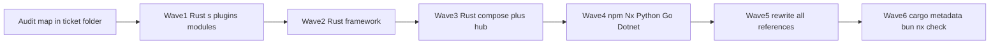

# Unify All Package Names With Location

## Goal and ticket

- Associate with goal **AI-OPTIMIZED-REPO** (repo consistency / no legacy identifiers).
- Continue open ticket `[RENAME-LEGACY-PACKAGE-NAMES-END-TO-END](.🦑️repo/🎫️tickets/🎆️26/� comb️05/☀️30/RENAME-LEGACY-PACKAGE-NAMES-END-TO-END)` (issue [#1509](https://github.com/usalu/semio/issues/1509)); put audit scripts, rename maps, and logs only in that ticket folder.
- Repo MCP was unavailable earlier (auth skipped); authenticate `project-0-semio-repo` before edits, then `ticket_reopen` with the new prompt scope.

## Canonical naming rules (no exceptions for compose/hub)

Derive from emoji-stripped path segments (skip structural folders: `implementation`, `rust`/`typescript`/`python`/`dotnet`/`go`, `product`, `module`, `manifest`/`artifact` where they are scaffolding only).

| Tree                                          | Rust `[package].name`                                       | npm / Nx `name`                                                                           |
| --------------------------------------------- | ----------------------------------------------------------- | ----------------------------------------------------------------------------------------- |
| `✏️s/🔌️plugin/
/🛂️manifest/...`           | `semio-s-plugin-
`                                        | `@semio-tech/
-plugin` (or existing `@semio-tech/
-rs` if already the bundle)         |
| `✏️s/🔌️plugin/
/🎛️app/<a>/.../<slot>/...` | `semio-s-app-<a>[-<slot>]` (already mostly done)            | keep `@semio-tech/...` aligned with app/slot                                              |
| `✏️s/🔌️plugin/
/🔨️module/<m>/...`         | `semio-s-plugin-
-<m>`                                    | `@semio-tech/
-<m>-rs`                                                                  |
| `✏️s/🔨️module/...`                           | `semio-s-kernel-...` (geometry/mindmap/imperative as today) | `@semio-tech/kernel-...`                                                                  |
| `🧰️framework/...`                            | `semio-framework-...` / `semio-framework-os-kernel-...`     | `@semio-tech/framework-...` / `@semio-tech/ui-...`                                        |
| `compose/...`                                 | `semio-compose-...`                                         | `@semio-tech/compose-...`                                                                 |
| `🌎️hub/...`                                  | `semio-hub-...`                                             | n/a (Rust-only today)                                                                     |
| Root workspace                                | n/a                                                         | `workspace` (match `[📋️project.json](📋️project.json)`; drop legacy root name `compose`) |

Concrete examples of expected renames:

- `puzzle-plugin` → `semio-s-plugin-puzzle`
- `s-plugin` → `semio-s-plugin-space`
- `remodel_engine` → `semio-s-plugin-remodel-engine`
- `ui_wgpu` → `semio-framework-ui-wgpu`
- `framework_editor` → `semio-framework-editor`
- `repo_cli` → `semio-framework-repo-cli`
- `compose` (crate) → `semio-compose-rs`
- `compose_query` → `semio-compose-query`
- `hub` / `hub-directory-*` → `semio-hub` / `semio-hub-directory-*`
- `compose-vscode` / `repo-vscode` → `@semio-tech/compose-vscode` / `@semio-tech/repo-vscode`
- `@semio-tech/infinite-cavas-react-renderer` → `@semio-tech/infinite-canvas-react-renderer`
- `@semio-tech/semio-asset` (and icon/image/logo) → `@semio-tech/asset` (drop doubled `semio-`)
- Python `compose` → `semio-compose`; `ui-styling` → `semio-framework-ui-styling`
- .NET `Elements.Styling` → location-aligned `Semio.Framework.Ui.Styling` (both framework and compose copies)
- Align the 4 `package.json` ≠ `project.json` name pairs (vscode ×2, trinity ram/lsp)

**Keep `[lib] name` / Rust crate import identifiers** updated in lockstep with `[package] name` when they still encode the old snake_case (no dual legacy import aliases—greenfield, no compatibility layers).

## Execution waves

1. **Audit map (ticket-only script)**
  Generate a complete `rename-map.json` (path → actual → expected) covering ~76 non-`semio-` crates under s/framework, 9 compose/hub crates, JS mismatches, Python/.NET. Diff against already-correct `semio-s-app-*` / `semio-s-plugin-{fem,gis,layout,note,vcs}` so those are not touched.
2. **Wave 1 — ✏️s Rust leftovers (~58)**
  - All remaining `{name}-plugin` manifests → `semio-s-plugin-{name}` (match existing fem/gis/layout/note/vcs).  
  - Plugin modules: animate/remodel/trinity/norm/fem/imperative/energy/sourcing/playbook/draw-fsm → `semio-s-plugin-*` or `semio-s-kernel-*` per path table above.  
  - Update every `Cargo.toml` dep key / `package = "..."` and root workspace member list only if paths change (paths stay; names change).
3. **Wave 2 — framework Rust (9)**
  `framework_editor`, `framework_surface_*`, `ui_*`, `repo_cli` → `semio-framework-*` forms matching neighboring already-renamed crates (e.g. `semio-framework-os-kernel-dsl-core`).
4. **Wave 3 — compose + hub Rust (9)**
  Prefix to `semio-compose-*` / `semio-hub-*`. Update compose workspace deps and any `extern crate` / path deps.
5. **Wave 4 — JS/Nx + other languages**
  - Force every `package.json` / `📋️project.json` under compose/repo/vscode/trinity/assets/infinite-canvas onto `@semio-tech/...` per table.  
  - Root `[package.json](package.json)` `name`: `compose` → `workspace`.  
  - Python `[compose/client/lib/py](compose/client/lib/py)`, framework ui-styling pyproject.  
  - Go modules under compose/repo: keep `github.com/usalu/semio/...` path-shaped modules; rename only if the module path still says a relocated/legacy segment (do not invent a second parallel scheme).  
  - Rename .NET `Elements.Styling` projects/namespaces to Semio location names; update solution refs.
6. **Wave 5 — reference sweep**
  Mechanical replace using the rename map across: `Cargo.toml`/`Cargo.lock`, `package.json`/`bun.lock`, `project.json`, `script.ts`, `.vscode/launch.json`, TS/JS imports, Rust `use` paths, vitest/vite aliases, nx config. No migration shims; handcraft all hits. Store the map + dry-run logs in the ticket folder (extend pattern from prior `[dry_run_rename.ts](.🦑️repo/🎫️tickets/🎆️26/� comb️06/☀️23/RENAME-ALL-PROJECTS-TO-SEMIO-TECH-PREFIX/dry_run_rename.ts)`).
7. **Wave 6 — verify**
  - `cargo metadata --no-deps` (no duplicate package names / missing members)  
  - `cargo check -p` on a sample of renamed crates per wave  
  - `bun install` / nx project graph for renamed npm packages  
  - Confirm zero remaining non-canonical names via re-running the audit script (allowlist only root `workspace` and third-party).

## Out of scope / non-goals

- Moving folders (paths already constitutional from the s-tree migration).  
- Opening/closing goals.  
- Rewriting app logic beyond name/import updates.

## Risk notes

- Root rename `compose` → `workspace` touches monorepo identity; update anything that keys off root package name.  
- High fan-out on `compose` / `puzzle-plugin` / `ui_wgpu`; do renames via the map in batches and regenerate `Cargo.lock`/`bun.lock` once per wave, not per crate.  
- Concurrent editors: only edit existing manifests; no worktrees; no git mutating commands.

