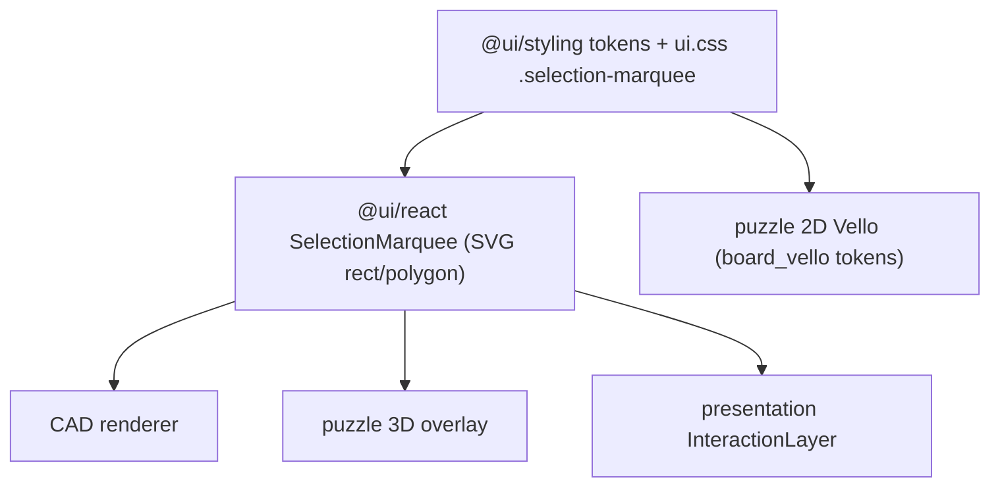

## Canonical decision (single source of truth)

- Stroke: `var(--color-primary)`, width `1.5`. Fill: `color-mix(in oklab, var(--color-primary) 12%, transparent)`.
- Partial -> `stroke-dasharray: 5 4` (dashed). Full -> solid.
- Convention everywhere: drag right-to-left (`end.x < start.x`) = partial (crossing); otherwise full (window/enclosing).
- Same style for both rectangle and lasso shapes.

## 1. Shared primitive + tokens (the enforcement mechanism)

- [ui/styling/js/ui.css](ui/styling/js/ui.css): add a `.selection-marquee` rule block (own region) defining fill/stroke/width on child `rect, polygon`, and `[data-coverage="partial"] rect, [data-coverage="partial"] polygon { stroke-dasharray: 5 4; }`. Reuses existing `--color-primary`.
- [ui/react/index.tsx](ui/react/index.tsx): add a `SelectionMarquee` region exporting `SelectionMarqueeCoverage = "partial" | "full"` and a component that renders one SVG overlay (`pointer-events-none absolute inset-0 h-full w-full overflow-visible`, `data-coverage`) containing either a `<rect>` (props accept px numbers or `%` strings, so percent callers work) or a `<polygon>` (lasso points). All styling comes from the CSS class -> identical dash/fill/stroke for rect and lasso. Export it from the index surface.

## 2. CAD - [cad/js/renderer/index.tsx](cad/js/renderer/index.tsx)

- Replace the inline SVG block (lines 5063-5088) with `<SelectionMarquee coverage={dragSelection.coverage} ... />`, mapping `method` (`rectangle`/`lasso`) and existing `dragOverlayPoints`/`dragOverlayRect` geometry. Drop bespoke `text-accent`/`text-foreground`, `fill-current/10`, hardcoded `5 4`.
- Coverage logic (`spatialSelectionCoverageFromPath`, ~2146) already uses `end.x < start.x` = partial -> already canonical, keep.

## 3. Puzzle 3D - [puzzle/3d/react/index.tsx](puzzle/3d/react/index.tsx)

- Rewrite `Puzzle3dMarqueeOverlay` (lines 7568-7603) to return `<SelectionMarquee>` with `coverage = marqueeIsCrossing(...) ? "partial" : "full"`, rectangle rect or lasso points (switch lasso from open `polyline` to the shared polygon). Keep store/gesture (`marqueeIsCrossing` = `endX < startX`, already canonical). Drop hardcoded `color-mix` strings and `4 3` dash.

## 4. Presentation / Projektetage - [framework/product/presentation/renderer/react/index.tsx](framework/product/presentation/renderer/react/index.tsx)

- Flip convention to canonical: `marqueeSelectionRule` (line 2461) -> `return end.x < start.x ? "crossing" : "window";`. This also aligns it with the presentation `AGENTS.md` spec ("going to the left partial inclusion is enough").
- `InteractionLayer` (lines 4440-4476): replace the `
` with `<SelectionMarquee coverage={rule === "crossing" ? "partial" : "full"} rect={{ left/top/width/height as "%" }} />` using the existing percent box.
- [framework/product/presentation/renderer/react/globals.css](framework/product/presentation/renderer/react/globals.css): remove the now-unused `.presentation-interaction-marquee*` rules (lines 691-707), including the secondary-color window variant.
- Update the existing in-file tests (lines 6619-6627) to the new direction expectations (extend existing test, do not add a file).

## 5. Puzzle 2D Vello (Rust) - [puzzle/2d/rs/lib.rs](puzzle/2d/rs/lib.rs) + [ui/styling/rs/board_vello_build.inc.rs](ui/styling/rs/board_vello_build.inc.rs)

- Align token alphas to canonical in `board_vello_build.inc.rs`: `SELECTION_PREVIEW_FILL` 0.14 -> 0.12, `SELECTION_PREVIEW_STROKE` 0.75 -> 1.0.
- Thread a `selection_preview_crossing: bool` next to `selection_screen_preview`, set in `sync_selection_screen_overlay` from the existing drag direction (`enclosing = last.x >= start.x`, so crossing = `last.x < start.x`).
- In the render (lines 5274-5284), when crossing use a dashed stroke (`Stroke::new(1.5)` with dashes `[5.0, 4.0]`) else solid -> dashed-on-partial parity with the React primitive.

## 6. Out of scope (with rationale)

- Playground figure-tile marquee ([framework/product/playground/renderer/react/index.tsx](framework/product/playground/renderer/react/index.tsx) ~5742) is a crop tool (creates a tile), not partial/full entity selection; it already uses primary. Leave unless you want it folded in too.

## 7. Process + verification

- Open a repo ticket (read `repo://goals`, associate, `ticket_open`) before editing; close with summary when done.
- Verify each play app at runtime (CAD play, puzzle 3D play, puzzle 2D play, presentation/Projektetage deck): rectangle + lasso show primary fill/stroke, dashed only when dragging right-to-left, solid otherwise. Run the presentation renderer test suite for the updated convention.

