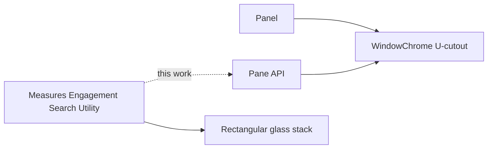

# Unify Window Pane Cutout And Width With Panels

## Problem

Shell **panels** already render through `[WindowChrome](🧰️framework/🔨️module/🖱️ui/⚛️react/⚡️implementation/🟦️typescript/📦️index.tsx)`: glass only on chip-cap + body, transparent U-gap, SVG silhouette, fold control on the right, open width default **300px**.

Built-in **window panes** (measures / engagement / search / utility) still use the old rectangular stack (`windowMeasuresStackClass` + header bar + `WindowPaneChromeToggle`). Open widths diverge (224px rail, `min(28rem,…)`, content `w-fit`). Ticket `[UNIFY-WINDOW-PANES-INTO-A-SHARED-8-ANCHOR-DRAGGABLE-PANE-API](.🦑️repo/🎫️tickets/🎆️26/� comb️07/☀️21/UNIFY-WINDOW-PANES-INTO-A-SHARED-8-ANCHOR-DRAGGABLE-PANE-API/)` already built `Pane`/`PaneHost` and **explicitly deferred** migrating these five overlays onto it.

The shared `Pane` component itself is also content-width when open (`w-fit`, no default `size`), so product panes that already use it still do not match panel width.

## Approach

Finish the deferred migration inside `[Window](🧰️framework/🔨️module/🖱️ui/⚛️react/⚡️implementation/🟦️typescript/📦️index.tsx)`: replace each rectangular overlay host with `Pane` (same `WindowChrome` path panels use). Do not invent a second chrome. Keep semantic slots/test hooks via `Pane`/`WindowChrome` `stackSlot`/`bodySlot` (extend `Pane` props if needed so existing `data-slot="window-measures-*"` selectors keep working).

### 1. Pane width parity with Panel

In `Pane`:

- Default `size = 300` (same as `Panel`)
- When open, always apply `width: ${size}px` and drop open-state `w-fit`
- Keep folded as chip-hugging (`chipOnly` / `w-fit`)
- Keep `minSize`/`maxSize` at 200/600
- Enable resize when `onSizeChange` is provided (same pattern as Panel), not a separate opt-in default

Align rail tokens so callers that still read `windowMeasuresDefaultWidthPx` resolve to **300** (update `layoutPanelRailUiSpacing` or stop using it and pass `size={300}`).

### 2. Map each built-in overlay onto `Pane`

| Overlay    | Anchor        | Folded prop        | titleChips      | close | enlarge                              | body                                  |
| ---------- | ------------- | ------------------ | --------------- | ----- | ------------------------------------ | ------------------------------------- |
| Measures   | `top-right`   | `measuresFolded`   | settings toggle | fold  | focus/unfocus (today’s span control) | measures tree                         |
| Engagement | `top-left`    | `actionsFolded`    | play toggle     | fold  | omit                                 | engagement + actionPane               |
| Search     | `top-middle`  | `searchFolded`     | search toggle   | fold  | omit                                 | Search                                |
| Utility    | `bottom-left` | `utilityBarFolded` | hammer toggle   | fold  | omit                                 | utilityBar; keep max-height clearance |

Preserve existing fold hotkeys, measures fullscreen expand (teach `Pane`/`WindowChrome` an `expanded` fill mode driven by `enlarge`, replacing the `inset-0` overlay branch), and utility-bar height clearance (`useWindowUtilityBarMaxHeightPx`).

Chip composition stays `WindowPaneChromeToggle`, but restyle it onto the same pill tokens as panel tabs (`modeDockInactiveTabClass` / active fill / `max-w-[12rem]`) so the chip-cap silhouette matches panels. Extend parent-hover CSS in `[🎨️ui.css](🧰️framework/🔨️module/🖱️ui/🎨️styling/⚡️implementation/🟦️typescript/🎨️ui.css)` so body hover emphasizes `window-pane-chrome-toggle` the same way it emphasizes `-tab-button`.

### 3. Delete rectangular chrome hosts

After migration, remove as layout hosts:

- `WindowMeasuresChrome`, `WindowEngagementChrome`, `WindowSearchChrome`, `UtilityBarChrome`
- `windowMeasuresStackClass` / `windowMeasuresChromeClass` / `windowRailChromeAsideClass` / `windowMeasuresRailWidthClass` / engagement-search `28rem` open defaults

Keep thin toggle helpers only if still needed for icon/label constants.

### 4. Ticket / verification

- Reopen the existing unify-window-panes ticket (or open a focused follow-up) via repo MCP once auth is available; put logs/temps in that ticket folder only.
- Extend existing vitest blocks in the UI barrel (no new test files): assert each overlay has `window-chrome-silhouette-border` + gap/chip slots when open, folded `chipOnly`, and open width `300px`.
- Run UI react typecheck + targeted vitest via nx.
- Confirm runtime silhouette/width with `[DEBUG]` logs if visual check is needed.

## Out of scope

- ModeDock parent **window** chrome convergence (separate fork; not what “window panes” means here).
- Cad REPL aside → floating pane.
- Product panel tab *content* layout (Document/Catalogue/Inspection).
- `MobilePanel` full-bleed exception.

