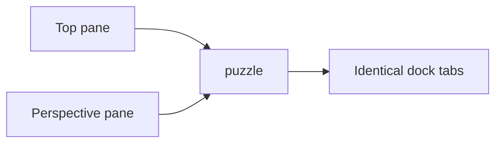
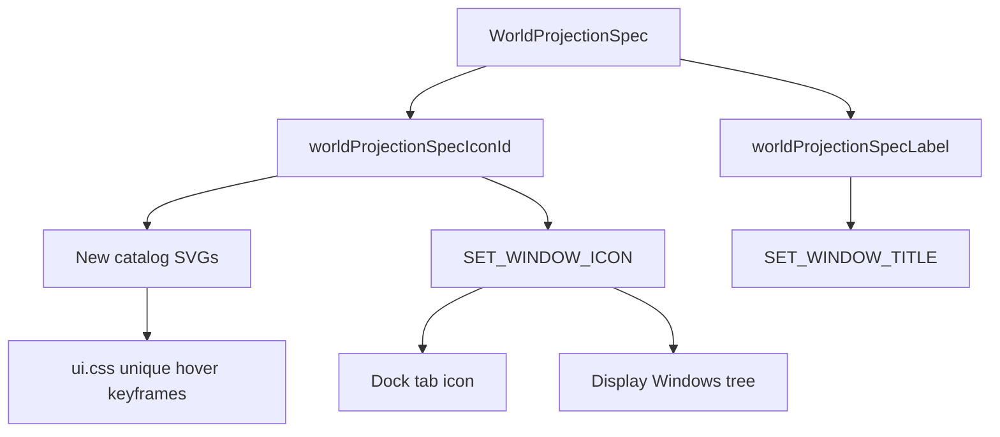

# Unique Specific Icons Across the Monorepo

## Rule (locked)

**One glyph per distinct meaning. Same meaning → one shared canonical glyph. Different meanings → never share.**

- Allowed reuse: `mouse-pointer` for "Select" in every app; `trash-2` for delete; chevrons/check/x as universal chrome primitives.
- Forbidden reuse: `puzzle` for both Top and Perspective panes; `box` for CAD Shape + FEM Model + Puzzle5D 3D + Volume Brush; `eye` for Scene + Preview + visibility; `camera` for remodel app + shooting Scene + projection pane; `square` for rectangle tool + orthographic + trinity LHS/RHS.

Glyphs must **resemble** their meaning (orthographic top ≠ three-point perspective ≠ generic cube).

Goal: `🎯r2602🎯runningsketchpad🎯runningsketchpadapps🎯runningdesignapp` (same family as [window_kind_icons](.cursor/plans/window_kind_icons_acc26d72.plan.md)).

## Current failure (example)

Both extra instances of Puzzle 3D inherit `kind.iconId` (`puzzle`) in [framework/renderer/react/index.tsx](framework/renderer/react/index.tsx) (~7409, ~7445). Titles sync via `SET_WINDOW_TITLE` + `worldProjectionSpecLabel`; icons do not. Display > Windows projection leaves from [createWorldProjectionTemplates](infinite/world/r3f/index.tsx) have **no icons**.

## Architecture

## Phase 0 — Inventory and uniqueness harness

Create ticket workspace artifacts (not new repo folders outside ticket):

- Concept → icon map in the ticket folder (seeded from the audit: ~125 multi-meaning icons, ~78 window kinds, ~63 utilities, 86 aliases).
- Add a **vitest uniqueness guard** in existing [ui/js/react/index.tsx](ui/js/react/index.tsx) / asset tests: an explicit `ICON_CONCEPT_ASSIGNMENTS` table where each concept id maps to exactly one `IconName`, and duplicate icon ids across different concept ids fail. Grow this table as phases land.

## Phase 1 — Projection / view icons (fixes Top vs Perspective)

**New catalog SVGs** under [ui/asset/icon/](ui/asset/icon/) — each visually distinct, Lucide-style 24×24:

| Id                                                   | Resembles                        |
| ---------------------------------------------------- | -------------------------------- |
| `projection-parallel`                                | Parallel rays / flat cube face   |
| `projection-orthographic`                            | Flat plan square with axes       |
| `projection-axonometric`                             | Tilted isometric cube            |
| `projection-isometric` / `dimetric` / `trimetric`    | Distinct angle cues on axon cube |
| `projection-oblique` + cabinet/cavalier/military     | Front face + receding depth      |
| `projection-perspective`                             | Vanishing-point frustum          |
| `projection-one-point` / `two-point` / `three-point` | 1/2/3 vanishing points           |
| `projection-curvilinear`                             | Fisheye / curved horizon         |

Wire:

1. Add `iconId` to `WorldProjectionTemplateDescriptor`; set it in `createWorldProjectionTemplates`.
2. Add `worldProjectionSpecIconId(spec)` next to `worldProjectionSpecLabel` in [infinite/world/r3f/index.tsx](infinite/world/r3f/index.tsx).
3. Mirror title sync: `windowIconsById` + `SET_WINDOW_ICON` + `SetWindowIconContext`; `syncProjectionWindowTitle` becomes title+icon in [framework/renderer/react/index.tsx](framework/renderer/react/index.tsx) (~14432).
4. Dock tabs: `iconId: windowIconsById[id] ?? kind.iconId` for base and extras.
5. Display tree: `worldProjectionTemplatesToTreeItems` sets `icon` from template `iconId`.
6. Projection pane / switch tree: stop using generic `camera` for all modes; use mode-specific icons.
7. Codegen (`bun ./script.ts generate all` in `ui/asset`), unique `[data-icon]` hover CSS in [ui/styling/js/ui.css](ui/styling/js/ui.css), extend existing icon-animation tests.
8. wgpu parity: dock + display pick up new SVGs via existing atlas build.

## Phase 2 — Window kinds and apps (kill generic reuse)

Reassign every overloaded window/app icon so each kind is unique and specific. Priority collisions from audit:

| Current                                | Split into distinct glyphs                                                                                                                          |
| -------------------------------------- | --------------------------------------------------------------------------------------------------------------------------------------------------- |
| `box` (6+ model windows)               | `cad-shape`, `fem-model`, `lowpoly-model`, `process-workpiece`, `puzzle5d-3d`, `remodel-model` (handcrafted SVGs)                                   |
| `eye` (all Previews)                   | Keep `eye` only for visibility toggles; Previews → `preview` (eye-in-frame or similar)                                                              |
| `network` (all Graphs)                 | Domain-specific: `flow-graph`, `math-graph`, `architect-graph`, etc., or keep `network` only for true network graphs and give others distinct marks |
| `square` LHS/RHS                       | `trinity-lhs`, `trinity-rhs`                                                                                                                        |
| `file-text` multi text windows         | Domain-specific document glyphs                                                                                                                     |
| `camera` remodel vs shooting           | Remodel app ≠ Scene window ≠ projection (projection already Phase 1)                                                                                |
| `sigma` fem + mathematical + note math | Split FEM vs math utility                                                                                                                           |
| Panel tabs `framework.panel.*`         | Real catalog icons for catalogue / inspection / parameters (today fall back to `circle-dot`)                                                        |

Touch every `plugin/rs/lib.rs` `.window_kind*` / `.icon_id(` site (~30 plugins). Prefer **new handcrafted SVGs** over forcing mismatched Lucide reuse.

## Phase 3 — Utilities, tools, measures, aliases

- Converge same-meaning tools onto one canonical icon (`Select` → one pointer glyph everywhere).
- Split different meanings that currently share (`move-3d` Transform vs Relocate vs GIS Terrain; `maximize-2` Scale vs Select-all; `layers` HUD vs LOD vs raster composite).
- Fix [asset/js/index.ts](asset/js/index.ts) semantic aliases: `SceneIcon` must not be `eye`; `TypeIcon`/`WorkbenchIcon` must not both be `box`; remove story mislabels (`Redo` → `rotate-cw`).
- Shell chrome: `WINDOW_PANE_*` and utility category icons stay only if their meanings are unique; otherwise new glyphs.
- Sketchpad `compose.sketchpad.icon.windows` → real catalog id (no `circle-dot` fallback).

## Phase 4 — Enforcement and cleanup

- Expand uniqueness harness to cover all production assignments (window kinds, utilities, measures, aliases, panel tabs, projection modes).
- Storybook [Icons.stories.tsx](.storybook/stories/ui/Icons.stories.tsx) remains the visual gallery; add a "concepts" story listing concept → icon for review.
- Metabolism set (29) stays separate; only change if two metabolism glyphs are visually identical (audit first — likely no work).
- No migration layers; hand-update all fixtures/tests that assert old icon ids.

## Out of scope

- Redesigning metabolism architecture glyphs unless duplicates found.
- Changing Icon union / codec architecture (already general).
- Opening/closing goals.

## Execution order when implementing

1. Ticket open + Phase 0 table.
2. Phase 1 end-to-end (SVGs → codegen → CSS → live icon sync → Display tree → tests) so Top/Perspective are visibly different.
3. Phase 2 window/app remapping in batches by collision group (`box`, then `eye`, then `network`, …).
4. Phase 3 utilities/aliases.
5. Phase 4 harness completeness + ticket close with full file list.

