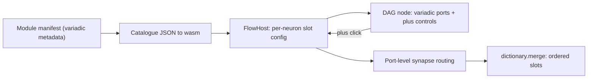

# Variadic Flow Ports

## Goal

Let neuron kinds declare variadic inputs/outputs (generic, manifest-driven). `dictionary.merge` is the first user: starts with two ordered input slots, and when zoomed in shows `+` glyphs to insert more slots before/between/after. Connections become port-level (each synapse targets a specific slot), and evaluation routes each upstream output into its ordered slot.

This touches five layers, because today every neuron renders exactly one `in`/`out` handle, synapses are widget-to-widget, and all upstream outputs are merged into a single input dict.

## Key existing facts (verified)

- `Value` is only `Atom | Dictionary` (no list type); lists are index-keyed dicts (`"0"`,`"1"`,...) per [flow/module/list/lib.rs](flow/module/list/lib.rs). Variadic slots will be passed to functions the same way: an index-keyed dictionary under a slot key.
- Port arity lives only in JS module manifests today; core only knows the kind id string. Core must receive port/variadic metadata via the catalogue it already gets through `setCatalogueJson` ([flow/core/lib.rs](flow/core/lib.rs) `set_host_catalogue_json`).
- Synapses are widget-to-widget and `sync_from_dag` strips the `:port` suffix; this must be changed to preserve port ids.

## 1. Neural engine metadata + routing — [neural/engine/lib.rs](neural/engine/lib.rs)

- Extend `NeuronKindInfo` with an optional variadic descriptor, e.g. add `variadic_input: Option<VariadicSpec>` and `variadic_output: Option<VariadicSpec>` where `VariadicSpec { slot_key: String, min: usize, max: Option<usize> }`. Keep `inputs`/`outputs` as the fixed (non-variadic) keys.
- Extend `Synapse` to carry `to_port: String` (target input slot id) and `from_port: String` (source output key).
- Rewrite `collect_neuron_input` so that, per incoming synapse, it pulls `from_port` from the source output and inserts it under the target slot id. Fixed ports map to their named key (`a`,`b`,...); variadic slots map to ordered keys `0,1,2,...` nested under `slot_key` (a list-style dict), so a function sees `{ items: { "0": {...}, "1": {...} } }`.
- Add unit tests in the existing `#region Tests` covering variadic routing (ordered slots) and port-specific fixed routing.

## 2. dictionary.merge becomes variadic — [flow/module/dictionary/lib.rs](flow/module/dictionary/lib.rs)

- Change `Merge::evaluate` to read the ordered slot dict (e.g. `items`), iterate slots `0..n` in order, and fold via `Dictionary::merge` (later overrides earlier). Output stays `{ "dictionary": ... }`.
- Update registration (currently `inputs: ["a","b"]`) to declare `variadic_input: Some(VariadicSpec { slot_key: "items", min: 2, max: None })`.
- Extend the dictionary module tests for N-way merge (2 and 3+ inputs, override order).

## 3. Flow core: per-neuron slot state + port-level synapses — [flow/core/lib.rs](flow/core/lib.rs)

- `Widget::Neuron` gains a persisted port list, e.g. `#[serde(default)] inputs: Vec<String>` (ordered slot ids) so slot count/order survives save/load. Default seeded from kind metadata `min` on first build.
- Store kind metadata in `FlowHost` (parse the catalogue/manifest the host already receives) so `widget_io_ports` can return N input `IoPortSpec`s for a variadic neuron (one per slot) plus its fixed ports.
- `SynapseSpec` gains `from_port` + `to_port`. Update `build_dag_fixture_v1` to emit `source: "{from}:{from_port}"`, `target: "{to}:{to_port}"`, and `sync_from_dag` to preserve port ids (stop collapsing on `split(':')`).
- `build_tree` maps `SynapseSpec` -> neural `Synapse` including the new port fields.
- Add host APIs: `add_input_port(widget_id, index)` and `remove_input_port(widget_id, port_id)` that mutate the neuron's `inputs`, fix up affected synapse `to_port`s, rebuild + re-evaluate. Wire matching `#[wasm_bindgen]` methods in the `WasmSession` region.
- `connect()` gains a target port parameter (default first free slot) and validates against the variadic spec.

## 4. DAG node variadic flag + zoom-gated "+" controls — [mathematical/graph/port/directed/dag/lib.rs](mathematical/graph/port/directed/dag/lib.rs)

- `DagNodeKind::Computation` gains `#[serde(default)] variadic_inputs: bool` (and `variadic_outputs: bool`) so the painter knows to draw insert controls. `DagNodeSpec::computation` callers updated.
- In `paint_scene`/`paint_port_labels`, when `cam.zoom` exceeds a threshold (e.g. >= ~1.5) and the node is variadic, paint small `+` glyphs at slot boundaries (before first, between each pair, after last) on the input side.
- Add hit-testing for these `+` regions in `pointer_down` (compute boundary rects from node geometry, analogous to `slider_track_bounds`). On hit, surface the action to the flow layer. Since DAG is generic, expose it via either a new `BoardEvent::PortInsertRequested { node, side, index }` drained by the host, or a `DagHost` method returning the hit; the flow `FlowHost` translates it into `add_input_port`.
- Tests: `+` rects only generated above the zoom threshold; a click at a boundary maps to the expected insert index.

## 5. Manifest plumbing — [flow/module/wasm/lib.rs](flow/module/wasm/lib.rs) and [flow/react/index.tsx](flow/react/index.tsx)

- `build_manifest_json` already serializes `registry.catalogue()`, so the new `NeuronKindInfo` variadic fields flow through automatically; verify the TS `FlowModuleNeuronKind` interface in [flow/react/index.tsx](flow/react/index.tsx) mirrors the new fields.
- Ensure the React host forwards kind metadata to the wasm core (via `setCatalogueJson`) so core can resolve variadic specs. No new pointer handlers needed: `+` clicks are handled inside wasm `pointerDownScreen` (canvas already routes pointer + wheel events). `onPointerUp` already calls `persistFixture()`, so inserted slots persist.

## 6. Fixtures, launch.json, validation

- Update the default fixture / any `dictionary.merge` fixtures and the playground default ([framework/product/playground/renderer/react/index.tsx](framework/product/playground/renderer/react/index.tsx) `FLOW_PLAY_DEFAULT_FIXTURE_JSON`) so merge nodes carry an `inputs` slot list and synapses carry ports.
- Reuse the existing ticket validation script pattern (`.repo/.../validate-flow-runtime.mjs`) to assert: 3-way merge evaluates correctly, and an inserted slot rewires/evaluates. Run Rust tests for `neural/engine`, `flow/core`, `flow/module/dictionary`, `mathematical/.../dag` and the flow vitest via the existing `launch.json` entries (add entries only if a needed command is missing, following existing grouping).

## Ticket workflow

Work inside a repo MCP ticket (the server was not ready during planning). At execution start: read `repo://goals`, associate with the most fitting goal, and `ticket_reopen` the existing `FLOW-RUNTIME-LOADABLE-MODULES` / flow ticket if it covers this, else `ticket_open` a new ticket (e.g. `FLOW-VARIADIC-PORTS`). Keep all temp/validation files inside the ticket folder; close with a summary and file list when done.

## Risks / decisions

- Variadic input representation uses an index-keyed dict under a slot key (consistent with the list module) since `Value` has no list variant. If a true list value type is preferred, that is a larger neural-engine change and out of scope here.
- The `+` interaction is implemented in the Rust/wasm canvas layer (not React DOM) to match how sliders/handles already work.
- Removing slots is included via `remove_input_port`; the explicit request is "add", so the `+` UI is primary and removal can be minimal (e.g. drag-off / future control).
