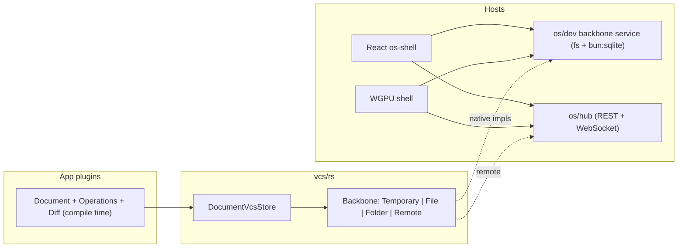

# VCS Backbones and Sync Tool Category

## Architecture

vcs stays app-agnostic: it only sees `DocumentVcsEnvelope<P, Operation>` where each app provides projection `P`, operations `Operation: ::vcs::Operation
`, and diffs `Operation::Diff: OperationDiff
` at compile time. Persistence is owned by the store/shell, never by app plugins (they are sandboxed wasm and the capability lint forbids fs/net).

## 1. vcs core refactor — [vcs/rs/lib.rs](vcs/rs/lib.rs)

Replace the current `DevJsonFileBackbone` / `SqliteFolderBackbone` / `RemoteHttpBackbone` (greenfield, no compat) with four canonical backbones and a typed kind:

- `BackboneKind { Temporary, File, Folder, Remote }`; `DocumentBackboneRef { kind: BackboneKind, uri }`.
- URI schemes: `temp://<document-id>`, `file:///abs/path.json` (embedded JSON file), `folder:///abs/path` (sqlite at `<path>/.semio/document.db`, single-row `document` table), `remote://host:port/<document-id>` (hub).
- `TemporaryBackbone` = in-memory (today's `MemoryBackbonePort` behind the trait). `FileJsonBackbone` and `FolderSqliteBackbone` do native fs/rusqlite on non-wasm; on wasm they route through an injected `BackbonePort` (host IO). `RemoteBackbone` loads via hub REST and syncs operations; native uses blocking HTTP, wasm goes through the host port.
- Store API: `attach_backbone(uri)`, `detach_backbone()`, `backbone_ref()`; `dispatch` auto-syncs to the attached backbone after every successful mutation so state is always persisted.
- Update `resolve_backbone`, all vcs tests (four round-trip tests, one per kind), and [vcs/rs/studio-store.json](vcs/rs/studio-store.json) to the new schemes.

## 2. Collapse duplicate backbones in os core and s

- [framework/product/os/core/rs/lib.rs](framework/product/os/core/rs/lib.rs): delete `DevJsonBackbone`, `LocalJsonBackbone`, `RemoteOsBackbone`, `OsBackboneRef`, `NativeFileBackbonePort`, `SqliteFolderBackbonePort`; use vcs `Backbone`/`BackbonePort` and `DocumentBackboneRef` directly. Studio catalog keeps working over ports with `temp://` (memory) and browser localStorage.
- [s/plugin/rs/lib.rs](s/plugin/rs/lib.rs): rewire `bind_studio_file`, `create_folder_studio`, catalog ports, and demo fixtures onto the new kinds/URIs; fix all touched fixtures at once.

## 3. Hub envelope sync — [framework/product/os/hub/rs/bin.rs](framework/product/os/hub/rs/bin.rs)

- Add `GET/PUT /documents/{id}/envelope` for whole-envelope load/sync plus keep operation streaming over the existing WebSocket; broadcast envelope updates so other connected clients reload.
- Fix the stale hub test (it still constructs `AppendOpRequest` with a removed `change` field) and add an envelope round-trip test.

## 4. Browser host IO — [framework/product/os/dev](framework/product/os/dev/script.ts)

Both shells run in the browser, so File/Folder need host-side IO. Add a vite middleware (registered from os/dev `vite.config.ts`, logic in `script.ts`) exposing `GET/PUT /semio-backbone?uri=...` that performs fs JSON and `bun:sqlite` `.semio/document.db` IO with the exact same on-disk format as the vcs native impls. Remote goes straight from the shell to the hub. Zero-touch, cross-platform.

## 5. Sync tool category — framework core

- Add `ToolCategory::Sync` to [framework/core/rs/lib.rs](framework/core/rs/lib.rs) and the TS mirror in [framework/core/js/index.ts](framework/core/js/index.ts).
- WGPU footer: extend `partition_tools_by_category` in [framework/renderer/wgpu/rs/lib.rs](framework/renderer/wgpu/rs/lib.rs) to 5 buckets.

## 6. Shell-injected Sync tools + attach cards (both renderers)

The four tool nodes (`framework.sync.temporary/file/folder/remote`, toggles; pressed = active kind) are injected by the shells for the current sync target — app document in playgrounds, studio document in studio, focused spawned app's document when an app window is focused. Apps never declare them.

- React [framework/renderer/react/os-shell.tsx](framework/renderer/react/os-shell.tsx): append Sync nodes to the footer `ToolTree`; pressing File/Folder/Remote opens a Popover card (from `ui/js/react`) anchored above the tool button with a path input (plus File System Access picker where available) or URL input and an Attach action; Temporary attaches immediately. Card shows the currently attached URI and a Detach action. On attach: load-or-create through the backbone, then auto-sync the envelope on every document change (hook the existing command dispatch/refresh pipeline).
- WGPU [framework/renderer/wgpu/rs/lib.rs](framework/renderer/wgpu/rs/lib.rs): same four tools in the Sync partition; immediate-mode floating card above the pressed tool with a text input and attach/detach; IO via the dev-server endpoint and hub WebSocket (web_sys fetch/ws).

## 7. Defaults and state-management audit

- Every document without a backbone gets `temp://<document-id>` attached on creation — playgrounds therefore default to Temporary (replace the current `dev://studio.json` default in `create_empty_os_document`).
- Audit all program play apps to confirm each defines its document + typed operations through `DocumentVcsStore` (the compile-time manifest) and returns the full envelope to the shell (needed for sync); fix stragglers found during implementation.

## 8. Verification

- `cargo test -p vcs`, os core, s program, hub, wgpu renderer tests; react renderer vitest for Sync tools/card; extend existing test files only.
- Runtime confirmation with `[DEBUG]` logs: boot a playground (temporary default), attach File/Folder/Remote via the cards, verify persistence and hub round-trip; remove debug logs after.
- Open a repo MCP ticket first (`repo://goals`, `ticket_open`), keep temp artifacts in the ticket folder, close with summary.
