wa o  aresp`q_final_heating`ir sddtouynti

---
name: Vector Figure-Ground Styles
overview: Add a per-window "Style" sub-option (Colored / Figure-Ground / Inverted-Figure) that applies in Vector and Combined render modes, painting an LOD-aware black/white figure-ground silhouette using theme tokens.
todos:
  - id: rust-core
    content: Add MapVectorStyle enum, MapHost.vector_style field + set_vector_style/vector_style_str, and WASM setVectorStyle binding in gis/map/rs/lib.rs
    status: completed
  - id: rust-paint
    content: Refactor append_vector_tiles to dispatch on vector_style; add LOD-aware figure-ground painting (ink=label_fill, paper=surface_clear, swapped for inverted) and extend inline tests
    status: completed
  - id: react
    content: Add MapVectorStyle type, MapRenderer.setVectorStyle, MapCanvas vectorStyle prop + effects in gis/map/react/index.tsx
    status: completed
  - id: play
    content: Add vector style modes, snapshot fields, controller command/getter, and the Style select measure (vector/combined only) in gis/map/play/index.ts
    status: completed
  - id: playground
    content: Resolve and pass vectorStyle to MapCanvas in the playground MapPlayPaneSurfaceHost
    status: completed
  - id: wasm-build
    content: Rebuild gis_map WASM and verify figure-ground/inverted at city and world zoom in the play app
    status: completed
isProject: false
---
# Vector Figure-Ground Styles

Add a vector "style" axis orthogonal to the existing render mode (`image`/`vector`/`combined`). The new control offers `Colored` (current behavior), `Figure-Ground`, and `Inverted-Figure`, and is shown when the render mode is Vector or Combined.

## Behavior (confirmed)

- Colored: current `append_vector_tiles` unchanged.
- Figure-Ground / Inverted-Figure use theme tokens (no hardcoded black/white):
  - ink = `theme.label_fill` (`var(--foreground)`), paper = `theme.surface_clear` (`var(--canvas)`).
  - Inverted swaps them (ink = surface_clear, paper = label_fill).
- The "figure" (ink mass) is LOD-aware, keyed off the existing `profile.draw_buildings` gate per tile:
  - When buildings are drawn at this zoom: figure = building footprints (ink); everything else is paper (Nolli/poche).
  - When buildings are not drawn (low zoom): figure = land polygons (`landcover`/`landuse`/`park`/`countries`) in ink, with `water` cut back to paper.
- Only the figure mass is shown: no road lines, no labels, no colored water/parks. Paper backdrop fills each tile first.
- In Combined mode the raster still draws underneath; the style only governs how vector tiles are painted (so Combined = raster + ink figure overlay).

```mermaid
flowchart LR
  styleSel["Style select (vector/combined)"] --> ctrl[MapPlayController.setVectorStyle]
  ctrl --> snap[snapshot store]
  snap --> host[MapPlayPaneSurfaceHost]
  host --> canvas["MapCanvas vectorStyle prop"]
  canvas --> renderer[MapRenderer.setVectorStyle]
  renderer --> session["MapSession.setVectorStyle (WASM)"]
  session --> rs["MapHost.vector_style"]
  rs --> paint[append_vector_tiles dispatch]
```

## 1. Rust core — [gis/map/rs/lib.rs](gis/map/rs/lib.rs)

- Add `MapVectorStyle` enum next to `MapTileMode` (~line 1025): variants `Colored` (default), `FigureGround`, `InvertedFigure`, with `from_str` (`"figureGround"`, `"invertedFigure"`, else Colored) and `as_str`.
- Add field `vector_style: MapVectorStyle` to `MapHost` (~~line 1245) and init in `Default` (~~line 1277).
- Add `MapHost::set_vector_style(&str)` and `vector_style_str()` near `set_render_mode` (~line 1381).
- Refactor `append_vector_tiles` (~line 1746): keep the shared tile-collection (`draw` vec, `render_z`, retain/sort), then dispatch on `self.vector_style`:
  - `Colored` -> existing per-layer painting (extract current body into `append_vector_tiles_colored` or guard inline).
  - figure styles -> new `append_vector_tiles_figure(scene, &draw, span, forced_lod, ink, paper)`:
    - per tile compute `profile = vector_detail_profile(...)` and paint a paper backdrop via existing `append_vector_tile_land_backdrop(scene, tz, tx, ty, paper)`.
    - if `profile.draw_buildings && vis.buildings`: fill `building` rings with `ink` (reuse `append_vector_tile_polygon`, transparent stroke).
    - else: fill `landcover`/`landuse`/`park`/`countries` rings with `ink`, then fill `water` rings with `paper` (water passes after land so it cuts out).
- `build_vector_scene` (~line 2123) needs no change (Combined already calls `append_vector_tiles`).
- WASM `MapSession` bindings (~line 2288, next to `setRenderMode`): add `#[wasm_bindgen(js_name = setVectorStyle)] set_vector_style(&mut self, style: &str)` and `#[wasm_bindgen(js_name = vectorStyleStr)] vector_style_str()`.
- Extend inline `mod tests`: add `map_vector_style_from_str` and a `build_vector_scene_respects_vector_style` style case alongside `build_vector_scene_respects_render_mode` (~line 2819).

## 2. React host — [gis/map/react/index.tsx](gis/map/react/index.tsx)

- Add `export type MapVectorStyle = "colored" | "figureGround" | "invertedFigure";` near `MapRenderMode` (line 56).
- `MapRenderer`: add `private vectorStyle: MapVectorStyle = "colored";` and `setVectorStyle(style)` -> `this.session.setVectorStyle(style)` (near `setRenderMode`, line 489).
- `MapCanvasProps`: add `vectorStyle?: MapVectorStyle;` (line 210); destructure with default `"colored"` (line 749); call `renderer.setVectorStyle(vectorStyle)` in the boot effect (line 832) and add a `useEffect` mirroring the `renderMode` one (line 887) keyed on `vectorStyle`.

## 3. Play controller/UI — [gis/map/play/index.ts](gis/map/play/index.ts)

- Add `MAP_VECTOR_STYLES` + `GIS_MAP_VECTOR_STYLE_LABEL` (`Colored`/`Figure-Ground`/`Inverted-Figure`).
- `MapPlaySnapshot`: add `vectorStyle` + `vectorStyleByInstance`; update `GIS_MAP_PLAY_IDLE_SNAPSHOT` (line 88) and `rebuildSnapshotCache` (line 258).
- `MapPlayController`: add `vectorStyle`/`vectorStyleByInstance` fields, `getVectorStyleForScope`, and a `setVectorStyle` command handler (mirroring `setRenderMode`, line 305).
- Add `mapPlayVectorStyleMeasure(...)` select (id `gis-map-vector-style`, label `Style`, onChange `setVectorStyle`) and include it in the `gis-map-display` group (line 199) only when `renderMode` is `vector` or `combined`.

## 4. Playground host — [framework/product/playground/renderer/react/index.tsx](framework/product/playground/renderer/react/index.tsx)

- In `MapPlayPaneSurfaceHost` (line 5021): resolve `vectorStyle` via `ctrl?.getVectorStyleForScope(scopeId) ?? snapshot.vectorStyleByInstance[scopeId] ?? snapshot.vectorStyle` and pass `vectorStyle={vectorStyle}` to `<MapCanvas>` (line 5037).

## 5. Rebuild WASM

- Rebuild the `gis_map` WASM package so the new `setVectorStyle` binding is emitted (`bun nx run @gis/map/rs:wasm`; the `dev:gis:map` dev task also rebuilds it). Then verify in the play app (port 6040) at city zoom (buildings -> ink poche) and world zoom (land/water silhouette), plus the inverted variant.

## Notes

- Work proceeds inside a repo MCP ticket; structure additions with the existing `#region` markers in `lib.rs`.
- No new files; all changes extend existing `lib.rs`, `react/index.tsx`, `play/index.ts`, and the playground host.
