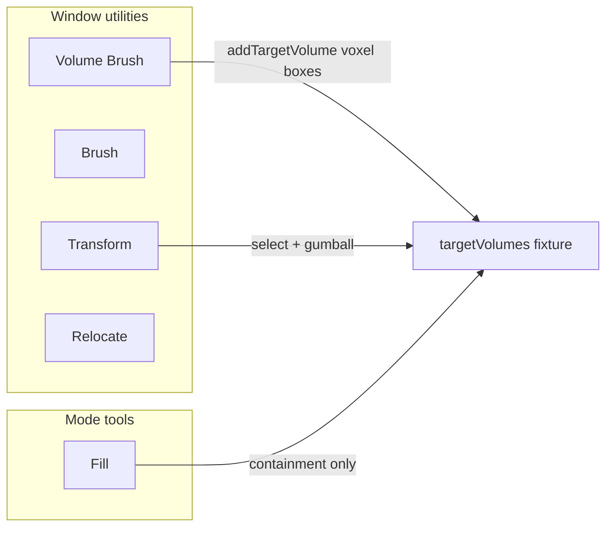

# First-Class Target Volumes and Volume Brush

## Context

Today target volumes are already persisted oriented boxes (`Puzzle3dTargetVolume` / `WorldVolumeProps`) and already constrain fill via AABB-in-oriented-box containment. Creation UX is voxel-only and buried inside Fill as **Edit Volumes** (`fill_edit_target_volumes` + W/D/H + Alt+click ground plane). Viewport volumes render with `interactive={false}`, so they are not first-class in the 3D window.

## Design decisions

- **Volume model stays oriented boxes** (origin / orientation / scale). No new volume-kind union. “Not only voxels” means volumes are general boxes you can select and freely transform; Volume Brush is one creation path that paints grid-aligned voxel boxes.
- **Volume Brush is a window utility** (same tier as Brush / Transform), not a mode tool. Fill stays a mode tool and only fills.
- **Voxel placement UX** (Alt+click, W/D/H dims, ground plane + preview) moves unchanged onto Volume Brush.
- Goal for the ticket: `🎯r2602` (same as recent puzzle tool/utility tickets).

## Implementation

### 1. Register Volume Brush utility (plugin)

In `[puzzle/plugin/rs/lib.rs](puzzle/plugin/rs/lib.rs)`:

- Add `.utility(UtilityDefinition::new("volumeBrush", "Volume Brush", "box"))` and include it in `.window_kind_utilities(...)` next to `brush`.
- Add labels / i18n (`volume_brush`, keep `voxel` W/D/H labels).
- Add `puzzle3d_volume_brush_utility_options` returning a Group tagged `active_utility_id: Some("volumeBrush")` whose children are the existing `puzzle3d_voxel_dim_measures`.
- Append that group from `puzzle3d_window_measures`.
- Map scene mode: when active utility is `volumeBrush`, treat interaction like today’s fill-edit-volumes (block instance picks so Alt+click hits the voxel plane). Extend `worldInstancePickBlocked` / `puzzle3d_blocks_instance_pick` (or equivalent) accordingly.
- Gate engagement / `puzzle3d_scene_mode` as needed so Volume Brush does not collide with Fill/Brush.

### 2. Strip volume editing from Fill

In the same program file:

- `puzzle3d_fill_tool_measures`: keep only fill-count slider + distribution children. Remove `puzzle3d_edit_volumes_toggle`, voxel group, and the `fill_edit_target_volumes` gate that hides the count slider.
- Remove `setFillEditTargetVolumes` action and `fill_edit_target_volumes` from `Puzzle3dRuntime` / `Puzzle3dWindowOptions` snapshots.
- Keep `voxel_dims` + `setVoxelDims` + `addTargetVolume` / `deleteTargetVolume` (owned by Volume Brush / document editing).
- Update tests that assert Edit Volumes on the fill tool tree (e.g. `fill_and_brush_params_are_tagged_utility_options_not_engagement_controls`) to assert: Fill has no edit-volumes/voxel measures; Volume Brush utility options carry voxel dims.

### 3. Viewport: Volume Brush painting + first-class volumes

In `[framework/renderer/react/index.tsx](framework/renderer/react/index.tsx)`:

- Replace `interaction.fillEditTargetVolumes` gating with `activeUtility === "volumeBrush"` for `WorldVoxelGroundPlane` / `WorldVoxelPreviewBox`.
- Drop `fillEditTargetVolumes` from the interaction JSON type; keep `voxelDims` / `gridFactor`.
- Enable `WorldVolumeLayer` as interactive when not in brush/fill/volumeBrush pointer modes (select/transform):
  - Pass `selectedIds` from selection JSON (`targetVolumeIds`).
  - `onSelect` → `setSelection` / `contextMenuAt` with `kind: "targetVolume"`.
  - `onRelocate` → new or extended relocate actions that write origin/orientation/scale on selected volumes.
  - Honor Transform utility move/rotate flags via existing gumball config (same pattern as objects); volumes already support gumball in `[infinite/world/r3f/index.tsx](infinite/world/r3f/index.tsx)` (`WorldVolumeBoxItem`).

In `[puzzle/plugin/rs/lib.rs](puzzle/plugin/rs/lib.rs)`:

- Extend `translateSelection` / `rotateSelection` / `scaleSelection` (or add a dedicated `relocateTargetVolume` path used by volume gumball) so selected `target_volume_ids` update pose, not only objects.
- Include selection/hidden/locked flags in `world_target_volumes_json` so the host can dim locked volumes and skip picking them.
- Ensure `world_interaction_json` exposes `activeUtility` correctly for `volumeBrush` (via `puzzle3d_scene_active_utility` — fill tool still overrides when fill is active).

### 4. Semantics: volumes are general boxes

No engine fill-math change required — `[puzzle/3d/rs/lib.rs](puzzle/3d/rs/lib.rs)` already uses oriented-box containment.

Clarify in docs/comments near volume types: volumes are oriented boxes; Volume Brush creates axis-aligned voxel-sized instances; Transform/gumball can turn them into arbitrary oriented boxes. Do not rename `targetVolumes` or introduce a `kind: "voxel"` discriminant in this ticket.

### 5. Ticket hygiene and verification

- Open ticket via repo MCP (`ticket_open`) under `🎯r2602`, title like **First-Class Target Volumes and Volume Brush**.
- Put any notes/logs under the ticket folder.
- Extend existing tests in `puzzle/plugin/rs/lib.rs` (fill measures, utility registration, addTargetVolume, selection/context menu). Add coverage that Volume Brush options appear under window measures and Fill no longer includes edit-volumes.
- Run targeted `cargo test -p puzzle-plugin` filters for fill/volume/brush; confirm React host still compiles for touched types.
- Close ticket with `ticket_close` when done.

## Out of scope

- New volume representations (mesh/brep/SDF).
- Puzzle 2d / 5d volume brush parity.
- Restoring the old 3-point volume draw tool (replaced earlier by voxel brush).

