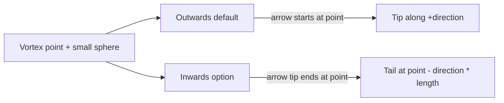

# Puzzle 3D Vortex Arrow Preview

## Context

Vortices are connection points with world `position` and `direction`. Today both render paths draw them only as spheres:

- React: `[WorldVortexMarkers](framework/renderer/react/index.tsx)` (`sphereGeometry` at `vortex.position`; `direction` ignored)
- WGPU: `[infinite/world/rs/lib.rs](infinite/world/rs/lib.rs)` instances `vortex-marker` (ico-sphere) with uniform scale

Plugin already emits direction in `[world_vortices_json](puzzle/plugin/rs/lib.rs)`. Window options follow the existing `vortex_show` pattern (per-window via `Puzzle3dWindowOptions`).

Goal: `🎯r2602` (Running Sketchpad). New ticket (no open ticket covers arrow display).

## Display semantics




- Always: small sphere at the vortex point.
- Always: arrow mesh (cylinder shaft + cone head) aligned with unit `direction`.
- **Outwards** (default): shaft starts at the point; tip at `point + dir * length`.
- **Inwards**: tip ends on the point; shaft starts at `point - dir * length` (vector still points along `+direction`).

Proportions (relative to existing `radius`, default `0.36`):

- Point sphere: `radius * 0.18`
- Arrow length: `radius`
- Shaft radius / head size: small fractions of `radius` (match the linear-handle style in the same file)

Pointer hit target stays an invisible sphere of full `radius` at the point so selection/hover/connect UX does not shrink.

## Changes

### 1. Window option in puzzle plugin

In `[puzzle/plugin/rs/lib.rs](puzzle/plugin/rs/lib.rs)`, mirror `vortex_show`:

- Constants: `PUZZLE3D_VORTEX_DIRECTION_OUTWARDS = "outwards"`, `PUZZLE3D_VORTEX_DIRECTION_INWARDS = "inwards"`
- Runtime + `Puzzle3dWindowOptions` field: `vortex_direction: String` (default outwards)
- Wire through `snapshot_window_options` / `apply_window_options`
- Measure `puzzle3d-play-vortex-direction` (select Outwards / Inwards), placed next to Vortex Show in `puzzle3d_window_measures`
- Action `setVortexDirection` (validate values, register in action tables + `view_action`)
- Labels EN/DE: `"Vortex Direction"` / `"Vortex-Richtung"`, `"Outwards"`/`"Auswärts"`, `"Inwards"`/`"Einwärts"`

Stamp on each emitted vortex record:

```json
"displayDirection": "outwards" | "inwards"
```

(alongside existing `position`, `direction`, `radius`, …)

### 2. React markers (primary UI path)

Rewrite `WorldVortexMarkers` in `[framework/renderer/react/index.tsx](framework/renderer/react/index.tsx)`:

- Extend `WorldVortexRecord` with `displayDirection?: "outwards" | "inwards"`
- Per vortex: group with
  - invisible hit `sphereGeometry(radius)` carrying existing pointer handlers
  - visible small sphere at point
  - shaft `cylinderGeometry` + head `coneGeometry`, oriented with `Quaternion.setFromUnitVectors(Y, dir)` (same pattern as `linear-handle` preview nearby)
- Position shaft/head from shared start/tip math using `displayDirection`

### 3. WGPU world path

In `[infinite/world/rs/lib.rs](infinite/world/rs/lib.rs)`:

- Add `direction` and `display_direction` to `WorldVortexRecord`
- Replace single sphere instances with three instance draws:
  - `vortex-marker` = small sphere (scale to point radius)
  - `vortex-arrow-shaft` = unit cylinder oriented along direction
  - `vortex-arrow-head` = unit cone oriented along direction
- Add mesh kinds in `[framework/core/rs/lib.rs](framework/core/rs/lib.rs)` `mesh_from_kind` (or reuse `"cylinder"` / `"cone"` with TRS)
- Shared `quat` from Y → direction (local helper; cylinder/cone primitives are Y-aligned)
- Keep `pick_vortex_at` using full `radius` AABB at the point

### 4. Tests

Extend existing plugin tests in the same file (no new test files):

- Default measure is outwards; `setVortexDirection` switches to inwards
- Emitted `vorticesJson` entries include `displayDirection` matching the option
- Per-window option isolation (toggle on one instance does not affect another), same spirit as `window_options_are_local_to_the_window_instance…`

## Ticket workflow (on execute)

1. `ticket_open` under goal `🎯r2602`
2. Implement + run `cargo test -p puzzle-plugin` for the new/updated cases
3. `ticket_close` with summary and touched paths

