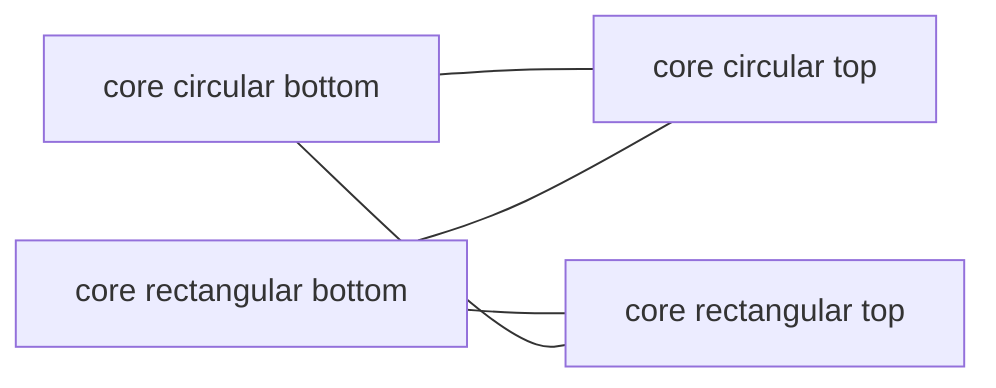

# Vortex Compatibility Coloring (puzzle 3d)

## Goal

Give every vortex a color derived from compatibility. Vortex kinds linked through the compatibility table form Union-Find connected components; all kinds in a component share one color. The color shows on idle vortices only; hover / selection / attraction-drag highlight states keep their current `MeshStyleKind` colors (per your choice).

## Key findings

- Vortices render in `Vortex` (`puzzle/3d/react/index.tsx`) via `VortexFallbackMesh` (sphere, used by the fixture) or `VortexMeshGltf` -> `MeshBody`. Color today comes only from interaction state (`MeshStyleKind`).
- Compatibility data is on the registry: `reg.kindCompatibility` (`KindCompatEntry[]`) and `reg.kindCatalogs.vortices` (`VortexKind[]`). `Vortex` already calls `useRegistry()`.
- Compatibility is an undirected graph for coloring purposes, e.g. `core circular bottom` / `core circular top` / `core rectangular bottom` / `core rectangular top` are all linked -> one group.

## Changes (all in `puzzle/3d/react/index.tsx`)

### 1. Union-Find + color, in the `Compat` region (~line 2895)

- `vortexCompatibilityGroups(vortexKindIds, table)`: Union-Find seeded with every catalog kind id as a singleton; union `source` and `target` of each `KindCompatEntry`. Returns `Map<kind, canonicalRoot>` where canonical = lexicographically smallest member of the set (deterministic, order-independent). Isolated kinds stay their own group.
- `hashStringToHue(s)` deterministic string hash -> `hsl(h 60% 50%)`.
- `vortexCompatibilityColor(vortexKind, table, catalogs)`: resolves the kind's canonical root, derives its color from the root id; builds the full kind->color map once and memoizes via a module-level `WeakMap` keyed on the `table` array reference.

### 2. `Vortex` component (~line 5142)

- Compute `idleColor = vortexCompatibilityColor(props.vortexKind, reg.kindCompatibility, reg.kindCatalogs)`.
- `idle = highlight === "none" && !vortexPointerHovered`.
- When idle, pass `idleColor` to the body renderers; otherwise leave current behavior.

### 3. `VortexFallbackMesh` (~line 5063) - primary path for the fixture

- Add optional `baseColor`; when set, use it as the sphere `meshStandardMaterial` color (keep neutral emissive/opacity).

### 4. GLB path (`VortexMeshGltf` / `MeshBody` / Pool region) - completeness for mesh vortices

- Thread an optional base-color override: `styledPoolKey(url, style, edgeOutlines, baseColor?)` includes the color; `applyMeshStyleToObject3D` uses `baseColor ?? colors.meshColor`; `styledMeshTemplate` / `usePooledStyledMesh` / `MeshBody` pass it through. Pooling stays correct because the key includes the color.

### 5. Tests - extend the inline `import.meta.vitest` block (~line 8948)

- `vortexCompatibilityGroups`: the four `core ...` kinds collapse into one group; two `door ... right`-chain vs `... left`-chain are separate; an isolated kind is its own group; empty/undefined table -> each kind singleton.
- `vortexCompatibilityColor`: members of one group return identical colors; different groups differ; stable across calls.

## Process

- Open a repo MCP ticket (e.g. "Puzzle 3d Vortex Compatibility Coloring") under the most appropriate goal before editing; close it with a summary and touched files when done.
- Validate at runtime: temporary `[DEBUG]` log of kind->color map and visual check that idle vortices recolor per group and revert to highlight colors on hover/select.
