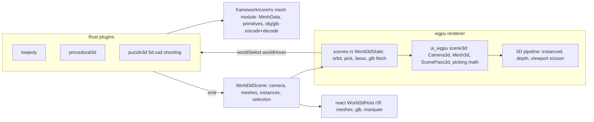

# Real 3D World in the WGPU Renderer

## Current state

- [framework/renderer/wgpu/rs/scenes.rs](framework/renderer/wgpu/rs/scenes.rs) `render_world_3d` draws a fake 2D cube; `WORLD3D_SHADER` in [ui/wgpu/rs/shaders.rs](ui/wgpu/rs/shaders.rs) is compiled but never used; all pipelines have `depth_stencil: None`; input has no wheel/drag/modifiers; `scene_hit_target` is dead code.
- Protocol `World3dScene { camera_json, instances_json }` in [framework/core/rs/ui.rs](framework/core/rs/ui.rs) only carries box instances — no meshes, no selection. Emitted by lowpoly, procedural3d, puzzle3d, puzzle5d, cad, shooting plugins.
- React `World3dHost` ([framework/renderer/react/components/world-3d-host.tsx](framework/renderer/react/components/world-3d-host.tsx)) renders unit boxes only; rich picking/lasso lives in domain packages (cad renderer, puzzle3d core) — design/type apps (compose sketchpad) need GLB mesh URLs.
- Export: Rust-side `OsMediaExportFormat { Svg, Png, Obj, Glb }` + handler registry exist in [framework/product/os/core/rs/media_graph.rs](framework/product/os/core/rs/media_graph.rs); the s plugin emits a `downloadMediaExport` op which the React shell downloads, but the wgpu shell's `apply_ops` ignores it. No 3d export handlers are registered in the Rust plugin path.

## Architecture

## 1. Shared mesh module — `framework/core/rs`

New `mesh` module (new file `framework/core/rs/mesh.rs`, exported from the existing crate) usable by plugins and both renderers:

- `MeshData { positions, normals, colors, indices }` with compact JSON (de)serialization (flat number arrays) for scene payloads.
- Primitive generators: `box`, `plane`, `uv_sphere`, `ico_sphere`, `cylinder`, `cone`, `torus` (replaces lowpoly's `mesh_json: {"kind":"box"}` placeholders with real geometry).
- Encoders/decoders: `mesh_to_obj`, `mesh_to_glb` (hand-rolled minimal GLB container + glTF JSON), `mesh_from_glb` (parses GLB binary chunks; positions/normals/indices; enough for kit representation meshes). Unit tests: primitive validity, obj output, glb round-trip.

## 2. Protocol — extend `World3dScene`

In [framework/core/rs/ui.rs](framework/core/rs/ui.rs), mirrored in [framework/renderer/react/types.ts](framework/renderer/react/types.ts) and [framework/wit/world.wit](framework/wit/world.wit):

- `camera_json`: `{ position, target, up, fov }`.
- `meshes_json`: mesh library `[{ id, data? (inline MeshData), url? (GLB) }]`.
- `instances_json`: `[{ id, meshId, position, rotationQuat, scale, color, selected, hovered, label }]`.
- `selection_json`: `{ method: "rectangle"|"lasso", mode, ids, hoveredId }`.

Standard renderer-to-plugin commands (handled by every world-3d plugin): `worldSelect { ids, merge }`, `worldHover { id }`, `setSelectionMethod { method }`. No back-compat shims — all emitters and both renderers move at once.

## 3. `ui_wgpu` toolkit 3D layer — `ui/wgpu/rs`

New `scene3d.rs` module plus targeted extensions to existing files:

- **Math/scene**: `Vec3/Mat4/Quat` helpers, `Camera3d` (view-projection from position/target/up/fov), `OrbitController` (yaw/pitch/distance/target; orbit, pan, zoom deltas), `Mesh3d` (CPU geometry + AABB), `Instance3d` (model matrix, color, selected/hovered flags).
- **GPU** ([ui/wgpu/rs/draw.rs](ui/wgpu/rs/draw.rs), [gpu.rs](ui/wgpu/rs/gpu.rs), [shaders.rs](ui/wgpu/rs/shaders.rs)):
  - `DrawList` gains `scene_passes: Vec<ScenePass3d>` — each with viewport rect, camera matrices, light, and `(mesh_id, Vec<Instance3d>)` draws.
  - Extend `WORLD3D_SHADER` to instanced rendering: per-instance model matrix (4 vec4 attributes), instance color, selection/hover tint applied in the shader — one draw call per mesh regardless of instance count.
  - `UiPipelines`: real 3D pipeline with depth test; `GpuContext` owns a depth texture recreated on resize; `MeshStore` caches GPU vertex/index buffers keyed by mesh id + content version (upload once, never per frame).
  - Frame order: clear, then each 3D pass with its own viewport+scissor and depth clear, then the existing 2D UI pass on top (panels, overlays, text stay crisp above the 3D view).
- **Picking** (pure, unit-tested): ray from camera through pixel, Moller-Trumbore triangle intersection with per-instance inverse transform and AABB early-out; screen projection of instance vertices; point-in-polygon (winding) for lasso and rect containment for rectangle marquee.
- **Input** ([ui/wgpu/rs/input.rs](ui/wgpu/rs/input.rs)): extend `attach_dom_listeners` with wheel events, mouse button identity, and shift/ctrl/alt modifiers; add drag tracking to `InputState` (down position, current stroke points).

## 4. WGPU renderer world-3d host — `framework/renderer/wgpu/rs`

- **`scenes.rs`**: rewrite `render_world_3d` around a retained `World3dState` per `surface_id` (stored on `ShellState`): orbit camera state, decoded mesh cache, pending async GLB fetches (`spawn_local` + fetch, decode via core `mesh_from_glb`, insert into `MeshStore`), hover id, active marquee stroke. Each frame it parses the scene payload, ensures meshes are uploaded, pushes a `ScenePass3d` clipped to the window bounds, and draws the lasso/rectangle overlay via the existing vector pipeline.
- **Interaction** (wired through `lib.rs` pointer routing into scene bounds, matching cad-renderer semantics):
  - mousemove: raycast, renderer-local hover tint, dispatch `worldHover` only on change.
  - left click: pick nearest instance, dispatch `worldSelect` (shift/ctrl merge modes).
  - left drag: marquee per `selection_json.method` — rectangle or lasso; on release project instances and test coverage, dispatch `worldSelect` with the id set.
  - right drag orbit, middle or shift+right drag pan, wheel zoom — all renderer-local (no plugin round trip).
- **Export** ([shell.rs](framework/renderer/wgpu/rs/shell.rs)): handle the `downloadMediaExport` op in `apply_ops` — trigger a browser download via `web_sys` Blob + anchor click (parity with `os-shell.tsx`).

## 5. Plugin updates (all world-3d emitters, all at once)

- **lowpoly** ([lowpoly/plugin/rs/lib.rs](lowpoly/plugin/rs/lib.rs)): store real `MeshData` per object (primitives from the core mesh module), emit mesh library + instances with selection/hover state, handle `worldSelect`/`worldHover`/`setSelectionMethod`, register `obj`/`glb` export handlers via `register_os_media_export_handler` using the core encoders; fix the default fixture.
- **procedural3d** ([procedural/3d/plugin/rs/lib.rs](procedural/3d/plugin/rs/lib.rs)): preview emits real meshes (primitive geometry per node kind), selection wiring, obj/glb export of the preview meshes.
- **puzzle3d, puzzle5d, cad, shooting**: emit the extended payload — GLB `url` mesh entries where fixtures carry `meshUrl`, primitives otherwise — and handle the standard selection commands. Design/type apps (compose sketchpad, React-only) are covered by the GLB-url + selection capabilities without touching compose.

## 6. React renderer parity — `framework/renderer/react`

Update [world-3d-host.tsx](framework/renderer/react/components/world-3d-host.tsx) to the new protocol so both renderers stay on one wire format: inline meshes as three `BufferGeometry`, GLB urls via loader, hover/click raycast selection, rectangle/lasso marquee (reusing the `SelectionMarquee` utilities from `ui/react`), dispatching the same `worldSelect`/`worldHover`/`setSelectionMethod` commands.

## 7. Verification

- `cargo test` for framework core (mesh primitives, obj/glb round-trip), `ui_wgpu` (camera math, picking, lasso polygon tests), and each updated plugin.
- `cargo build -p semio-framework-renderer-wgpu --target wasm32-unknown-unknown --release` + wasm-bindgen artifact regeneration.
- Boot dev server with `SEMIO_RENDERER=wgpu` for `?plugin=lowpoly` and `?plugin=procedural3d`; confirm runtime behaviour in the browser with `[DEBUG]` console logs (mesh upload counts, pick hits, lasso selection ids, export download).
- React renderer vitest suite plus a react-path browser check for the same plugins.

Work happens inside the existing ticket `26/07/04/RUST-PLUGIN-FRAMEWORK-MIGRATION` (reopen) or a fresh ticket if scoping demands; goals reviewed via `repo://goals` before starting.