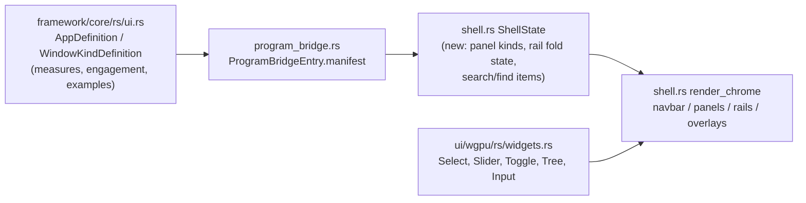

## Root cause

All 25 playground apps can boot in two renderer modes via `SEMIO_RENDERER=react|wgpu` (`framework/product/os/dev/js/index.ts`). The React renderer (`framework/renderer/react/os-shell.tsx`, already updated in the working tree by the in-progress "restore old S navbar parity" work) is the up-to-date behavioral reference. The WGPU renderer (`framework/renderer/wgpu/rs/shell.rs`) has structural navbar/footer/panel chrome but several pieces are stubs or entirely absent:

- Global command palette (Mod+P) and find-in-window (Mod+F): `[render_palette](framework/renderer/wgpu/rs/shell.rs)` draws a title + empty input box, no item list, no filtering, no keyboard nav, no dispatch.
- Per-window **Command** rail (engagement) and **Window Options** rail (measures): not implemented at all in `shell.rs`, even though `WindowKindDefinition.measures` / `.engagement` ([framework/core/rs/ui.rs:913-923](framework/core/rs/ui.rs)) are already populated by the `s` and `draw` plugins ([s/plugin/rs/lib.rs](s/plugin/rs/lib.rs), [draw/plugin/rs/lib.rs](draw/plugin/rs/lib.rs)) and already deserialized into `ActiveSession.app` on the WGPU side via `ProgramBridgeEntry` — this is a pure rendering/interaction gap, not a data gap.
- Navbar: currently shows back/forward/up + breadcrumb + inline theme dropdown + visible Search/Find toggle buttons (the _old_, now-superseded React navbar shape). React has since been restored to: logo/title → example dropdown → fill → 4-icon panel toggle group (display/workbench/details/settings) → mode button group, with theme moved into a Settings panel tab and history/breadcrumb/search/find kept only as keybindings.
- Framework side-panel tabs (Display/Workbench/Details/Settings, Document auto-injection) exist in React (`framework/renderer/react/os-chrome-panels.tsx`) but have no WGPU equivalent — panels only show raw program tabs.
- Keyboard: `on_key` in [framework/renderer/wgpu/rs/lib.rs:333-346](framework/renderer/wgpu/rs/lib.rs) only appends characters into a focused input; there is no Mod+P/Mod+F/history/Escape/Arrow routing.

Confirmed via `AppDefinition`/`WindowKindDefinition`/`PluginManifest` in [framework/core/rs/ui.rs](framework/core/rs/ui.rs): the WGPU shell already receives everything it needs (`session.app.window_kinds[].measures`/`.engagement`, `manifest.examples`, `app.modes`, `app.panel_tabs`) — this plan is entirely about consuming that data in `shell.rs`/`lib.rs`, reusing existing `ui/wgpu/rs/widgets.rs` primitives (`Select`, `Slider`, `Toggle`, `Tree`, `NumberStepper`, `Ring`, `Input`, `Button`).

## Changes

### 1. `ShellState` plumbing — [framework/renderer/wgpu/rs/shell.rs](framework/renderer/wgpu/rs/shell.rs)

Add fields alongside the existing `left_panel_open`/`open_selects` etc.:

- `active_left_panel_kind: PanelKind` (`Workbench | Display`), `active_right_panel_kind: PanelKind` (`Details | Settings`)
- `active_example_id: Option<String>`, derived/reset from `manifest.examples` on session change (mirror the generic derivation in `os-shell.tsx` — driven by `session.pluginId`, not hardcoded to `s`)
- `engagement_expanded: HashMap<String, bool>`, `measures_folded: HashMap<String, bool>`, `measures_expanded: HashMap<String, bool>`, `measures_width: HashMap<String, f32>` — keyed by window id, matching `WindowEngagementChrome`/`WindowMeasuresChrome` fold/expand/resize semantics from [ui/js/react/index.tsx:13124-13230](ui/js/react/index.tsx)
- `search_items` / `find_items` (built lazily from `session.app` — panel tabs, window kinds, keybindings — plus a `find_items` registry populated by scene hosts, mirroring `UIFindProvider`)
- Remove now-superseded fields tied to breadcrumb/back-forward-up if no longer used once the navbar is rewritten.

### 2. Navbar restore — `render_navbar` in `shell.rs`

Rebuild to match the restored `navbarItems` order in [framework/renderer/react/os-shell.tsx:1307-1367](framework/renderer/react/os-shell.tsx):

- Keep logo + title.
- Add example dropdown when `manifest.examples` non-empty for the active plugin: options list overlay (reuse the `render_palette`-style overlay, promoted per Phase 3 below), dispatch `setActiveExample`.
- Replace the L/R-only panel toggles with a 4-icon `PanelToggleGroup` (display/workbench/details/settings), wired to `active_left_panel_kind`/`active_right_panel_kind` — only show the "display" icon when framework named layouts exist, mirroring `frameworkDisplayTabs.length > 0` gating.
- Add a mode button group when `app.modes.len() > 1`, dispatching an update to `ViewState.active_mode_id`.
- Remove: back/forward/up buttons, breadcrumb segments, inline theme dropdown, visible Search(`S`)/Find(`F`) toggle buttons. Theme selection moves into the new Settings panel tab (Phase 3). History navigation (`uri_history`/`uri_index`) and Search/Find stay reachable only via keybindings (Phase 6).

### 3. Framework side panels — `shell.rs` (panel rendering section, alongside `render_floating_panel`)

- **Display tab**: named layouts + window tree, built from `app.named_layouts` / `app.window_kinds`, using the existing `Tree` widget (`ui/wgpu/rs/widgets.rs`), selecting a layout dispatches the layout-switch command (mirrors `createFrameworkDisplayPanelTabs`).
- **Settings tab**: theme select (move the current `render_theme_dropdown` content in here as an inline `Select`), compact toggle, expertise select (mirrors `createFrameworkSettingsPanelTab`).
- **Document tab auto-injection**: when the left/workbench tab set has no plugin-provided tab, inject a `framework.panel.document` tab (constant already exists: `FRAMEWORK_PANEL_TAB_DOCUMENT_ID` in `shell.rs`) showing the window/panel tree — mirrors the injection at [framework/renderer/react/os-shell.tsx:1172-1181](framework/renderer/react/os-shell.tsx).
- Switch which tab set renders based on `active_left_panel_kind`/`active_right_panel_kind` from Phase 1.

### 4. Command palette (Mod+P) — real implementation in `shell.rs`

Replace `OverlayState::Search`'s call into the `render_palette` stub with a full list-picker:

- Build `search_items` from `session.app.panel_tabs`, `session.app.window_kinds`, `session.app.keybindings` (plus studio commands when `studio_mode`) — same source set as `searchItems` in [os-shell.tsx:1369-1440](framework/renderer/react/os-shell.tsx).
- Case-insensitive substring filter across label/description/category (Rust-side equivalent of Fuse, consistent with the existing feature-complete-wgpu decision to use substring filtering instead of porting Fuse.js), grouped by category.
- Render as a scrollable list (reuse `ScrollRegion`/`Tree`-style row rendering already in `ui/wgpu/rs`), with hover highlight, click-to-select, and Up/Down/Enter/Escape handled via the keyboard routing added in Phase 6.
- On select: dispatch the matching `CommandDescriptor` / `setActivePanelTab` / `setActiveWindowId`, close the palette, clear the query.

### 5. Find in window (Mod+F) — real implementation

- Add a `find_items: Vec<FindItem>` + `on_find_item` callback slot to `ShellState`, populated by the active scene host (mirrors `UIFindProvider`/`useUIFind`). Start with the `node-graph` scene in [framework/renderer/wgpu/rs/scenes.rs](framework/renderer/wgpu/rs/scenes.rs) registering its node labels/ids each frame the scene is active (parity target: `node-graph-host.tsx:219-240`).
- Same list-picker UI/filter/keyboard-nav as Phase 4; on select, invoke the registered callback to select/center the corresponding node in the active scene.

### 6. Window Command rail (engagement) — new chrome region in `shell.rs`

For the active window kind's `engagement: Option<WindowEngagement>`:

- Collapsed state: a small "Command" chip on the window's right edge (chevron `>`/`<` toggle), matching `WindowEngagementChrome` in [ui/js/react/index.tsx:13178-13215](ui/js/react/index.tsx).
- Expanded state: render `options` as a button/toggle row, `input` as a text field with submit/repeat-last/abort dispatch (`on_change`/`on_submit`/`on_repeat_last`/`on_abort`), `control`/`controls` using the existing `Slider`/`NumberStepper`/`Ring`/`Select` `ControlNode` variants, `status` as text rows, `possible_engagements` as a clickable list.
- Verify against `s` (media-graph + compiled-dag engagement) and `draw` (canvas engagement input) plugins, which already populate this data.

### 7. Window Options rail (measures) — new chrome region in `shell.rs`

For the active window kind's `measures: Vec<WindowMeasure>`:

- Collapsed/expanded/focused states mirroring `WindowMeasuresChrome` ([ui/js/react/index.tsx:13124-13176](ui/js/react/index.tsx)): fold/unfold chip, focus/unfocus (expand) toggle, resizable width (reuse the existing side-panel resize-drag pattern already in `shell.rs`).
- Render the `WindowMeasure` tree recursively: `group` → collapsible `Section`/`Tree` node, `select`/`slider`/`toggle` → corresponding `ui_wgpu` widget leaf, each dispatching its `on_change` command — mirrors `renderWindowMeasure` in [framework/renderer/react/os-shell.tsx:482-539](framework/renderer/react/os-shell.tsx).
- Verify against `s`'s media-graph measures (app-instance select) — the only current producer.

### 8. Keyboard shortcuts — [framework/renderer/wgpu/rs/lib.rs](framework/renderer/wgpu/rs/lib.rs) `on_key` / `ui/wgpu/rs/input.rs`

- Extend the modifier-aware key handler (currently modifiers are captured but unused for shortcuts) to dispatch: Mod+P → toggle Search overlay, Mod+F → toggle Find overlay, Mod+[ / Mod+] / Mod+Up → history navigation (kept functional though the navbar buttons for it are removed, matching the React "keybindings-only" decision), Ctrl/Cmd+B and Ctrl/Cmd+Shift+B → panel toggles (already partly planned in the earlier feature-complete-wgpu pass — verify/finish).
- When an overlay (Search/Find/palette) is open, route ArrowUp/ArrowDown/Enter/Escape to list navigation/selection/dismiss instead of the focused-input character path.

### 9. Context menu real items — `shell.rs` `render_context_menu` / `scenes.rs`

Replace the generic Copy/Paste no-operations with scene-contributed items (starting with `node-graph`: delete node, disconnect port, etc.), matching what React scene hosts contribute today.

## Verification

- Extend the existing suite (per repo convention, no new test files): [.repo/🎫️/26/07/04/WGPU-PLAYGROUND-E2E/verify-wgpu-playgrounds-e2e.ts](.repo/🎫️/26/07/04/WGPU-PLAYGROUND-E2E/verify-wgpu-playgrounds-e2e.ts) — add assertions that Mod+P opens a palette with visible, clickable items; Mod+F opens find with items for `draw`/`flow`; the example dropdown, 4-icon panel toggle group, and mode buttons render/function; and — specifically on `s` and `draw` — the Command rail and Window Options rail chips are present and expand to show real controls.
- `cargo test -p ui_wgpu` for widget/layout units touched; rebuild the WGPU wasm bundle (`framework/renderer/wgpu/script.ts wasm`).
- Run the full 25-plugin suite for both `verify-react-playgrounds-e2e.ts` and `verify-wgpu-playgrounds-e2e.ts` to confirm no regressions, plus a manual screenshot comparison of `s` and `draw` in both renderers.
- All work stays in existing files using region/subregion comments per repo convention — no new script files.
