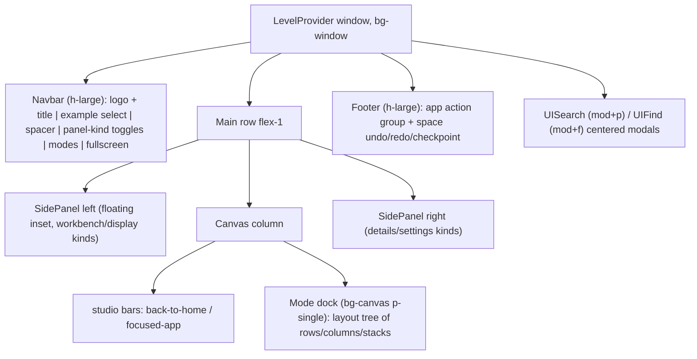

# Wgpu Shell Layout Parity

## Current state vs React shell

Styling tokens are now shared (previous ticket), but the _structure_ diverges. The React OS shell ([framework/renderer/react/os-shell.tsx](framework/renderer/react/os-shell.tsx)) renders:

The wgpu shell ([framework/renderer/wgpu/rs/shell.rs](framework/renderer/wgpu/rs/shell.rs)) instead has: a navbar with back/forward/up + URI breadcrumb + S/F/L/R/theme buttons (all of which React **removed** from the navbar), a single flat window rect with plain-text kind tabs (no dock, no window chrome), one flat tab bar per panel (no kind switching, no framework Display/Settings tabs), and stub search/find palettes.

## 1. Mode dock — multi-window layout tree (the big one)

New `mod dock` region in [shell.rs](framework/renderer/wgpu/rs/shell.rs) replacing `render_main_window`'s flat content rect.

- **Layout state**: add `shell_layout: Option<DockNode>` to `ShellState`. `DockNode` mirrors React's `WindowLayoutNode`: `Row(Vec<(DockNode, f32 size)>)`, `Column(...)`, `Stack { windows: Vec<String>, active: String }`. Build from `session.app.default_layout` (already deserialized as `WindowLayout` in [framework/core/rs/layout.rs](framework/core/rs/layout.rs) lines 54-103); fallback = `createEvenWindowLayout` semantics ([ui/js/react/index.tsx](ui/js/react/index.tsx) lines 14820-14830): 1 window → single stack, N windows → row of single-window stacks.
- **Recursive render**: rows/columns split their rect proportionally by `size` (default even); stacks render tab bar + body. `maximized_stack: Option<path>` replaces the whole mode body with that stack (Focus/Unfocus).
- **Stack chrome** (mirrors `ModeDockTabBar`, [ui/js/react/index.tsx](ui/js/react/index.tsx) lines 20424-20617):
  - Tab pills (window title, `text_xs`, `h-medium`), active tab = solid `active_base` fill with 3-sided cap border; inactive = window bg + hover fill.
  - Tab gap strip (flex-filler, `bg-canvas`, bottom hairline).
  - Controls cap on the right: **Focus** and **Close** buttons for the stack-active window.
  - U-shaped frames with hairlines: cap = top+sides border + `window` bg; body = sides+bottom border + `canvas` bg; globally-active stack gets `active_base` border color.
- **Interactions**: click tab → set stack-active + globally-active window; Focus → maximize/unmaximize stack; Close → remove window from tree (collapse empty stacks/axes); drag hairline between row/column children → resize `size` fractions (reuse the panel-resize drag pattern, `HitKind::ScrollRegion`-style drag axis).
- Mode body inset: `p-single` (3.2px) on `canvas` background; window content renders inside the body frame via existing `render_window_content` scissor+scroll.

## 2. Navbar — rebuild to React slot order

Rewrite `render_navbar` ([shell.rs](framework/renderer/wgpu/rs/shell.rs) lines 941-1084):

- **Keep (left)**: logo square (accent, `size-workbench` = 24px) + `session.app.label` title.
- **Add**: flex spacer; **panel-kind toggle group** (4 icon toggles in one bordered group, `h-medium`, divide-x): `display`, `workbench` (left kinds), `details`, `settings` (right kinds) — pressed when panel visible AND kind active, press switches kind + toggles visibility; **mode button group** when `session.app.modes.len() > 1` (text items, active = `active_base` fill, dispatch existing mode command); **fullscreen toggle** at far right (`web_sys` `request_fullscreen` / `exit_fullscreen` on document).
- **Remove from navbar**: back/forward/up buttons, URI breadcrumb, S/F toggles, theme select (React ships these as hotkeys / Settings tab). Keep the underlying state + command handling.
- Icons for the toggles come from the existing `IconAtlas` (`layout-grid`, `folder`, `info`, `settings-2` fallbacks per [os-shell.tsx](framework/renderer/react/os-shell.tsx) lines 1238-1278); text-glyph fallback if an icon id is missing from the atlas.

## 3. Side panels — kind switching + framework tabs

Extend panel state in `ShellState`: `active_left_kind: PanelKind` (`Workbench | Display`), `active_right_kind` (`Details | Settings`).

- **Tab routing** stays (`panel_side_for_group`), but the visible tab set now depends on the active kind:
  - Left `workbench`: program left tabs + injected Document tab when missing (parity with [os-shell.tsx](framework/renderer/react/os-shell.tsx) lines 1158-1181).
  - Left `display`: shell-built tabs `framework.display.windows` + `framework.display.layout` — build their `UiNode` trees in Rust (window list with focus/close actions; layout summary), mirroring [os-chrome-panels.tsx](framework/renderer/react/os-chrome-panels.tsx) lines 163-189.
  - Right `details`: program right tabs (current behavior).
  - Right `settings`: shell-built `framework.settings.general` tab containing the **Theme select (system/light/dark)** — this is where the navbar theme dropdown moves — plus Expertise select stub (stored, not yet consumed).
- Tab bar buttons get a 12px icon slot + label (icons via `IconAtlas` by `tab.icon_id`).
- Panel visibility/kind commands `ui.panelToggle.{display|workbench|details|settings}` wired from the navbar group.
- Keep floating inset geometry, hairline frame, hover emphasis, resize handle (all done in styling ticket).

## 4. Footer + studio canvas bars

- Footer ([shell.rs](framework/renderer/wgpu/rs/shell.rs) lines 1174-1233): render the app item as a bordered action-group cell (icon from `session.app.icon_id` via `IconAtlas`, fallback `app-window` glyph) + label; keep space undo/redo/checkpoint right-aligned with icons. No other items (React parity).
- Studio canvas bars above the mode dock (from [os-shell.tsx](framework/renderer/react/os-shell.tsx) lines 1516-1538): "← Home" full-width bar when `studio_mode && app.id == "studio" && spawned_ui.is_none()` (dispatch `goHome`); "← Back to Media Graph · {label}" bar when a spawned app is focused (close focused instance). Error state renders as plain text in the canvas (already close).

## 5. Search / Find palettes + hotkeys

Replace the stub `render_palette` ([shell.rs](framework/renderer/wgpu/rs/shell.rs) lines 1687-1726):

- **Search (mod+p)**: centered modal (max-w ~512px) on `temporary`-level bg; text input (reuse existing input focus/text_buffer machinery); item list built from session — panel tabs ("Panels"), window kinds ("Windows"), app commands ("Commands"), studio programs — substring-filtered; keyboard up/down + Enter executes, Esc closes; click executes.
- **Find (mod+f)**: same modal shell, input only, filters against the active window's text content (basic: highlight rows in `window_ui` whose text matches — parity with React's provider-driven find can be approximated).
- **Hotkeys** in the existing `KeyAction` handling ([framework/renderer/wgpu/rs/lib.rs](framework/renderer/wgpu/rs/lib.rs)): `mod+p` search, `mod+f` find, `mod+b` toggle left panel, `mod+shift+b` toggle right panel, `mod+[`/`mod+]`/`mod+up` history back/forward/up (replacing the removed navbar buttons), Esc closes overlays.

## 6. Verification

1. `cargo test -p ui_wgpu -p semio-framework-renderer-wgpu` (extend existing test files with dock-layout unit tests: even-layout fallback, default_layout parsing, close-window collapse).
2. Rebuild wasm `bun ./framework/renderer/wgpu/script.ts wasm`.
3. Full 25-plugin E2E suite (`.repo/🎫️/26/07/04/WGPU-PLAYGROUND-E2E/verify-wgpu-playgrounds-e2e.ts`) — programs with multiple window kinds (flow, cad, s) now exercise the dock.
4. Side-by-side screenshot comparison against the React shell (`?renderer=react` vs wgpu) for: navbar composition, window tab caps + U-frames, panel kind toggles, footer, search palette.

## Todos
