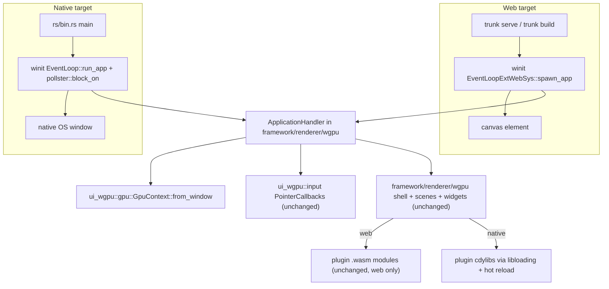

# Migrate wgpu OS/Playground Stack to winit + trunk

## Why this is one migration, not many

Every "playground" and the OS are the same app: [framework/product/os/dev](framework/product/os/dev) with a different `SEMIO_PLUGIN`. The renderer switch lives in one place, [framework/product/os/dev/js/index.ts](framework/product/os/dev/js/index.ts):

```52:69:framework/product/os/dev/js/index.ts
if (renderer === "wgpu") {
	const { bootFrameworkOsWgpu } = await import("@semio-tech/framework-renderer-wgpu");
	void bootFrameworkOsWgpu({ plugin: pluginFilter, plugins }).catch(...)
} else {
	// react path, unchanged
}
```

`.vscode/launch.json` already has ~26 `🛠️dev<app>🧊wgpu` entries (`s`, `draw`, `cad`, `dag`, `flow`, `puzzle/2d|3d|5d`, `gis/2d`, `forms`, `raster`, `vcs`, `sequence`, `imperative`, `lowpoly`, `layout`, `procedural/2d|3d`, `reasoning/wires`, `shooting`, `trinity/jack|rewrite`, `presentation`, `note`, `writer`) all setting `SEMIO_RENDERER=wgpu`. So the entire scope of "wgpu os, playgrounds, etc" collapses to three crates plus the dev-host wiring:

- [ui/wgpu/rs](ui/wgpu/rs/lib.rs) — GPU device/surface + input (owns the browser-only bits today)
- [framework/renderer/wgpu](framework/renderer/wgpu/rs/lib.rs) — the shared boot/shell/scene entry point every app goes through
- [infinite/world/rs](infinite/world/rs/lib.rs) — 3D world engine consumed by that entry point

`infinite/cavas` stays out of scope (it's vello-based, not raw wgpu).

## Current state (why winit doesn't just drop in)

- `GpuContext::from_canvas` is `#[cfg(target_arch = "wasm32")]`-only and calls `wgpu::SurfaceTarget::Canvas(canvas)` directly:

```3586:3594:ui/wgpu/rs/lib.rs
pub async fn from_canvas(canvas: web_sys::HtmlCanvasElement, dpr: f32) -> Result<Self, String> {
    ...
    let surface = instance
        .create_surface(wgpu::SurfaceTarget::Canvas(canvas))
```

- All input is hand-wired DOM listeners in `attach_dom_listeners` (`ui/wgpu/rs/lib.rs`, input region ~4147-4337) — `mousemove`/`mousedown`/`wheel`/`keydown`/`contextmenu` via `web_sys::Element::add_event_listener_with_callback`. The good news: they already funnel into a renderer-agnostic `PointerCallbacks { on_move, on_button, on_wheel, on_key, on_context_menu }` closure struct and `InputState<E>` — only the DOM wiring itself is browser-specific.
- The `<canvas>` element and the icon atlas are created/rasterized in JS, not Rust: [framework/renderer/wgpu/js/index.ts](framework/renderer/wgpu/js/index.ts) `bootFrameworkOsWgpu` creates the `<canvas>`, and `buildIconAtlas`/`rasterizeSvg` use `document.createElement("canvas")` + `CanvasRenderingContext2d` — not portable to a native, DOM-less binary.
- Build is a hand-rolled `cargo build --target wasm32-unknown-unknown` + `wasm-bindgen --target web` pair in [framework/renderer/wgpu/script.ts](framework/renderer/wgpu/script.ts), no `trunk` involved.
- Plugins are wasm-bindgen modules loaded via browser `import()` (`loadPluginModule` in [framework/core/js/index.ts](framework/core/js/index.ts:666)), string-in/string-out (`semio_plugin_manifest/create_app/destroy_app/handle_command/render/tools/window_engagements/window_measures`) — a shape that maps cleanly onto a native C-ABI dylib. There's already a hot-rebuild watcher for the wasm build (`PluginWatchScript` in [framework/product/os/dev/script.ts](framework/product/os/dev/script.ts:81)) that the native path should mirror.

## Target architecture



## 1. `ui/wgpu`: winit-owned window/surface/input host

- Add `winit` (0.30.x, matching the `wgpu 27.0.1` already in [ui/wgpu/rs/Cargo.toml](ui/wgpu/rs/Cargo.toml)) as a normal (not `wasm32`-gated) dependency.
- Replace `GpuContext::from_canvas` with `GpuContext::from_window(window: Arc<winit::window::Window>)` using `wgpu::SurfaceTarget::from(window)` — one code path for native and web, since `winit::Window` implements `raw-window-handle` on both targets.
- Replace `attach_dom_listeners` + `pointer_coords`/`modifiers_from_event`/`device_pixel_ratio` with a new `pub mod host` implementing `winit::application::ApplicationHandler`: translates `WindowEvent::CursorMoved/MouseInput/MouseWheel/KeyboardInput/Resized/RedrawRequested` into the existing `PointerCallbacks`/`InputState` calls (their signatures do not change).
- Replace `schedule_frame`'s `request_animation_frame` web-sys call with `window.request_redraw()` driven by the winit event loop.

## 2. `framework/renderer/wgpu`: dual entry points sharing one shell

- `rs/lib.rs`'s shell/scenes/widgets interpreter is already renderer-agnostic (operates on `UiNode`/JSON) — untouched.
- New `rs/host.rs` region: a `SemioApp` implementing `ApplicationHandler`, wrapping the existing boot logic that `semio_renderer_boot` performs today, following the winit 0.30 pattern (create window in `resumed()`, `pollster::block_on` GPU setup natively, `wasm_bindgen_futures::spawn_local` + `EventLoopProxy` user-event round trip on web).
- **Web**: winit creates/attaches the `<canvas>` itself (`WindowAttributesExtWebSys::with_canvas`/`with_append` into the `#root` div) via `EventLoopExtWebSys::spawn_app`, replacing the manual `document.createElement("canvas")` in `js/index.ts`. Plugin `.wasm` module loading stays JS-driven (`loadPluginModule`), invoked from the trunk-generated glue.
- **Native**: new `rs/bin.rs` + `[[bin]]` target in [framework/renderer/wgpu/rs/Cargo.toml](framework/renderer/wgpu/rs/Cargo.toml). `main()` builds a native `winit::event_loop::EventLoop`, runs the same `SemioApp`, and resolves plugins through the new native plugin host instead of `loadPluginModule`.
- **Icon atlas**: move `buildIconAtlas`/`rasterizeSvg`/`iconTintMask` from `js/index.ts` into Rust (CPU SVG rasterization, e.g. `resvg`/`tiny-skia`) so both native and web builds can produce the atlas without a DOM canvas; `@semio-tech/ui-asset`'s icon SVGs get mirrored into a generated Rust const, same pattern as [ui/styling/rs/generated.rs](ui/styling/rs/generated.rs) already does for design tokens.

## 3. Native plugin hosting (new) — hot-swappable, for performance

- Each plugin crate (`draw/plugin/rs`, `s/plugin/rs`, ... all 25 in [framework/product/os/dev/js/index.ts](framework/product/os/dev/js/index.ts:14) `PLUGIN_BUILD_TARGETS`) gains a native `cdylib` build path exporting the same function names as today's wasm-bindgen exports, but as `#[no_mangle] pub extern "C" fn` over `*const c_char`/`*mut c_char` JSON strings — no ABI redesign, since the existing interface is already JSON-string-based (`framework/core/js/index.ts:638` `PluginWasmHandle`).
- New `NativePluginHost` (shared crate, e.g. `framework/plugin/rs` region or a new sibling crate) using `libloading::Library` to `dlopen`/resolve symbols, exposing the exact same shape as `PluginWasmHandle`.
- Hot-swap: a file watcher mirroring `PluginWatchScript` ([framework/product/os/dev/script.ts:81](framework/product/os/dev/script.ts)) rebuilds the native dylib on change; the host drops the old `Library` and opens the new one. Plugin state already round-trips through JSON via `handle_command`/`render`, so instances survive a reload without a redesign.
- [framework/product/os/dev/script.ts](framework/product/os/dev/script.ts) `PluginBuildScript`/`PluginWatchScript` gain a native branch alongside the existing `wasm32-unknown-unknown` branch.

## 4. Build tooling: `trunk` for the web target

- New `framework/renderer/wgpu/index.html` + `Trunk.toml`, dist output kept at the same place the dev host already serves from (`framework/product/os/dev/renderer-modules/wgpu` or equivalent).
- Rewrite `WasmBuildScript` in [framework/renderer/wgpu/script.ts](framework/renderer/wgpu/script.ts) to shell out to `trunk build --release` instead of the manual `cargo build` + `wasm-bindgen` pair — `trunk` is invoked as a subprocess from `script.ts`, keeping the `project.json` → `script.ts` contract intact. Add a `trunk serve`-backed dev command.
- [framework/product/os/dev/script.ts](framework/product/os/dev/script.ts) `DevScript`/`BuildScript`: when `SEMIO_RENDERER=wgpu`, run `trunk serve`/`trunk build` directly on `S_OS_PORT` instead of routing through Vite's dynamic `import()` — the React path (`SEMIO_RENDERER=react`) stays exactly as-is on Vite.
- [framework/product/os/dev/js/index.ts](framework/product/os/dev/js/index.ts) drops its wgpu branch (lines 57-61); plugin-registry/`pluginFilter` resolution moves into the trunk `index.html`/Rust boot code, reading `program`/`SEMIO_PLUGIN` from the query string the same way the React path already does via `pluginFromUrl`.

## 5. Native launch entries

- Add `bun ./script.ts native <plugin>` to [framework/renderer/wgpu/script.ts](framework/renderer/wgpu/script.ts) (`cargo run -p semio-framework-renderer-wgpu --bin <native-bin> --release -- --plugin <id>`).
- Add new `.vscode/launch.json` entries following the existing `🛠️dev<emoji><name>🧊wgpu` naming/grouping, e.g. `🛠️dev🖥️s🧊wgpu🖥️native`, starting with `s` plus one or two representative playgrounds (`draw`, `puzzle/3d`) rather than mechanically duplicating all ~26 — native program dylibs need to exist per app first.

## 6. `infinite/world` follow-through

- Audit remaining `web_sys`-only calls (`Request`/`Response` texture fetches, wasm32-gated deps in [infinite/world/rs/Cargo.toml](infinite/world/rs/Cargo.toml)) and add native equivalents (`std::fs::read`/`reqwest`) behind `cfg(not(target_arch = "wasm32"))` so texture loading works when driven from the native binary.

## Process

- One MCP ticket (read `repo://goals` first; likely continues the `🎯framework🎯playground` / raw-wgpu-renderer lineage). All temp logs/scripts inside the ticket folder. Edits added to existing files via regions — no new test files, no example files.
- Verification: `trunk build`/`trunk serve` for the web target still boots `s` studio and a couple of single-plugin apps; `cargo run` the native binary opens a real OS window and renders the same shell; hot-swap a plugin dylib while the native app is running and confirm the UI updates without a restart; existing `bun test` / `cargo test` suites stay green.
