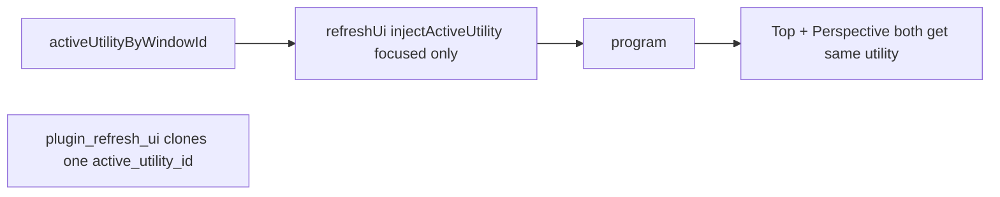

# Window-Local Utilities (Mode-Wide Tools Only)

## Problem

Chrome already stores utilities correctly in `activeUtilityByWindowId` and the utility bar is per-window. Tools correctly use a single mode-wide `activeToolId`.

On batched `refreshUi`, the shell injects **only the focused window’s** utility into one shared `[ViewState](framework/core/rs/lib.rs)`:

```4625:4636:framework/renderer/react/index.tsx
const viewState: ViewState = injectActiveUtility({
  ...nextSession.viewState,
  // ...
});
const request = buildUiRefreshRequest(scope, windowInstances, panelTabLeaves, viewState, cache);
```

`[plugin_refresh_ui](framework/plugin/rs/lib.rs)` stamps `window_id` per pane but **clones the same `active_utility_id`**:

```4052:4057:framework/plugin/rs/lib.rs
let window_view_state = ViewState { window_id: Some(entry.key.clone()), ..request.view_state.clone() };
```

Puzzle 3D then bakes `gumballActive` / `transformMode` into each pane’s selection JSON from that shared utility, so Top + Perspective both show the gumball when transform is active in either.

Engagements/measures have the same leak: they iterate instances but resolve one shared `puzzle3d_scene_active_utility(view_state)`.




## Chosen approach

Carry the full per-window utility map on `ViewState`, overlay each window’s utility when rendering that window, and resolve per-window utilities in engagements/measures. Do **not** use a renderer-only gumball hack — that would leave brush/session/engagement leakage.

## Implementation

### 1. Protocol: per-window utility map on `ViewState`

In `[framework/core/rs/lib.rs](framework/core/rs/lib.rs)` and `[framework/core/js/index.ts](framework/core/js/index.ts)`:

- Add `active_utility_by_window_id: HashMap<String, String>` (TS: `activeUtilityByWindowId?: Record<string, string>`).
- Keep singular `active_utility_id` as the **per-call overlay** (actions / single-target renders).
- Fix the docstring: utilities are per window **instance**, not kind; tools remain mode-wide via `active_tool_id`.

### 2. Shell: pass the map on refresh; keep singular overlay on actions

In `[framework/renderer/react/index.tsx](framework/renderer/react/index.tsx)`:

- On `refreshUi`, pass `activeUtilityByWindowId` from the shell map into `viewState`.
- Do **not** set singular `activeUtilityId` from the focused window on multi-window refresh (that is the leak). Mode-wide `activeToolId` via `injectActiveTool` stays.
- Keep `injectActiveUtility(viewState, windowId)` for `handleAction` / host effects (singular overlay for the targeted window).

Update `[buildUiRefreshRequest](framework/renderer/react/index.tsx)` tests if they assert the old singular field.

### 3. Plugin refresh: stamp utility per window

In `[framework/plugin/rs/lib.rs](framework/plugin/rs/lib.rs)` `plugin_refresh_ui` window loop:

```rust
let active_utility_id = request.view_state
    .active_utility_by_window_id
    .get(&entry.key)
    .cloned()
    .or_else(|| request.view_state.active_utility_id.clone());
let window_view_state = ViewState {
    window_id: Some(entry.key.clone()),
    active_utility_id,
    ..request.view_state.clone()
};
```

### 4. Puzzle (and same pattern elsewhere): resolve utility per instance

In `[puzzle/plugin/rs/lib.rs](puzzle/plugin/rs/lib.rs)`:

- Extend `puzzle3d_scene_active_utility` (and 2d/5d equivalents) to accept a window id and prefer `active_utility_by_window_id[window_id]`, then singular overlay, then fill-tool override, then default.
- In `window_engagements` / `window_measures`, resolve utility **inside** the per-`wid` loop (not once before the loop).
- `render` already gets a stamped singular `active_utility_id` after step 3 — keep using that.

### 5. Tests

- **Puzzle Rust**: two window instances of `puzzle3d-main`; transform active only on `puzzle3d-main-top` via the map → top selection JSON has `gumballActive: true`, perspective `false`.
- **Framework plugin**: refresh with two windows and different map entries → each rendered section’s view path sees its own utility (extend existing refresh tests if present).
- **Renderer**: `buildUiRefreshRequest` / refresh path carries the map; focused-window singular inject is not used for multi-window refresh.

### 6. Ticket

On execution: open a new ticket under goal `🎯r2602` (same as [PER-WINDOW-LOCAL-OPTIONS](.repo/🎫/26/07/22/PER-WINDOW-LOCAL-OPTIONS/ticket.json) / [INTRODUCE-TOOLS-TO-APP-MODES](.repo/🎫/26/07/22/INTRODUCE-TOOLS-TO-APP-MODES/ticket.json)). No existing ticket covers cross-window utility/gumball leakage ([SHOW-3D-GUMBALL…](.repo/🎫/26/07/21/SHOW-3D-GUMBALL-ONLY-WHEN-TRANSFORM-UTILITY-ACTIVE/ticket.json) only fixed inactive-looking transform).

## Out of scope

- Changing tool semantics (fill stays mode-wide).
- Renderer-only gumball visibility overrides.
- Puzzle2d deeper engine-shared option rearchitecture (already documented as a known limitation).

