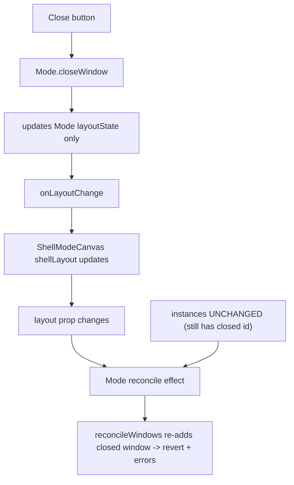

# Fix Window Drag + Close Across All UIs

## Root cause

All play UIs share one path: `ShellModeCanvas` ([framework/product/platform/renderer/react/index.tsx](framework/product/platform/renderer/react/index.tsx) lines 1495-1649) renders `Mode` ([ui/react/index.tsx](ui/react/index.tsx) lines 17402+). The shell owns `instances` (source of truth); `Mode` keeps its own `layoutState` and only emits `onLayoutChange`.

- `Mode.closeWindow` ([ui/react/index.tsx](ui/react/index.tsx) lines 17497-17510) removes the window from its internal layout only. It never signals the shell to drop the instance.
- `ShellModeCanvas` never removes instances on close, so `windows` still contains the closed id.
- `Mode`'s reconcile effect (lines 17432-17440) re-derives `layoutState` from props via `reconcileWindows` ([ui/react/index.tsx](ui/react/index.tsx) lines 16599-16617), which re-adds any instance still present. The closed window snaps back and the layout/instances desync throws in CAD play.
- For drag, the same desync makes layout changes feel dead; single-window UIs additionally have nothing to dock to via internal tab drag — splitting them into multiple same-kind panes is done by dragging a window from the Display panel (`buildDisplayWindowsTree`, [framework/product/platform/renderer/react/index.tsx](framework/product/platform/renderer/react/index.tsx) lines 1148-1198) onto the canvas (`handleExternalTemplateDrop` → `onTemplateDrop` → `handleTemplateDrop`).

## Fix

### 1. Add a close intent from `Mode` to the shell

In [ui/react/index.tsx](ui/react/index.tsx):

- Add `onWindowClose?: (windowId: string) => void` to `ModeProps` (lines 16495-16504).
- In `closeWindow` (lines 17497-17510): call `onWindowClose?.(windowId)` and, when the last window is closed, emit `onActiveWindowChange?.(...)` cleanly (widen `onActiveWindowChange` and `activeWindowId` handling to allow no active window).
- Keep the internal `layoutState` update so `Mode` still works uncontrolled, but the shell removal below makes the reconcile keep it removed.

### 2. Remove the instance in the shell (single source of truth)

In `ShellModeCanvas` ([framework/product/platform/renderer/react/index.tsx](framework/product/platform/renderer/react/index.tsx) lines 1506-1648):

- Add a `handleWindowClose` that does `setInstances(prev => prev.filter(i => i.instanceId !== windowId))`, removes the window from `shellLayout`, and updates active window (fallback to first remaining, or null when empty).
- Pass `onWindowClose={handleWindowClose}` to `<Mode>` (lines 1638-1647).
- With the instance gone, `windows` no longer contains it, so `reconcileWindows` removes it from layout instead of re-adding — close becomes durable and drag/template-drop persist.

### 3. Allow a null active window

- Widen `onActiveWindowChange` to accept `null` through the chain: `Mode` (lines 16498), `ShellModeCanvas` (line 1504), and platform `handleActiveWindowChange` ([framework/product/platform/renderer/react/index.tsx](framework/product/platform/renderer/react/index.tsx) lines 4364-4370). UI `onActiveWindowChange` consumers (e.g. CAD [cad/js/renderer/play/index.tsx](cad/js/renderer/play/index.tsx) lines 775-779) already no-operation on unknown ids.

### 4. Empty-shell notice (restore hint)

- In `Mode`'s render (around [ui/react/index.tsx](ui/react/index.tsx) lines 17780-17805), when the layout has no windows, render a centered notice: layouts can be restored and windows dragged in from the Display panel in the navbar. Add the label to the UI translations alongside the existing `ui.display.*` keys used by the Display panel.

### 5. Verify multi-instance splitting works in every UI

Per-instance scoping already exists (GIS controller keys by `instanceId`, [gis/map/play/index.ts](gis/map/play/index.ts) lines 364-471; bodies scope via `useShellWindowInstance` / `shellWindowScopeId`, [framework/product/platform/renderer/react/index.tsx](framework/product/platform/renderer/react/index.tsx) lines 800-841, 1473-1493). During verification, drag a window from the Display panel into GIS map / puzzle 3d / CAD play to confirm a second same-kind pane renders with independent state; fix any per-instance binding gaps found.

## Verification (all UIs, must behave identically)

For GIS map, CAD play, and puzzle 3d:

- Close a window: it disappears, no console errors, no snap-back.
- Close the last window: empty shell shows the restore notice.
- Drag a window from the Display panel onto the canvas (edge = split, center = new tab): a new same-kind pane appears and persists.
- Drag an existing tab/stack to re-dock: layout updates and persists.
- Restore a saved/named layout from the Display panel after emptying.

Confirm runtime behaviour with temporary `[DEBUG]` logs in `closeWindow` / `handleWindowClose` / `handleTemplateDrop`, then remove them.

## Notes / conventions

- Work inside a repo MCP ticket (open or reopen) before editing; keep any temp artifacts under the ticket folder.
- Edit existing files only, using regions; no new files.
