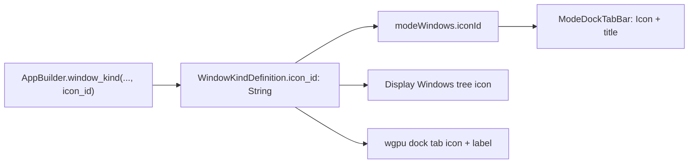

# Window Kind Icons Before Names

## Problem

`[WindowKindDefinition.icon_id](framework/core/rs/lib.rs)` exists as `Option<String>` but every app leaves it `None` (~94 kinds). Dock tab caps render text-only titles (`ModeDockTabBar` in `[ui/js/react/index.tsx](ui/js/react/index.tsx)` ~25361), and Display > Windows rows are label-only (`[buildDisplayWindowsTree](framework/renderer/react/index.tsx)` ~8735). wgpu mirrors the same gap.

## Approach

Make `icon_id` **required**, force every program to pick an icon at declaration time, then thread it into every UI surface that shows a window name.

## 1. Schema + builder (required icon)

- In `[framework/core/rs/lib.rs](framework/core/rs/lib.rs)`: change `WindowKindDefinition.icon_id` from `Option<String>` to `String` (always serialized). Regenerate TS types.
- In `[framework/program/rs/lib.rs](framework/program/rs/lib.rs)`:
  - Add `icon_id` as a required 5th argument to `window_kind` and 6th to `window_kind_with_engagement`.
  - Assert non-empty `icon_id` when building the app.
  - Fix all in-crate `WindowKindDefinition { icon_id: None }` fixtures (core tests, os core, wgpu harness).

## 2. Populate every window kind

Update every `.window_kind(` / `.window_kind_with_engagement(` call site in app `program/rs/lib.rs` files (puzzle, cad, flow, procedural, trinity, shooting, note, gis, draw, sourcing, remodel, architect, s, writer, process, vcs, lowpoly, fem, sequence, animate, mindmap, protocol, …) plus framework test harnesses.

Choose existing Lucide ids from `[ui/asset/icon/](ui/asset/icon/)` that match the kind (e.g. Scene → `box`/`move-3d`, Graph → `network`, Table → `table-2`, Canvas → `pen-tool`, Map → `globe`, Icon preview → `image`). No new SVG assets unless nothing fits.

## 3. React: show icon in front of the window name

- Extend `[ModeWindowDescriptor](ui/js/react/index.tsx)` with `iconId: string`.
- In shell window construction (`[framework/renderer/react/index.tsx](framework/renderer/react/index.tsx)` ~7260–7301): pass `kind.iconId` for base and extra instances.
- Update `ModeDockTabBar` / stack tab list (~25587, ~25338): render `<Icon icon={…} size="small" />` immediately before the truncated title (same for ghost insert preview). Resolve unknown ids via existing `ICONS` fallback (`app-window` or `circle-dot`, matching other chrome).
- Update `[buildDisplayWindowsTree](framework/renderer/react/index.tsx)`: set `icon` on section headers and kind leaf rows from `kind.iconId` (`TreeDataItem`/`TreeDataSection` already support `icon`).

## 4. wgpu: parity

- Dock tab caps in `[framework/renderer/wgpu/rs/lib.rs](framework/renderer/wgpu/rs/lib.rs)`: reserve icon slot before `dock_text`, paint via existing `push_icon` (same pattern as Focus/Close caps).
- Display > Windows builder (~16439): icon + label rows instead of plain text.
- `[ui/wgpu/rs/lib.rs](ui/wgpu/rs/lib.rs)` `build_window`: pass kind `icon_id` instead of empty string.

## 5. Tests

Extend existing suites only:

- React: dock tab renders icon-before-title; Display Windows tree items carry icons when `iconId` is set.
- Plugin/builder: constructing a window kind without a non-empty icon fails (or compile-time via required param).
- wgpu: unit/paint path for tab label width includes icon advance (extend existing chrome tests if present).

## Out of scope

- Pane rail icons (`WINDOW_PANE_*`) — already done.
- App-level navbar `AppBuilder.icon_id` — unrelated branding.
- New icon asset design unless a kind has no suitable existing Lucide id.

## Ticket / goal

On execution: open ticket under goal `🎯r2602🎯runningsketchpad🎯runningsketchpadapps🎯runningdesignapp` (same family as recent shell UX tickets; `repo://goals` MCP resource is currently unavailable). Bind this plan id on open/close.