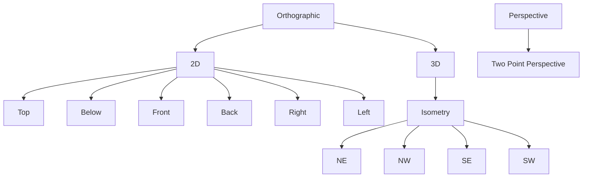

## Goal tree (window templates, every node draggable)

Each parent (Orthographic, 2D, 3D, Isometry, Perspective) is itself a draggable template that applies a sensible default view (Orthographic/2D -> Top, 3D/Isometry -> NE, Perspective -> standard perspective).

## 1. Engine view ids + tree + layout catalog - [infinite/world/r3f/index.tsx](infinite/world/r3f/index.tsx) (region `📷️OrbitCameraView`)

- Extend `OrbitCameraViewId` (~~1009) and the `ORBIT_CAMERA_VIEW_LABELS`/`ORBIT_CAMERA_VIEW_DIRECTION` maps (~~1023/1035) with: `right` `[1,0,0]`, `left` `[-1,0,0]`, `isometricNe` `[1,1,1]`, `isometricNw` `[-1,1,1]`, `isometricSe` `[1,-1,1]`, `isometricSw` `[-1,-1,1]`, `twoPointPerspective` `[1,-1,0]` (horizontal/eye-level so verticals stay parallel). Keep existing ids.
- Add `children?` to `OrbitCameraViewTemplateDescriptor` (~~1107) and rewrite `createOrbitCameraViewTemplates` (~~1122) to return the nested tree above (each node has `id`, `label`, `controllerId`, `command`, `args:{view}`, optional `children`). Labels per request ("Below", "Right", "Left", "Two Point Perspective").
- Add a sibling `createOrbitCameraViewLayoutDescriptors()` returning an abstract, framework-free tree of layout descriptors (id, label, `groupPath`, arrangement + ordered `views`). Cover as many useful arrangements as possible, grouped as a tree:
  - Single: each of the 11 views as a one-window layout.
  - Dual: Top|Front, Front|Right, Top|NE, Plan|Perspective, Front|Back, Right|Left.
  - Triple: Top/Front/Right.
  - Quad: Standard (Top, Front, Right, NE), Ortho Faces (Top, Front, Right, Left), Isometry (NE, NW, SE, SW).
  - 2D: six-pane Top/Below/Front/Back/Right/Left.
  - 3D: four-corner isometry.
- Add `WorldOrbitCameraViewApplier({ view, seedKey })`: reads camera + orbit controls via `useThree`, and on `seedKey` change applies `computeOrbitCameraViewState(view, { target, distance })` from the current target/distance (for canvases like CAD where `WorldCanvas` owns the camera). Extend the in-file `createOrbitCameraViewTemplates` test (~1378) for the new tree shape.

## 2. Framework model: nested templates + grouped layouts - [framework/core/index.ts](framework/core/index.ts)

- `WindowTemplate` (~271): add `readonly children?: readonly WindowTemplate[];`.
- `NamedLayout` (~~283) + `createNamedLayout` (~~292): add optional `readonly groupPath?: readonly string[];`.

## 3. Display panels: render trees - [framework/product/platform/renderer/react/index.tsx](framework/product/platform/renderer/react/index.tsx)

- `findWindowTemplate` (~779): recurse into `template.children` so any nested node id resolves (used by drop/dispatch/bootstrap).
- `buildDisplayWindowsTree` (~1149): map each template (and its `children`) recursively to nested draggable `TreeDataItem`s; every node emits `{ windowKindId, templateId }` drag data. Keep the draggable kind parent row.
- `buildDisplayLayoutTree` (~1180): group builtin layouts into nested folder items by `groupPath`; leaves call `host.applyNamedLayout`. Keep user/saved layouts flat under a "Saved" group.
- Extend the vitest blocks (~3223/3234) for nested template rows and grouped layout items.

## 4. Puzzle 3D - [puzzle/3d/play/index.ts](puzzle/3d/play/index.ts)

- `PUZZLE_3D_VIEW_TEMPLATES` (~548) already comes from `createOrbitCameraViewTemplates` -> now the tree (no other change needed there).
- `applyOrbitCameraView` (~~1621) + `orbitCameraViewFromLegacyPreset` (~~1644): handle the new view ids; `computeOrbitCameraViewState` already covers them via the new direction map.
- Replace the single `"Quad"` named layout (~~2456) with the full catalog via a new mapper (see step 6) bound to `PUZZLE_3D_PLAY_WINDOW_ID`. Update the `ORBIT_CAMERA_VIEW_COMMAND` tests (~~3328) to also exercise an isometric/two-point view.

## 5. CAD full camera wiring - [cad/js/renderer/index.tsx](cad/js/renderer/index.tsx) + [cad/js/renderer/play/index.tsx](cad/js/renderer/play/index.tsx)

Renderer ([cad/js/renderer/index.tsx](cad/js/renderer/index.tsx)):

- In `InteractionSpatialView` (~3104, near `<WorldOrbitGated>` ~3123) render `WorldOrbitCameraViewApplier` when a `cameraView`/`cameraViewSeedKey` prop is present.
- Thread `cameraView?: OrbitCameraViewId` + `cameraViewSeedKey?: string|number` through `InteractionSpatialView` props and `PlaySession` props (~3639) down to the spatial view.

Play ([cad/js/renderer/play/index.tsx](cad/js/renderer/play/index.tsx)):

- Add the view-template tree to each `WindowKindRuntime` in `rebuildShellMode` (~636) via `createOrbitCameraViewTemplates({ controllerId: CAD_PLAY_CONTROLLER_ID })`.
- `CadPlayShellController.run` (~704): handle `setOrbitCameraView` `{ view, instanceId }` -> store `viewSeedByInstance[instanceId] = { view, nonce++ }` and `emit()`.
- Pass `instanceId` from `CadPlaySurfaceHost` (~~2202, has `shellInstance`) into `CadPlayInteractionPane` (~~2086); read the per-instance seed and pass `cameraView`/`cameraViewSeedKey` into `PlaySession` (~2153).
- Replace `CAD_PLAY_LAYOUT`/named layouts with the existing 4-pane quad plus the full view-layout catalog (mapper bound to a representative window kind, e.g. `CAD_PLAY_SHAPE_WINDOW_ID`, dropping multiple instances at different views). Update the cad-play vitest (~2319) for templates + `setOrbitCameraView`.

## 6. Shared layout mapper - [framework/product/playground/core/index.ts](framework/product/playground/core/index.ts) (region `🔖️WindowKindRuntime`/layouts)

- Add `namedLayoutsFromOrbitViewDescriptors(windowKindId, descriptors)` that turns the abstract layout descriptors from step 1 into `NamedLayout[]` (using `createWindowLayout` with `templateId = view`, `groupPath` from the descriptor, arrangement -> row/column/stack tree). Both plays consume this.

## Notes / decisions

- View semantics (Z-up): Right=+X, Left=-X, Below=-Z, Top=+Z, Front=-Y, Back=+Y; isometry corners are the four diagonals; Two Point Perspective is a horizontal eye-level perspective (no vertical convergence).
- Keep `@semio-tech/infinite-world-r3f` free of `@framework/*` types (descriptors stay abstract; mapping to `WindowTemplate`/`NamedLayout` happens in the framework/play layers), matching the existing `as readonly WindowTemplate[]` cast pattern.
- All edits extend existing files within their regions per repo rules; tests extend existing in-file vitest blocks. Validate by running the `@semio-tech/infinite-world-r3f`, `@semio-tech/puzzle-3d-play`, `@semio-tech/cad-js-renderer`, and `@framework/...` suites, plus a runtime smoke of both plays.
