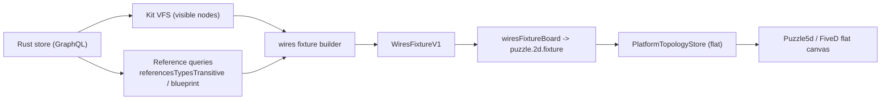

# Wires Kit Relationship View

## Goal

The kit app's relationship view becomes a real WIRES graph. Every node currently visible in the kit File System (VFS) is a WIRES identity, and edges are pulled directly from the Rust store, kept in sync with VFS visibility:

- A node is shown only if it is visible in the VFS (root + expanded branches).
- Containment is drawn parent -> child (matching the VFS tree).
- Reference relationships are drawn at the *closest* granularity: a collapsed design shows its transitive `references` edge to a visible type; once expanded (pieces visible), that transitive edge is dropped and the direct chain `design --has--> piece --is--> type` is shown instead.

## Mechanism

Edge resolution rule (generalized from the design/type example): a transitive reference edge `A -> C` is emitted only when no intermediate node on its path is visible; if the intermediate `B` is visible, emit `A -> B` and `B -> C` instead.

## Relationship-kind mapping (4 WIRES kinds)

- `owns`: containment for kit/typology/folder -> child (kit->typology/folder/file/family, folder->*, typology->type/design).
- `has`: type -> representation/port/connector; design -> piece/connection; piece -> child piece/connection.
- `is`: visible piece -> its blueprint type/design (`Piece.blueprint()`), drawn only when the blueprint node is also visible.
- `references`: collapsed design -> visible type/design via `referencesTypesTransitive()` / `referencesDesignsTransitive()`; suppressed when the design is expanded.

## Key files

- [semio/client/lib/sketchpad/js/index.ts](semio/client/lib/sketchpad/js/index.ts): manifest, window body, the fixture builder, sync triggers, VFS access.
- [semio/client/lib/js/index.ts](semio/client/lib/js/index.ts): relationship APIs already exist (`referencesTypes`/`referencesTypesTransitive` at ~3342/3363, `blueprint`/`isType`/`isDesign` at ~4067-4076); add a small batched relationship-fetch helper if needed.
- [reasoning/mindmap/wires/react/index.ts](reasoning/mindmap/wires/react/index.ts): reuse `WiresFixtureV1`, `wiresFixtureBoard`, `relationshipKindToEdgeKindId`, kind catalogs.
- [framework/product/platform/core/index.ts](framework/product/platform/core/index.ts): VFS controller; add a method to enumerate currently-visible nodes for a scope.

## Implementation

### 1. Window: rename Diagram -> Wires (sketchpad)

- In the kit app manifest (~~14407-14418) replace the `diagram` window kind with `{ id: "wires", label: "Wires", bodyKey: SKETCHPAD_BODY_KIT_WIRES }`; update `createDefaultLayout([...])`, `SKETCHPAD_BODY_KIT_`* / `SKETCHPAD_SURFACE_KIT_*` constants (~~13089-13119), and body registration (~14466).
- Rename `SketchpadKitDiagram` (~13274) to `SketchpadKitWires` (still a `puzzle5d` flat `SketchpadRoutedComponent`); keep `presentation: "flat"`.
- Update route/pane parsing (`parseSketchpadRouteScopeFromPath`, `kit-diagram` pane) and selection application (`sketchpadApplyPuzzle2dSelection`, `sketchpadPathFromDiagramNodeId`) and the `sketchpadKitDiagramInstanceId` -> `...WiresInstanceId` helper (~11590).

### 2. Visible-node enumeration (platform core)

- Add `visibleVirtualFileSystemNodes(scope): readonly VirtualFileSystemNodeRecord[]` to `VirtualFileSystemController` reusing the same data as `buildVirtualFileSystemModel` (root + expanded `childrenByScope`). The sketchpad shell exposes the kit-scope visible set + each node's `parentId`/`fileNodeKindId`.

### 3. Reference data from Rust (sketchpad + @semio/js)

- Add an async relationship fetch in the shell keyed by visible node ids, using the existing JS store methods: per visible design call `referencesTypesTransitive()`/`referencesDesignsTransitive()`; per visible piece call `blueprint()`. Cache results per kit, invalidated alongside `invalidateKitVirtualFileSystem` (~14078).

### 4. Wires fixture builder (sketchpad, new region)

- Replace `sketchpadKitPuzzle2dFixtureFromKit` usage for this surface with `sketchpadKitWiresFixture(...)` that:
  - builds identities from visible VFS nodes (`identityKind = fileNodeKindId`, `nodeId = vfs id`, `label = name`),
  - emits containment edges from `row.parentId` with `owns`/`has` per the mapping,
  - emits `is` edges for visible piece->blueprint and `references` edges for collapsed-design->visible type/design, applying the bridging rule (skip a design's transitive references when that design is expanded),
  - assigns deterministic seed `x/y` per node (kind-layered), and a `kindCatalogs` block coloring `wires.owns/is/references/has`,
  - returns `WiresFixtureV1` -> `wiresFixtureBoard(...)` -> `puzzle.2d.fixture/v1` for the flat topology (empty volume).

### 5. Sync triggers (sketchpad)

- In `syncTopologyForSurface` (~13751) route the wires surface to the new builder. Because identities/edges now depend on VFS state and async reference reads, make the wires sync re-run on: kit store change (`subscribe`), VFS expand toggle for the kit scope (hook into `toggleVirtualFileSystemExpand`), async children-load completion, and route change. Upsert via `upsertTopologyStore` once async reference data resolves.

### 6. i18n + labels

- Replace kit `diagram` window labels with `wires` ("Wires") in the sketchpad i18n block (~7178) and any panel/tab copy.

### 7. Tests (extend existing only)

- Extend the sketchpad/wires test files to cover: identity-per-visible-node, containment kind mapping, collapsed design emits transitive `references` edge to a visible type, and expanded design emits `has`+`is` direct chain instead.

## Repo process

- Per repo rules: read `repo://goals`, open/reopen a repo-MCP ticket before editing, keep temp artifacts in the ticket folder, structure additions with `#region`, extend existing tests/examples in place, and close the ticket with a summary when done.

## Notes / decisions

- Confirmed: rename Diagram -> Wires (no separate window), and all visible VFS node kinds become identities.
- Rendering reuses the existing FiveD flat topology path (the current kit diagram already renders handle-less nodes + edges), so no new renderer is required beyond relationship-kind catalogs.

