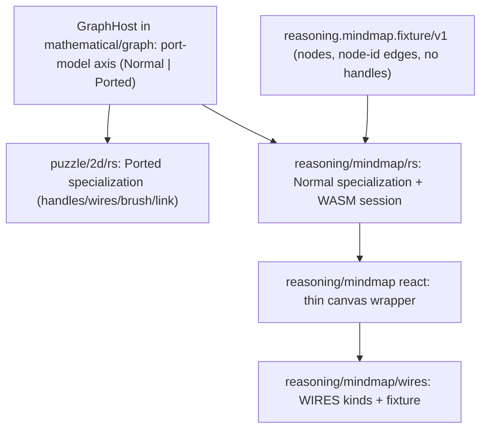

## Wires Normal Graph (React thin, logic in Rust)

### Problem

A mindmap is a normal directed graph, but WIRES currently renders through the **port-graph** puzzle 2d board. The Rust split is already done at the engine layer (`GraphEngine<P: GraphPortModel, D>` in [mathematical/graph/lib.rs](mathematical/graph/lib.rs) branches on `P::HAS_PORTS`; `reasoning/mindmap` = `GraphEngine<Normal, Directed>`), but the **rich Vello renderer is not**:

- `BoardHost` in [puzzle/2d/rs/lib.rs](puzzle/2d/rs/lib.rs) (~~5200 lines) is self-contained and entirely handle-centric. `parse_fixture_v1` (~~3762) hard-fails without per-node `handles[]`; `edge_curve` (~3254) only resolves through handles; scene build draws handle markers; hit-test prioritizes handles; `delete_selection` cascades node→handles→edges.
- `SceneDescriptorJson` ([infinite/canvas/vello/lib.rs](infinite/canvas/vello/lib.rs) ~421) carries `handles` and edges reference handle ids.
- The React layer [puzzle/2d/react/index.tsx](puzzle/2d/react/index.tsx) (~12.6k lines) is **not thin**: TS owns fixture parsing (`parsePuzzle2dFixture` ~1718, requires handles), kind catalogs (`#region 🔖️Kinds`), theme probing (`#region 🎨️ElementsUiPuzzle2dPaint`), declarative scene sync (`syncPuzzle2dScene` ~10586, binds edges to handle objects), and document observation (`#region 🔖️DirectedGraphObservation`).
- WIRES shoehorns this: [metabolism.wires.json](reasoning/mindmap/wires/fixture/metabolism.wires.json) gives every topic a synthetic `:link` handle and connects edges handle→handle; [wires/play](reasoning/mindmap/wires/play/index.ts) boots the full puzzle 2d chrome via `PUZZLE_PLAY_ENTRY=wires`.

### Target

### Approach

All graph logic and styling move to (or stay in) Rust; React only hosts the canvas, forwards a single fixture/theme JSON, and subscribes to events. The rich host is generalized over the existing port-model axis so the **same** Vello drawing/camera/LOD/theme/GPU pipeline serves both quadrants; Normal mode simply omits handles and anchors edges at node rims.

### Decisions (chosen; adjust if you disagree)

- New normal board schema: `reasoning.mindmap.fixture/v1` (nodes with `id/x/y/shape/size/text/nodeKind`, **no** `handles`; edges with `id/source/target/edgeKind` referencing **node ids**; `camera`; `meta.kindCatalogs` limited to `nodes`/`edges`). `reasoning.wires.fixture/v1` embeds this instead of `puzzle.2d.fixture/v1`.
- Host generalization implemented by threading a `GraphPortMode { Normal, Ported }` through `BoardHost` (runtime field set at construction/from fixture schema), branching the ~12 load-bearing sites, rather than duplicating the 5200-line host. The drawing/theme/LOD/icon/GPU paths are shared unchanged. (Mirrors the `P::HAS_PORTS` branching already in `GraphEngine`.)
- Normal rendering reuses the rich host crate's WASM module; mindmap gets its own `wasm_bindgen` session entry constructed in Normal mode.

### Phase 1 - Normal-graph fixture schema

- Define `reasoning.mindmap.fixture/v1` and migrate [metabolism.wires.json](reasoning/mindmap/wires/fixture/metabolism.wires.json): drop `handles[]`, repoint edges to node ids (e.g. `source: "f042c2a4-..."`), move handle catalog out, keep node/edge kind catalogs + `meta.wires.allowedTopicIds`.
- Update [wires/react/index.ts](reasoning/mindmap/wires/react/index.ts): `WiresFixtureBoard.schema` -> `reasoning.mindmap.fixture/v1`; `parseWiresFixtureBoard` validates node-id edges (no handles).

### Phase 2 - Rust: normal mode in the host

In [puzzle/2d/rs/lib.rs](puzzle/2d/rs/lib.rs) (or lifted into [mathematical/graph/lib.rs](mathematical/graph/lib.rs) base under a `#region 🔖️Host`):

- Add `GraphPortMode` field to `BoardHost`; default `Ported`.
- `parse_fixture_v1`: accept `reasoning.mindmap.fixture/v1` (no `handles[]`, node-id edges) -> Normal; keep `puzzle.2d.fixture/v1` -> Ported. Edge endpoints store node ids in Normal.
- `edge_curve` / `endpoint geometry`: Normal anchors at node rim toward peer (reuse `ray_*_rectangle_edge` / circle rim from `infinite_canvas`), control arms from node centers; matches `GraphEngine<Normal>` semantics.
- Scene build (`append_nodes_and_handles`, `append_edges_wires_and_link`, indirect ring): skip handle markers/icon/rings/wires in Normal.
- Hit-test/hover (`resolve_hit_world` ~3433): Normal = nodes then edges only.
- `delete_selection`: Normal deletes node -> incident edges directly.
- `sync_descriptor` + `SceneDescriptorJson`: allow empty `handles` and node-id edges in Normal.
- Graph observation (document from `root` + node-id edges) in Normal.

### Phase 3 - Rust: WASM session for mindmap

- Expose a Normal-mode session entry (e.g. `MindmapSession` or a `BoardSession` constructed with `GraphPortMode::Normal`) in the `#region 🔖️WasmSession`, with `parseFixtureJson`/`syncDescriptorJson`/pointer/theme/catalog/events methods reused.
- Build a Rust crate `reasoning/mindmap/rs` WASM target (or reuse puzzle 2d's pkg) so mindmap has its own bindings; keep `reasoning_mindmap_wires` as the kinds layer.

### Phase 4 - React: thin mindmap wrapper

- Add a thin `reasoning/mindmap/react` (and `play`) that mounts the generic canvas host from `@semio-tech/infinite-canvas-react-renderer` against the Normal session, forwarding only `fixtureJson` + theme token values and subscribing to `drainEventsJson`. No `Handle` markers, no `syncPuzzle2dScene` handle path, no TS fixture parse for the normal path.
- Move the still-needed parsing/catalog/theme-default/observation responsibilities into Rust so the wrapper stays thin (Rust owns `parse`, styling defaults, document).
- Re-point [wires/react/index.ts](reasoning/mindmap/wires/react/index.ts) + [wires/play/index.ts](reasoning/mindmap/wires/play/index.ts) to the mindmap renderer instead of `@puzzle/2d/`\*; update `bootWiresPlay` in [framework/product/playground/renderer/react/index.tsx](framework/product/playground/renderer/react/index.tsx) (~~4456) and the default-fixture switch (~~1950) to the normal path.

### Phase 5 - Wiring & validation

- Root [Cargo.toml](Cargo.toml) members + [.vscode/launch.json](.vscode/launch.json) cargo test `-p` list updated for any new crate, following existing order/grouping.
- `cargo test` for the host + mindmap crates; `nx` vitest for `@semio-tech/reasoning-mindmap-wires-react` + `play`; runtime verification with `[DEBUG]` logs confirming WIRES renders **no** handles and edges connect node rims; close ticket with file summary.

### Constraints

- Work inside a repo MCP ticket (reopen GENERALIZE-GRAPHS or open a new one after reading `repo://goals`); temp logs under the ticket folder. No `AGENTS.md` edits. Extend existing in-file test/`#region` blocks; no extra script files (use `script.ts`). External libs stay behind interfaces (vello/wgpu already do).

[{"id": "ticket", "content": "Read repo://goals and reopen GENERALIZE-GRAPHS (or open a new ticket) binding this plan; keep temp logs under the ticket folder."}, {"id": "schema", "content": "Define reasoning.mindmap.fixture/v1 (no handles, node-id edges); migrate metabolism.wires.json; update wires/react board parsing."}, {"id": "rust-normal-mode", "content": "Add GraphPortMode to the rich host; branch parse_fixture_v1, edge_curve/geometry, scene build, hit-test, delete, descriptor, and observation for Normal."}, {"id": "rust-wasm-session", "content": "Expose a Normal-mode WASM session for mindmap (reuse host pipeline); wire reasoning/mindmap rs/bindings."}, {"id": "react-thin", "content": "Add thin reasoning/mindmap react+play canvas wrapper over the Normal session; move remaining parse/catalog/theme/observation to Rust; drop handle markers/scene-sync for normal path."}, {"id": "repoint-wires", "content": "Re-point wires/react + wires/play and framework bootWiresPlay/default-fixture to the mindmap renderer and new schema."}, {"id": "wiring-validate", "content": "Update Cargo.toml members + launch.json; run cargo test + vitest; verify no-handles rendering with [DEBUG] logs; close ticket with file summary."}]
