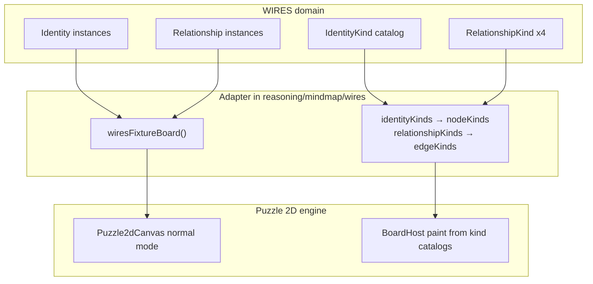

# WIRES: Identity kinds, relationship kinds, and visual semantics

## Product intent

WIRES is **not** a generic puzzle board: it is a fixed vocabulary of **four relationship kinds** (`Owns`, `Is`, `References`, `Has`) over a **flexible set of identity kinds**, each registrable with its own shape (and color/icon). The UI and wires-layer code should say that plainly; puzzle 2d remains the render engine (`graphPortMode: "normal"`), with an explicit adapter boundary.

## Current gaps (validated)

| Area | Today | Problem |
|------|--------|---------|
| Terminology | `topics`, `topicId`, `nodeKind`, mindmap “Topic” | Conflicts with WIRES-native **Identity** / **IdentityKind** |
| Fixture meta | `kindCatalogs.nodes` / `.edges` | Correct data ([metabolism.wires.json](reasoning/mindmap/wires/fixture/metabolism.wires.json) colors per `wires.*`) but wires-facing names are wrong |
| Canvas edges | [`append_edges_wires_and_link`](puzzle/2d/rs/lib.rs) uses theme chrome only | All relationships look identical despite `edgeKind` + catalog colors |
| Canvas nodes | Instance `shape` only; catalog `shape`/`color` ignored at paint | Every identity renders as theme rectangles |
| Play shell | Generic [`buildPuzzle2dPlayHierarchySections`](puzzle/2d/play/index.ts) (“Nodes”, “Edges”, `A → B`) | Does not surface relationship kind; [`wiresPlayRelationshipEdgeLabel`](reasoning/mindmap/wires/play/index.ts) unused in UI |
| Docs | [mindmap/AGENTS.md](reasoning/mindmap/AGENTS.md) says relationship is a “Node” | Wrong link target |

Cross-window sync is already on the shared normal-graph path ([prior plan](.cursor/plans/generalize_wires_cross-window_sync_e8279886.plan.md)); this work does **not** reopen that architecture.

---

## 1. Canonical WIRES terminology (code + docs)

Establish a glossary in [reasoning/mindmap/wires/AGENTS.md](reasoning/mindmap/wires/AGENTS.md) and use it in wires-layer **public** names only (mindmap/puzzle keep their internal graph vocabulary behind adapters).

| WIRES term | Meaning | Puzzle adapter field |
|------------|---------|----------------------|
| **Identity** | One vertex in the WIRES graph | board node (`id`, position, `text`) |
| **IdentityKind** | Registered kind (shape, color, icon) | `nodeKind` + `kindCatalogs.nodes[]` row |
| **Relationship** | One directed link between identities | board edge (`id`, `source`, `target`) |
| **RelationshipKind** | One of `Owns`, `Is`, `References`, `Has` | semantic `kind` + catalog `edgeKind` `wires.{owns\|is\|references\|has}` |

**Rename in wires crate (greenfield, no compat layer):**

- Rust ([reasoning/mindmap/wires/lib.rs](reasoning/mindmap/wires/lib.rs)): prefer `RelationshipKind` (enum) over `WireRelationship`; `identity_label` / `allowed_identities` on extension; keep `mindmap::TopicId` only as internal graph id type.
- TS ([reasoning/mindmap/wires/react/index.ts](reasoning/mindmap/wires/react/index.ts)): `WiresFixtureIdentityV1`, `identityId`, `identityKind`, `sourceIdentityId` / `targetIdentityId`, `RelationshipKind` type alias; central helpers:
  - `relationshipKindToEdgeKindId(kind)` → `wires.owns` …
  - `edgeKindIdToRelationshipKind(id)` / `relationshipKindDisplayName(kind)` → `"Owns"` …
- Fixture JSON ([metabolism.wires.json](reasoning/mindmap/wires/fixture/metabolism.wires.json)): `topics` → `identities`, `topicId` → `identityId`, `nodeKind` → `identityKind`, `sourceTopicId` → `sourceIdentityId`, meta `allowedTopicIds` → `allowedIdentityIds`, catalog keys `identityKinds` / `relationshipKinds` (adapter maps to puzzle `nodes`/`edges` when calling `setKindCatalogsJson`).

Fix [reasoning/mindmap/AGENTS.md](reasoning/mindmap/AGENTS.md) relationship line to point at **edge**, not Node.

**Disambiguation rule (comment + AGENTS):** puzzle **Wire** = transient link-drag cable; never use “wire” for a WIRES relationship in user-facing strings.

---

## 2. Kind-catalog paint in puzzle 2d (shared, relationship + identity visuals)

Extend catalog ingest and paint so fixture metadata actually drives appearance.

**Rust** ([puzzle/2d/rs/lib.rs](puzzle/2d/rs/lib.rs)):

- Expand `EdgeKindDef` to match TS [`EdgeKind`](puzzle/2d/react/index.tsx): `color`, `stroke` (width multiplier or px), `pattern` (`solid` | `dashed` | `dotted`).
- Parse those fields in `set_board_kind_catalogs_from_json` (today only `name` is stored ~L1267).
- In `append_edges_wires_and_link`, compute **base stroke** from `edge_kinds.get(&e.edge_kind)`; apply interaction chrome as overlay (brighten/darken or width bump), not full replacement—so Owns/Is/References/Has stay distinguishable when hovered/selected.
- For nodes: parse `color` on `NodeKindDef` (if missing today); optional `resolve_node_base_fill` from catalog when instance has no explicit fill; keep instance `shape` authoritative but **default** shape from catalog when syncing descriptor if instance omits `shape` (wires board builder can set this).

**TS**: keep `EdgeKind` / `NodeKind` as puzzle names; wires adapter copies `relationshipKinds` → `edges`, `identityKinds` → `nodes`.

**Default relationship visuals** (fixture + catalog seeds):

| RelationshipKind | Suggested stroke | Catalog color (existing) |
|------------------|------------------|---------------------------|
| Owns | solid, medium | `#64748b` |
| Is | solid, heavier | `#0ea5e9` |
| References | dashed | `#a855f7` |
| Has | dotted | `#22c55e` |

Implement dash/dot via Vello stroke style (add small helper; no dash usage in repo yet).

**Tests:** Rust host test: two edges, different `edgeKind`, assert stroke colors differ at neutral pass; vitest catalog round-trip for new fields.

---

## 3. WIRES fixture board builder (identity shapes from kinds)

In [reasoning/mindmap/wires/react/index.ts](reasoning/mindmap/wires/react/index.ts):

- `wiresFixtureBoard(fixture)`: for each identity, set board `nodeKind` from `identityKind`; if board node lacks `shape`, copy from matching **IdentityKind** catalog row (`circle` | `rectangle`).
- Ensure every relationship row’s `edgeKind` is derived from `RelationshipKind` via `relationshipKindToEdgeKindId` (single source of truth—remove manual drift in JSON).
- Validate: 9 relationships ⇒ 9 edges; each `edgeId` maps to exactly one `RelationshipKind`.

Metabolism fixture: give distinct `identityKind` shapes where useful (e.g. capsule vs base rectangles vs circle) so the demo visibly exercises flexible identity kinds—not only labels.

---

## 4. WIRES play shell UI (own terms, not Nodes/Edges)

Add wires-specific hierarchy builder (new region in [reasoning/mindmap/wires/play/index.ts](reasoning/mindmap/wires/play/index.ts) or [puzzle/2d/play/index.ts](puzzle/2d/play/index.ts) behind `PUZZLE_2D_PLAY_IS_WIRES`):

- Root group: **WIRES** (or kit name from fixture `source.kitName`).
- Child groups: **Identities**, **Relationships** (not Nodes/Edges).
- Identity items: identity label (+ optional IdentityKind name from catalog).
- Relationship items: **`Owns: Source → Target`** using `relationshipKindDisplayName` + identity labels (wire `wiresRelationshipLabelForEdgeId` / identity label helpers).

Framework playground ([framework/product/playground/renderer/react/index.tsx](framework/product/playground/renderer/react/index.tsx)): when `isWiresPlay`, pass wires hierarchy builder + optional `fixtureObjectDisplayLabel` override so selection panel matches.

Inspector (puzzle play edge/node inspectors): for wires play, show read-only **Relationship kind** / **Identity kind** using WIRES names; keep underlying `edgeKind`/`nodeKind` fields as implementation detail in a collapsed/advanced row if needed.

Optional canvas edge labels at detail LOD (later slice): mid-curve “Owns” badge—only if cheap; hierarchy labels are minimum bar.

---

## 5. Ticket and validation

- Reopen or continue ticket `26/06/03/FRAMEWORK-ICON-INTERFACE` sibling: use **`WIRES-NORMAL-GRAPH`** or open **`WIRES-IDENTITY-RELATIONSHIP-UI`** via repo MCP when executing (goals resource was unavailable in plan mode).
- **Runtime** (:6015 wires play): four visibly different edge styles; identities show distinct shapes/colors per IdentityKind; hierarchy uses Identities/Relationships with kind in relationship labels; cross-pane selection unchanged.
- **Tests:** extend [reasoning/mindmap/wires/react/index.ts](reasoning/mindmap/wires/react/index.ts) vitest for renames + mapping fns; puzzle 2d tests for catalog paint; wires play vitest for hierarchy labels.

---

## Out of scope (explicit)

- Renaming puzzle 2d public types (`Node`, `Edge`, `WireKind`) globally.
- Compose kit → fixture codegen changes beyond ensuring `identityKind` ids stay stable.
- Arrowheads / edge routing styles per kind (follow-up if dash/color insufficient).

## Key files

- Domain + adapter: [reasoning/mindmap/wires/react/index.ts](reasoning/mindmap/wires/react/index.ts), [reasoning/mindmap/wires/lib.rs](reasoning/mindmap/wires/lib.rs), [reasoning/mindmap/wires/fixture/metabolism.wires.json](reasoning/mindmap/wires/fixture/metabolism.wires.json)
- Paint: [puzzle/2d/rs/lib.rs](puzzle/2d/rs/lib.rs), [puzzle/2d/react/index.tsx](puzzle/2d/react/index.tsx)
- Play UI: [reasoning/mindmap/wires/play/index.ts](reasoning/mindmap/wires/play/index.ts), [puzzle/2d/play/index.ts](puzzle/2d/play/index.ts), [framework/product/playground/renderer/react/index.tsx](framework/product/playground/renderer/react/index.tsx)
- Docs: [reasoning/mindmap/wires/AGENTS.md](reasoning/mindmap/wires/AGENTS.md), [reasoning/mindmap/AGENTS.md](reasoning/mindmap/AGENTS.md)
