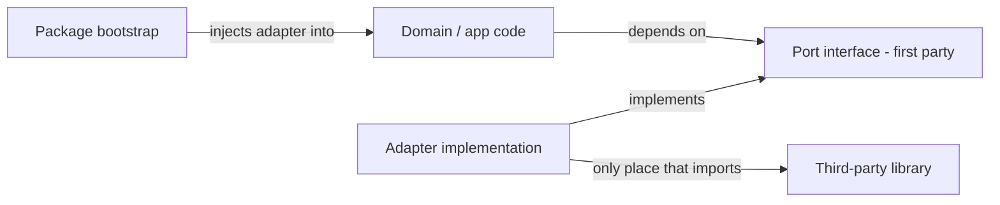

# Wrap External Dependencies Behind Interfaces

## Goal

No first-party source touches a third-party library directly. Each external dependency is consumed only through a first-party **port** (interface) implemented by a thin **adapter**. Scope = third-party deps only (npm/crates/nuget/pip/go modules), not std libs or runtime frameworks. This is a repo-wide rollout strategy, executed package-by-package, enforced automatically.

## Core convention (applies to every language)

- **Port**: a first-party interface describing the capability the package needs (not the library's API surface). Maps to repo definition kind `interface`.
- **Adapter**: the only code allowed to `import`/`use`/`require` the third-party package; implements the port. Maps to definition kind `implementation`.
- **Location**: one adapter unit per dependency, named for the dependency, isolated in its own region/file so the import boundary is greppable (mirrors the existing `//#region 🌐️Transport` boundary in [compose/client/lib/js](compose/client/lib/js) where `@semio-tech/compose-rs-wasm` is only imported inside `rs-wasm-transport.ts`).
- **Wiring**: composition happens at the package entry/bootstrap (constructor injection / provider), never deep in domain logic.
- **Naming**: follow repo rules — use `kind` not `type`, titleized names, emoji-prefixed docstrings, organize with `#region`/subregions in the existing god-files rather than new files where the codebase already concentrates code.

## Existing anchors to use as templates

- Rust: `Transport` trait in [compose/client/lib/query](compose/client/lib/query) (`MemoryTransport`/`JsTransport`/`ComposeTransport`).
- TS: `SpatialKernel`/`StateEngine` ports in [cad/js/core](cad/js/core) with `BrepjsKernel` and `StatelyStateEngine` adapters; `@semio-tech/framework-platform-core` core is already dependency-free.
- Go: `GraphQLExecutor`/`VersionControlProvider`/`SandboxProvider`/`EditorProvider` interfaces in [repo/client/cli](repo/client/cli).

## Per-language mechanics

- **TypeScript/JS**: port = `interface`/type; adapter = module that imports the lib; inject via factory params. Strongest offenders: `@semio-tech/ui-react` (Radix x14, R3F/three, XYFlow, dnd-kit, xstate, i18next, motion, cmdk, fuse.js), `@puzzle/scene`+`@puzzle/topology` (three/R3F), `@semio-tech/cad-js-query` (chevrotain), `@semio-tech/cad-js-kernel-brepjs` (brepjs/OCC), `@semio-tech/compose-sketchpad` (three/fflate).
- **Rust**: port = trait; adapter = struct in a `//#region` that owns the `use`. Offenders in `compose` crate: `nalgebra`, `rusqlite`, `ureq`, `zip`, `async-graphql`, wasm `web-sys`/`js-sys`; `puzzle_board` (`vello`/`typst`) is already behind the wasm boundary.
- **.NET/C#**: port = `interface`; adapter = class. Offenders in [compose/client/lib/net/Compose](compose/client/lib/net/Compose): `Newtonsoft.Json`, `FluentValidation`, `QuikGraph`, `SharpGLTF`, `Svg`, `Refit` (already partly behind `IApi`). Host SDKs (`RhinoCommon`, `Grasshopper`, `WebView2`) wrapped last.
- **Python**: port = `typing.Protocol`/ABC; adapter = concrete module. Offenders in [compose/client/lib/py](compose/client/lib/py) and engine: `sqlalchemy`/`sqlmodel`, `ifcopenshell`, `trimesh`, `graphene`, `pydantic`, `networkx`; coda assistant: `rdflib`, `owlready2`, `fastmcp`, `starlette`/`uvicorn`.
- **Go**: port = `interface`; adapter = struct. Offenders in [repo/client/cli](repo/client/cli): `cobra`, `bleve`, `graphql-go`, `mcp-go`, `modernc.org/sqlite`, `yaml.v3`, `sprig`; coordinator (`pg`/`pg-boss`/`jose`/`next`).

## Enforcement (the durable part)

Add a repo policy `dependency-boundary` to [.repo/📊️/policies.json](.repo/📊️/policies.json) with statutes detecting direct third-party imports outside whitelisted adapter regions, wired into the existing analyze/lint pipeline:

- Extend the JS linter in [repo/lib/js/src/linter.ts](repo/lib/js/src/linter.ts) and the Go `analyze` path in [repo/client/cli](repo/client/cli) with per-language import extraction (the language plugins already expose `extractImports`).
- A breach fires when a file imports a package listed in its manifest's third-party deps and the file is not the registered adapter for that package.
- Run via existing `nx`/`script.ts lint` so it gates pre-commit hooks like other policies.

## Rollout phases (by blast radius)

1. Land the policy + linter statute (TS first, then Go/Rust/C#/Python) so new violations are caught immediately while migration proceeds.
2. Rust `compose` crate (largest single source of truth).
3. GraphQL/transport surface end-to-end (already half-ported).
4. `@semio-tech/ui-react` and shared 3D (three/R3F) port.
5. .NET `Compose.cs`.
6. Python `main.py` (compose) + coda assistant.
7. Go `repo/client/cli`.
8. Host-specific adapters (Rhino/Grasshopper/Electron/WebView2/Next coordinator).

## Process notes

- Work inside repo tickets: open one ticket per phase/package via `ticket_open`, associate with the appropriate goal, close with `ticket_close` listing touched files. No goals opened/closed without your instruction — recommend you open a new goal (e.g. "Wrapped Dependencies") to parent these tickets, or name an existing one.
- No backwards-compat/legacy shims; edit existing files and use regions; extend existing test files (don't add new ones) to assert domain code compiles against ports with fake adapters.
- `reuse` (empty vault) and `elements` (already migrated) need no work.
