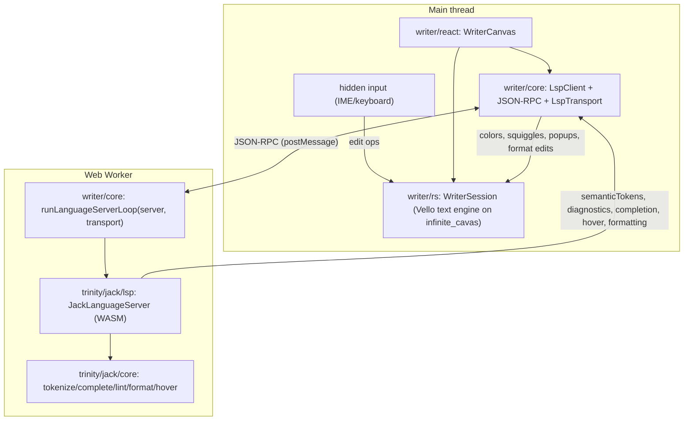

## Writer Technology: Infinite-Canvas Editor + Jack LSP

Greenfield, no legacy/adapters. New `writer` technology stays language-agnostic; all jack-specific language intelligence lives in `trinity`. The editor renders on the existing 2D Vello/WebGPU infinite canvas (`infinite/cavas`); language features flow over a real JSON-RPC LSP protocol between an `LspClient` (main thread) and a language server (WASM) hosted in a Web Worker.

### Architecture

### Layer 1 - Jack language intelligence (Rust, in `trinity`)

Extend [trinity/jack/core/lib.rs](trinity/jack/core/lib.rs) under a new `#region Language Service` with span-aware analysis (today `parse` returns `Result<Query,String>` with no spans):

- `pub fn lint(graph: &Graph, source: &str) -> Vec<Diagnostic>`: span-tracking parse for syntax errors, plus semantic lints (unknown node/edge kind vs manifest, unknown property, variable used in `RETURN`/`WHERE`/`SET` not bound by `MATCH`). `Diagnostic { start, end, severity, message, code }`.
- `pub fn format(source: &str) -> Result<String, String>`: canonical pretty-printer (uppercased keywords, one clause per line, normalized spacing/commas); must be idempotent.
- `pub fn hover(graph: &Graph, source: &str, cursor: usize) -> Option<Hover>`: describe kind/property/keyword at cursor.
- `pub fn semantic_tokens(source: &str) -> Vec<SemanticToken>`: derived from existing `tokenize`.
- Fix the lexer gap so `!=` (`Token::Ne`) is emitted (needed for correct lint).
- Extend the in-file `#region Tests` for lint/format(idempotency)/hover/semantic tokens.

New WASM language-server crate `trinity/jack/lsp/` (`lib.rs`, `Cargo.toml`, `AGENTS.md`, `project.json`, `script.ts`): `JackLanguageServer` consuming `trinity_jack` + `trinity_ram::Graph`, exposing `handle_message_json(json) -> Option<String>` that implements LSP methods: `initialize`, `textDocument/didOpen|didChange` (-> recompute + emit `textDocument/publishDiagnostics`), `textDocument/completion`, `textDocument/hover`, `textDocument/formatting`, `textDocument/semanticTokens/full`. Register crate in the workspace `Cargo.toml` members.

Worker entry `trinity/jack/lsp/worker.ts`: instantiate the jack server WASM and run `runLanguageServerLoop` (from `@semio-tech/writer-core`) over a worker-side transport. Exported factory `createJackLspWorker()` from [trinity/react/index.tsx](trinity/react/index.tsx).

### Layer 2 - `writer/core` (TS, language-agnostic) - `@semio-tech/writer-core`

`writer/core/index.ts` regions:

- `WriterDocumentV1`: schema `"writer.document/v1"` = `{ schema, id, languageId, uri, text, camera: {x,y,zoom} }` (camera makes it a true infinite-canvas document). Parser + validation.
- `#region Lsp`: JSON-RPC 2.0 envelope types + a pragmatic LSP subset (Initialize, TextDocumentItem, DidOpen/DidChange, Completion/CompletionItem, Hover, Diagnostic/PublishDiagnostics, TextEdit/DocumentFormatting, SemanticTokens). `interface LspTransport { send(msg); onMessage(cb); dispose() }`. `interface LanguageServer { handle(msg): LspMessage[] }`. `class LspClient` (correlates requests like [flow/worker-client.ts](flow/worker-client.ts), syncs document, exposes diagnostics/semantic-token subscriptions). `runLanguageServerLoop(server, transport)` generic pump for workers.
- `#region Grammar`: declarative `Grammar` interface (scope patterns -> token classes) for instant client-side highlighting before the server replies; registry keyed by `languageId`.
- vitest in-file for protocol round-trip, document parse, grammar tokenize.

### Layer 3 - `writer/rs` (Rust/WASM editor engine) - on `infinite_cavas`

`writer/rs/lib.rs` (`pub use infinite_cavas`): `WriterSession` (`wasm_bindgen`) mirroring the raster/flow session pattern:

- WebGPU attach (`attach_canvas`, `resize`, `render_frame` via `CanvasGpuSession`), `CanvasContent` impl building the Vello `Scene`: line gutter, glyphs via `infinite::text::append_label`, caret rect, selection rects, diagnostic squiggles, token colors from semantic tokens.
- Camera `{x,y,zoom}` with `wheel_screen` (zoom-at-cursor) + middle/space-drag pan via `screen_to_world`.
- Text buffer + edit ops: `insert`, `delete`, `newline`, arrows/selection, `pointer_down/move/up_screen` (caret/selection hit-testing through the camera).
- Setters: `set_text`/`text`, `set_semantic_tokens_json`, `set_diagnostics_json`, `apply_text_edits_json` (formatting).
- `Cargo.toml`, `AGENTS.md`, `project.json` (nx `wasm` target), `script.ts`; add to workspace `Cargo.toml`. In-file Rust tests for buffer edits + scene non-empty.

### Layer 4 - `writer/react` - `@semio-tech/writer-react`

`writer/react/index.tsx`: `WriterCanvas` React component = `<canvas>` + WASM `WriterSession` + a hidden focus input for IME/keyboard (full-blown editing while rendering on GPU). Owns an `LspClient` built from an injected worker/transport factory; routes keystrokes/edits to WASM and pushes text changes to the server; renders DOM overlays positioned via the WASM `world_to_screen` for the completion popup (tab/enter accept), hover tooltip, and a diagnostics list; applies semantic tokens + diagnostics back into the session each frame. Uses `reactHostPort`. vitest with a fake transport/server.

### Layer 5 - `writer/play` - `@semio-tech/writer-play`

`writer/play/index.ts`: `PlaygroundWriter extends Playground`, `WriterPlayController`, layout with one canvas window (`writer` surface), hierarchy/catalogue/inspector trees, toolbar with Format + Lint actions, fixtures via `import.meta.glob("../fixture/*.writer.json")` + `fixture-slugs.ts`. One full fixture `writer/fixture/jack.writer.json` (`languageId: "jack"`, real jack source). The play controller wires the jack LSP client using `createJackLspWorker()` (demo/test coupling only). Static `index.html`, `globals.css`, `vite.config.ts`, `project.json`, `script.ts`, `package.json`, `vitest.config.ts`.

### Layer 6 - Framework integration

- [framework/product/platform/core/index.ts](framework/product/platform/core/index.ts): add `UiWriterHostSurfaceNode` (`type:"writer"`, `componentKind:"writer"`), add `"writer"` to `ComponentKind`, and `buildWriterWindowBody(surfaceId, controllerId)`.
- [framework/product/playground/renderer/react/index.tsx](framework/product/playground/renderer/react/index.tsx): `registerUiWriterSurfaceHost` + `WriterSurfaceHost` (renders `WriterCanvas` as a canvas host; add `"writer"` to `PLAYGROUND_CANVAS_HOST_TYPES`), `bootWriterPlay`, and a `PUZZLE_PLAY_ENTRY === "writer"` boot branch. Add `"./writer"` export in the renderer `package.json`.

### Layer 7 - Use the editor in the jack shell

In [framework/product/playground/renderer/react/index.tsx](framework/product/playground/renderer/react/index.tsx), replace `TrinityJackEditorSurfaceHost`'s `CodeEditor` with `WriterCanvas` wired to the jack LSP client (via `createJackLspWorker()`), keeping the existing graph + results panes. The jack query becomes a `writer.document/v1` (`languageId:"jack"`); Cmd/Ctrl+Enter still runs the query; format/lint now available. Keep `trinity/jack/play` window structure; only the editor surface changes.

### Layer 8 - Repo registration (zero-touch, cross-platform)

- `writer/README.md` (`name: writer`, `kind: user`), `writer/AGENTS.md` (emoji), per-bundle `AGENTS.md` for core/rs/react/play.
- [repo/lib/js/index.ts](repo/lib/js/index.ts): add `"writer"` to `PlaygroundHostKind` and `PLAYGROUND_PORTS` (`writer: { dev: 6062, test: 6063, env: "WRITER_PLAY_PORT" }`).
- Root [script.ts](script.ts) `DevScript`: map `writer` -> `@semio-tech/writer-play:dev`; root `package.json` `dev:writer`; `.vscode/launch.json` entry following existing grouping; jack worker WASM build target wired into project.json/script.ts.

### Verification (before closing ticket)

- `cargo test` for `trinity_jack` (lint/format/hover), the new jack lsp crate, and `writer/rs`.
- vitest for `writer-core`, `writer-react`, `writer-play`, and touched trinity/platform renderer tests.
- A `runtime-check.mjs` in the ticket folder + browser runtime verification with `[DEBUG]`-prefixed logs on the writer play port and the jack shell (highlighting, completion/tab, hover, live diagnostics, format) before claiming success.

ticket-openRead repo://goals via repo MCP and open a new ticket (e.g. Writer Technology Infinite Canvas Lsp) associated with the most fitting goal; record session.jack-languageExtend trinity/jack/core/lib.rs: add span-aware lint, idempotent format, hover, semantic_tokens; fix != lexing; extend in-file tests.jack-lsp-serverCreate trinity/jack/lsp Rust/WASM JackLanguageServer implementing the LSP method subset over trinity_jack + trinity_ram; add worker.ts + createJackLspWorker() in trinity/react; register crate in workspace Cargo.toml.writer-coreCreate writer/core (@semio-tech/writer-core): WriterDocumentV1, JSON-RPC + LSP subset, LspTransport/LanguageServer interfaces, LspClient, runLanguageServerLoop, Grammar interface; in-file vitest.writer-rsCreate writer/rs WASM WriterSession on infinite_cavas: WebGPU attach/render, Vello text/gutter/caret/selection/diagnostics/token rendering, camera pan/zoom, text buffer + edit ops, setters; Rust tests; register crate in workspace Cargo.toml + nx wasm target.writer-reactCreate writer/react (@semio-tech/writer-react): WriterCanvas with hidden IME input, LspClient wiring, completion/hover/diagnostics DOM overlays positioned via world_to_screen, semantic-token+diagnostic application; vitest with fake transport.writer-playCreate writer/play (@semio-tech/writer-play): PlaygroundWriter, controller, layout, hierarchy/catalogue/inspector trees, Format/Lint toolbar, jack fixture (writer/fixture/jack.writer.json) + fixture-slugs, vite/html/css/boot; vitest.framework-integrationAdd UiWriterHostSurfaceNode + buildWriterWindowBody + ComponentKind 'writer' (platform core); register WriterSurfaceHost + bootWriterPlay + 'writer' canvas host type + writer entry/export (playground renderer + package.json).jack-shell-integrationReplace TrinityJackEditorSurfaceHost CodeEditor with WriterCanvas wired to the jack LSP client; jack query becomes writer.document/v1; keep run-on-Cmd+Enter, add format/lint in the jack shell.registrationAdd writer README/AGENTS + bundle AGENTS; PLAYGROUND_PORTS + PlaygroundHostKind 'writer' (6062/6063); root script.ts DevScript, package.json dev:writer, .vscode/launch.json entry.verifyRun cargo tests (jack core, jack lsp, writer/rs), vitest (writer core/react/play, trinity, platform renderer), ticket runtime-check.mjs, browser runtime verification with [DEBUG] logs on writer play + jack shell; then close ticket.