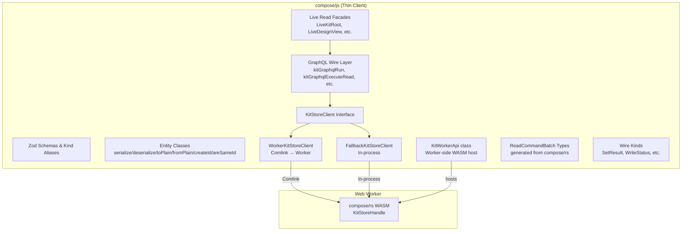
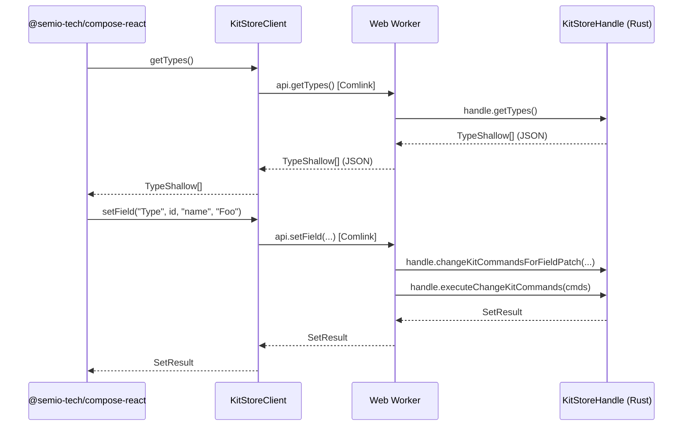

# Design Document: compose-js-thin-client-refactor

## Overview

This design transforms `compose/js/index.ts` (~31k lines) from a monolithic TypeScript library containing domain logic, caching, diff/hash computation, transaction management, and free functions into a pure OO thin client that exclusively delegates to `compose/rs` via WASM. The refactored file retains only:

1. Zod schemas and TypeScript kind aliases for all kit entities
2. Entity classes with OO methods (serialization, ID factory, comparison) — no domain logic
3. The WASM bridge layer (`KitStoreClient` interface, `WorkerKitStoreClient`, `FallbackKitStoreClient`, `kitWorkerApi`)
4. Wire kind definitions (`SetResult`, `WriteStatus`, `KitStoreExecuteResult`, backbone/conflict wire kinds)
5. `ReadCommandBatch` / `ReadCommandBatchResult` kinds and the GraphQL-to-read-command mapping layer
6. Live read facades (`LiveKitRoot`, `LiveDesignView`, `LiveTypeView`, `LivePieceView`)
7. Embedded tests (updated to call through WASM bridge)

Everything else — domain logic, caching, free functions, legacy classes — is deleted.

## Architecture

### High-Level Architecture



### Deletion Scope

The following are removed entirely:

| Category | Examples |
|---|---|
| Domain logic classes | `KitImpl`, `KitEntity`, `KitEntityIndexes`, `KitEntityCaches`, `KitInteractionsApi`, `KitInteractionEntity`, `KitEntityType`, `KitEntityPiece`, `KitEntityDesign`, `KitDocument`, `KitBackboneBridge`, `KitTypesOps`, `KitDesignsOps`, `KitFamiliesOps`, `KitFilesOps`, `KitTagsOps`, `KitConceptsOps`, `KitAttributesOps`, `KitOps` |
| Transaction/history | `KitTransactionsCoordinator`, `KitActiveTransactionSurface`, `Transaction`, `DiffComposer`, `recomputeTxNet`, `#historyDone`, `#historyUndone` |
| Diff functions | All `get*Diff`, `apply*Diff`, `inverse*Diff`, `merge*Diff`, `applyCollectionDiff`, `getCollectionDiff`, `inverseCollectionDiff`, `mergeCollectionDiff`, `addPieceToDesignDiff`, `removePieceFromDesignDiff`, etc. |
| Hash functions | `hashType`, `hashDesign`, `hashKit`, `hashPiece`, `hashConnection`, `HashWriter`, `sha256bytes`, `formatNumberForHash`, `hashPlaneRoot`, `hashPlaneChain`, `hashCenterRoot`, `hashCenterChain` |
| Flatten/placement | `computeChildPlane`, `connectionPlacementTranslationBasis`, `flattenPlacementWalkDesignOrderRoots`, `buildFlattenPieceAdjacency`, `collectUndirectedComponentIds`, `moveTranslationWorldFromPiecePlane`, `childConnectorOriginWorld`, `solveConnectionOriginMinNorm`, `connectionDiffFromStructuralMoveVector` |
| Caching | `#flattenMerkleByDesign`, `FlatMerkleCacheEntry`, `ensureFlattenGeometryCache`, `getFlattenMerkleCache`, `invalidateFlattenMerkleCaches`, `piecesMetadataCached`, `cachedSqlJs` |
| Representation selection | `jaccard`, `selectBestRepresentation`, `filterRepresentationsByTagIds`, `getAvailableTagIdsForRepresentations`, `getAllTagIdsFromRepresentations` |
| Geometry 3D math | `planeToMatrix`, `matrixToPlane`, `averagePlane`, `toThreeRotation`, `toComposeRotation`, `toThreeQuaternion`, `toComposeQuaternion`, `vectorToThree` |
| Validation | `validateKitEntityDiff`, `kitEntityDiffIsBlocking`, `validationReportFromGraph`, `graphValidationFromLedgerReport` |
| Semantic commands | `expandSemanticCommandToDiff`, `FlattenDesignCommand`, `DeletePieceCommand`, `ChangePieceTypeCommand` |
| Wire projection | `kitWireProjectionFromImpl`, `kitDataFromWireDto`, `emptyKitWireDto`, `kitGraphToPlainData` |
| Ledger diffs | `emptyLedgerDiff`, `normalizeLedgerDiff`, `squashLedgerChangesForward`, `squashLedgerChangesBackward`, `invertLedgerDiff`, `ledgerKitChangeFromGraph`, `graphKitChangeFromLedger` |
| Free functions | `cn`, `id`, `normalize`, `round`, `deepEqual`, `arraysEqual`, `generateUniqueName`, all per-entity `serialize*`/`deserialize*`, `create*Id`/`areSame*Id`/`get*Id`, `asKitInstance`, `requireKit`, `duplicateKitForIsolation`, `stripNullsJsonClone`, `detachPieceForLocalMutation`, `detachConnectionForLocalMutation`, `detachDesignForLocalMutation`, `designWithDiff`, `createLocalBackbone`, `createDevBackbone`, `createRemoteBackbone`, `roundPlane`, `serializePlane`, `deserializePlane` |
| Legacy stores | `InMemoryKitStore`, `KitStore` (the JS-side class) |
| Connector compat | `arePortsCompatible`, `areConnectorsCompatible`, `unifyConnectorPortsAndCompatiblePortsForTypes` |
| Clusterable groups | `getClusterableGroups`, `getIncludedDesigns` |
| Copy/paste logic | `copyDesign`, `pasteDesign`, `mergeDesigns`, `orientDesign` |
| Design mutation helpers | `deletePiecesAndConnectionsInDesign`, `removePiecesAndConnectionsFromDesign`, `fixPieceInDesign`, `buildDragMoveStructuralContext` |

### What Stays

| Category | Details |
|---|---|
| Zod schemas | All `*Schema`, `*DiffSchema`, `*MetaSchema`, `*ShallowSchema`, `*IdSchema` |
| Kind aliases | All `type * = z.infer<typeof *Schema>` |
| Entity classes | `Coordinate`, `Vec`, `Point`, `Vector`, `Plane`, `Camera`, `Attribute`, `Location`, `Author`, `File`, `Folder`, `Benchmark`, `Quality`, `Port`, `Family`, `Prop`, `Tag`, `Concept`, `Representation`, `Connector`, `Type`, `Piece`, `Connection`, `Design`, `Layer`, `Group`, `Side`, `Stat`, `Kit` (new thin wrapper) |
| WASM bridge | `KitStoreClient` interface, `WorkerKitStoreClient`, `FallbackKitStoreClient`, `KitStoreClient.create()` static factory |
| Worker API | `KitWorkerApi` class (renamed from `kitWorkerApi` object) |
| Wire kinds | `SetResult`, `SetError`, `WriteStatus`, `HookTriad`, `KitStoreExecuteResult`, `KitStoreWireBackboneConfig`, `KitStoreWireConflictResolution`, `KitStoreWireBackboneStatus`, `KitStoreWireKitConflict` |
| Read commands | `ReadCommandBatch`, `ReadCommandBatchResult`, all `Read*Command` / `Read*CommandOutput` kinds (generated) |
| GraphQL wire | `KitGraphqlHandle`, `kitGraphqlRun`, `kitGraphqlExecuteRead`, `kitGraphqlExecuteStoreCommand`, `kitGraphqlSubscribeLoop`, `kitGraphqlKitDesignPiecesMetadata`, and other `kitGraphql*` query helpers |
| Live facades | `LiveKitRoot`, `LiveDesignView`, `LiveTypeView`, `LivePieceView` |
| Constants | `ICON_WIDTH`, `TOLERANCE` |
| Generator | `Generator` class (random name/id generation) |
| Embedded tests | Updated to use WASM bridge |

## Components and Interfaces

### KitStoreClient Interface (unchanged contract)

The `KitStoreClient` interface remains the boundary contract consumed by `@semio-tech/compose-react` and the sketchpad. No methods are added or removed — every method delegates to `KitStoreHandle` via WASM.

```typescript
export interface KitStoreClient {
  // State reads
  getDto(): any;
  getSnapshot(): Promise<any>;

  // Field-level mutations (ChangeKitCommand pipeline)
  setField(kind: string, id: string, field: string, value: unknown): Promise<SetResult>;
  addChild(parentKind: string, parentId: string, childKind: string, dto: unknown): Promise<SetResult>;
  removeChild(parentKind: string, parentId: string, childKind: string, childId: string): Promise<SetResult>;

  // Diff application
  applyDesignDiff(designId: string, diff: unknown): Promise<SetResult>;
  applyKitDiff(diff: unknown): Promise<SetResult>;

  // Design operations (all delegate to KitStoreHandle)
  clusterPieces(designId: string, pieceIds: string[], clusterName: string): Promise<SetResult>;
  dragPieces(designId: string, pieceIds: string[], du: number, dv: number): Promise<SetResult>;
  movePieces(designId: string, pieceIds: string[], gap: number, shift: number, rise: number): Promise<SetResult>;
  fixPieces(designId: string, pieceIds: string[]): Promise<SetResult>;
  flattenDesign(designId: string): Promise<SetResult>;
  expandDesign(parentDesignId: string, nestedDesignId: string): Promise<SetResult>;
  deleteConnection(designId: string, connectionId: string): Promise<SetResult>;
  changePieceType(designId: string, pieceId: string, newTypeId: string): Promise<SetResult>;
  pasteDesignSelection(designId: string, selection: unknown, plane: unknown): Promise<SetResult>;
  createHangingPieces(designId: string, typeIds: string[], plane: unknown): Promise<SetResult>;
  createConnectedPiece(designId: string, parentPiece: string, parentPort: string, childType: string, childPort: string): Promise<SetResult>;
  createFixedPiece(designId: string, typeId: string, plane: unknown): Promise<SetResult>;

  // Read operations
  getPiecesMetadata(designId: string): Promise<any>;
  getPieces(designId: string): Promise<any>;
  getConnections(designId: string): Promise<any>;
  getDesigns(): Promise<any>;
  getTypes(): Promise<any>;
  getAuthors(): Promise<any>;
  getKitMetadata(): Promise<any>;

  // Undo/redo (delegated to KitStoreHandle)
  undo(): Promise<SetResult>;
  redo(): Promise<SetResult>;
  canUndo(): Promise<boolean>;
  canRedo(): Promise<boolean>;

  // Events
  subscribe(cb: (ev: any) => void): () => void;
  dispose(): void;

  // GraphQL control plane
  execute(cmd: unknown): Promise<KitStoreExecuteResult>;
  executeRead(commands: ReadCommandBatch): Promise<ReadCommandBatchResult>;
  kitGraphql(): KitGraphqlHandle;

  // VCS
  vcsState(): Promise<any>;
  theKitDto(): Promise<any>;
  materializeAt(id: string): Promise<any>;

  // Backbone
  attachBackbone(cfg: KitStoreWireBackboneConfig): Promise<SetResult>;
  detachBackbone(): Promise<SetResult>;
  backboneStatus(): Promise<KitStoreWireBackboneStatus>;
  listConflicts(): Promise<KitStoreWireKitConflict[]>;
  resolveConflict(id: string, strategy: KitStoreWireConflictResolution): Promise<SetResult>;
  syncNow(): Promise<SetResult>;
}
```

### Entity Class Pattern

Every entity class follows the same OO pattern. Domain logic methods (like `Piece.flatPlane()`, `Piece.flatCenter()`, `Piece.delete()`, `Piece.changeType()`, `Design.deletePieces()`) are removed. Only data + serialization + factory + comparison remain.

```typescript
export class Type {
  id!: string;
  name!: string;
  // ... fields from TypeSchema ...

  constructor(data: TypePlain) { Object.assign(this, data); }

  // Serialization
  serialize(): string { return JSON.stringify(this.toPlain()); }
  static deserialize(json: string): Type { return Type.fromPlain(JSON.parse(json)); }

  // Plain conversion
  toPlain(): TypePlain { return TypeSchema.parse(this); }
  static fromPlain(data: TypePlain): Type { return new Type(data); }

  // ID factory
  static createId(id: string): TypeId { return { id }; }
  static areSameId(a: TypeId, b: TypeId): boolean { return a.id === b.id; }
}
```

Entity classes that already have instance methods (`Coordinate`, `Vec`, `Point`, `Vector`, `Plane`, `Camera`) retain their existing `serialize()`, `rounded()`, `toPlain()` methods. Free-function wrappers around them are deleted.

### Kit Class (replaces KitImpl)

`KitImpl` is deleted. A new thin `Kit` class replaces it with zero domain logic:

```typescript
export class Kit {
  id!: string;
  name!: string;
  // ... all fields from KitSchema ...

  constructor(data: KitPlain) { Object.assign(this, data); }

  serialize(): string { return JSON.stringify(this.toPlain()); }
  static deserialize(json: string): Kit { return Kit.fromPlain(JSON.parse(json)); }
  toPlain(): KitPlain { return KitSchema.parse(this); }
  static fromPlain(data: KitPlain): Kit { return new Kit(data); }
  static createId(id: string): KitId { return { id }; }
  static areSameId(a: KitId, b: KitId): boolean { return a.id === b.id; }
}
```

No `ops`, no `transactions`, no `#historyDone`/`#historyUndone`, no `#flattenMerkleByDesign`, no `backbone`, no `_applyDiff`, no `replayChangeUnchecked`.

### Compose Utility Class

Free utility functions become static methods on a `Compose` class that delegates to WASM:

```typescript
export class Compose {
  /** Delegates to composeNormalizeName in compose/rs. */
  static normalizeName(s: string): string { return wasmModule.composeNormalizeName(s); }
  /** Delegates to composeRound in compose/rs. */
  static round(value: number, decimals: number): number { return wasmModule.composeRound(value, decimals); }
  /** Delegates to generateId in compose/rs. */
  static generateId(): string { return wasmModule.generateId(); }
  /** Delegates to kitFromJson in compose/rs. */
  static async kitFromJson(s: string): Promise<any> { return wasmModule.kitFromJson(s); }
  /** Delegates to kitToJson in compose/rs. */
  static async kitToJson(value: any): Promise<any> { return wasmModule.kitToJson(value); }
  /** Delegates to kitValidate in compose/rs. */
  static async kitValidate(value: any): Promise<any> { return wasmModule.kitValidate(value); }
  /** Delegates to kitsAreEqual in compose/rs. */
  static async kitsAreEqual(a: any, b: any): Promise<any> { return wasmModule.kitsAreEqual(a, b); }
  /** Delegates to flattenDesign in compose/rs. */
  static async flattenDesign(kit: any, designId: string): Promise<any> { return wasmModule.flattenDesign(kit, designId); }
}
```

### KitWorkerApi Class (replaces kitWorkerApi object)

The `kitWorkerApi` plain object becomes a `KitWorkerApi` class:

```typescript
export class KitWorkerApi {
  private handle: KitStoreHandle | null = null;
  private eventListeners = new Map<number, (ev: unknown) => void>();
  private nextEventListenerId = 0;
  private eventGqlStarted = false;

  async init(wasmSpecifier: string, dto: unknown): Promise<void> { /* ... */ }
  snapshot(): any { /* ... */ }
  async setField(kind: string, id: string, field: string, value: unknown): Promise<SetResult> { /* ... */ }
  async addChild(parentKind: string, parentId: string, childKind: string, dto: unknown): Promise<SetResult> { /* ... */ }
  async removeChild(parentKind: string, parentId: string, childKind: string, childId: string): Promise<SetResult> { /* ... */ }
  // ... all other methods that currently exist on kitWorkerApi ...
}
```

### KitStoreClient.create() Factory

The free `createKitStoreClient` function becomes a static method:

```typescript
// On the KitStoreClient interface (or a companion namespace):
export async function createKitStoreClient(opts: CreateKitStoreClientOptions): Promise<KitStoreClient> {
  // JSON round-trip for wasm-bindgen compatibility
  const dto = JSON.parse(JSON.stringify(opts.initialKit));
  if (opts.forceFallback || typeof Worker === "undefined") {
    const mod = await importWasmModule(wasmSpecifier);
    await ensureComposeWasmInitialized(wasmSpecifier, mod, isNodeRuntime);
    return new FallbackKitStoreClient(mod.KitStoreHandle.create(dto), dto, timeoutMs);
  }
  try {
    const worker = opts.workerFactory?.() ?? new Worker(/* ... */);
    const api = Comlink.wrap(worker);
    await api.init(wasmSpecifier, dto);
    return new WorkerKitStoreClient(worker, api, dto, timeoutMs);
  } catch {
    // Fallback to in-process
    const mod = await importWasmModule(wasmSpecifier);
    await ensureComposeWasmInitialized(wasmSpecifier, mod, isNodeRuntime);
    return new FallbackKitStoreClient(mod.KitStoreHandle.create(dto), dto, timeoutMs);
  }
}
```

Note: Since `KitImpl` is deleted, the `asKitInstance(opts.initialKit)` call is replaced with a plain `JSON.parse(JSON.stringify(opts.initialKit))` — the WASM deserializer only needs plain objects.

### FallbackKitStoreClient (simplified)

The existing `FallbackKitStoreClient` is retained but simplified:
- Removes any local validation logic (e.g., `validateRequiredName`, `validateOptionalDisplayName`) — validation is done by `KitStoreHandle` in Rust
- Every method is a pure delegation to `this.handle.*` with `settleSetPromise` wrapping
- No local DTO caching beyond what's needed for `getDto()` (a snapshot call)

### WorkerKitStoreClient (simplified)

The existing `WorkerKitStoreClient` is retained but simplified:
- Removes local DTO refresh logic that called `KitImpl` methods
- Every method delegates to `this.api.*` (Comlink proxy) with timeout wrapping
- `getDto()` calls `this.api.snapshot()` instead of maintaining a local `KitImpl` mirror


## Data Models

### Retained Zod Schemas (complete list)

All Zod schemas and their inferred TypeScript kind aliases are retained unchanged. They define the wire format between `compose/js` and `compose/rs`:

**Geometry kinds**: `CoordinateSchema`, `VecSchema`, `PointSchema`, `VectorSchema`, `PlaneSchema`, `CameraSchema` + their `*DiffSchema` variants

**Entity ID schemas**: `AttributeIdSchema`, `LocationIdSchema`, `AuthorIdSchema`, `FileIdSchema`, `FolderIdSchema`, `BenchmarkIdSchema`, `QualityIdSchema`, `PortIdSchema`, `PropIdSchema`, `RepresentationIdSchema`, `ConnectorIdSchema`, `TypeIdSchema`, `LayerIdSchema`, `PieceIdSchema`, `GroupIdSchema`, `ConnectionIdSchema`, `StatIdSchema`, `DesignIdSchema`, `KitIdSchema`, `TagIdSchema`, `ConceptIdSchema`, `FamilyIdSchema`

**Entity schemas**: `AttributeSchema`, `LocationSchema`, `AuthorSchema`, `FileSchema`, `FolderSchema`, `BenchmarkSchema`, `QualitySchema`, `PortSchema`, `FamilySchema`, `PropSchema`, `TagSchema`, `ConceptSchema`, `RepresentationSchema`, `ConnectorSchema`, `TypeSchema`, `LayerSchema`, `PieceSchema`, `GroupSchema`, `ConnectionSchema`, `SideSchema`, `StatSchema`, `DesignSchema`, `KitSchema`

**Meta schemas** (subset projections): `AuthorMetaSchema`, `FileMetaSchema`, `FolderMetaSchema`, `QualityMetaSchema`, `PortMetaSchema`, `FamilyMetaSchema`, `PropMetaSchema`, `TagMetaSchema`, `ConceptMetaSchema`, `RepresentationMetaSchema`, `ConnectorMetaSchema`, `TypeMetaSchema`, `LayerMetaSchema`, `PieceMetaSchema`, `PieceShallowSchema`, `TypeShallowSchema`, `ConnectorShallowSchema`

**Diff schemas**: `DiffStatusSchema`, `AttributeDiffSchema`, `AttributesDiffSchema`, `LocationDiffSchema`, `AuthorDiffSchema`, `AuthorsDiffSchema`, `FileDiffSchema`, `FilesDiffSchema`, `FolderDiffSchema`, `FoldersDiffSchema`, `BenchmarkDiffSchema`, `BenchmarksDiffSchema`, `QualityDiffSchema`, `QualitiesDiffSchema`, `PortDiffSchema`, `PortsDiffSchema`, `FamilyDiffSchema`, `FamiliesDiffSchema`, `PropDiffSchema`, `PropsDiffSchema`, `TagDiffSchema`, `TagsDiffSchema`, `ConceptDiffSchema`, `ConceptsDiffSchema`, `RepresentationDiffSchema`, `RepresentationsDiffSchema`, `ConnectorDiffSchema`, `ConnectorsDiffSchema`, `TypeDiffSchema`, `LayerDiffSchema`, `PieceDiffSchema`, `GroupDiffSchema`, `ConnectionDiffSchema`, `SideDiffSchema`, `DesignDiffSchema`, `KitDiffSchema`

**Collection diff schemas**: `*sDiffSchema` for each entity collection (e.g., `AuthorsDiffSchema`, `FilesDiffSchema`, etc.)

### Wire Kind Definitions

```typescript
// Error kinds from Rust SetError
export type SetError = {
  kind: "IllegalName" | "NameTooLong" | "NotFound" | "Conflict" | "InvalidOperation" | "Internal";
  message: string;
};

export type SetResult = { ok: true } | { ok: false; error: SetError };

export type KitStoreExecuteResult =
  | { ok: true; result: unknown }
  | { ok: false; error: SetError };

export type WriteStatus =
  | { kind: "idle"; pending: 0; lastError?: undefined }
  | { kind: "pending"; pending: number; lastError?: SetError };

export type HookTriad<T> = readonly [T, (next: T | ((prev: T) => T)) => Promise<SetResult>, WriteStatus];

export type KitStoreWireBackboneConfig =
  | { dev: { path: string } }
  | { local: { folder: string } }
  | { remote: { session: string } };

export type KitStoreWireConflictResolution =
  | { dropWip: null }
  | { forceOverwriteBackbone: null };

export type KitStoreWireBackboneStatus = {
  attached: boolean;
  kind?: string | null;
  tip?: string | null;
};

export type KitStoreWireKitConflict = {
  id: string;
  wipCheckpoint: unknown;
  backboneCheckpoint: unknown;
  message?: string;
};
```

### ReadCommandBatch Types (generated)

The `ReadCommandBatch` and `ReadCommandBatchResult` kinds are generated from `compose/rs/read_module.rs` via `gen_read_command_types.py`. They remain unchanged:

```typescript
export type ReadCommandBatch = ReadonlyArray<ReadKitCommand>;
export type ReadCommandBatchResult = ReadonlyArray<ReadKitCommandOutput>;
```

Where `ReadKitCommand` is a discriminated union of externally-tagged read commands (e.g., `{ readKitTypeIdsCommand: null }`, `{ readKitDesignsShallowCommand: null }`, `{ readKitTypeCommands: { typeId: string; commands: ReadTypeCommand[] } }`, etc.) and `ReadKitCommandOutput` is the corresponding output union.

### GraphQL Handle

```typescript
export type KitGraphqlHandle = {
  execute(requestJson: string, onMessage: (line: string) => void): Promise<void>;
};
```

This is the raw WASM `KitStoreHandle.execute` shape. All reads, mutations, and subscriptions flow through this single entry point.

### Entity Class Data Flow




## Correctness Properties

*A property is a characteristic or behavior that should hold true across all valid executions of a system — essentially, a formal statement about what the system should do. Properties serve as the bridge between human-readable specifications and machine-verifiable correctness guarantees.*

### Property 1: Entity toPlain/fromPlain round-trip

*For any* entity kind (Coordinate, Vec, Point, Vector, Plane, Camera, Attribute, Location, Author, File, Folder, Benchmark, Quality, Port, Family, Prop, Tag, Concept, Representation, Connector, Type, Piece, Connection, Side, Design, Layer, Group, Stat, Kit) and *for any* valid plain object conforming to that entity's Zod schema, calling `Entity.fromPlain(data).toPlain()` SHALL produce an object deeply equal to the original data.

**Validates: Requirements 3.1, 7.2**

### Property 2: Entity serialize/deserialize round-trip

*For any* entity kind and *for any* valid plain object conforming to that entity's Zod schema, constructing an entity instance, calling `entity.serialize()` to produce a JSON string, then calling `Entity.deserialize(json)` SHALL produce an entity whose `toPlain()` output is deeply equal to the original data.

**Validates: Requirements 7.1**

### Property 3: Entity ID factory and comparison

*For any* entity kind that has ID operations and *for any* two arbitrary strings `a` and `b`, `Entity.createId(a)` SHALL produce `{ id: a }`, and `Entity.areSameId(Entity.createId(a), Entity.createId(b))` SHALL return `true` if and only if `a === b`.

**Validates: Requirements 3.2, 7.3, 7.4**

## Error Handling

### WASM Bridge Errors

All errors from `KitStoreHandle` are surfaced as `SetResult` or `KitStoreExecuteResult` with structured `SetError` payloads. The thin client does not catch, transform, or suppress errors — it forwards them as-is.

Error kinds from Rust:
- `IllegalName` — name validation failed (empty, invalid characters)
- `NameTooLong` — name exceeds maximum length
- `NotFound` — entity not found by ID
- `Conflict` — concurrent modification conflict
- `InvalidOperation` — operation not supported (e.g., backbone commands on WASM-only handle)
- `Internal` — unexpected Rust panic or internal error

### Timeout Handling

Both `FallbackKitStoreClient` and `WorkerKitStoreClient` wrap every WASM call with `withTimeout(promise, timeoutMs, "timeout")`. If the WASM call exceeds the timeout, the promise rejects with a timeout error. The default timeout is configurable via `CreateKitStoreClientOptions.timeoutMs`.

### Worker Failure Fallback

`createKitStoreClient` attempts to create a `WorkerKitStoreClient` first. If the Worker fails to boot (e.g., CSP restrictions, missing Worker support), it falls back to `FallbackKitStoreClient` (in-process WASM). This fallback is transparent to consumers.

### Dispose

`KitStoreClient.dispose()` terminates the Worker (if `WorkerKitStoreClient`) or calls `handle.free()` (if `FallbackKitStoreClient`). After dispose, all subsequent calls throw.

## Testing Strategy

### Unit Tests (example-based)

Unit tests verify specific examples and edge cases:

1. **Export surface smoke tests**: Verify that all expected schemas, kind aliases, entity classes, wire kinds, and bridge classes are exported. Verify that all deleted domain logic functions/classes are NOT exported. This is a single comprehensive test that scans the module's exports against an allowlist and a denylist.

2. **Entity class method existence**: Verify each entity class has `serialize()`, `deserialize()`, `toPlain()`, `fromPlain()`, `createId()`, `areSameId()` methods (where applicable).

3. **Geometry class methods**: Verify `Coordinate`, `Vec`, `Point`, `Vector`, `Plane`, `Camera` retain their `rounded()` method and produce correctly rounded values for specific examples.

4. **WASM bridge integration tests**: Using `FallbackKitStoreClient` (in-process WASM):
   - Create a client with a minimal kit, call `setField`, verify `SetResult.ok === true`
   - Call `getTypes()`, `getDesigns()`, verify they return data from WASM
   - Call `undo()` / `redo()`, verify state changes
   - Call `vcsState()`, verify it returns VCS tree data
   - Call `executeRead()` with a `ReadCommandBatch`, verify typed results

5. **Embedded tests**: The existing embedded test suite (triggered by `COMPOSE_JS_RUN_EMBEDDED_TESTS=1`) is updated to call through the WASM bridge. Tests that exercised deleted domain logic are either rewritten to use WASM or removed with a comment explaining why.

### Property-Based Tests

Property-based tests verify universal properties across all valid inputs. Using `fast-check` (already available in the vitest ecosystem):

- Minimum 100 iterations per property test
- Each property test references its design document property
- Tag format: `Feature: compose-js-thin-client-refactor, Property {number}: {property_text}`

**Property 1 implementation**: Generate random valid plain objects for each entity kind using Zod schema-aware generators (or `fast-check` arbitraries that produce objects matching the schema). For each entity, verify `Entity.fromPlain(data).toPlain()` deep-equals the input.

**Property 2 implementation**: Same generators as Property 1. For each entity, verify `Entity.deserialize(entity.serialize())` produces an equivalent entity.

**Property 3 implementation**: Generate random string pairs. For each entity kind with ID operations, verify `createId` and `areSameId` behavior.

### Test Configuration

- Test runner: `vitest` (already configured in `package.json`)
- PBT library: `fast-check` (add as dev dependency)
- Embedded tests: `cross-env COMPOSE_JS_RUN_EMBEDDED_TESTS=1 vitest run`
- All tests remain in `compose/js/index.ts` (embedded test pattern, no separate test files per workspace rules)
