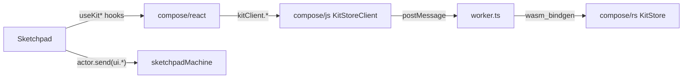

## Non-negotiable architectural invariants

1. **One source of kit state.** `@semio-tech/compose-sketchpad` imports kit data and mutation only via hooks from `@semio-tech/compose-react`. No `yjs`, no `Y.*`, no `Sync*`, no `KitStore` direct use, no `kitCommands`, no `useKit`, no `useKitScope`, no `useKitCommands`, no `useKitTransaction`. `@semio-tech/compose-react` is the only consumer of `@semio-tech/compose-js` (which owns the worker + RPC). `@semio-tech/compose-js` is the only consumer of `@semio-tech/compose-rs` (wasm).
2. **All sketchpad UI state in `sketchpadMachine`.** The single existing machine in [compose/sketchpad/index.tsx](compose/sketchpad/index.tsx) owns every UI slice: `tutorial`, `origin`, `focus`, `panelSections`, `sidePanelTab`, `footerItem`, `dragDrop`, `openKitGuids`, `activeKitGuid`, `homeApp`, `kitApps`, `typeApps`, `designApps`, `qualityApps`, `feedbackApp`, `backgroundOperations`. No ad-hoc providers, no `createContext` + `useState` islands, no `SketchpadStore`/`AppStore`/`KitDiffAppStore`/`PlainAppStore` classes.
3. **Everything non-blocking and status-bearing.** Every write goes through an `@semio-tech/compose-react` `HookTriad<T> = [value, setter, WriteStatus]`. UI components mirror the current server value into a local `useState` (draft) so they keep the user's input when the async setter rejects, and render `status` (`idle` / `pending` / `error` / `readonly`) as spinners, disabled affordances, warnings, and errors.
4. **Rust store is an OO graph, not a bag of pure functions.** Any surviving free function in `impl kit` (e.g. `type_index`, `normalize_coord`, `cross`, `design_dto_by_guid`, `connection_key`, `strip_design_piece_guid`, `expand_nested_design_pieces_in_dto`) MUST be small composable methods on `impl KitStore` (or `impl DesignView`/`impl PieceView` if we grow helpers). Undo/redo joins them as instance methods.

---

## Phase R — Rust: undo/redo + OO hygiene

Edits confined to [compose/rs/src/lib.rs](compose/rs/src/lib.rs) inside existing `pub mod kit`.

1. On `impl KitStore` add instance methods:
   - `pub fn undo(&mut self) -> SetResult`
   - `pub fn redo(&mut self) -> SetResult`
   - `pub fn can_undo(&self) -> bool`
   - `pub fn can_redo(&self) -> bool`
   - `pub fn begin_tx(&mut self) -> SetResult`
   - `pub fn commit_tx(&mut self) -> SetResult`
   - `pub fn abort_tx(&mut self) -> SetResult`
   - Internally: two ring-stacks `past: VecDeque<KitDiff>` / `future: VecDeque<KitDiff>` on `KitStore`, every existing mutator calls `self.record(diff)` that pushes the inverse onto `past` and clears `future`.
2. Demote every remaining free helper in `pub mod kit` (search for `fn ` at module scope) to a private associated fn on `impl KitStore` with `Self::foo(...)` call sites. None may survive as free functions.
3. On `impl KitStoreHandle`, add matching `#[wasm_bindgen(js_name=undo|redo|canUndo|canRedo|beginTx|commitTx|abortTx)]` that lock `inner` and forward.
4. `cargo test` in [compose/rs](compose/rs).

## Phase J — @semio-tech/compose-js: expose undo/redo + tx via client

Edits in [compose/js/index.ts](compose/js/index.ts) only.

1. Extend `interface KitStoreClient` with `undo()`/`redo()`/`canUndo()`/`canRedo()`/`beginTx()`/`commitTx()`/`abortTx()`.
2. Implement on `WorkerKitStoreClient` (forward to worker) and `FallbackKitStoreClient` (delegate to `this.kit.undo()` etc. — add those as instance methods on `class KitImpl`).
3. [compose/js/worker.ts](compose/js/worker.ts): forward the new messages to `KitStoreHandle`.

## Phase X — @semio-tech/compose-react: add the remaining triad hooks

Edits in [compose/react/index.tsx](compose/react/index.tsx) only, reusing the `runtime.kitClient.subscribe(load)` RPC pattern already used by `usePiecesMetadataMap`.

1. Add async command hooks that drive `kitClient`:
   - `useUndo()`, `useRedo()` → `{ run, status }`.
   - `useCanUndo()`, `useCanRedo()` → `SchemaHookTriad<boolean>` (undefined setter).
   - `useTransaction()` → `{ begin, commit, abort, status }`.
2. Add missing CRUD command hooks mirroring the `useUpdatePiece` pattern so sketchpad's old `kitCommands` map can be fully deleted: `useCreateAuthor`, `useUpdateAuthor`, `useDeleteAuthor`, `useCreateType`, `useUpdateType`, `useDeleteType`, `useCreateDesign`, `useUpdateDesign`, `useDeleteDesign`, `useCreateQuality`, `useUpdateQuality`, `useDeleteQuality`, `useCreatePort`, `useUpdatePort`, `useDeletePort`, `useCreateTag`, `useUpdateTag`, `useDeleteTag`, `useCreateConcept`, `useDeleteConcept`, `useAddFile`, `useUpdateFile`, `useRemoveFile`, `useCreateFolder`, `useUpdateFolder`, `useDeleteFolder`, `useMoveToFolder`, `useImportKit`, `useExportKit`, `useAddPiece`, `useAddPieces`, `useRemovePiece`, `useRemovePieces`, `useAddConnections`, `useRemoveConnection`, `useRemoveConnections`, `useDeleteSelected`, `useDeselectAll`.
3. Add a small helper exported as `useDraft<T>(triad)` → `{ value, setDraft, commit, reset, status, error }` that implements the "local mirror + async write" pattern the user mandated: holds a local `useState` initialised from `triad[0]`, `setDraft` only updates local, `commit` awaits `triad[1]`, on rejection keeps the draft and surfaces `status=error`. All sketchpad inputs use this.

## Phase S — Sketchpad strip (the big one)

Done in-place in [compose/sketchpad/index.tsx](compose/sketchpad/index.tsx). No new files. Regions deleted as atomic bundles.

### S.1 Delete sync infrastructure entirely

- `import * as Y from "yjs"` (line 286).
- Region `🪬SyncInterfaces` (361–445): `SyncMap`, `SyncArray`, `SyncDoc`, `isSyncMap`, `isSyncArray`, `SyncDocFactory`.
- Region `📰CrdtBackend` (447–493): `CrdtDoc`, `createSyncDocFactory`, `getSyncBackendDoc`.
- Region `🏂PersistenceProviders` (495–612): `PersistenceProvider`, `PersistenceFactory`, `JsonFileAdapter`, `SqliteAdapter`, `SyncBinaryPersistenceProvider`, `createJsonFilePersistenceFactory`, `createSqliteFolderPersistenceFactory`.
- Region `👓SyncPath Helpers` (2174–2307) and `🎗️Derived Store` (2309–2443).
- Region `⭐SyncPath Types` (639–652).
- Region `🏬Sync-XState Bridge` (2058–2137).
- Region `🎈Store` (5884–6466): `Store`, `AppStore`, `KitDiffAppStore` base classes.
- Region `🎏Plain App Store (Plain)` (6468–6764): `PlainAppStore` and subclasses.
- Region `🎈Store` (1683–1760) shared types that describe sync-backed stores: `Synchronizable`, `StoreState`, `AppStep`, `AppEdit`, `AppDiff`, `AppCommandResult`, `KitDiffAppStep`, `KitDiffAppEdit`, `KitDiffAppCommandResult`.
- Remove `yjs` from [compose/sketchpad/package.json](compose/sketchpad/package.json).

### S.2 Delete kit state plumbing

- Region `🎙️Granular Hook Types` (654–788): `HookResult`, `HookNoSetResult`, `READONLY_SETTER`, `READONLY_CAN`, `readonlyHookResult`, `writableHookResult`, `conditionalHookResult`, `Field`, `ActionField`, `NOOP_SETTER`, `createField`, `createReadonlyField`, `createAction`, `fieldToHookResult`, `hookResultToField`. Every `canSet`/`HookResult` consumer (~728 occurrences) migrates to `status.kind === "idle" || status.kind === "pending"` from the `HookTriad` returned by `@semio-tech/compose-react`.
- Region `💧Commands` (1644–1681): `KitCommandContext`, `KitCommandResult` interfaces.
- Region `⏰Entity Data Hooks` (7627–7718): `useLocalKitSnapshot`, `useAuthor`, `useType`, `useQuality`, `useDesign`, `usePiece`, `useConnection`, `usePieces`, `useConnections`.
- Region `🎆Piece Derived Hooks` (7720–7807): `PieceMetadata`, `usePiecesMetadataMap`, `usePieceMetadata`, `useFlatPiecePlane`, `useFlatPieceCenter`, `useIsConnectedPiece`, `usePieceDepth`, `useFixedPieceId`, `useParentPieceId`, `useCurrentPiecePlane`, `usePieceParentConnection`.
- Region `🎹Design Derived Hooks` (7809–7838): `useIncludedDesigns`, `useDesignId`, `usePiecesFromIds`, `useReplacableTypes`, `useReplacableDesigns`, `useExplodeableDesignNodes`.
- Region `⏱️Kit` scaffolding (7842–8401): `executeKitCommand`, `KitScope`, `KitScopeContext`, `KitWasmRuntimeBridge`, `KitScopeProvider`, `useKitScope`, `useIsInKitScope`, `useKitStoreFromProvider`, `useKit`, all `useKit*` hooks (`useKitTypes`, `useKitName`, `useKitDescription`, `useKitAuthors`, `useKitFiles`, `useKitQualities`, `useKitDesigns`, `useDesigns`, `useKitFolders`, `useKitPorts`, `useKitTags`, `useKitConcepts`, `useTypeFromKit`, `useDesignFromKit`, `useKitConnectorCompatibility`), `useFileUrls`, `useKitTransaction`, `useKitCommands`.
- Region `💧Commands` (8403–8840): `kitCommands` object.
- Region `🎊kitSelectionHelper` (5216–5790) if it depends on kit data; keep only geometry helpers that remain pure, move them next to consumers as methods on the relevant component. If `kitSelectionHelper` reads kit data, rewire to `@semio-tech/compose-react` hooks.

### S.3 Delete UI provider islands, fold into sketchpadMachine

Each of these regions becomes a ≤10-line `useSelector(actor, …)` wrapper around machine context; no `createContext`, no local `useState`:

- `🏰Origin` (22043–22136): `OriginStore`, `OriginContext`, `OriginProvider`, `useOrigin`, `useOriginValue` → machine slice `origin: string`, events `ui.origin.set`. The document-level pointer/keydown/focusin listener becomes a `fromCallback` actor invoked by the machine.
- `🔬Footer Items` (22138–22209): `FooterItemContext`, `FooterItemProvider`, `useFooterItems`, `useAddFooterItem`, `useRemoveFooterItem` → machine slice `footerItems: FooterItem[]`, events `ui.footer.add`/`ui.footer.remove`.
- `🌥️DragDrop` (22361–22398): `DragDropContext`, `DragDropProvider`, `useDragDrop` → machine slice `dragDrop: { activeType?: Guid, activeDesign?: Guid }`, events `ui.dragDrop.start`/`ui.dragDrop.end`.
- `🎙️Store Factory Registry`, `📰App Plugin Registry`, `📸Dynamic Event Dispatch Registry`, `🏆App Event Handler Factories`, `🌪️Transaction Handler Factory`, `🧿Selector Factory Pattern`, `⭐App Hooks Registry`, `🎸App Registry Exports` (2445–3852): the machine already owns `homeApp`/`kitApps`/`typeApps`/`designApps`/`qualityApps`/`feedbackApp`. Event-handler factories stay only as pure reducers executed by `dispatchAppEvent`; registries that create Sync-backed stores are deleted.
- `OriginProvider`/`FocusProvider`/`PanelSectionProvider`/`SidePanelTabProvider`/`FooterItemProvider`/`DragDropProvider` call sites in the main `Sketchpad` component tree collapse into one `SketchpadActorProvider` already present (or add it).

### S.4 Delete kit lifecycle bridge

- `KitWasmRuntimeBridge` (7877) and `KitScopeProvider` (7915) are replaced at every call site by `<KitProvider kitGuid={guid} backbone={...}>` from `@semio-tech/compose-react`. The sketchpad factory wrappers `createJsonFileKitStore`/`createFolderKitStore`/`createSessionKitStore` re-exports at line 615–628 are deleted; consumers use `KitRegistryProvider` + `KitProvider` with the appropriate `KitProviderBackbone`.
- Anything currently using `useSketchpadStore().kit(guid).store` uses `useKitStoreClient()` or a data hook (`usePieces`, `useDesigns`, ...) from `@semio-tech/compose-react`.

### S.5 Rewire call sites

- `commands.updatePiece(` (×8) → `useUpdatePiece().run(...)` + `useDraft(...)` at the input level.
- `commands.updateConnection(` (×9) → `useUpdateConnection().run(...)`.
- `commands.addConnection(` (×1) → `useAddConnection().run(...)`.
- `store.execute("compose.designApp.*", ...)` (×37 in 29759–30144) → either `actor.send({ type: "designApp.*", ... })` for UI-only intents, or the corresponding `useX` hook from `@semio-tech/compose-react`.
- `kitCommands.*` (×34) → matching `@semio-tech/compose-react` command hooks from Phase X.
- Every `.canSet` / `HookResult[2]` check → `status.kind === "idle"` / negated `status.kind === "readonly"` / `status.kind === "pending"` as appropriate.
- Every editable input: wrap with `useDraft(triad)` so the draft survives async rejection; render `status` via `useWriteIndicator(status)` already in `@semio-tech/compose-react`.

## Phase M — Promote remaining UI slices into `sketchpadMachine`

In the existing machine [compose/sketchpad/index.tsx](compose/sketchpad/index.tsx) ~9671:

1. Add context slices: `origin: string`, `focus: FocusState`, `panelSections: Record<...>`, `sidePanelTab: string`, `footerItems: FooterItem[]`, `dragDrop: { activeType?: Guid; activeDesign?: Guid }`, `openKitGuids: Guid[]`, `activeKitGuid?: Guid`.
2. Add typed events: `ui.origin.set`, `ui.focus.*`, `ui.panel.toggle`, `ui.sidePanel.select`, `ui.footer.add`/`ui.footer.remove`, `ui.dragDrop.start`/`ui.dragDrop.end`, `ui.openKit.push`/`ui.openKit.close`/`ui.openKit.activate`.
3. Invoke `fromCallback`/`fromPromise` actors for: document listeners (origin resolver), kit open/close against `KitRegistryProvider`, kit import/export, SQLite round-trip. Nothing lives in ad-hoc `useEffect`s anymore.

## Phase T — Tests & verification

1. Extend existing vitest in `@semio-tech/compose-react` with a `useDraft` roundtrip test: successful commit clears draft, rejection keeps draft + exposes `status.kind === "error"`, concurrent writes on different guids do not cross-contaminate pending counters.
2. Extend existing Playwright spec under [compose/sketchpad](compose/sketchpad): pending/error/readonly affordances on `useUpdatePiece`, illegal-name preserved draft, concurrent independent pending counters on two pieces, undo/redo via `useUndo`/`useRedo`.
3. Run, in this order:
   - `cargo test` in [compose/rs](compose/rs)
   - `pnpm -F @semio-tech/compose-js test`
   - `pnpm -F @semio-tech/compose-react test`
   - `pnpm -F @semio-tech/compose-sketchpad test`
   - Desktop smoke run over `metabolism.zip`: open kit → drag piece → update connection → undo → redo → export.

## Out of scope

- No new top-level modules in any package.
- No new pure helper functions in `@semio-tech/compose-js` or `@semio-tech/compose-react`; every new thing is a method on `KitStoreClient`, `KitImpl`, `KitStore` (Rust), `KitStoreHandle`, the `KitRuntimeContextValue`, or the existing `sketchpadMachine`.
- No new contexts/providers in `@semio-tech/compose-sketchpad`; only `KitProvider` / `KitRegistryProvider` / `SketchpadStateContext`.
