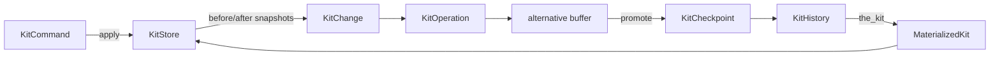

## Defaults chosen (question skipped)

- **Scope: skeleton + wrap.** New types and modules are added. `KitGraphSession` is re-plumbed to drive the new history. `KitStore.undo_past`/`undo_future`/`with_undo`/`begin_tx`/`commit_tx` stay in place as internal mechanics for now; `KitHistory` sits above them. A follow-up task can remove the legacy stack once every call site routes through the history.
- **Operation shape: hybrid.** `KitOperation { kind: KitOperationKind, change: KitChange }`. Replay always uses the stored forward `KitDiff`; `kind` carries semantics (for UI labels, merge heuristics, validation).

## Concept → type mapping

- `kit store` → existing `KitStore` ([lib.rs:6213](compose/rs/src/lib.rs)). No schema change.
- `initial kit` → `KitFullDto` ([lib.rs:6334](compose/rs/src/lib.rs)) stored inside `KitHistory::initial`.
- `kit diff` → new `KitDiff` (kit-scope analogue of `DesignDiff`, [lib.rs:3838](compose/rs/src/lib.rs)).
- `kit change` → new `KitChange { forward: KitDiff, backward: KitDiff, before?: KitFullDto, after?: KitFullDto, author?, time? }` (structurally the same shape as `DesignChange`, [lib.rs:3822](compose/rs/src/lib.rs), but kit-scoped).
- `kit command` → new `KitCommand` trait: `fn apply(&self, kit: &KitStoreRef) -> Result<Option<KitOperation>>`. `None` means the command was a pure query / had no effect; `Some` means it produced an operation to record.
- `kit operation` → new `KitOperation { kind: KitOperationKind, change: KitChange }`, where `KitOperationKind` is an enum of semantic labels (`SetKitMetadata`, `AddType`, `RemoveType`, `ModifyType`, `AddDesign`, `RemoveDesign`, `AddPiece`, `RemovePiece`, `ModifyPiece`, `Connect`, `Disconnect`, `ApplyDesignDiff`, `ApplyKitDiff`, `Other(String)`, …).
- `materialized kit` → new `MaterializedKit { initial: KitFullDto, operations: Vec<KitOperation>, computed: KitFullDto }`. `compute()` replays every operation's `forward` diff onto `initial`.
- `kit checkpoint` → new `KitCheckpoint { id: Id, parent: Option<Id>, operations: Vec<KitOperation>, message: Option<String>, author: Option<String>, time: Option<String>, hash: String }`. `hash` is content-addressable over `(parent, operations)`.
- `kit history` → new `KitHistory { initial: KitFullDto, checkpoints: HashMap<Id, KitCheckpoint>, children: HashMap<Option<Id>, Vec<Id>>, head: Option<Id>, alternatives: HashMap<Id, Vec<KitOperation>> }`. Tree structure via `parent`; `children` is a reverse index; `head` points to the committed tip of the main (non-alternative) line.
- `the kit` → `KitHistory::the_kit() -> MaterializedKit` replays initial + every operation from root to `head` along the non-alternative path.
- `alternative` → uncommitted operations after `head`. Keyed by an alternative id; `alternatives[aid]` is the op list. `promote(aid, message)` turns an alternative into a real checkpoint parented on `head` and advances `head`.

## Module layout (single-file `lib.rs` convention)

Add five inline modules after `pub mod diff {…}` ([lib.rs:3808](compose/rs/src/lib.rs)) and before `pub mod error {…}` ([lib.rs:4056](compose/rs/src/lib.rs)):

- `pub mod kit_diff { … }` — `KitDiff`, `KitDiff::between(&KitFullDto, &KitFullDto)`, `KitDiff::apply(&self, &mut KitStore)`, `KitDiff::invert(&self, before: &KitFullDto) -> KitDiff`.
- `pub mod kit_change { … }` — `KitChange`, `KitChange::between(before, after)`, `KitChange::apply_forward`, `KitChange::apply_backward`.
- `pub mod kit_command { … }` — `trait KitCommand`, plus a tiny `BuiltinKitCommand` enum for common wrapping cases (e.g., `ApplyKitDiff`, `ApplyDesignDiff`, `ReplaceFromFullDto`). Existing RPC entry points (`apply_design_diff_rpc`, `add_child_rpc`, `remove_child_rpc`, …) get thin `KitCommand` adapters.
- `pub mod kit_operation { … }` — `KitOperation`, `KitOperationKind`.
- `pub mod history { … }` — `KitCheckpoint`, `KitHistory` with: `new(initial)`, `record_operation(op)`, `checkpoint(message, author)`, `open_alternative() -> Id`, `switch_alternative(Option<Id>)`, `promote_alternative(Id, message)`, `discard_alternative(Id)`, `the_kit()`, `materialize_at(checkpoint_id)`, `diff(a: &Id, b: &Id) -> KitDiff`, `walk(root..=head) -> impl Iterator<&KitCheckpoint>`, content-addressable hashing via the existing `HashWriter` ([lib.rs:6046](compose/rs/src/lib.rs)).

## Data flow

The trip from `KitCommand` to `KitChange` is: snapshot `before` via `to_full_dto()`, run the command's effect on `KitStore`, snapshot `after`, build `KitChange { forward: KitDiff::between(before, after), backward: KitDiff::between(after, before) }`. This reuses the exact technique in `with_undo` ([lib.rs:7084-7122](compose/rs/src/lib.rs)).

## Session rewire

Update `KitGraphSession` ([lib.rs:11706-11803](compose/rs/src/lib.rs)) to own `Arc<RwLock<KitHistory>>` alongside `KitStoreRef`:

- `new(kit)` captures `kit.to_full_dto()` as `initial` and stores an empty alternative.
- Add `execute<C: KitCommand>(&self, cmd: C) -> Result<Option<KitOperation>>`. On `Some(op)` it pushes into the current alternative.
- Replace the existing `commit(DesignChange)` with `checkpoint(message) -> Result<Id>` (promotes current alternative; keeps old API as a deprecated shim that wraps to a `KitOperation` of kind `ApplyDesignDiff`).
- Add `the_kit() -> KitFullDto`, `materialize_at(Id) -> KitFullDto`, `open_alternative()`, `switch_alternative(Option<Id>)`, `promote_alternative(Id, message)`, `discard_alternative(Id)`.
- Keep `undo_depth`/`redo_depth` but compute them from the active alternative length and last-checkpoint operations.

## WASM surface

Mirror the new API in `pub mod wasm { … }` ([lib.rs:15826](compose/rs/src/lib.rs)) with identical JS-facing names: `kitHistoryNew`, `kitHistoryExecute`, `kitHistoryCheckpoint`, `kitHistoryTheKit`, `kitHistoryMaterializeAt`, `kitHistoryOpenAlternative`, `kitHistorySwitchAlternative`, `kitHistoryPromoteAlternative`, `kitHistoryDiff`. Delegate to the OO API. DTOs go through `serde_wasm_bindgen`.

## Serialization

`KitHistory` is serde-serializable so callers can persist it next to the kit. A `KitHistoryFullDto` mirrors `KitFullDto` style: all ids, all checkpoints in topo order, active head, active alternative map. Hashing uses the existing `Cache<String>` + `HashWriter` pattern used by `KitStore` ([lib.rs:6239](compose/rs/src/lib.rs), [lib.rs:6046](compose/rs/src/lib.rs)).

## What stays / what is deferred

- `KitStore.undo_past`/`undo_future`/`with_undo`/`begin_tx`/`commit_tx` ([lib.rs:6242-6249](compose/rs/src/lib.rs), [lib.rs:7084-7299](compose/rs/src/lib.rs)) remain. They continue to power the low-level snapshot stack underneath; `KitHistory` is the user-facing versioning layer. A follow-up ticket can remove them once every RPC routes through `session.execute`.
- `DesignDiff`/`DesignChange` ([lib.rs:3808-4054](compose/rs/src/lib.rs)) stay. Design-level changes are lifted to kit scope by a helper `KitDiff::from_design_diff(design_id, DesignDiff) -> KitDiff`.
- Merging two alternatives is **out of scope** for this plan (tree is read-only across branches; only linear promote). Can be added on top by materializing both and running `KitDiff::between`.

## Tests

Add `#[cfg(test)] mod history_tests { … }` at the bottom of `lib.rs` covering:

- empty history: `the_kit()` equals `initial`;
- record + checkpoint + `the_kit()` round-trip equals the actual `KitStore` dto;
- alternative isolation: ops in alt A do not affect main or alt B;
- promote advances `head` and empties that alternative;
- `materialize_at(id)` for any checkpoint equals a fresh replay from `initial`;
- `KitDiff::between(a, b)` then apply on a clone of `a` produces `b`.
