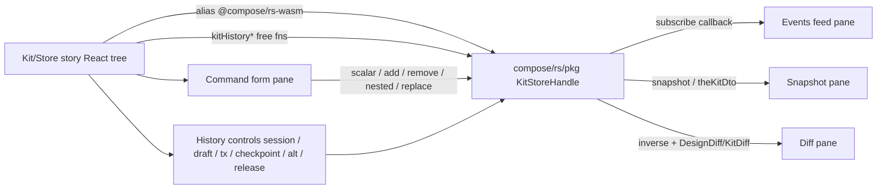

## Goal

Single Storybook story (`compose-algorithms/Kit/Store`) that lets us manually exercise every feature of the `KitStoreRef` / `KitStoreHandle` in the `compose/rs` WASM bundle: every granular `Change{Entity}Command`, every read command, every VCS primitive (sessions, drafts, transactions, checkpoints, alternatives, releases), with live event feed, diff/inverse inspection, and materialized kit snapshots. Unwired Rust variants stay visible in the UI and surface their runtime error in the events feed.

## Architecture



The command form is driven by a TS schema that mirrors every `Change{Entity}Command` variant and its payload (derived from the granular command audit in [`.cursor/plans/granular_kit_change_commands_07c2a9cc.plan.md`](.cursor/plans/granular_kit_change_commands_07c2a9cc.plan.md) and the enums at [compose/rs/lib.rs](compose/rs/lib.rs) lines 410-1086).

## Key files

- [compose/algorithms/.storybook/main.ts](compose/algorithms/.storybook/main.ts) — add `@compose/rs-wasm` Vite alias (mirroring `[compose/sketchpad/vite.config.ts](compose/sketchpad/vite.config.ts)` line 118) and ensure `.wasm` assets are served with the correct MIME.
- [compose/algorithms/package.json](compose/algorithms/package.json) — add `"compose": "file:../rs/pkg"` (or equivalent) so Storybook resolves the WASM package.
- [compose/algorithms/.storybook/stories/KitStore.stories.tsx](compose/algorithms/.storybook/stories/KitStore.stories.tsx) — new story; title `"compose-algorithms/Kit/Store"`.
- [compose/algorithms/.storybook/stories/kit-store/](compose/algorithms/.storybook/stories/kit-store/) — co-located UI pieces:
  - `commandSchema.ts` — enumerates every `Change{Entity}Command` variant with payload types (one entry per setter/add/remove/nested variant; mirror [compose/rs/lib.rs](compose/rs/lib.rs) 410-1086). Exports grouped dropdown options.
  - `EntityPicker.tsx` — cascading dropdowns to pick scope: entity kind (Kit|Type|Design|Piece|Port|Connector|Representation|Connection|Layer|Group|Stat|File|Folder|Author|Concept|Tag|Quality|Benchmark|Prop|Attribute) then its id inside the current snapshot.
  - `CommandForm.tsx` — reads selected entity + variant, renders typed inputs (string / number / Option / vec / DTO JSON editor), submits through `KitStoreHandle`.
  - `EventsFeed.tsx` — subscribes via `KitStoreHandle.subscribe(cb)`; tabular log with kind/entity/field/payload, filters, clear.
  - `DiffViewer.tsx` — for each submission, shows forward command(s), returned inverse, emitted `DesignDiff` / `KitDiff` (JSON tree, collapsible).
  - `SnapshotViewer.tsx` — tabs: `snapshot()` (live graph), `kitHistoryTheKit(dto)` (main-line materialized), `kitHistoryMaterializeAt(dto, at)` (pick any checkpoint). JSON tree with search.
  - `HistoryControls.tsx` — begin/commit/abort tx, undo/redo, checkpoint create/mark-as-release, alternative open/switch/promote via the `kitHistory*` free functions.
- [compose/rs/lib.rs](compose/rs/lib.rs) `pub mod wasm` (~line 15935) — add a small exported method to bridge the command enum (see below); does not remove existing methods.

## Story layout (AlgorithmApp, multi-pane)

Use `WindowKind.CUSTOM` with `component:` overrides on each `AlgorithmWindowDef` (the pattern `CopyAndPaste.stories.tsx` and `FindReplaceableTypesInDesigns.stories.tsx` already use). Default golden-layout:

- Left column: `EntityPicker` (top) + `HistoryControls` (bottom).
- Center column: `CommandForm` (top) + `DiffViewer` (bottom).
- Right column: `SnapshotViewer` (top) + `EventsFeed` (bottom).

`AlgorithmContextValue` carries only the seed `kit` fixture (reuse `metabolism.kit.compose.json`); all other state lives in a local `useKitStore()` hook that owns the `KitStoreHandle`, event buffer, last-diff, and last-inverse.

## WASM bridge addition (small Rust edit)

The current `KitStoreHandle` surface in [compose/rs/pkg/compose.d.ts](compose/rs/pkg/compose.d.ts) has `setField` / `addChild` / `removeChild` / `applyKitDiff` but no typed `Change{Entity}Command` entry point. To drive every granular variant (including the "not yet wired" stubs, which we want to surface as errors), add:

```rust
#[wasm_bindgen(js_name = executeChangeKitCommands)]
pub async fn execute_change_kit_commands(&self, cmds: JsValue) -> Result<JsValue, JsValue> {
    let cmds: Vec<ChangeKitCommand> = serde_wasm_bindgen::from_value(cmds)?;
    let inverse = ChangeKitCommand::apply_many(&mut self.kit.write().unwrap(), &cmds)
        .map_err(to_js_err)?;
    Ok(serde_wasm_bindgen::to_value(&inverse)?)
}
```

This delegates straight to the existing `ChangeKitCommand::apply_many` (around [compose/rs/lib.rs](compose/rs/lib.rs):1090+). Unwired variants will return `Err("... not yet wired")` verbatim into the events feed. Rebuild the WASM pkg via `npm run build` in `compose/rs` (cargo + wasm-pack toolchain already set up).

## Feature coverage checklist rendered by the UI

The `commandSchema.ts` is the single source of truth for the dropdowns and drives both the form and an on-screen coverage table. Groups and example variants (full list mirrors the enum declarations):

- Kit-level: `Name`, `Description`, `Icon`, `Image`, `Preview`, `Version`, `Remote`, `Homepage`, `License`, `Uri`, `Created`, `Updated`, `AddType`, `RemoveType`, `ChangeTypeCommands`, `AddDesign`, `RemoveDesign`, `ChangeDesignCommands`, `AddFile`/`RemoveFile`/`ChangeFileCommands`, same for `Folder`/`Quality`/`Author`/`Concept`/`Tag`, plus kit-level `Attribute`/`Prop` add/remove/change, plus `FromKitDiff`.
- Type: `Name`/`Description`/`Icon`/`Image`/`Variant`/`Stock`/`Virtual`/`Unit`/`Location`/`Created`/`Updated` + Port/Connector/Representation add/remove/change + Author/Concept/Tag/Quality/Prop/Attribute association variants.
- Port: `Id`/`Family`/`CompatibleFamilies`/`Mandatory`/`T`/`Description`/`Point`/`Direction` + attribute/quality association variants.
- Connector, Representation, Layer, Group, Stat, Prop, Attribute, Author, Concept, Tag, Benchmark, File, Folder, Quality: all scalar setters + attribute collection variants.
- Design: scalar setters + Piece/Connection/Layer/Group/Stat add/remove/change + associations.
- Piece: scalar setters + Prop/Attribute add/remove/change.
- Connection: scalar setters + Attribute add/remove/change + `ReplaceConnected`/`ReplaceConnecting` side variants.

Read commands (`ReadKitCommand` etc., lib.rs line 11-343) get a simpler "Read" dropdown that renders the JSON result in the snapshot pane.

VCS controls (History pane) cover:

- `beginTx` / `commitTx` / `abortTx`, `undo` / `redo` / `canUndo` / `canRedo`.
- `kitHistoryNew`, `kitHistoryCheckpoint(dto, message?, author?, time?)`, `kitHistoryMaterializeAt(dto, at?)`, `kitHistoryTheKit`, `kitHistoryDiff`, `kitHistoryExecute`, `kitHistoryOpenAlternative`, `kitHistorySwitchAlternative`, `kitHistoryPromoteAlternative`.
- `mark_as_release` (via a `KitCheckpointCommand::MarkAsRelease` wrapped into a `kitHistoryExecute` call).

## Acceptance

- Dropdown contains every variant in the enum list (verified against [compose/rs/lib.rs](compose/rs/lib.rs) lines 410-1086).
- Submitting any variant updates the events feed live (via `subscribe`) and shows the returned inverse in the diff pane.
- Unwired variants render a red row in the events feed with the `InvalidOperation` string; UI does not crash.
- Materialized-kit pane re-renders after each command and matches `kitHistoryTheKit` after a commit; differs from `snapshot()` while a transaction or session is open.
- Undo/redo round-trip a command and the snapshot diff returns to zero for wired variants.
- No new lints in `compose/algorithms` (Storybook + React + TS project).

## Out of scope

- Implementing the Rust stubs currently returning "not yet wired" — this is separate work tracked by the granular-commands plan.
- Adding UI-level persistence; the story resets on reload (seeds from `metabolism.kit.compose.json`).
- Changing the existing algorithm stories or the native-algorithms proxy.
