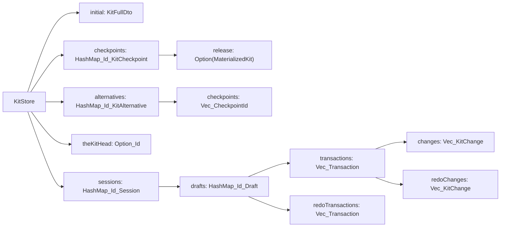

## Concept -> type map

- `kit store` -> `KitStore` (extended; now owns the whole VCS tree, not just a live graph).
- `kit snapshot` -> `KitFullDto` (no new type; it's already a point-in-time DTO).
- `materialized kit` -> `MaterializedKit { initial, change_list, computed }` (reuse, extend storage for release).
- `initial kit` -> `KitStore.initial: KitFullDto`.
- `kit checkpoint` -> `KitCheckpoint { id, parent: Option<Id>, changes: Vec<KitChange>, message, time, authors: Vec<Id>, hash, release: Option<MaterializedKit> }` (replaces the current checkpoint which stored `Vec<KitOperation>`; `KitOperation` / `KitOperationKind` are deleted).
- `the kit` -> head of the main (non-alternative) committed line; computed from `KitStore.the_kit_head: Option<Id>`.
- `kit alternative` -> `KitAlternative { id, name, checkpoints: Vec<Id>, root: Id }`: explicit ordered list of checkpoints; checkpoints can be shared between alternatives. Stored individually in `KitStore.checkpoints`.
- `kit session` -> `Session { id, drafts }` owned by `KitStore.sessions: HashMap<Id, Session>`; no more `KitGraphSession`.
- `kit draft` -> `Draft { id, parent: Id /* checkpoint */, transactions: Vec<Transaction>, redo_transactions: Vec<Transaction> }`; lives inside a `Session`; must target the tip of `the_kit` or an alternative.
- `kit transaction` -> `Transaction { id, changes: Vec<KitChange>, redo_changes: Vec<KitChange>, state: TransactionState /* Open | Finalized */ }`.
- `kit release` -> flag stored on a checkpoint as `release: Some(MaterializedKit)`; computed lazily.
- `kit diff` -> `KitDiff` (kept as-is from `pub mod kit_diff`).
- `kit change` -> `KitChange` (kept as-is from `pub mod kit_change`; will get a semantic tag field instead of the deleted `KitOperation`).
- `kit command` -> `KitStoreCommand` (top-level enum, dispatched against `KitStore`).
- `kit read command` -> anything under `ReadKitCommand` subtree; read-only, no state change.
- `kit change command` -> anything under `ChangeKitCommand` subtree; only valid inside a live `Transaction`.

## Module layout (inline `pub mod X {...}` in lib.rs, matching current convention)

Add / replace these modules between `pub mod diff` ([lib.rs:3808](compose/rs/src/lib.rs)) and the existing `pub mod error` ([lib.rs:5408](compose/rs/src/lib.rs)):

- `pub mod kit_diff` - **kept**.
- `pub mod kit_change` - **kept**, add `pub kind: KitChangeKind` (replaces `KitOperationKind`), author/time already present.
- `pub mod read_command` - **new**: `ReadConnectorCommand`, `ReadRepresentationCommand`, `ReadPortCommand`, `ReadPieceCommand`, `ReadConnectionCommand`, `ReadTypeCommand`, `ReadDesignCommand`, `ReadKitCommand`; each with a matching `*Result` enum returned by execution. Externally-tagged camelCase serde.
- `pub mod change_command` - **new**: `ChangeConnectorCommand`, `ChangeRepresentationCommand`, `ChangePortCommand`, `ChangePieceCommand`, `ChangeConnectionCommand`, `ChangeTypeCommand`, `ChangeDesignCommand`, `ChangeKitCommand`. Each variant is "smallest non-cross-cutting write" (e.g. `ChangePieceCommand::Name { name }`, `ChangePieceCommand::Fix {}`, `ChangeDesignCommand::AddPiece { piece }`).
- `pub mod transaction` - **new**: `Transaction`, `TransactionCommand`, `TransactionCommandResult`, `TransactionState`.
- `pub mod draft` - **new**: `Draft`, `KitDraftCommand`, `KitDraftCommandResult`.
- `pub mod session` - **replaced**: `Session`, `SessionCommand`, `SessionCommandResult`. `KitGraphSession` deleted.
- `pub mod checkpoint` - **new**: `KitCheckpoint`, `KitCheckpointCommand`, `KitCheckpointCommandResult`.
- `pub mod alternative` - **new**: `KitAlternative`, `KitAlternativeCommand`, `KitAlternativeCommandResult`.
- `pub mod kit_store_command` - **new**: `KitStoreCommand`, `KitStoreCommandResult` (top-level dispatch surface).
- `pub mod history` - **deleted** (`KitHistory`, `MaterializedKit` folded into `KitStore`).
- `pub mod kit_operation` - **deleted** (`KitOperation`, `KitOperationKind` replaced by `KitChangeKind` on `KitChange`).
- `pub mod kit_command` - **deleted** (`KitCommand` trait, `BuiltinKitCommand`, RPC adapters replaced by `KitStoreCommand`).

## Data shape



Ownership rules (enforced at dispatch, not via borrows):

- A `Draft.parent` must equal either `KitStore.the_kit_head` or the last id of some `KitAlternative.checkpoints`. Validated on `NewDraft`.
- Alternatives can share checkpoints: two `KitAlternative`s may reference the same `Id` in `checkpoints`.
- Finalizing a draft produces exactly one new `KitCheckpoint` whose `changes` = concatenation of `Transaction.changes` across `Draft.transactions`, optionally collapsed by `KitDiff::between(before_draft, after_draft)` for storage (both snapshots already available because draft keeps a `before: KitFullDto` taken at `NewDraft`).

## Execution model

Top-level dispatch: `KitStore::execute(&mut self, cmd: KitStoreCommand) -> Result<KitStoreCommandResult>`. Recursive dispatch to inner enums via `execute_session`, `execute_draft`, `execute_transaction`, `execute_checkpoint`, `execute_alternative`.

Change command semantics (inside an open `Transaction`):

1. Take a `before: KitFullDto` snapshot via `KitStore.snapshot_live()` (uses the live graph = `the_kit` materialized + stack-applied transactions of this draft).
2. Mutate the live graph for that change (reuses existing `KitStore` mutators: `apply_design_diff`, `add_child_rpc` equivalents demoted to private helpers).
3. Take `after: KitFullDto`.
4. Build `KitChange { forward, backward, before, after, kind, author?, time? }` via `KitChange::between(before, after)` and push onto `Transaction.changes`; clear `Transaction.redo_changes`.

Undo/redo:

- `TransactionCommand::Undo` / `UndoAll` pop from `changes`, apply `backward` to the live graph, push onto `redo_changes`. `Redo` is symmetric.
- `TransactionCommand::Finalize` seals the transaction (state = Finalized, no more changes accepted); the transaction is kept on the draft's stack for draft-level undo.
- `TransactionCommand::Abort` rolls back all changes then removes the transaction entirely.
- `KitDraftCommand::Undo { count }` pops finalized transactions, applies their composite `backward` to the live graph, pushes onto `redo_transactions`.
- `KitDraftCommand::FinalizeToKitCheckpoint { message }` requires no open transaction; creates a new `KitCheckpoint` with parent = draft.parent, hash via existing `HashWriter` on `(parent_id, new_id, changes_json)` (same technique as [lib.rs:5362](compose/rs/src/lib.rs)), advances either `the_kit_head` or the target `KitAlternative.checkpoints`, then removes the draft from the session.

Read commands: executed against a `KitReadView` that's either the live graph (when running inside a session/draft/transaction) or a materialized snapshot (when running at `KitStoreCommand::ReadKitCommands` level or `KitCheckpointCommand::ReadKitCommands` / `KitAlternativeCommand::ReadKitCommands`). Each `ReadXCommand::Everything{}` returns `*FullDto`; `::Name{}` returns `String`; nested read children return nested results. Results are typed, no serde round-trip at the Rust layer.

Alternatives:

- `KitStoreCommand::NewAlternative { from_checkpoint, name }` -> creates `KitAlternative { checkpoints: vec![from_checkpoint], ... }`.
- `KitAlternativeCommand::UnifyKitCheckpointsToSingleKitCheckpoint { message }` -> materializes from root to tip, builds a single KitChange diff, creates a single checkpoint with parent = root, replaces `checkpoints` with `[root_id, new_id]`.
- Finalizing a draft targeted at an alternative appends to that alternative's `checkpoints`.

Release:

- `KitCheckpointCommand::MarkAsRelease { }` sets `release = Some(mk)` where `mk = MaterializedKit::from_checkpoints(&initial, &path_to_checkpoint, computed: Some(snapshot))`; persisted in-tree.

## WASM surface ([lib.rs:17467](compose/rs/src/lib.rs))

Keep `KitStoreHandle`; replace ad-hoc RPC methods with a single `#[wasm_bindgen(js_name=execute)]` that takes `JsValue` (serde-decoded `KitStoreCommand`) and returns `JsValue` (serde-encoded `KitStoreCommandResult`). Keep a few legacy shims for the current JS surface (`undo`, `redo`, `applyDesignDiff`, `toFullDto`) as thin wrappers that build the equivalent `KitStoreCommand` tree under the hood, so `compose/js` and `compose/react` keep compiling. A follow-up ticket migrates them fully.

## JSON shape

Serde: all command enums `#[serde(rename_all = "camelCase")]` with the default externally-tagged form, so the spec's sample shape is honoured. Example for `KitStoreCommand::ExecuteSessionCommands`:

```json
{
 "executeSessionCommands": {
  "id": "sess1",
  "commands": [{ "newDraft": { "checkpointId": "cp1" } }]
 }
}
```

The top-level WASM endpoint accepts either a single command or `Vec<KitStoreCommand>` (wraps in a synthetic `Batch` variant).

## Delete list (confirmed scope: full replacement)

- `pub mod history` ([lib.rs:5073](compose/rs/src/lib.rs)): `KitHistory`, `KitCheckpoint` (old shape), `KitHistoryFullDto`, `MaterializedKit` (moved into `checkpoint` mod in new shape).
- `pub mod kit_operation` ([lib.rs:4746](compose/rs/src/lib.rs)): `KitOperation`, `KitOperationKind`.
- `pub mod kit_command` ([lib.rs:4778](compose/rs/src/lib.rs)): `KitCommand`, `BuiltinKitCommand`, `ApplyDesignDiffRpc`, `ApplyKitDiffRpc`, `AddChildRpc`, `RemoveChildRpc`.
- `pub mod session` (old) ([lib.rs:13109](compose/rs/src/lib.rs)): `KitGraphSession` entirely (incl. `commit(DesignChange)` shim, `undo_depth`, `redo_depth`, `last_change`).
- Low-level undo stacks on `KitStore` (`undo_past`/`undo_future`/`with_undo`/`begin_tx`/`commit_tx`): replaced by transaction-level change stack; remove once all callers migrated to `Transaction` (can stay for an iteration, marked `#[deprecated]`).
- Tests: `mod history_tests` removed; `mod tests` entries referencing `KitHistory` / `KitGraphSession` rewritten to the new API.

## Tests

Under `#[cfg(test)] mod tests` at the bottom of [compose/rs/src/lib.rs](compose/rs/src/lib.rs):

- `store_execute_new_session_and_draft` - `NewSession` -> `NewDraft` at `the_kit_head` -> read everything returns current `the_kit` dto.
- `transaction_change_undo_redo` - change piece name, `Undo`, read returns old name, `Redo` returns new, `Finalize`.
- `draft_undo_across_transactions` - two finalized transactions, `KitDraftCommand::Undo { count: 1 }` rolls back one transaction.
- `finalize_to_checkpoint_advances_the_kit_head` - draft on main line creates a new checkpoint parented on old head.
- `alternative_new_and_extend` - `NewAlternative(from=cp1)`, draft targeting alt tip, finalize appends; `the_kit_head` unchanged.
- `alternative_share_checkpoints` - two alternatives whose `checkpoints` vectors both contain a shared id.
- `unify_alternative_collapses_to_single_checkpoint` - end-to-end dto equality before/after unify.
- `release_caches_materialized_kit` - `MarkAsRelease` then materialize check equals path replay from `initial`.
- `json_round_trip_kit_store_command` - spec sample JSON decodes to `Vec<KitStoreCommand>` and back.
- `read_command_tree_returns_nested_results` - `Everything{}` vs `Name{}` vs `ReadTypeCommands` return the expected typed shape.

## What stays / what is deferred

- `pub mod kit_diff` / `pub mod kit_change`: kept; only minor additions (`kind: KitChangeKind` on `KitChange`).
- `KitStore`'s internal mutators (`apply_design_diff`, add/remove helpers): kept but demoted to `pub(crate)`; only `change_command` dispatch calls them.
- WASM surface migration: single-entry `execute` is added now; legacy methods are shimmed so JS/React/sketchpad compile without changes. Full JS/React/sketchpad rewrite to the new command API is a follow-up ticket (out of scope here).
- Merging two alternatives (beyond `UnifyKitCheckpointsToSingleKitCheckpoint` on one): out of scope.
- Cross-session conflict resolution when two sessions finalize drafts on the same alternative tip: last-wins for now; the loser's draft parent becomes stale and its finalize fails with `InvalidOperation("stale parent")`. Three-way merge deferred.
