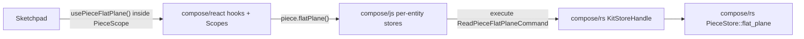

# Kit data single-source-of-truth refactor

## Architectural invariants (target end-state)

1. **compose/rs** owns every domain operation and cache. Per-entity stores (`PieceStore`, `DesignStore`, `TypeStore`, …) expose `computed_*` methods and public accessors (e.g. `PieceStore::flat_plane`). Every consumer-visible field/derived value has a `Read*Command` variant and a `Read*CommandOutput` variant. Writes stay on the existing `ChangeKitCommand` / `Change*Command` surface (per-field changes already there). All reads go through `KitStoreCommand::ReadKitCommands` dispatched via `KitStoreHandle::execute` (`#[wasm_bindgen(js_name = execute)]`).
2. **compose/js** contains NO domain logic and NO caching. It wraps `compose/rs` into per-entity TS store classes (`PieceStore`, `DesignStore`, `TypeStore`, `ConnectionStore`, `AuthorStore`, `QualityStore`, …) with pure-accessor methods (e.g. `piece.flatPlane()` that sends exactly one `ReadPieceFlatPlaneCommand` through `kitStoreHandle.execute`). No `KitImpl` flatten/Merkle caches, no `applyKitDiff`/`inverseKitDiff`/`getDesignDiff`/`findPieceInDesign`/`findTypeInKit`/`findDesignInKit`/`findRepresentation`/`selectBestRepresentation`/`getKitPorts`/`colorPortsForTypes`/`getClusterableGroups`/`getIncludedDesigns`/`sumQualityInDesign`/`composeKitCommandHandlers`/`TS Piece.flatPlane`/`ensureFlattenGeometryCache`. Only value-type classes (`Piece`, `Design`, `Type`, `Connection`, …) and persistence wrappers (`JsonFileKitStore`, `FolderKitStore`, `SessionKitStore`) stay, and those lose any computed/derived accessors.
3. **compose/react** exports clean Scope components (`KitScope`, `PieceScope`, `TypeScope`, `DesignScope`, `ConnectionScope`, `AuthorScope`, `QualityScope`, `FileScope`, `FolderScope`, `PortScope`, `ConnectorScope`, `RepresentationScope`, `FamilyScope`, `TagScope`, `ConceptScope`, `LayerScope`, `GroupScope`, `StatScope`, `PropScope`, `AttributeScope`) and per-field hooks (`usePieceFlatPlane`, `usePieceFlatCenter`, `useConnectionGap`, `useKitName`, …). Hooks forward 1:1 to the corresponding `*Store` method in `@compose/js`. No `useMemo`+find, no `@compose/js` helper imports other than pure value types, no command semantics, no `useKitCommands`/`executeKitCommand`/`useKitCommandDispatchersWithOrigin` exports. Read-only computed hooks return `[value, status]` pair; writable field hooks return `[value, setValue, status]` triad (unchanged).
4. **compose/sketchpad** contains ZERO kit data, zero kit stores, zero kit hooks, zero command strings. Only UI-selection / tools / panels / navigation state lives in its `SketchpadStore` + `sketchpadMachine`. Every kit read/write happens in a component under a `<PieceScope id=…>` (or sibling) via a `@compose/react` hook.



## Phase R1 — extend `compose/rs` read surface to cover ALL fields/derived values currently computed in TS

All edits in [compose/rs/lib.rs](compose/rs/lib.rs).

1. Audit every domain helper currently in `@compose/js` and add the matching per-entity method + `Read*Command` variant + `Read*CommandOutput` variant + execute arm. Concretely:
   - `applyKitDiff` / `inverseKitDiff` / `getDesignDiff` → already exist as rs apply/inverse/diff on `KitGraph` / `ChangeKitCommand`; expose via `KitStoreCommand` variants `ApplyKitDiff { diff }`, `InverseKitDiff { diff }`, `GetDesignDiff { before, after, design_id }` (result enums matching).
   - `findPieceInDesign(design, pieceId)` → already addressable via `ReadDesignPieceCommand { id, commands }`; add `ReadDesignPieceFullCommand` / `ReadDesignPieceShallowCommand` if missing.
   - `findTypeInKit(kit, typeId)` → `ReadKitTypeCommands { id, commands }`; add shallow/full variant if absent.
   - `findDesignInKit(kit, designId)` → `ReadKitDesignCommands { id, commands }`.
   - `findRepresentation(type, tags)` / `selectBestRepresentation` → add `ReadTypeBestRepresentationCommand { tags: Vec<String> } => ReadTypeBestRepresentationCommand { representation }`, backed by a new `impl TypeStore { pub fn best_representation(&self, tags: &[String]) -> Option<RepresentationFull> }`.
   - `getKitPorts(kit)` → `ReadKitPortsFullCommand` already exists; verify it returns the flattened-by-type structure that JS expects, otherwise add `ReadKitFlatPortsCommand`.
   - `colorPortsForTypes(types, palette)` → `ReadKitColoredPortsCommand { palette } => ReadKitColoredPortsCommand { colored_ports }`, impl on `KitStore::colored_ports`.
   - `getClusterableGroups(design, selection)` → `ReadDesignClusterableGroupsCommand { selection }`, impl `DesignStore::clusterable_groups`.
   - `getIncludedDesigns(kit, designId)` → `ReadDesignIncludedDesignsCommand`, impl `DesignStore::included_designs`.
   - `sumQualityInDesign(design, qualityId)` → `ReadDesignQualitySumCommand { quality_id }`, impl `DesignStore::quality_sum`.
   - Piece derived already present (`ReadPieceFlatPlaneCommand`, `ReadPieceFlatCenterCommand`, `ReadPieceFlatPoseCommand`, `ReadPiecePathCommand`, `ReadPieceAlternativesCommand`). Add any missing: `ReadPieceMetadataCommand { metadata }`, `ReadPieceDepthCommand`, `ReadPieceFixedIdCommand`, `ReadPieceParentIdCommand`, `ReadPieceCurrentPlaneCommand`, `ReadPieceIsConnectedCommand`, `ReadPieceParentConnectionCommand`, `ReadPieceWithDiffCommand { diff } => ReadPieceWithDiffCommand { piece }`, `ReadPieceColorCommand`, `ReadPieceNameCommand`, `ReadPieceDescriptionCommand`, `ReadPieceIsHiddenCommand`, `ReadPieceIsLockedCommand`, `ReadPieceScaleCommand`, `ReadPieceCenterUCommand`, `ReadPieceCenterVCommand`.
   - Connection derived: `ReadConnectionGapCommand`, `ReadConnectionShiftCommand`, `ReadConnectionRiseCommand`, `ReadConnectionRotationCommand`, `ReadConnectionTurnCommand`, `ReadConnectionTiltCommand`, `ReadConnectionUCommand`, `ReadConnectionVCommand`, `ReadConnectionDescriptionCommand`, `ReadConnectionColorCommand { palette }`, `ReadConnectionChildPlaneMatrixCommand` (already present), `ReadConnectionFlatSidesForChildCommand` (present).
   - Compose command table: port every handler in `composeKitCommandHandlers` (~28222–28664 of [compose/js/index.ts](compose/js/index.ts)) into a matching `KitStoreCommand` variant. Each existing `compose.kit.*` / `compose.design.*` string becomes a typed `KitStoreCommand::*`. Drop the string-based dispatch entirely.
2. Add `computed_*` methods to each store for every derived value (pattern already set by `PieceStore::computed_flat_plane`). Cache them in `OnceCell`/`RefCell`/internal merkle exactly like `flat_plane: OnceCell<Plane>` + `invalidate_flatten` on `DesignStore`. Move the JS flatten-merkle cache (`KitImpl.#flattenMerkleByDesign`, `ensureFlattenGeometryCache`, `#flattenDesignCached`, `#runFlattenPlacementWalk`) into `DesignStore` (or into a new `FlattenCache` field owned by `KitGraph`). Invalidation hooks: every `Change*Command::apply` that mutates flatten inputs calls the same `invalidate_flatten`/`rewire_piece_flatten_parents` path that already exists.
3. Extend `KitStoreHandle` (wasm) with nothing new — all new read variants flow through the existing `execute` / `executeReadKitCommands`. Add `#[cfg(target_arch = "wasm32")]` tests in the wasm module for the new variants.
4. `cargo test` for every new command + its output variant + execute arm + computed accessor.

## Phase R2 — strip computed/diff accessors off `@compose/js` value-type classes

All edits in [compose/js/index.ts](compose/js/index.ts).

Classes `Kit`, `KitImpl`, `Design`, `Type`, `Piece`, `Connection`, `Port`, `Representation`, `Author`, `Quality`, etc. keep only: constructor, `toJSON`, plain field getters that read the underlying POJO, and equality / `clone`. Delete:

- `Piece.flatPlane` / `Piece.flatCenter` accessors (5213–5232).
- `KitImpl.#flattenMerkleByDesign` / `#flattenDesignCached` / `#flattenDesignUncached` / `#runFlattenPlacementWalk` / `ensureFlattenGeometryCache` / `getFlattenMerkleCache` / `invalidateFlattenMerkleCaches` (~8508–9334).
- `KitImpl.#applyDiff` / `#invalidateCachesTouchedByDiff` / `#entityVersionHashFor` (~10303+).
- `KitTypesOps` / `KitDesignsOps` / `KitFamiliesOps` / `KitEntity` / `KitEntityCaches` / `KitEntityIndexes` (~11525+, 12091+, 12244+) — the lookup surface moves into `PieceStore`/`DesignStore`/`TypeStore` (`compose/js`) which call wasm, not into these domain classes.
- Exported helpers: `applyKitDiff` (12535), `inverseKitDiff` (11808), `getDesignDiff` (6994), `findPieceInDesign` (7796), `findDesignInKit` (7801), `findTypeInKit` (7807), `findRepresentation` (4096), `selectBestRepresentation` (4141/4149), `getKitPorts` (2924), `colorPortsForTypes` (21180), `getClusterableGroups` (7679), `getIncludedDesigns` (7745), `sumQualityInDesign` (21075), `executeComposeKitCommand` (28667), `executeKitCommand` (28723), `composeKitCommandHandlers` (28222–28664). All of these move to `compose/rs` and are consumed via the per-entity TS stores introduced in Phase J1.

Result: `@compose/js` value types are pure POJO wrappers. Any caller still importing these helpers is refactored in Phases J1, K, and S.

## Phase J1 — add per-entity TS stores in `@compose/js`

All edits in [compose/js/index.ts](compose/js/index.ts). New classes (exported), each holding a `kitStoreHandle` / `KitStoreClient` reference and an entity id/path:

- `class PieceStore(client, designId, pieceId)` with methods: `full()`, `metadata()`, `flatPlane()`, `flatCenter()`, `flatPose()`, `path()`, `alternatives()`, `depth()`, `parentPieceId()`, `parentConnection()`, `isConnected()`, `currentPlane()`, `name()`, `description()`, `color()`, `scale()`, `centerU()`, `centerV()`, `isHidden()`, `isLocked()`, `withDiff(diff)`. Each method builds exactly one `ReadPieceCommand` variant (or nested under `ReadDesignPieceCommands`), wraps it in a `ReadKitCommands` + `executeRead`, and returns the typed output.
- `class DesignStore(client, designId)` with `full()`, `shallow()`, `pieces()`, `connections()`, `flattenMap()`, `includedDesigns()`, `clusterableGroups(selection)`, `qualitySum(qualityId)`, plus per-field aliases (`name`, `description`, …).
- `class TypeStore(client, typeId)` with `full()`, `shallow()`, `ports()`, `representations()`, `bestRepresentation(tags)`, `connectorForPortId(portId)`, per-field.
- `class ConnectionStore(client, designId, connectionId)` with `full()`, `gap()`, `shift()`, `rise()`, `rotation()`, `turn()`, `tilt()`, `u()`, `v()`, `childPlaneMatrix()`, `flatSidesForChild(childPieceId)`, `color(palette)`, per-field.
- `class AuthorStore`, `class QualityStore`, `class PortStore`, `class RepresentationStore`, `class FileStore`, `class FolderStore`, `class FamilyStore`, `class ConnectorStore`, `class TagStore`, `class ConceptStore`, `class LayerStore`, `class GroupStore`, `class StatStore`, `class PropStore`, `class AttributeStore` — each with the same pattern: constructor takes client + id(s), methods 1:1 map rs commands.
- `class KitStore` (distinct from the existing persistence `KitStore` interface — rename that to `KitPersistenceStore`): `name()`, `description()`, `icon()`, `preview()`, `remote()`, `homepage()`, `license()`, `uri()`, `created()`, `updated()`, `types()`, `designs()`, `files()`, `folders()`, `locations()`, `families()`, `ports()`, `coloredPorts(palette)`, `authors()`, `concepts()`, `tags()`, `qualities()`, `props()`, `attributes()`, and factory methods `piece(designId, pieceId)`, `design(designId)`, `type(typeId)`, `connection(designId, connId)`, `author(authorId)`, … returning the per-entity store above.

Writes: each writable field has a `setX(value)` method on the corresponding store that sends the matching `ChangeKitCommand` variant via `client.execute(...)`. Read-only computed fields have no setter.

No caching inside these stores — every call round-trips to wasm. Rs `OnceCell` caches behind `KitStoreHandle` ensure the round-trip is cheap.

## Phase J2 — strip remaining domain orchestration from `KitStoreClient`

All edits in [compose/js/index.ts](compose/js/index.ts).

- `KitStoreClient` becomes a thin RPC façade: `execute(cmd)`, `executeRead(cmds)`, `subscribe`, `vcsState`, backbone/session helpers. Remove `applyDesignDiff`, `applyKitDiff`, `clusterPieces`, `dragPieces`, `movePieces`, `fixPieces`, `flattenDesign`, `expandDesign`, `deleteConnection`, `changePieceType`, paste/create helpers, `get*` queries — every one becomes either (a) a `KitStoreCommand` variant accessed through `execute`, or (b) a method on a per-entity store from Phase J1.
- Delete `FallbackKitStoreClient` / `WorkerKitStoreClient` specializations that do TS mutation (lines 19957–19997); keep only the `execute` / `executeRead` forwarding.
- Worker in [compose/js/worker.ts](compose/js/worker.ts) likewise reduces to `execute` + `executeRead` + `subscribe` + `init`.

## Phase K1 — thin-wrapperize `@compose/react`

All edits in [compose/react/index.tsx](compose/react/index.tsx).

1. Replace the internal indexed-schema infrastructure that reads JSON fields (`scanSchemaState` 349, `readSchemaFieldValue`/`readCustomFieldValue` 469–565, `diffSchemaPropertyEvents` 617–658, `setFieldValue`/`setObjectValue` in `KitProvider` 1135–1156) with a pure subscription to `kitStoreHandle.subscribe()` — the handle already emits typed change events. No indexing, no TS-side diffing.
2. Rename every `*Provider` that wraps `SchemaScopeContext` to `*Scope` for API parity with your example:
   - `PieceProvider` → `PieceScope`
   - `TypeProvider` → `TypeScope`
   - `DesignProvider` → `DesignScope`
   - `ConnectionProvider` → `ConnectionScope`
   - `AuthorProvider` → `AuthorScope`
   - `QualityProvider` → `QualityScope`
   - `PortProvider`, `FileProvider`, `FolderProvider`, `TagProvider`, `ConceptProvider`, `FamilyProvider`, `RepresentationProvider`, `ConnectorProvider`, `BenchmarkProvider`, `LayerProvider`, `GroupProvider`, `StatProvider`, `PropProvider`, `AttributeProvider` → matching `*Scope`.
   - `KitRegistryProvider` stays (registry context, not entity scope); `KitProvider` → `KitScope` (wraps `KitRuntimeContext`).
   - Update `SchemaScopeContext` docs; keep `useSchemaScope` internal.
3. Rewrite every per-field hook as a 1:1 forwarder to the matching per-entity store from Phase J1. Example target:
   ```ts
   export function usePieceFlatPlane(): readonly [Plane, WriteStatus] {
    const piece = usePieceStore();
    return useStoreRead(() => piece.flatPlane());
   }
   export function usePieceName(): HookTriad<string> {
    const piece = usePieceStore();
    return useStoreField(
     () => piece.name(),
     (v) => piece.setName(v),
    );
   }
   ```
   `usePieceStore()` reads the `PieceScope` + `KitScope` contexts and returns a `PieceStore` from `@compose/js`. `useStoreRead` and `useStoreField` are two small internal helpers that subscribe to `kitStoreHandle.subscribe` filtered by the store's entity path and return `[value, status]` or `[value, setValue, status]`. No `useMemo` + `@compose/js` helpers anywhere.
4. Rename: `useFlatPiecePlane` → `usePieceFlatPlane`, `useFlatPieceCenter` → `usePieceFlatCenter`. Delete old names (no alias — breaking change, fixed in Phase S).
5. Delete exports that imply command semantics: `useKitCommands`, `useKitCommandDispatchersWithOrigin`, the `executeKitCommand` re-export, `useKitScope` (replaced by `KitScope` component + `useKitStore()`), any `dispatch`/`send` helpers.
6. Delete `useKitStoreClient` public export (or keep as `@internal`); `@compose/react` consumers only see hooks and Scopes. The fact that a `KitStoreClient` exists becomes an implementation detail of `@compose/react`.
7. Delete every `useMemo`-backed derivation that calls `@compose/js` helpers: `useIncludedDesigns` 3252, `useReplacableTypes` 3262, `useReplacableDesigns` 3278, `useExplodeableDesignNodes` 3294, `usePieceParentConnection` 3243. Replace with forwarders to the rs-backed equivalents introduced in Phase R1 (`design.includedDesigns()`, `design.replacableTypes(pieceIds)`, `design.explodeableNodes()`, `piece.parentConnection()`).
8. Top-level imports from `@compose/js`: keep only value types (`Piece`, `Design`, `Type`, `Connection`, `Author`, `Quality`, `Plane`, `Coordinate`, `Point`, `Vector`, `Camera`, `Tag`, `Concept`, `Folder`, `Representation`, `File`, `Attribute`, `Id`, `Kit`, `KitShallow`, `DesignShallow`, `TypeShallow`, `TOLERANCE`, `ICON_WIDTH`) plus the per-entity stores from Phase J1 (`PieceStore`, `DesignStore`, `TypeStore`, `ConnectionStore`, `KitStore`, …) and `createKitStoreClient`.

## Phase S1 — delete every kit class/field in sketchpad

All edits in [compose/sketchpad/index.tsx](compose/sketchpad/index.tsx).

Delete (by name; line numbers from exploration):

- `class KitDiffAppStore` (6279), `class PlainKitDiffAppStore` (6605) — delete.
- `class KitAppStoreImpl` (24545), `class DesignStore` (27063), `class QualityAppStore` (41818), `class DocsAppStore` (44345) — replace with `class KitAppStore extends PlainAppStore`, `class DesignAppStore extends PlainAppStore`, etc. that hold ONLY UI state (selection, hover, tool, panel, filter, sort, tutorial). No `kit()` accessor, no `applyKitDiff`, no `getDesignDiff`, no `pieceMetadata`, no `flatPiecePlane`, no diff-inverse.
- `class HoverPiecesStore` (29187) — keep only the hover-id selection slice; remove any kit reads.
- In `class SketchpadStore` (17667): delete `syncKits` (17666), `syncKitApps` (17680), `kitApps` (17681), `kitShallowsCache` / `kitShallowsCacheVersion` (17691–17693), `injectedKitStore` (17705–17706), `temporaryKitStoreFactory` / `folderKitStoreFactory` / `fileKitStoreFactory` / `remoteKitStoreFactory` (17706–17734), `persistKitsToStorage` / `schedulePersistKitsToStorage`, `kitShallows()`, `createKit` / `openKit` / `kit()` / `hasKit()` / `kitStore()`, `loadPersistedKits`, `loadKitFilesFromPublic`, `supportedKitKinds` / `availableKitKinds` / `inferKitPersistenceKind` / `getKitPersistenceSource` / `resolveKitFileProviderFactory` / `registerKitStore` / `createBackedKitStore`. Constructor signature reduces to UI deps only.
- Delete `SketchpadKitStoreFactory` type re-export (6918).
- Delete local `useKits` (20097), `useDesignStore` (27561), `useKitAppStore` (25248), `useKitCommandsById` (20122), `useResolvedKitStoreSnapshot` (6989), `useKitSnapshot` (7013), `useKitTypes`/`useKitDesigns`/`useKitFiles`/`useKitTags` (7017–7032).
- Delete `KitScopeProvider` (7288), `useKitScope` (7295), `useIsInKitScope` (7304), `KitWasmRuntimeBridge` (7265).

## Phase S2 — delete every kit hook definition in sketchpad

All edits in [compose/sketchpad/index.tsx](compose/sketchpad/index.tsx). Delete the following (each redefined locally today — kill the local definition, add import from `@compose/react`):

- Entity hooks: `useAuthor` (7037), `useType` (7045), `useQuality` (7053), `useDesign` (7061), `usePiece` (7069), `useConnection` (7077), `usePieces` (7088), `useConnections` (7094).
- Piece derived: `usePiecesMetadataMap` (7113), `usePieceMetadata` (7130), `useFlatPiecePlane` (7138), `useFlatPieceCenter` (7146), `useIsConnectedPiece` (7154), `usePieceDepth` (7162), `useFixedPieceId` (7170), `useParentPieceId` (7178), `useCurrentPiecePlane` (7186), `usePieceParentConnection` (7194).
- Design derived: `useIncludedDesigns` (7206), `useDesignId` (7212), `usePiecesFromIds` (7217), `useReplacableTypes` / `useReplacableDesigns` (7222/7234).
- Design-inspector triad region 16381–16797: `useDiffedPiece`, `useClusterableGroups`, `usePieceWithDiff`, `useConnectionColor`, and every `usePieceCenterU`/`usePieceCenterV`/`usePieceScale`/`usePieceIsHidden`/`usePieceIsLocked`/`usePieceColor`/`usePieceDescription`/`usePieceName` / `useConnectionGap`/`useConnectionShift`/`useConnectionRise`/`useConnectionRotation`/`useConnectionTurn`/`useConnectionTilt`/`useConnectionU`/`useConnectionV`/`useConnectionDescription`.
- Sync helpers 17147–17495: `useSync`, `useSyncOptional`, `useSyncDeep`, `useSyncField`, `useSyncFields`, `useSyncNestedArrayItemMembership`, `useSyncSelectionItemMembership`, `useSyncWithState`, and the `DerivedStore` class / `useDerived` if present.
- `usePath` helper.

All now resolve to `@compose/react` exports (with renamed `usePieceFlatPlane` / `usePieceFlatCenter`).

## Phase S3 — delete command/execute wiring

All edits in [compose/sketchpad/index.tsx](compose/sketchpad/index.tsx).

1. The 78 `store.execute("compose.*")` call sites split into two categories:
   - UI state transitions (`compose.sketchpad.*`, `compose.designApp.select*`, `compose.designApp.hover*`, `compose.designApp.setTool`, `compose.designApp.togglePanel`, …) → keep, but convert from string-dispatch to typed actor events (`actor.send({ type: "UI.DESIGN.SELECT_PIECE", id })`) on `sketchpadMachine`.
   - Kit mutations (`compose.designApp.updatePiece`, `compose.designApp.updateConnection`, `compose.designApp.addConnection`, `compose.kit.*`) → delete; callers call the matching `@compose/react` hook inside the relevant Scope. Example: `commands.updatePiece({ id, patch })` (8 sites, 16423–16535) becomes, in the inspector component under `<PieceScope id={pieceId}>`: `const [name, setName, nameStatus] = usePieceName(); await setName(draft)`.
2. Delete the 12 `executeKitCommand(...)` call sites; each becomes a typed hook call inside a Scope.
3. Delete `sketchpadCommands` re-export (20138) and the `useKitCommandsById` helper (20122). Keep only the `compose.sketchpad.*` UI commands reconceived as machine events.
4. Replace dynamic `require("@compose/js")` / `import("@compose/js")` at 47386 / 47552 (sql-related import/export path) with a call into `@compose/react` `useKitExport()` / `useKitImport()` that forwards to a rs-side `KitStoreCommand::ExportAs { format }` / `ImportFrom { … }`.

## Phase S4 — provider tree & machine

All edits in [compose/sketchpad/index.tsx](compose/sketchpad/index.tsx).

1. Root: wrap `Sketchpad` in `<KitRegistryProvider>` (already exists in react); for each active tab mount `<KitScope kitId={guid} backbone={…}>`. Inside the tab, the design panel wraps `<DesignScope id={designId}>`, piece inspector wraps `<PieceScope id={pieceId}>`, etc. Every per-field input reads/writes via `@compose/react` hooks in its local Scope.
2. `sketchpadMachine` (8312) keeps `openKitGuids` / `activeKitGuid` (8679–8681) and `UI.OPEN_KIT.PUSH|CLOSE|ACTIVATE` events (7674–7676, 8612–8632). Add any new UI events introduced to replace kit-mutation command strings. The machine invokes `fromPromise` actors that call `kitRegistry.open*` from `@compose/react`.

## Phase P — package / dist cleanup

- [compose/sketchpad/package.json](compose/sketchpad/package.json): drop `@compose/js` from direct deps (sketchpad no longer imports any js symbol). Keep `@compose/react`, `@compose/ui`.
- [compose/react/package.json](compose/react/package.json): `@compose/js` stays (peer + dev), not `@compose/sketchpad`.
- [compose/js/package.json](compose/js/package.json): remove any dep that was only used by the deleted domain-helper code paths.
- Delete stale `dist/` only if the build produces fresh ones cleanly.

## Phase T — verification

Order:

1. `cargo test` in [compose/rs](compose/rs): every new `Read*Command` variant + `computed_*` + `*Store` method round-trips. Add a wasm integration test for `KitStoreHandle.execute` on each new variant.
2. `pnpm -F @compose/js test`: per-entity TS stores (`PieceStore.flatPlane()` returns Plane, `setFlatPlane` does not exist as it is read-only, `PieceStore.setName()` routes to `ChangePieceCommand::Name`).
3. `pnpm -F @compose/react test`: `<PieceScope>` + `usePieceFlatPlane()` returns `[plane, status]`; `<PieceScope>` + `usePieceName()` returns `[name, setName, status]`; rollback on rejection.
4. `pnpm -F @compose/sketchpad test`: existing Playwright regions pass after the rewire; kit boot (temporary/file/folder/remote) via `useKitRegistry`; piece-name input edit+commit+rollback; no `@compose/js` import in the bundle (add an eslint rule).
5. Desktop smoke: open `metabolism.zip`, drag piece, edit name, undo/redo, export.

## Out of scope

- Yjs multiplayer / backbone UI work beyond wiring `kitRegistry.openRemote(...)` from machine events.
- GraphQL / OpenAPI / Python / Ruby bundles.
- Renaming the existing `KitStore` interface in `@compose/js` to `KitPersistenceStore` is optional; if too invasive, keep the interface name and give the new per-entity class a different name (e.g. `KitRef`).
