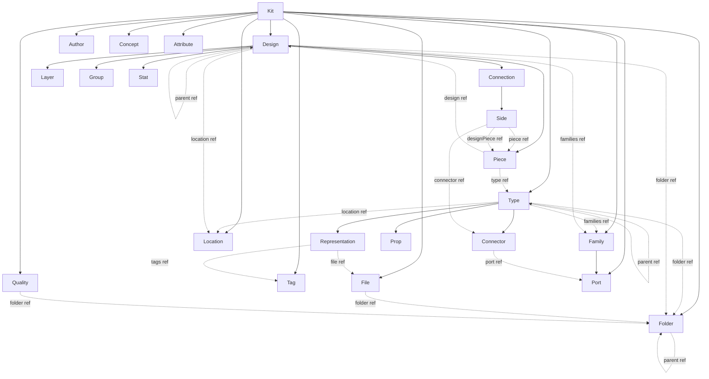

# Rust kit canonical schema alignment

## Canonical schema reference

Ground truth: the hash functions in `compose/py/main.py` (lines 6365–7190), cross-checked with `assets/compose/metabolism.kit.reference.compose.json` (kit top-level) and `metabolism.shallow.kit.compose.json` (types/designs referencing families).

Top-level Kit collections: `types`, `designs`, `files`, `folders`, `authors`, `concepts`, `tags`, `ports`, `qualities`, `families`, `locations`, `attributes` (plus scalar metadata: `id`, `name`, `version`, `description`, `icon`, `image`, `remote`, `homepage`, `license`, `preview`, `createdAt`, `updatedAt`).

## Phase 1 — Value types (`pub mod geom` in [`lib.rs`](compose/rs/lib.rs) lines ~10032–10167)

Rewrite as separate types (none alias each other):

- `Coordinate { u: f64, v: f64 }` — 2D diagram coord (Piece.center, drag offset).
- `Vec { u: f64, v: f64 }` — 2D screen offset (hash tag "Vec").
- `Point { x: f64, y: f64, z: f64 }` — 3D position (Plane.origin, Connector.point, Camera.position).
- `Vector { x: f64, y: f64, z: f64 }` — 3D direction (Plane.xAxis/yAxis, Connector.direction, Camera.forward/up). Drop the current `pub type Vector = Coordinate;` alias.
- `Plane { origin: Point, x_axis: Vector (xAxis), y_axis: Vector (yAxis) }`.
- `Camera { position: Point, forward: Vector, up: Vector }` — remove `target` and `fov`.
- Delete `PieceCenterWire`/`deserialize_option_piece_center` (`center` is always `{u,v}` now).
- `hash_into` for each type must produce the byte sequence matching `hash_coordinate`/`hash_vec`/`hash_point`/`hash_vector`/`hash_plane`/`hash_camera` in [`compose/py/main.py`](compose/py/main.py).

## Phase 2 — New kit-level entities

Add two new modules alongside the existing ones in [`lib.rs`](compose/rs/lib.rs):

- `pub mod location` — `LocationStore { id, longitude, latitude, altitude: Option<f64>, attributes: Vec<AttributeStoreRef>, parent_kit: KitStoreWeak, event_bus, hash_cache }` plus `LocationIdDto`, `LocationMetadataDto`, `LocationShallowDto`, `LocationFullDto`. Must match `hash_location` in [`compose/py/main.py`](compose/py/main.py) (lines 6461–6478).
- `pub mod family` — `FamilyStore { id, name, description: Option<String>, icon: Option<String>, ports: Vec<PortStoreRef>, attributes: Vec<AttributeStoreRef>, parent_kit: KitStoreWeak, … }` plus the DTO set. Ports are defined inline inside a family.

Change [`pub mod port`](compose/rs/lib.rs) (lines ~14206–): ports migrate from type-scoped to family/kit-scoped.

- Keep: `id`, `name` (rename current `family`/`compatible_families` string fields), `description`, `icon`, `compatible_ports: Vec<PortStoreWeak>`, `attributes`.
- Drop: `t`, `point`, `direction`, `mandatory` (move to Connector), `parent_type`.
- Add: `parent_family: FamilyStoreWeak`.

## Phase 3 — Reshape existing entity modules

For every module listed below, update the store struct, all `*Dto` variants (`IdDto` / `MetadataDto` / `ShallowDto` / `FullDto`), `from_*_dto` / `to_*_dto` round-trips, setters and `hash_into`. Target = exact match with the Python hash function of the same name.

- [`pub mod folder`](compose/rs/lib.rs) (9868): replace `path` with `name: String`; add `parent: Option<FolderStoreWeak>`, `attributes`, `created`/`updated`/`created_by`/`updated_by` (optional). `FolderShallowDto`/`FolderFullDto` use `name` canonically (keep the `alias = "name"` but flip: canonical is `name`, keep `alias = "path"` for legacy imports).
- [`pub mod file`](compose/rs/lib.rs) (9561): rename `url` → `name`; rename `hash` → `content_hash` (serialised `contentHash`); add `remote: Option<String>`, `blob: Option<String>`, `folder: Option<FolderStoreWeak>`, `mime` stays, add `created_by`/`updated_by`. `FileFullDtoWire`/coercion from `blob`/`name`/`url` goes away (legacy fallback stays as a deserialisation alias only).
- [`pub mod quality`](compose/rs/lib.rs) (14770): replace current `{key, value, unit, definition, description}` with the full canonical set — `id, key, name, description, uri, kind: Option<i64>, folder: Option<FolderStoreWeak>, can_scale, default_si_unit, default_imperial_unit, min, max, is_min_excluded, is_max_excluded, default_value, formula, icon, image, unit, benchmarks, attributes`. Hash must match `hash_quality` (6577).
- [`pub mod connector`](compose/rs/lib.rs) (6104): rename `code` → `name: Option<String>` (optional per asset); add `t: f64`, `point: Point`, `direction: Vector`, `mandatory: Option<bool>`, `max_children: Option<i32>`, `props: Vec<PropStoreRef>`. Keep existing `port`, `description`, `attributes`. Remove `qualities`.
- [`pub mod representation`](compose/rs/lib.rs) (15153): rename `url` → `name: Option<String>`; make `file: FileStoreWeak` required (no `Option`); tags remain `Vec<TagStoreWeak>` (reference kit-level tags, not inline). Remove `qualities`.
- [`pub mod connection`](compose/rs/lib.rs) (5682): rename `x`/`y` fields to `u`/`v` (drop the aliases). All hash fields in `hash_connection` must appear.
- [`pub mod side`](compose/rs/lib.rs) (15382): already has `piece`/`design_piece`/`connector`; verify `SideMetadataDto` serialises with the canonical names.
- [`pub mod piece`](compose/rs/lib.rs) (13259): ensure `center: Option<Coordinate>` (now `{u,v}`), `plane: Option<Plane>`, `mirror_plane: Option<Plane>`, `hidden` → `is_hidden` (alias `isHidden`), `locked` → `is_locked`. Store already has `type_ref`/`parent_piece` — keep.
- [`pub mod typ`](compose/rs/lib.rs) (15954): Drop `variant`, direct `ports`, `tags`, `qualities`. Add `parent: Option<TypeStoreWeak>`, `is_abstract: Option<bool>` (keep reading from existing `virtual`/`isAbstract` alias), `folder: Option<FolderStoreWeak>`, `families: Vec<FamilyStoreWeak>`. Change `location` from value `Option<Location>` to `Option<LocationStoreWeak>` (reference).
- [`pub mod design`](compose/rs/lib.rs) (6319): Drop `variant`, `view`, `camera`, `tags`, `qualities`. Add `parent: Option<DesignStoreWeak>`, `folder: Option<FolderStoreWeak>`, `is_abstract: Option<bool>`, `can_scale: Option<bool>`, `can_mirror: Option<bool>`, `active_layer: Option<LayerStoreWeak>`, `families: Vec<FamilyStoreWeak>`. `location` becomes a reference.
- [`pub mod kit`](compose/rs/lib.rs) (10583): remove `uri`, `props`. Add new kit-level collections `ports: Vec<PortStoreRef>`, `tags: Vec<TagStoreRef>`, `families: Vec<FamilyStoreRef>`, `locations: Vec<LocationStoreRef>`. Rename `created`/`updated` JSON to `createdAt`/`updatedAt` canonically (keep alias). `KitFullDto`, `KitShallowDto`, `KitMetadataDto` mirror these collections.

## Phase 4 — Diff types ([`compose/rs/diff_body.rs`](compose/rs/diff_body.rs), [`compose/rs/kit_diff_body.rs`](compose/rs/kit_diff_body.rs))

- Rewrite `FolderDiff`/`FoldersDiff` to use `name`/`parent` instead of `path`.
- Rewrite `FileDiff`/`FilesDiff` with canonical fields.
- Rewrite `QualityDiff` with the full canonical field set.
- Rewrite `PortDiff`/`PortsDiff` for the new kit-level shape.
- Rewrite `ConnectorDiff` to include `t`, `point`, `direction`, `mandatory`, `maxChildren`, `props`.
- Rewrite `RepresentationDiff` to drop `url`, use `name`.
- Rewrite `TypeDiff` / `DesignDiff` to drop Rust-only fields and add `parent`, `folder`, `families`, `isAbstract`, etc.
- Rewrite `ConnectionDiff` to use `u`/`v`.
- Add brand-new diff modules: `FamilyDiff`/`FamiliesDiff`, `LocationDiff`/`LocationsDiff`.
- `KitDiff` (kit_diff_body.rs) gains `tags: Option<TagsDiff>`, `ports: Option<PortsDiff>`, `families: Option<FamiliesDiff>`, `locations: Option<LocationsDiff>`; drops `uri`, `props`. `merge`/`is_empty`/`between` updated.
- Hashing for diffs stays structural — mirror any additions/renames in `hash_*_diff` if we add a Rust side. The Python `hash_kit_diff` / `hash_*_diff` in [`compose/py/main.py`](compose/py/main.py) (lines 7192+) is the spec for the ordering.

## Phase 5 — Events ([`pub mod events`](compose/rs/lib.rs) lines ~8723–)

- Add `EntityKind::Family`, `EntityKind::Location`.
- Replace/extend field enums:
  - `FolderField { Name, Parent, Description, Attributes, CreatedAt, UpdatedAt, CreatedBy, UpdatedBy }`.
  - `FileField { Name, Remote, Blob, Folder, Mime, Size, ContentHash, Description, CreatedAt, UpdatedAt, CreatedBy, UpdatedBy }`.
  - `QualityField { Key, Name, Description, Uri, Kind, Folder, CanScale, DefaultSiUnit, DefaultImperialUnit, Min, Max, IsMinExcluded, IsMaxExcluded, DefaultValue, Formula, Icon, Image, Unit, Benchmarks, Attributes }`.
  - `PortField { Name, Description, Icon, CompatiblePorts, Attributes }` (remove T/Point/Direction/Mandatory/Family/CompatibleFamilies).
  - `ConnectorField { Name, Description, T, Point, Direction, Port, Mandatory, MaxChildren, Props, Attributes }`.
  - `RepresentationField { Name, Description, File, Tags, Attributes }`.
  - `TypeField { Name, Description, Icon, Image, IsAbstract, Stock, Virtual, Unit, Parent, Folder, Location, CreatedAt, UpdatedAt, Authors, Concepts, Families, Attributes }`.
  - `DesignField { Name, Description, Icon, Image, Unit, IsAbstract, CanScale, CanMirror, Parent, Folder, ActiveLayer, Location, Families, Authors, Concepts, CreatedAt, UpdatedAt, Attributes }`.
  - `KitField { Name, Description, Icon, Image, Preview, Version, Remote, Homepage, License, CreatedAt, UpdatedAt }` (drop `Uri`).
  - Add `FamilyField { Name, Description, Icon, Ports, Attributes }`, `LocationField { Longitude, Latitude, Altitude, Attributes }`.
  - `ConnectionField { ... U, V, ... }` (replace `X`/`Y`).
- `KitEvent` enum gains `Family { family_id, event }`, `Location { location_id, event }`; the kit-level `Port`/`Tag` scopes are wired to the kit emit path.

## Phase 6 — Change commands ([`pub mod change_command`](compose/rs/lib.rs) lines ~346–3751)

- Remove: `Uri` (kit), all `Variant`/`View`/`Camera` commands, the type-level `AddPort`/`RemovePort`, tag/quality add-remove on Type, Design.
- Add new kit-level commands: `AddFamily`, `UpdateFamily`, `RemoveFamily`; `AddLocation`, `UpdateLocation`, `RemoveLocation`; `AddPort`, `UpdatePort`, `RemovePort` (now kit-scoped); `AddTag`, `UpdateTag`, `RemoveTag` stays but becomes kit-scoped properly.
- Update existing commands so their payload types reference the new DTOs (e.g. `ChangeConnectorFromDto` takes `ConnectorFullDto` with point/direction/etc).
- `DragPieces` / `PasteDesignSelection` already use `Coordinate`-as-offset — works unchanged since `Coordinate` is now 2D `{u,v}` which matches the GraphQL `offset: CoordinateInput!`.
- `ChangeKitCommand::apply`, `apply_many`, `compact` and the `KitDiff::between` round-trip need to be extended so the new kit-level collections flow through the **remove → update → add** apply order in [`KitStore::apply_kit_diff`](compose/rs/lib.rs).

## Phase 7 — Hashing (`pub mod hash`)

Update every `hash_into` on the touched entity stores + new entities so the byte-for-byte output equals the Python hash. The existing `HashWriter` helpers are fine; only field ordering and presence predicates change. Verify with a Rust test that hashes `metabolism.kit.reference.compose.json` and compares to `metabolism.meta.kit.compose.json`-derived root hash (or to a JS/Python-computed reference hash committed beside the asset).

## Phase 8 — IO, WASM, tests

- `pub mod io` (JSON + SQLite + ZIP): update field lists and SQL schema for `folders (name, parent_id)`, `files (name, remote, blob, folder_id, content_hash, mime)`, new tables `families`, `family_ports`, `locations`, etc. Update `io::json` serialisers to emit canonical field names (no more `path`/`url`).
- `pub mod wasm`: update the 47 `#[wasm_bindgen]` wrappers (kit._, type._, design._, piece._, connector.\*, etc.) to match the new setters and new entities (add `kit.addFamily`, `kit.addLocation`, `kit.addPort`, `type.setParent`, `type.setFolder`, `type.addFamily`, `design.setActiveLayer`, `design.addFamily`, etc.).
- `pub mod kit_store_command` (4248): add JSON-RPC entry points for new commands, remove outdated ones. Ensure [`compose/store/bin.rs`](compose/store/bin.rs) still dispatches the new method names (and update the Python client / C# client tests if they hardcode method names).
- [`compose/rs/tests/metabolism_kit.rs`](compose/rs/tests/metabolism_kit.rs) already only deserialises + hydrates; it will re-pass once DTOs accept the canonical asset shape. Extend the test to also assert kit.hash() == Python-computed root hash for the fixture.
- Inline `#[test]`s inside `lib.rs` (75 of them) each need adjusting for the renamed fields (Coordinate.x → .u, Folder.path → .name, Connection.x → .u, Camera.target removed, etc.). A global pass after compiling fixes the churn.

## Phase 9 — Cross-check and cleanup

- Run `cargo check`, `cargo test`, `cargo test --target wasm32-unknown-unknown` (as the CI does), plus `python -m pytest compose/py/store_test.py` (uses the sidecar) and the C# `Compose.Tests/StoreClientTests.cs` to catch JSON-RPC drift.
- Update `compose/rs/AGENTS.md` "Ownership graph" block to list new kit children (Family, Location, Tag, Port-as-kit-child), and adjust the comment in [`compose/rs/lib.rs`](compose/rs/lib.rs) that lists "Kit-scoped entities".

## Ownership graph (after refactor)

Solid arrows = `Arc<RwLock<T>>` ownership; dashed arrows = `Weak<RwLock<T>>` references resolved by kit-level ID during `*from_dto`.
