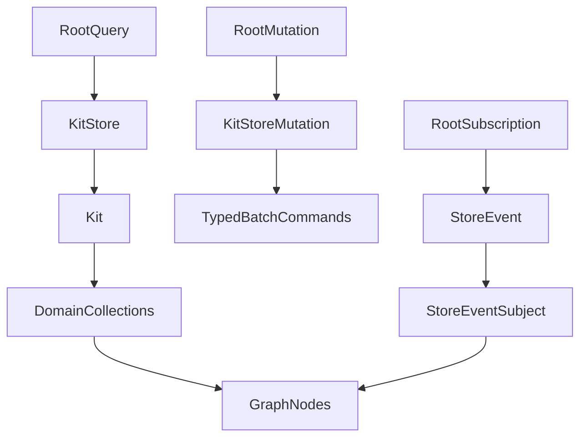

# Typed GraphQL Schema

## Current Findings

- Reopen the existing ticket `2026/04/25/UNIFY-GRAPH-QL-MUTATIONS-AND-REMOVE-JSON-SCALARS`; it is the exact prior work item for removing JSON scalars from `compose/graphql`.
- The generated schema is built from [`compose/rs/lib.rs`](compose/rs/lib.rs) through `kit_graphql::schema_sdl()` and checked against [`compose/graphql/schema.graphql`](compose/graphql/schema.graphql).
- The remaining schema JSON comes from `async_graphql::Json` fields in `kit_graphql`, especially batch command inputs, `kit_command_shell`, `event_stream`, and snapshot fields on `KitStoreNode`, `DesignNode`, `PieceNode`, and `TypeNode`.
- Existing domain DTOs already provide most of the raw shape, but the GraphQL API should expose traversal objects instead of DTO JSON snapshots.

## Target Shape

## Implementation Plan

1. Reopen the matching ticket through repo MCP, then keep any logs or temporary notes inside that ticket folder.
2. Replace schema-visible `Json` usage in [`compose/rs/lib.rs`](compose/rs/lib.rs):
   - `ChangeKitCommandsBatchInput.commands` becomes `[KitChangeCommandInput!]!` instead of raw JSON.
   - Remove or replace `kit_command_shell` with the typed `kitStore.batch` surface, since the shell endpoint is inherently opaque.
   - `event_stream` returns a typed `StoreEvent` GraphQL object, not `Json<KitEvent>`.
   - DTO snapshot fields like `liveFullDto`, `piecesFullJson`, `flatPlane`, `bestRepresentation`, and `vcsStateJson` become typed graph fields or typed object collections.
3. Add explicit GraphQL object/input/enum/union wrappers in the existing `kit_graphql` region:
   - Graph basics: `Node`, `PageInfo`, typed connection/edge structs.
   - Domain nodes: kit, design, piece, connection, side, port, connector, representation, family, file, folder, location, author, concept, tag, quality, prop, attribute, layer, group, stat, benchmark.
   - Geometry: `Point`, `Vector`, `Coordinate`, `Plane`, `Pose` plus matching input structs.
   - Control-plane data: sessions, drafts, transactions, checkpoints, alternatives, conflicts, backbone status, command receipts, batch results, user errors, store events.
4. Wire node resolvers to the existing `KitGraphRef` lookup methods instead of returning full DTO blobs. Lists should return typed connections and selectors should resolve to nodes by id/name/key/url/path where supported.
5. Convert command inputs into existing Rust command data without `serde_json::Value`; use typed `InputObject` and `OneofObject` shapes for add/update/remove/patch commands and graph operations.
6. Update the existing GraphQL smoke test in [`compose/rs/lib.rs`](compose/rs/lib.rs) to assert the generated SDL contains no `scalar JSON`, no `JSON` field references, and still matches [`compose/graphql/schema.graphql`](compose/graphql/schema.graphql).
7. Regenerate [`compose/graphql/schema.graphql`](compose/graphql/schema.graphql) through the existing [`compose/graphql/project.json`](compose/graphql/project.json) build target, then run the relevant Rust/GraphQL tests and inspect the regenerated schema for `JSON`.
8. Close the reopened ticket with a concise summary and the changed files once verification is complete.

## Validation

- Run the schema export/build target for `compose/graphql`.
- Run the existing `kit_graphql_smoke` tests in `compose/rs`.
- Search the regenerated schema for `scalar JSON`, `JSON`, and `Json` and require zero schema-visible matches.
- Check lints/diagnostics for edited files after the Rust and schema changes.
