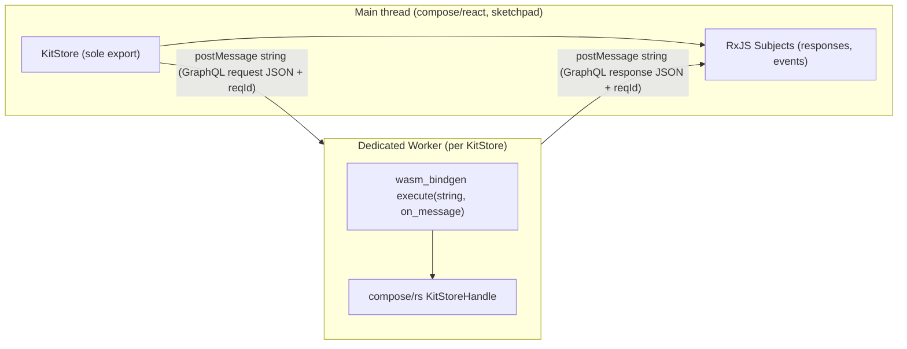

## Architecture

- Per-store dedicated `Worker` (no Comlink, no MessagePort, no `zod`, no `fflate`). Strings only.
- One persistent GraphQL `subscription { eventStream }` opened on construction; demultiplexed by request id into RxJS `Subject`s.
- Every public method is `async` and typesafe; every argument is a typed TS shape from the new internal `🔌WireTypes` region.

## Public surface (only export)

`compose/js/index.ts` exports **only** `KitStore` plus the TS types referenced by its method signatures. Thick API, one method per existing rs GraphQL operation.

- lifecycle: `static open(initialKit: KitFullDto): Promise<KitStore>`, `dispose(): Promise<void>`
- snapshot / observe: `snapshot(): Promise<KitFullDto>`, `theKit(): Promise<KitFullDto>`, `materializeAt(id: string): Promise<KitFullDto>`, `events$: Observable<KitEvent>`
- writes (typed wrappers per `compose/rs` mutation): `dragPieces`, `movePieces`, `clusterPieces`, `fixPieces`, `flattenDesign`, `expandDesign`, `deleteConnection`, `changePieceType`, `pasteDesignSelection`, `createHangingPieces`, `createConnectedPiece`, `createFixedPiece`, `undo`, `redo`, `changeKitCommands`, `changeKitWithInverse`, `patchEntityField`, `addChild`, `removeChild` — each returns `Promise<SetResult>` (typed, no `unknown`)
- reads: `read(batch: ReadCommandBatch): Promise<ReadCommandBatchResult>` plus typed convenience reads (`getPieces`, `getConnections`, `getDesigns`, `getTypes`, `getAuthors`, `getKitMetadata`)
- VCS / backbone: `vcsState`, `attachBackbone(cfg: BackboneConfig)`, `detachBackbone`, `backboneStatus`, `listConflicts`, `resolveConflict`, `syncNow`, `canUndo`, `canRedo`

## File-level changes

- [compose/js/index.ts](compose/js/index.ts) — full rewrite. New region layout (per AGENTS):
  - `🧲Header`
  - `📥Imports` (only `rxjs`)
  - `🔌WireTypes` — handwritten TS mirroring `compose/rs` schema (`KitFullDto`, every Input/Output, `KitEvent`, `SetError`, `SetResult`, `ReadCommandBatch`, `ReadCommandBatchResult`, `BackboneConfig`, `BackboneStatusDto`, `ConflictResolution`, `KitConflict`, `VcsState`, …)
  - `🪜GraphQLWorker` — owns `Worker`, request-id → `Subject<string>` map, persistent `eventStream` subscription
  - `🧰GraphQL` — private typed helpers `mutation<T>`, `query<T>`, `subscription<T>`
  - `📦KitStore` — sole exported class
  - `🧪EmbeddedTests` — vitest suite rewritten in place (no new test files)
  - Remove every other current export: `Compose`, `Coordinate`/`Vec`/`Point`/`Vector`/`Plane`/`Camera`, `Attribute`/`Author`/`File`/`Folder`/`Benchmark`/`Quality`/`Port`/`Family`/`Prop`/`Tag`/`Concept`/`Representation`/`Connector`/`Type`/`Layer`/`Piece`/`Group`/`Side`/`Connection`/`Stat`/`Design`/`Kit` (classes, zod schemas, `*Plain`/`*Diff`/`*Shallow`/`*MetadataDto`), `InMemoryKitStore`, `JsonFileKitStore`, `FolderKitStore`, `createSessionKitStore`, `KitHostStore`, `KitBinaryStore`, `DEFAULT_KIT_SYNC`, `FallbackKitStoreClient`, `WorkerKitStoreClient`, `createKitStoreClient`, `KitWorkerApi`, `KitViewStore`, `getComposeKitViewStore`, `kitGraphqlExecuteStoreCommand`, `kitGraphqlRun`, `KitGraphqlHandle`, `readCommandTypes`, all `*Schema` / `*Id` / `DiffStatus` / `ICON_WIDTH` / `TOLERANCE`.
- [compose/js/worker.ts](compose/js/worker.ts) — strip Comlink. Becomes a thin module worker that calls `boot()` from `@semio-tech/compose-rs-wasm`, holds one `KitStoreHandle`, and on each `message` (typed `{ reqId, kind, payload }`) calls `handle.execute(json, onLine => postMessage({ reqId, line }))` / `handle.snapshot()` / `KitStoreHandle.create(initialKit)`. Strings only on the wire.
- [compose/js/package.json](compose/js/package.json) — add `rxjs`; remove `zod`, `fflate`, `comlink`.
- [compose/js/vite.config.ts](compose/js/vite.config.ts) — keep `@semio-tech/compose-rs-wasm` alias.

## Dependent migrations (greenfield, no compat)

- [compose/react/index.tsx](compose/react/index.tsx) — drop every removed import. Rebuild hooks (`useKit`, `useDesign`, `usePiece`, `useType`, `useBackboneStatus`, `useAttachBackbone`, `useDetachBackbone`, `useListConflicts`, `useResolveConflict`, `useSyncNow`, `KitScope`, `DesignScope`, `PieceScope`, `TypeScope`, …) directly on `KitStore.events$` + typed methods. Remove all `export type/{…} from "@semio-tech/compose-js"` re-exports of deleted symbols.
- [compose/sketchpad/index.tsx](compose/sketchpad/index.tsx) — only consume `compose/react` hooks (its AGENTS rule); strip any direct `@semio-tech/compose-js` imports.
- [compose/sites/play/index.tsx](compose/sites/play/index.tsx), [compose/desktop/renderer.tsx](compose/desktop/renderer.tsx), [compose/vscode/webview.tsx](compose/vscode/webview.tsx), [compose/3dm/ui/index.tsx](compose/3dm/ui/index.tsx) — replace `InMemoryKitStore` / `createJsonFileKitStore` / `Kit` usage with `KitStore.open(initialKit)` + typed method calls (host-side persistence becomes a thin wrapper around `KitStore.snapshot()` + `KitStore.changeKitCommands(...)`; no host kit graph kept in JS).
- [compose/algorithms/nativeAlgorithmAdapter.ts](compose/algorithms/nativeAlgorithmAdapter.ts) — delete; algorithm calls go through `KitStore.flattenDesign` / `read(...)` (rs AGENTS forbids JS-side domain logic).
- [compose/algorithms/.storybook/stories/\*](compose/algorithms/.storybook/stories), [compose/ui/index.tsx](compose/ui/index.tsx), [compose/ui/.storybook/stories/\*](compose/ui/.storybook/stories) — rewrite imports against `KitStore` types only; remove uses of `Design`/`Kit`/`DesignEntity`/`KitRuntime`/`getKitPorts`/etc.

## Tests

Extend `🧪EmbeddedTests` in [compose/js/index.ts](compose/js/index.ts) (no new test files):

- `KitStore.open` boots worker, exposes typed `snapshot()`
- Each typed write round-trips and resolves with `SetResult`
- `events$` emits typed `KitEvent` for `accepted` / `succeeded` / `failed`
- `dispose()` terminates worker, completes `events$`
- Typed `read(batch)` returns typed result (no `unknown`)
- `vcsState` / `theKit` / `materializeAt` round-trip
- `attachBackbone` / `listConflicts` / `resolveConflict` typed paths

Run `npm test` in `compose/js`, `compose/react`, `compose/sketchpad` — all green before closing the ticket.

## Ticket

`ticket_open` → goal `🎯r2602🎯runningsketchpad`, title `Single Async KitStore Export In compose/js`. All temporary files inside the ticket folder. Close with summary + file list when tests pass.

## Out of scope

No `compose/rs` schema changes — we consume the existing single bindgen entrypoint `KitStoreHandle.execute(request_json, on_message)` as-is.
