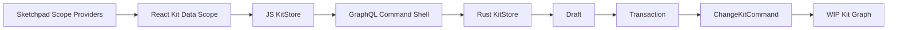

# Kit Command Scope Refactor

## Current Findings

- `compose/rs/lib.rs` already has `KitReadScope` for `theKit`, `checkpoint`, `alternative`, `draft`, and `transaction`, plus `Draft` and `Transaction` structures.
- `compose/graphql/schema.graphql` exposes scoped reads but the mutation remains `submitKitCommand(input: KitCommandShellInput)` with an untyped `JSON` request and no required transaction target.
- `compose/js/index.ts` forwards writes through `submitShell("changeKitCommands", { variables: { commands } })`, so command calls are not explicitly scoped to a draft/transaction.
- `compose/react/index.tsx` has entity scope providers, but schema field writes still contain fallback paths (`setFieldValue`, `setObjectValue`) and can construct command wire outside a transaction-aware scope.
- `compose/sketchpad/index.tsx` has local app transaction stacks and command controllers, but kit data edits can still be mixed with app-local transactions instead of a Rust-backed kit transaction scope.

## Target Flow

Every kit write becomes:
`kit or alternative latest checkpoint -> draft -> transaction -> command batch -> event result`.

Reads use the same active scope: transaction while open, draft after transaction finalization, checkpoint/latest kit when no draft is active.

## Implementation Plan

1. Reopen or attach work to the existing open ticket most closely matching this scope. The current `Sketchpad State Store Refactor` ticket is UI-state focused, so if repo ticket tooling does not expose a better open ticket such as scoped kit write/refactor, open a new ticket titled `Kit Command Scope Refactor` under `Running Sketchpad` / `Kit App`.

2. In [compose/rs/lib.rs](compose/rs/lib.rs), introduce a typed write target beside `KitReadScope`, for example `KitWriteScope { sessionId, draftId, transactionId }` with an explicit base target of latest `the kit` or latest `alternative`. Enforce in Rust that `ChangeKitCommands` only executes against an open transaction. Add command variants for `startDraft`, `startTransaction`, `finalizeTransaction`, `abortTransaction`, `commitDraftToCheckpoint`, `undoTransaction`, and `redoTransaction` if the existing session/draft command surface is not exposed through GraphQL cleanly.

3. In [compose/graphql/schema.graphql](compose/graphql/schema.graphql) and the Rust schema generation/resolvers, replace the unscoped `KitCommandShellInput.request: JSON` mutation shape for writes with typed inputs that carry `KitWriteScopeInput`. Keep the single async command receipt/event model, but remove JSON scalar use from command inputs as required by the GraphQL bundle rules.

4. In [compose/js/index.ts](compose/js/index.ts), make `KitStore` own the active `KitReadScope`/`KitWriteScope` state for a session. Add typed APIs such as `startDraft`, `startTransaction`, `changeKitCommands(scope, commands)`, `finalizeTransaction`, and derived `currentReadScope()`. Remove unscoped mutation helpers or make them private implementation details that require a transaction scope.

5. In [compose/react/index.tsx](compose/react/index.tsx), expose scope providers for kit, draft, transaction, and entity scopes. Update field/object mutation hooks so they call JS typed scoped commands only; delete or block legacy fallback writes that route through `setFieldValue` / `setObjectValue` without an active kit write transaction. Reads should subscribe through `KitDataScopeContext` so transaction previews are visible.

6. In [compose/sketchpad/index.tsx](compose/sketchpad/index.tsx), make each kit app/design/type interaction enter the active scope explicitly: start or reuse a draft, open a transaction for the gesture/edit, execute commands, and finalize/abort on completion. Keep app UI state (selection, hover, panels) in Sketchpad state, but route all kit CRUD through React command hooks. Remove local kit diff application and any direct kit host mutation from controller code.

7. Extend existing tests only. Focus coverage on: Rust rejects unscoped writes, transaction reads show uncommitted changes, abort leaves latest kit unchanged, finalize moves changes into draft, commit creates checkpoint, JS cannot submit unscoped writes, React field hooks require write scope, and Sketchpad drag/edit/delete flows run through transaction commands.

8. Validate in layers: Rust tests for `compose/rs`, GraphQL schema generation/check, JS tests for `compose/js`, React type/test checks, Sketchpad targeted tests, then the relevant Playwright suite. Also run the dependency/layer rule if available so `sketchpad -> react -> js -> GraphQL -> rs` remains strict.
