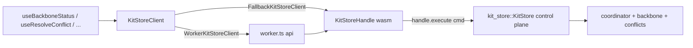

## Scope

- No new files. WASM-only surface (per prior decision); `compose-store` JSON-RPC client stays out of `@semio-tech/compose-js` for now.
- New commands (`AttachBackbone`, `DetachBackbone`, `BackboneStatus`, `ListConflicts`, `ResolveConflict`, `SyncNow`) are built in JS and sent through `handle.execute(cmd)`. On wasm the Dev/Local backbones error server-side (already handled by `KitStoreCommand::execute`), which is surfaced as a TS `SetResult` failure.
- `compose/algorithms` Storybook already talks to `KitStoreHandle` directly, so only the **native Rust bridge** needs a rename.

## Target command shapes (must match `kit_store_command::KitStoreCommand`)

```ts
type BackboneFlavor = { type: "Dev"; path: string } | { type: "Local"; dbPath: string; blobsDir: string } | { type: "Remote"; url: string; token?: string };

type BackboneConfig = {
 flavor: BackboneFlavor;
 active_checkpoint?: string;
};

type ConflictResolution = { kind: "Ours" } | { kind: "Theirs" } | { kind: "Manual"; patch: unknown };

type KitStoreCommand =
 | { kind: "AttachBackbone"; config: BackboneConfig }
 | { kind: "DetachBackbone" }
 | { kind: "BackboneStatus" }
 | { kind: "ListConflicts" }
 | {
    kind: "ResolveConflict";
    conflict_id: string;
    resolution: ConflictResolution;
   }
 | { kind: "SyncNow" }
 | /* existing VCS/CRUD variants passed through execute(...) */ unknown;
```

Field names follow the Rust `#[serde(rename_all = "camelCase")]` / tag conventions in [`compose/rs/lib.rs`](compose/rs/lib.rs); the plan's `snake_case` fields should be adjusted to whatever `KitStoreCommand` serializes as today (verified at edit time against `kit_store_command`).

## 1. [`compose/js/index.ts`](compose/js/index.ts)

1. Near the existing backbone/conflict domain types, add wire types `BackboneConfig`, `BackboneFlavor`, `BackboneStatus`, `ConflictResolution`, `KitStoreWireCommand` (tagged enum mirroring `KitStoreCommand` just for the new variants).
2. Extend `KitStoreClient` interface (line 19743) with:

```ts
execute(cmd: unknown): Promise<SetResult & { result?: unknown }>;
executeRead(cmds: unknown[]): Promise<any[]>;
vcsState(): Promise<any>;
theKitDto(): Promise<any>;
materializeAt(id: string): Promise<any>;
attachBackbone(cfg: BackboneConfig): Promise<SetResult>;
detachBackbone(): Promise<SetResult>;
backboneStatus(): Promise<BackboneStatus>;
listConflicts(): Promise<KitConflict[]>;
resolveConflict(id: string, res: ConflictResolution): Promise<SetResult>;
syncNow(): Promise<SetResult>;
```

3. Implement the new methods on `FallbackKitStoreClient` (≈19806): each builds the matching command object and calls `this.handle.execute(cmd)` / `this.handle.vcsState()` / `this.handle.executeReadKitCommands(cmds)` / `this.handle.materializeAt(id)` / `this.handle.theKitDto()` inside `withTimeout(...)`, normalizing errors into `SetResult`.
4. Implement the same methods on `WorkerKitStoreClient` (≈20060) by forwarding to new Comlink endpoints.
5. Mirror the new surface in `InMemoryKitStore` (≈20554) as no-ops / throw-not-supported where appropriate (backbone ops return `{ ok: false, error: { kind: "NotSupported" } }`; `execute`/`executeRead`/`vcsState` throw so tests catch misuse).
6. Add a `KitStoreClient` unit test (in the existing `describe("KitStoreClient", …)` block ~23525) that asserts `backboneStatus()` round-trips on the fallback client (attached=false by default) and that `attachBackbone({ flavor: { type: "Dev", path: "…" } })` rejects on wasm with a readable error.

## 2. [`compose/js/worker.ts`](compose/js/worker.ts)

Add to the `api` object (after `subscribe`):

```ts
execute: (cmd: unknown) => settle(Promise.resolve(handle.execute(cmd))),
executeRead: (cmds: unknown[]) => settle(Promise.resolve(handle.executeReadKitCommands(cmds))),
vcsState: () => Promise.resolve(handle.vcsState()),
theKitDto: () => Promise.resolve(handle.theKitDto()),
materializeAt: (id: string) => Promise.resolve(handle.materializeAt(id)),
attachBackbone: (config: unknown) => settle(Promise.resolve(handle.execute({ kind: "AttachBackbone", config }))),
detachBackbone: () => settle(Promise.resolve(handle.execute({ kind: "DetachBackbone" }))),
backboneStatus: () => Promise.resolve(handle.execute({ kind: "BackboneStatus" })),
listConflicts: () => Promise.resolve(handle.execute({ kind: "ListConflicts" })),
resolveConflict: (conflictId: string, resolution: unknown) =>
  settle(Promise.resolve(handle.execute({ kind: "ResolveConflict", conflictId, resolution }))),
syncNow: () => settle(Promise.resolve(handle.execute({ kind: "SyncNow" }))),
```

No changes to `init` / `snapshot` / existing calls.

## 3. [`compose/react/index.tsx`](compose/react/index.tsx)

Add hooks next to `useKitSync` (≈1237), using the existing `useKitRuntime()` pattern:

- `useBackboneStatus()` — `useEffect`-polled wrapper returning `{ status, lastError }` where `status: BackboneStatus | null`.
- `useAttachBackbone()` / `useDetachBackbone()` — mutation hooks returning `{ attach, detach, pending, lastError }`.
- `useListConflicts()` — returns `{ conflicts, refresh, pending, lastError }`.
- `useResolveConflict()` — `{ resolve, pending, lastError }`.
- `useSyncNow()` — `{ sync, pending, lastError }`.

Each hook calls `runtime.client.<method>()` (type-narrowed) and refreshes `useKitSync` state on error. Re-export new wire types from `@semio-tech/compose-js` for consumer convenience (`BackboneConfig`, `ConflictResolution`, `BackboneStatus`, `KitConflict`).

## 4. [`compose/algorithms/native-bridges/rs/src/main.rs`](compose/algorithms/native-bridges/rs/src/main.rs)

Rename to the new terminology:

```rust
use compose::{DesignStoreRef, Id, KitFullDto, KitGraph, KitGraphRef, ComposeReport};
...
let kit_ref: KitGraphRef = KitGraph::from_full_dto(req.kit);
...
let report = match futures_lite::future::block_on(
    compose::KitGraph::flatten_design_async(&kit_ref, &req.design_id),
) { ... };
```

No behavior change; relies on the new `pub use kit_graph::KitGraph;` at the crate root of [`compose/rs/lib.rs`](compose/rs/lib.rs).

## 5. Docs

- Append a short "Backbone / conflict surface" note to [`compose/js/AGENTS.md`](compose/js/AGENTS.md) listing the new `KitStoreClient` methods and the wasm-only constraint.
- Append a parallel note to [`compose/react/AGENTS.md`](compose/react/AGENTS.md) listing the new hooks.
- Update [`compose/algorithms/AGENTS.md`](compose/algorithms/AGENTS.md) to mention the `KitGraph` rename for the native bridge.

## What explicitly stays as-is

- `compose/algorithms/.storybook/**` (`composeWasm.ts`, `useKitStore.ts`, `HistoryControls.tsx`) — already use `KitStoreHandle.execute(...)`; still works unchanged. Any preset JSON examples in `commandSchema.ts` are kept as-is unless trivially extended during review.
- `@semio-tech/compose-rs-wasm` binding name `KitStoreHandle` — intentionally preserved (already renamed in `compose/rs` to match).
- `compose/react/vite.config.ts` alias to `../rs/pkg` — unchanged.

## Verification

- `pnpm -F @semio-tech/compose-js test` (focused on the `KitStoreClient` describe block).
- `pnpm -F @semio-tech/compose-react build` (type-check of new hooks).
- `cargo build -p compose-algorithms-bridge` (or equivalent path in `compose/algorithms/native-bridges/rs`) — verifies the rename compiles with the current `compose` crate.
- Existing `compose/store/tests/rpc.rs` remains unaffected.

## Data flow


