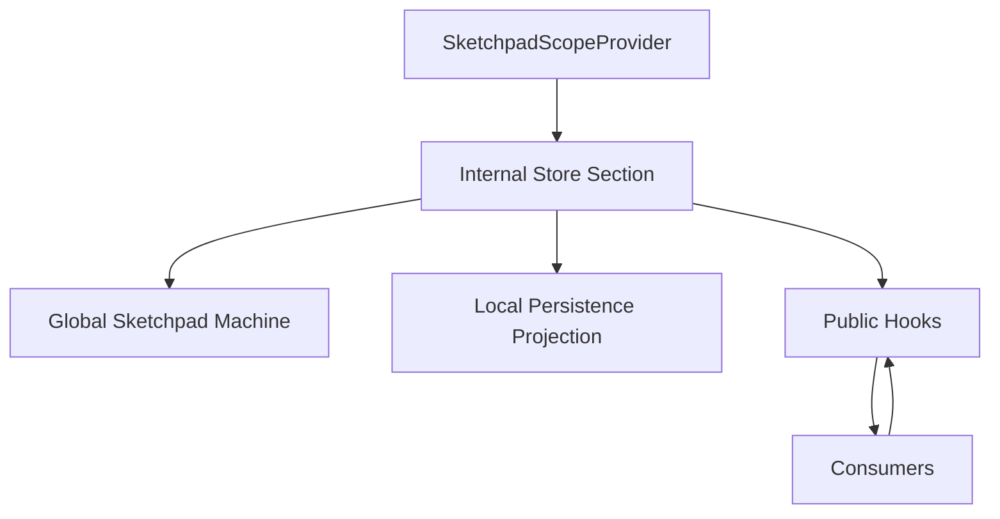

# Sketchpad State Store Refactor

## Scope

Refactor [compose/sketchpad/index.tsx](compose/sketchpad/index.tsx). Keep the one-file structure required by the repo, but reorganize the state-management code into one `Store` section with subregions for state shape, machine events, transition definitions, actor lifecycle, persistence projection, selectors, and public hooks.

Relevant current hotspots:

```ts
// [compose/sketchpad/index.tsx](compose/sketchpad/index.tsx)
export class SketchpadStore {
 private readonly syncDoc: SyncDoc;
 private readonly syncSketchpad: SyncSketchpad;
 actor?: SketchpadActorRef;
}
```

```ts
// [compose/sketchpad/index.tsx](compose/sketchpad/index.tsx)
export function useTheme(): HookResult<Theme> {
 const actor = useSketchpadActor();
 const value = useSelector(actor, (snapshot) => selectTheme(snapshot.context));
 const canSet = useSelector(actor, (snapshot) => snapshot.can(canSetEvent));
 return conditionalHookResult(canSet, value, setter);
}
```

## Target Shape



The machine remains the only runtime authority for sketchpad UI state, shell state, home app, kit app, design app, type app, quality app, feedback, tutorial, and local selection. Persistence is a projection of machine context, not a second mutable source.

## Implementation Plan

1. Create an internal `SketchpadStoreRuntime` shape inside the single Store section that holds the actor, scope id, persistence helpers, and kit registry bridge wiring. Replace the current `SketchpadStore` SyncDoc authority with a thin compatibility facade only where existing kit-opening commands still need an object during the migration.

2. Move `SketchpadLocalSelectionState`, app registry snapshots, docs panel state, focus/origin, filters, transaction hover state, and type filters into the global `SketchpadContext` or explicit machine child slices. Remove sketchpad-local `useSyncExternalStore` subscription paths from hooks.

3. Define transition descriptors next to the machine event definitions. Each descriptor maps a public field/action to its event factory and transition key, for example theme uses `SET_THEME`, fullscreen uses `TOGGLE_FULLSCREEN`, kit selection uses `KIT.SET_SELECTION`. Public hooks derive `canSet` from the descriptor by checking whether the transition exists and its guard passes for the current snapshot, not by constructing ad hoc duplicate `snapshot.can(...)` payloads throughout consumers.

4. Replace XState-facing public hooks with clean wrappers such as `useSketchpadField`, `useSketchpadAction`, `useKitAppField`, `useDesignAppField`, `useTypeAppField`, and `useQualityAppField`. Keep XState imports, actor references, `useSelector`, and transition inspection private to the Store section. Existing consumer hooks like `useTheme`, `useLanguage`, `useKitAppSelection`, and `useDesignAppSelection` continue returning `HookResult` or action tuples, but no consumer receives an actor or XState snapshot.

5. Remove or inline the sketchpad-local sync helpers: `useSync`, `useSyncOptional`, `useSyncDeep`, `useSyncField`, `useSyncFields`, and direct `useSyncExternalStore` uses in sketchpad state hooks. Any remaining external subscriptions must either move into the machine or be replaced by existing `@compose/react` kit hooks when they represent kit data.

6. Collapse duplicate state surfaces: delete the unused `SketchpadMachineContext`/`StoreSyncContext` sync bridge concepts, stop writing to `syncSketchpad` as state authority, and make `readSketchpadStateFromLocalStorage` / `writeSketchpadStateToLocalStorage` hydrate and persist the machine context directly.

7. Update existing embedded or package-level verification without adding new test files. If no real sketchpad test file exists, add focused runtime assertions to the existing sketchpad test harness path used by `npm run test` or extend the nearest existing repo test only for structural rules. Cover one unit per test: machine transitions, capability derivation, hook wrapper return shape, and absence of duplicate sync helpers.

8. Run validation after implementation: `npm run build --workspace @compose/sketchpad` or the repo-equivalent build, `npm run test --workspace @compose/sketchpad`, and any available layer/dependency check such as `npm run depcruise:layers` from the repo root.

## Ticket Workflow

When execution is approved, start by using the repo ticket workflow available in the environment: search/list goals, reopen the existing sketchpad layering ticket if it covers this work, otherwise open a new ticket titled `Sketchpad State Store Refactor`. Close the ticket after validation with a summary and touched files.
