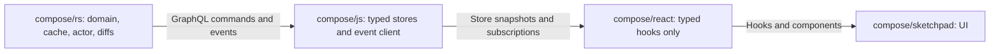

# Compose Layer Parity Plan

## Current Shape

The relevant code is concentrated in existing entry files: [compose/rs/lib.rs](compose/rs/lib.rs), [compose/js/index.ts](compose/js/index.ts), [compose/js/worker.ts](compose/js/worker.ts), [compose/react/index.tsx](compose/react/index.tsx), and [compose/sketchpad/index.tsx](compose/sketchpad/index.tsx). Tests already live inside [compose/js/index.ts](compose/js/index.ts), [compose/react/index.tsx](compose/react/index.tsx), [compose/rs/lib.rs](compose/rs/lib.rs), and [compose/store/tests/rpc.rs](compose/store/tests/rpc.rs), so those should be extended rather than adding new test files.

The main gaps are:

- [compose/rs/lib.rs](compose/rs/lib.rs) has `ChangeKitCommand`, `KitDiff`, `KitEvent`, GraphQL, WASM, and JSON-RPC behavior, but mutation execution is not uniformly fire-and-forget command id plus event result, and not every command is enforced through a diff-returning function.
- [compose/js/index.ts](compose/js/index.ts) exposes a wide `KitStoreClient` with loose events, duplicated GraphQL strings, partial read mapping, and no clean typed store classes.
- [compose/react/index.tsx](compose/react/index.tsx) already uses `useSyncExternalStore` in many places, but many hooks subscribe to broad client events and refetch even when the selected data did not change. It also re-exports a large domain barrel used by [compose/sketchpad/index.tsx](compose/sketchpad/index.tsx).

## Target Architecture

Layer rules to implement:

- `compose/rs` owns all domain logic, cache invalidation, command validation, command-to-diff planning, inverse planning, state application, and event production.
- `compose/js` only knows the GraphQL actor protocol and exposes typed store classes with structured events, selectors, command ids, request lifecycle events, and snapshot access.
- `compose/react` only knows `compose/js` stores. State hooks use `useSyncExternalStore`; mutation hooks return `useCallback` functions that enqueue commands and expose request ids/status through store state.
- `compose/sketchpad` only consumes React hooks/components, with any domain/store imports moved to the correct layer.

## Implementation Plan

1. Start by opening or reopening the matching repo ticket, then keep all notes/logs inside that ticket. Since this is a broad refactor, treat the existing pending ticket about duplicated run wrappers as related only if its scope matches this work; otherwise use a new ticket for layer parity.

2. In [compose/rs/lib.rs](compose/rs/lib.rs), make the command protocol explicit and uniform:
   - Define the command envelope shape with `requestId`, `commandKind`, payload, and accepted/result/error event variants.
   - Route GraphQL mutations through the inbound actor queue and return only the accepted command id.
   - Ensure outbound events include both lifecycle results and kit change events with enough affected keys for JS selectors.
   - Convert each kit-changing command path so concrete parameters produce a `KitDiff`, then apply all state changes centrally through `apply_kit_diff`/the existing reconcile path.
   - Add inverse planning for command batches as a first-class function and test it against current undo behavior.
   - Keep JSON-RPC/native store behavior aligned with the same command/event semantics or deliberately reduce it to a wrapper over the same internal command engine.

3. In [compose/js/index.ts](compose/js/index.ts) and [compose/js/worker.ts](compose/js/worker.ts), replace the loose client surface with clean typed stores:
   - Introduce typed event unions mirroring Rust events, including command accepted/succeeded/failed and affected store keys.
   - Centralize GraphQL execution and remove duplicated mutation/read string builders across fallback, worker, and worker API paths.
   - Add `KitStore` plus granular entity/read stores that expose `getSnapshot`, `subscribe`, `select`, and async command enqueue methods returning request ids.
   - Make store snapshots stable by key and only notify subscribers whose selected data actually changed.
   - Replace partial read mapping with one parity path backed by the Rust schema/command enum, then remove unsupported legacy mappers rather than keeping compatibility shims.

4. In [compose/react/index.tsx](compose/react/index.tsx), turn React into a thin typed hook adapter:
   - Add shared hook helpers around `useSyncExternalStore` for `store.select(selector, equality)` and exact snapshot identity.
   - Refactor all state hooks to read from `compose/js` store selectors, not broad `KitStoreClient.subscribe` plus refetch loops.
   - Refactor all mutation hooks to use `useCallback` and call JS store command methods, returning request id/status from the event-backed store state.
   - Remove `useEffect`/`useState` subscription patterns for live kit data where they duplicate store state.
   - Tighten types enough to remove or substantially shrink `@ts-nocheck` regions touched by this work.

5. In [compose/sketchpad/index.tsx](compose/sketchpad/index.tsx), update usage to the strict layer boundary:
   - Keep UI code on `@semio-tech/compose-react` hooks/components.
   - Move any direct domain/store assumptions to either `@semio-tech/compose-js` where non-React store access is truly needed, or to typed React hooks when used by UI.
   - Verify the exported hook/class parity expected by sketchpad still exists, but through the new layer boundaries.

## Validation

Run focused tests after each layer, then the cross-layer suite:

- Rust: `cargo test` scoped to the existing `compose/rs` command, diff, event, GraphQL, wasm handle, and JSON-RPC tests.
- JavaScript: `pnpm --filter @semio-tech/compose-js test` and `pnpm --filter @semio-tech/compose-js build`.
- React: `pnpm --filter @semio-tech/compose-react test` and `pnpm --filter @semio-tech/compose-react build`.
- Sketchpad: run the existing build/test command for [compose/sketchpad/package.json](compose/sketchpad/package.json) after React import changes.

Add/extend tests for:

- Every Rust kit change command: command parameters produce a diff; applying inverse restores the previous snapshot.
- Command lifecycle: enqueue returns request id, success/result/error arrives through events.
- JS store parity: every supported command/read/event has a typed method/event and no unsupported partial mapper remains.
- React granularity: hooks do not re-render when unrelated store keys change and do re-render when their selected data changes.
- Sketchpad smoke coverage for the updated hook/component import surface.
