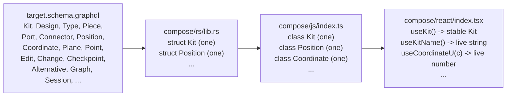
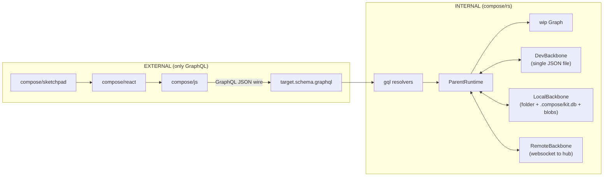
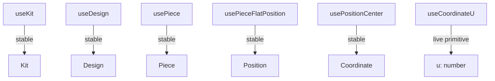

# Single-Source Entity Layers

## Layering contract

`compose/sketchpad` -> `compose/react` -> `compose/js` -> GraphQL -> `compose/rs`

Each entity in [compose/graphql/target.schema.graphql](compose/graphql/target.schema.graphql) appears **exactly once** per layer:



Cardinality rules (user verbatim):

- One class per **weak** entity (`Position`, `Plane`, `Point`, `Vector`, `Coordinate`, `Offset`, `Location`, `Attribute`).
- One class per **strong** entity (only `class Kit`, no `KitDto`/`KitStore`/`KitSnapshot`/`KitBundle`/`KitGraph`/etc.).
- One hook per strong-entity field, plus the entity-ref hook (`useKit`, `useDesign`, ...).
- Non-primitive field hooks return a **stable** instance (never re-renders); primitive field hooks subscribe to live updates.
- Owned strong-entity collection hooks (`useDesigns`, `useTypes`, `usePieces`, `useEdits`, ...) update only when membership (ids) changes, not when individual children change.

## Entity inventory (one class per layer)

The schema partitions every named type into one of seven families. **Every** concrete type in every family must have exactly one canonical Rust struct + one JS class + (where applicable) one React ref-hook.

### Strong entities, primary (uuidv7 id) - 28

`Place`, `Family`, `Folder`, `File`, `Author`, `Prop`, `Benchmark`, `Quality`, `Tag`, `Concept`, `Stat`, `Port`, `Connector`, `Representation`, `Type`, `Layer`, `Group`, `Piece`, `Connection`, `Design`, `Kit`.

VCS: `Edit`, `Change`, `Checkpoint`, `Alternative`, `TheKit`, `Graph`, `Session`, `Conflict`.

### Strong entities, operations (uuidv7 id) - 95

Concrete subtypes of `interface Operation` (each is a `StrongEntity`, has uuidv7 id). Examples per artifact family:

- **Kit**: `RenamedKit`, `ChangedDescription`.
- **Quality**: `CreatedQuality`, `CreatedQualities`, `RenamedQuality`, `UpdatedQualityDescription`, `UpdatedQualityIcon`, `AddedAttributeToQuality`, `AddedAttributesToQuality`, `RemovedAttributeFromQuality`, `RemovedAttributesFromQuality`, `DeletedQuality`, `DeletedQualities`.
- **Tag**, **Concept**, **Port**, **Type**, **Connector**, **Design**, **Piece**: parallel families (rename / describe / icon / attribute add+remove / delete singular+plural / type-specific operations).
- **Piece-graph**: `CreatedFixedPiece`, `AddedChildPieceWithParentConnection`, `AddedChildPiecesWithParentConnections`, `AddedHangingChildPieceWithParentConnection`, `AddedHangingChildPiecesWithParentConnections`, `ChangedPieceToType`, `ChangedPiecesToType`, `DraggedPiece`, `DraggedPieces`, `FixedPiece`, `FixedPieces`, `MovedPiece`, `MovedPieces`, `DeletedPiece`, `DeletedPieces`, `DeletedPiecesAndConnections`, `FlattenedDesign`.

Total exact count: **95** (verified `rg "^type \w+ implements Operation"`).

### Weak entities, primary (hash id) - 8

`Vector`, `Point`, `Coordinate`, `Offset`, `Plane`, `Position`, `Location`, `Attribute`.

### Weak entities, change algebra (hash id)

- `interface Diff` + **30 concrete** subtypes: `KitDiff`, `DesignDiff`, `TypeDiff`, `PieceDiff`, `ConnectionDiff`, `PortDiff`, `ConnectorDiff`, `RepresentationDiff`, `QualityDiff`, `TagDiff`, `ConceptDiff`, `StatDiff`, `PropDiff`, `BenchmarkDiff`, `AttributeDiff`, `AuthorDiff`, `FileDiff`, `FolderDiff`, `FamilyDiff`, `PlaceDiff`, `LayerDiff`, `GroupDiff`, `VectorDiff`, `PointDiff`, `CoordinateDiff`, `OffsetDiff`, `PlaneDiff`, `PositionDiff`, `LocationDiff`, `RepresentationDiff`.
- `interface Modification` + **30 concrete** subtypes (`KitModification`, ..., `LocationModification`).
- `type Modifications` (concrete wrapper) + **30 per-entity wrappers** (`KitModifications`, ..., `LocationModifications`).
- `interface Input` + **61 concrete** subtypes (one per operation that takes arguments: `RenamedKitInput`, `CreatedTagInput`, `CreatedTagsInput`, `RenamedTagInput`, `UpdatedTagDescriptionInput`, ...).
- `interface Event` (timestamped weak entity, used internally by Rust event bus; JS exposes only its concrete bus-event subclasses through the live-query subscription).

### Connections (relay shells) - 1 per entity

For every entity above there is a `<Entity>Edge` and `<Entity>Connection` (relay shape). These are **not** entity classes; they are the wire shape `useIdStableList` consumes. They appear once per entity in Rust (`gql_relay::*Connection`), and **never** in JS / React (collapsed into the id-list-stable hook).

### Totals per layer

- **Rust** structs (or enum variants): 28 + 95 + 8 + 30 + 30 + 30 + 61 = **282 canonical types**, one per concrete schema type. Today many already exist; remaining gaps will be added or unified during Phase A.
- **JS** classes: same **282** classes (one per concrete schema type) plus the 5 base classes (`Operation`, `Diff`, `Modification`, `Input`, `Event`). All in [compose/js/index.ts](compose/js/index.ts).
- **React** ref hooks: one per _strong_ entity = 28 + 95 = **123** ref hooks (`useKit`, `useDesign`, ..., `useRenamedKit`, `useCreatedFixedPiece`, ...). Weak entities have **no** ref hooks - they are reached via accessors on their parent strong-entity instance per K3.
- **React** field hooks (K1..K11): roughly **~1,200**. One per field per entity. The base interface fields (`hash`, `owner`, `id`, `owns`) generate a hook on the base class only; concrete subclasses add hooks only for their additional fields.

Each layer mechanically iterates this inventory; the patterns below are the ones each entry follows.

## External API boundary - GraphQL only, no general JSON serde



**Hard invariants** the rest of the plan must enforce:

1. **Only one external surface**: the wire format described by [target.schema.graphql](compose/graphql/target.schema.graphql). Every read/write between layers crosses this surface. No JSON-RPC, no out-of-band kit-DTO blobs, no parallel HTTP routes.
2. **Only one persistent serializer**: `DevBackbone` reads/writes a single JSON file. `LocalBackbone` uses a folder layout (`.compose/kit.db` SQLite + file blobs - **not** JSON). `RemoteBackbone` uses a WebSocket frame protocol (binary or compact text - **not** JSON-DTO snapshots). All three are **internal** to `compose/rs` and never appear in `compose/js` / `compose/react` / `compose/sketchpad`.
3. **Backbone attach goes through GraphQL**: a new `Mutation.session.backbone.attach(uri: String!)` (or analogous root) replaces the today-internal `Command::BackboneAttach`. The URI scheme dispatches the backend kind (`dev:///path/to.json`, `local:///path/to/folder`, `remote://wss://hub.compose.tech/...`).
4. **No general-purpose JSON helpers in `compose/js` public surface**: `JsonValue` / `JsonObject` / `parseJsonValue` / `KitGraphqlResponseEnvelope` become **private** wire helpers (file-local types not re-exported). The public API is class methods returning typed values. **293** current `JsonValue`/`JsonObject` references in [compose/js/index.ts](compose/js/index.ts) collapse to a small private wire layer.
5. `**Kit.open(uri)` interprets `uri` as a real URI**: today (line 795) it parses `uri` as a JSON kit-DTO string. After this plan, `uri` is a backbone URI (`dev:///...`, `local:///...`, `remote://...`) and the WASM `KitStoreHandle.create(uri)` boots an empty graph + dispatches an internal `BackboneAttach` command keyed by URI scheme. There is **no\*\* browser-side JSON-DTO upload path.
6. **Remove `Mutation.hydrateKitStoreBundleJson`** ([target.schema.graphql] - currently outside the schema but exposed in [lib.rs](compose/rs/lib.rs#L10111)). The only way to populate a kit is via the backbone attach + change pipeline.

## Strict invariants (carried forward from `field-only_kit_reads_refactor` + `macro-driven_entity_family_refactor`)

Both prior plans encode rules that this plan inherits and tightens. Listing them explicitly so no worker re-introduces a banned pattern:

1. **Schema-1:1 invariant**. Every exported hook in [compose/react/index.tsx](compose/react/index.tsx) corresponds to **exactly one** schema field (read) or **exactly one** `*OperationInput` leaf (write). No derivation, no aggregation, no metadata, no shallow / view / triad / accessor / `*Input`-whole-object hooks. Slicing happens **inline at the call site** (e.g. `usePieceCenter()?.u` instead of a `usePieceCenterU()` derived hook). Banned: `useTypesIds`, `useDesignPieceIds`, `usePieceCenterU`, `usePieceIsHidden`, `useDesignQualitySum`, `useTypeBestRepresentation`, every `*Metadata` / `*Shallow` / `*Full` / `*Triad` / DTO whole-object accessor.
2. **No `*Sync` operation hooks, no `*Sync` field methods**. Reads are `async () => Promise<T>` + `subscribe<Field>(cb)`; writes are `async (...args) => Promise<SetResult>`. The JS classes never store the latest read value (no in-class cache); `bindFieldToReact` keeps the React state via `useState` only.
3. **No `useSyncExternalStore` anywhere in [compose/react/index.tsx](compose/react/index.tsx)**. The source of truth lives in [compose/rs/lib.rs](compose/rs/lib.rs) and every read crosses the GraphQL boundary asynchronously — there is **no synchronous snapshot to take**, so the React tear-free guarantees of `useSyncExternalStore` would force a fake sync getter that always returned `undefined` until the first fetch resolved. The `bindFieldToReact` bridge uses `useState` + `useEffect` + cleanup. This **supersedes** the older guidance in [compose/AGENTS.md L15](compose/AGENTS.md#L15) and [compose/react/AGENTS.md L21](compose/react/AGENTS.md#L21) (those rules date from the `KitStoreClient` / `KitStore` / `getSnapshot` era which this refactor removes; AGENTS.md will catch up only after this plan lands, per workspace rule "do not edit AGENTS.md files").
4. **No `*Entity` suffix on JS class names**. `FileEntity` / `FolderEntity` / `LayerEntity` / `GroupEntity` / `StatEntity` / `PropEntity` rename to `File` / `Folder` / `Layer` / `Group` / `Stat` / `Prop`. They are ES-module exports — no DOM-global collision.
5. **`*Scope` → `*Context` rename across the public API** (matches `field-only_kit_reads_refactor` §4 "Naming"). Provider components: `KitScope` → `KitContext`, `DesignScope` → `DesignContext`, ..., `RepresentationScope` → `RepresentationContext`. Each takes a single `id` prop. Hooks: `useKitScope` → `useKitContext`, ..., `useTagScope` → `useTagContext`. Every `<XScope id={...}>` JSX site becomes `<XContext id={...}>`. `useIs<X>Scope` helpers go away. The earlier examples in this plan that say `<DesignScope>` / `useDesignScope` are renamed to `<DesignContext>` / `useDesignContext`.
6. **One asynchronous `read*()` + one `subscribe*(cb)` per schema field on every entity class**. No synchronous getter besides `id` (and `hash`, since hashes are deterministically derived).
7. **Naming normalization for operations** (matches `macro-driven_entity_family_refactor` §"Schema fixes"):

- `Created*` for **new artifact creation** (`CreatedTag`, `CreatedDesign`, `CreatedPort`).
- `Added*` for **adding an existing entity to a collection** (`AddedConnector`, `AddedAttributeToTag`, `AddedChildPieceWithParentConnection`).
- `Removed*` for **collection removal** (`RemovedAttributeFromTag`, `RemovedConnector`).
- `Deleted*` for **artifact deletion** (`DeletedTag`, `DeletedDesigns`).
- The corresponding hooks (`useCreateType`, `useAddConnector`, `useRemoveConnector`, `useDeleteType`) and JS class methods follow the same pattern.

## Macro-driven Rust definitions ([compose/rs/lib.rs](compose/rs/lib.rs))

[compose/rs/lib.rs](compose/rs/lib.rs) already has the in-progress macro suite from [.repo/🎫/26/05/11/MACRO-DRIVEN-ENTITY-FAMILY-REFACTOR/macro-driven_entity_family_refactor_e6121b3c.plan.md](.repo/🎫/26/05/11/MACRO-DRIVEN-ENTITY-FAMILY-REFACTOR/macro-driven_entity_family_refactor_e6121b3c.plan.md). This plan **uses** that macro suite; it does **not** re-roll the entity structs by hand. Every entity in the inventory above (28 strong primary + 95 operations + 8 weak primary + 30 Diff + 30 Modification + 30 Modifications + 61 Input = 282 canonical types) is exactly one declarative block in the `//#region 🧬 entity_dsl` area, plus one line in the bottom-of-file `register_entities!` / `register_operations!` rosters.

```rust
//#region 🧬 entity_dsl  // already exists; this plan extends it

// Weak entity — Coordinate is one block, not 6 hand-rolled hand-stitched types.
entity_family! {
    name: Coordinate,
    kind: weak,
    sdl_implements: "WeakEntity",
    owners: [Position, PositionDiff],
    owns:   [],
    fields: { u: f64 @data, v: f64 @data },
    hash_tag: "compose:geom:Coordinate",
}

// VCS strong entity.
entity_family! {
    name: Checkpoint,
    kind: strong,
    sdl_implements: "StrongEntity",
    owners: [Graph, TheKit, Alternative],
    owns:   [Change, Session],
    fields: {
        message:    String                                @data,
        kit:        std::sync::Arc<Kit>                   @entity,
        initial:    Option<std::sync::Arc<Kit>>           @entity,
        changes:    Vec<std::sync::Arc<Change>>           @children(ChangeConnection),
        ancestors:  Vec<std::sync::Arc<Checkpoint>>       @children(CheckpointConnection),
    },
    hash_tag: "compose:vcs:Checkpoint",
}

// Operation — RenamedKit is one block, not a hand-coded #[Object] + apply_to skeleton.
operation_family! {
    name: RenamedKit,
    scope_kind: Kit,
    owns: [RenamedKitInput],
    input: { new_name: String @data },
    output: { kit: std::sync::Arc<Kit> @entity },
    hash_tag: "compose:op:RenamedKit",
}

// Mutation nav — TagOperationInput collapses ~80 hand-rolled lines.
command_nav! {
    name: TagOperationNav,    sdl_name: "TagOperationInput",
    artifact: Tag,             owner_id_field: tag_id,
    methods: [
        rename            (new_name: String                                            -> RenamedTag),
        change_description(new_description: String                                     -> UpdatedTagDescription),
        change_icon       (new_icon: String                                            -> UpdatedTagIcon),
        add_attribute     (key: String, value: String, definition: String              -> AddedAttributeToTag),
        remove_attribute  (id: Id                                                      -> RemovedAttributeFromTag),
        remove_attributes (ids: Vec<Id>                                                -> RemovedAttributesFromTag),
    ],
}

// Bottom-of-file roster — single source for OwnerEntity / OwnedEntity unions and SDL fragment registry.
register_entities! {
    geom:   [Vector, Point, Coordinate, Offset, Plane, Position, Location, Place],
    meta:   [Attribute, Author, File, Folder, Prop, Benchmark, Quality, Tag, Concept, Stat, Layer, Group, Family],
    type_:  [Type, Port, Connector, Representation],
    design: [Design, Piece, Side, Connection, Clump],
    root:   [Kit],
    vcs:    [Edit, Change, Checkpoint, TheKit, Alternative, Graph, Session, Conflict],
}

register_operations! {
    kit:        [RenamedKit, ChangedDescription],
    tag:        [CreatedTag, CreatedTags, RenamedTag, UpdatedTagDescription, UpdatedTagIcon, AddedAttributeToTag, AddedAttributesToTag, RemovedAttributeFromTag, RemovedAttributesFromTag, DeletedTag, DeletedTags],
    concept:    [/* parallel */],
    quality:    [/* parallel */],
    port:       [/* parallel */],
    connector:  [AddedConnector, AddedConnectors, RenamedConnector, UpdatedConnectorDescription, UpdatedConnectorIcon, RemovedConnector, RemovedConnectors],
    type_:      [/* parallel */],
    design:     [CreatedDesign, CreatedDesigns, DeletedDesign, DeletedDesigns, FlattenedDesign, AddedAttributeToDesign, AddedAttributesToDesign, RemovedAttributeFromDesign, RemovedAttributesFromDesign],
    piece:      [CreatedFixedPiece, FixedPiece, FixedPieces, DraggedPieces, DraggedPiece, AddedChildPieceWithParentConnection, AddedChildPiecesWithParentConnections, AddedHangingChildPieceWithParentConnection, AddedHangingChildPiecesWithParentConnections, RenamedPiece, UpdatedPieceDescription, MovedPiece, MovedPieces, ChangedPieceToType, ChangedPiecesToType, AddedAttributeToPiece, AddedAttributesToPiece, RemovedAttributeFromPiece, RemovedAttributesFromPiece, DeletedPiece, DeletedPieces, DeletedPiecesAndConnections],
}
```

What the `entity_family!` macro emits per entity (12-type ladder per the macro plan §2):

- The **entity struct** with `id`, `owner: RwLock<XOwnerSlot>`, one `RwLock<T>` per field. `Default` impl. `new(...)`/`new_with_id(...)` constructors. `compute_hash()` walking RwLocks + child hashes.
- The **`#[Object]` impl** with `id`, `hash`, `owner`, `ownerEntity`, `ownedEntities`, one typed owner resolver per owner variant, one resolver per data field, one resolver per child collection.
- The **owner slot enum** (`XOwnerSlot::Unset | Variant(Weak<...>)`) + **owner async-graphql Union**.
- **Edge / Connection** relay shells, **Diff / DiffEdge / DiffConnection**, **Modification / Edge / Connection**, **Modifications / Edge / Connection**.
- **`SDL_FRAGMENT: &'static str`** (the static SDL slice the registry concatenates).

What the `operation_family!` macro emits (per macro plan §6):

- The optional **`XInput`** struct (typed input fields, hash, GraphQL `SimpleObject` impl, `SDL_FRAGMENT`).
- The **operation entity** (`id`, `hash`, `scope: Arc<OwnerEntity>`, optional `input: Arc<XInput>`, `modification: Arc<OperationModification>`, output fields).
- **Edge / Connection** relay shells.
- A default `apply_to(kit)` skeleton (overridden via `kit_op_apply!` per concrete op).
- `SDL_FRAGMENT`.

What the `register_entities!` / `register_operations!` rosters auto-grow:

- **`OwnerEntity` / `OwnedEntity` mega-unions** (every entity gets a variant; eliminates today's drift between `iface::OwnerEntity` and the live entities).
- **`NodeIface` / `EntityIface` / `EntityEdgeIface` / `EntityConnectionIface`** auto-populated from the roster, plus the kind-specific `WeakEntity` / `StrongEntity` / `RichStrongEntity` / `Artifact` / `Document` / `Event` / `Version` / `Input` / `Diff` / `Modification` / `Operation` interface enums (parameterized by `kind:` and `sdl_implements:`).
- **`push_all_fragments(out)`** that the new code-first **`gql::sdl()`** uses to emit the canonical SDL string (replacing today's tautological `include_str!`).

Implication for this plan's todos — none of `rust-weak-collapse` / `rust-vcs-canonical` / `rust-change-algebra-canonical` are hand-rolled struct edits. They are:

1. Add the missing `entity_family!` (and `entity_input!`) blocks in `//#region 🧬 entity_dsl`.
2. Add the missing roster lines in `register_entities!` / `register_operations!`.
3. Delete every hand-rolled twin (`*Node`, `*Dto`, `*OwnerSlot`, `*OwnerUnion`, `*Edge`, `*Connection`, `*Diff`, `*Modification`, `*Modifications`, `compute_*hash`, `Default`, `#[Object]` shell) the macro now emits.
4. Run `cargo test export_compose_graphql_schema_file -- --ignored` to regenerate [target.schema.graphql](compose/graphql/target.schema.graphql) from the macros (the new `gql::sdl()` is code-first; the schema file is a regenerated golden).
5. Run `cargo test schema_matches_target_graphql_file` (round-trip invariant).

This collapses **~3,000 LOC** of hand-rolled Rust per the macro plan's estimate, while making "add a new entity" be one `entity_family!` block + one roster line.

## Schema fixes (rolled into the entity declarations)

These mirror the catalog in [.repo/🎫/26/05/11/MACRO-DRIVEN-ENTITY-FAMILY-REFACTOR/macro-driven_entity_family_refactor_e6121b3c.plan.md §"Schema fixes"](.repo/🎫/26/05/11/MACRO-DRIVEN-ENTITY-FAMILY-REFACTOR/macro-driven_entity_family_refactor_e6121b3c.plan.md). Every fix is a side-effect of rolling the entity declarations through `entity_family!` — the macro can only emit one ladder per entity.

Hard duplicates the regenerated SDL eliminates:

- `ClumpEdge` / `ClumpConnection` duplicated at lines 7293-7305 vs 7308-7320 in [target.schema.graphql](compose/graphql/target.schema.graphql).
- `TheKitEdge` / `TheKitConnection` duplicated at 8025-8037 vs 8040-8052; also misplaced under `#region Alternatives` instead of `#region TheKit`.

Missing operation ladders the roster fills uniformly:

- `Stat`, `Representation`, `Layer`, `Group`, `Connection` (artifact), `Kit` get the full `Created/Renamed/Updated/AddedAttribute/RemovedAttribute/Deleted` operation family to match `Quality`/`Tag`/`Concept`.
- `Clump` gets the missing `ClumpDiff` / `ClumpModification` / `ClumpModifications` ladder.

Comment / structure fixes:

- `Modifications.owns` reference list missing `TagModification`; `*Modifications.owns` for `Position` / `Location` / `Place` repeat their own modification name. The macro emits a deterministic, alphabetically-sorted owns comment.
- `Operation.scope` interface comment gets all `*Modifications` containers added.
- `RepresentationModification.owner` and other modification owner comments normalized.
- `GroupDiff.owner` comment aligned with `GroupModification.owner`.
- `GroupModifications` heading normalized to `# GroupModifications` (currently `# Modifications`).
- `ConnectionDiff` body filled with substantive diff fields (currently scaffold only).

Operation interface conformance — every concrete `Operation` always emits `input: Input` (nullable), so async_graphql interface validation passes. Operations with no input render `input: null`.

## Phase A - Rust unification ([compose/rs/lib.rs](compose/rs/lib.rs))

Goal: one struct per entity in `compose/rs`; live-query subscription emits per-entity, per-field ticks.

- **Weak entity collapse**: today each weak entity has a `Copy DTO` (e.g. `geom::Position` line 615) **and** an Arc graph node (`geom::entity::PositionNode` line 773). Collapse to one `pub struct Position` per weak entity (Arc-bearing, with `RwLock` fields, both `Object` and `InputObject` impl on the canonical type). Same for `Vector`, `Point`, `Coordinate`, `Offset`, `Plane`, `Location`, `Attribute`.

  ```rust
  // canonical, one per weak entity
  #[derive(InputObject)]
  #[graphql(name = "PositionInput")]
  pub struct PositionInput { pub center: CoordinateInput, pub plane: PlaneInput }

  pub struct Position {
      pub id: Id, // hash-derived
      pub center: Arc<Coordinate>,
      pub plane:  Arc<Plane>,
  }
  #[Object(name = "Position")]
  impl Position {
      async fn id(&self) -> Id { self.id.clone() }
      async fn hash(&self) -> String { self.compute_hash().await }
      async fn center(&self) -> Arc<Coordinate> { self.center.clone() }
      async fn plane(&self) -> Arc<Plane> { self.plane.clone() }
  }
  ```

- **Bundle / snapshot fold**: remove standalone `KitStoreBundleFile` (line 8170), `GraphSnapshotDto` (line 8183), `AlternativeVersionDto` (line 8218), `KitGraphWorkspace` (line 7486), `DesignHandle` (line 7990). The replacement is **not** a generic `to_json/from_json` on entities - it is **DevBackbone-only** serialization. The `serde_json` plumbing now lives entirely inside `kit_backbone::DevBackbone` (the canonical home). Other backbones do not call into JSON.

  ```rust
  // compose/rs/lib.rs - only DevBackbone touches JSON
  pub mod kit_backbone {
      pub struct DevBackbone {
          path: PathBuf,
          /* ... */
      }
      impl DevBackbone {
          /// Single JSON file: read once at attach, write atomic on commit.
          pub async fn read(&self) -> Result<DevBundle, ComposeError> { /* serde_json::from_reader */ }
          pub async fn write(&self, bundle: &DevBundle) -> Result<(), ComposeError> { /* atomic temp+rename */ }
      }

      pub struct LocalBackbone {
          root: PathBuf,
          db: rusqlite::Connection,         // .compose/kit.db
          blob_dir: PathBuf,                // .compose/blobs/
      }
      impl LocalBackbone {
          // No JSON. Reads/writes go through SQL + opaque blob bytes.
          pub async fn read_kit(&self) -> Result<Arc<Kit>, ComposeError> { /* SQL queries */ }
          pub async fn append_op(&mut self, op: &KitOperation) -> Result<(), ComposeError> { /* INSERT */ }
      }

      pub struct RemoteBackbone {
          ws: tokio_tungstenite::WebSocketStream<...>,
          /* ... */
      }
      impl RemoteBackbone {
          // No JSON DTOs. Frame protocol is binary CBOR or compact MessagePack
          // chosen here (internal); the rest of the system never sees frames.
          pub async fn pull(&mut self) -> Result<Arc<Kit>, ComposeError> { /* recv frames */ }
          pub async fn propose(&mut self, op: &KitOperation) -> Result<(), ComposeError> { /* send frame */ }
      }
  }
  ```

- **Backbone kind enum** (replace today's `BackboneStoreKind { DevJson, LocalDotCompose }` at [lib.rs L7496](compose/rs/lib.rs#L7496)):
  ```rust
  pub enum BackboneKind {
      Dev,    // dev:///path.json  - single JSON file (the only JSON path)
      Local,  // local:///path     - folder with .compose/kit.db + blobs
      Remote, // remote://wss://... - websocket to hub
  }
  impl BackboneKind {
      pub fn from_uri(uri: &str) -> Result<(Self, &str), ComposeError> { /* match scheme */ }
  }
  ```
- **Drop `Mutation.hydrateKitStoreBundleJson`** ([lib.rs L10111](compose/rs/lib.rs#L10111)) and `ParentRuntime::spawn_wip_overlay_from_kit_dto(serde_json::Value)` ([lib.rs L9070](compose/rs/lib.rs#L9070)). They are the JSON-DTO entry path the user wants gone.
- **Add `Mutation.session.backbone.attach(uri: String!)` resolver** so the only way to hydrate a kit is the GraphQL surface; the resolver dispatches `BackboneKind::from_uri(uri)?` to the right internal backbone. Schema delta in [target.schema.graphql L8269](compose/graphql/target.schema.graphql#L8269):
  ```graphql
  type SessionCommandInput {
   start: ID!
   end: ID!
   login(username: String!, passwordHash: String!, hubUrl: String): ID!
   logout: ID!
   backbone: BackboneCommandInput! # NEW
   theKit: VersionCommandInput
   alternative(id: ID!): AlternativeCommandInput
   startAlternative(name: String): ID!
  }
  type BackboneCommandInput {
   attach(uri: String!): ID!
   detach(uri: String!): ID!
   status: BackboneStatus!
   setActiveCheckpoint(id: ID!): ID!
   syncNow: ID!
  }
  ```
- **Confine `serde_json::Value` to two callsites**:
  1. The GraphQL request decoder in `gql.rs` and `wasm_bridge.rs` (`Request::variables` parsing - unavoidable wire JSON).
  2. The `DevBackbone` reader/writer (single JSON file, the canonical bundle format).
     Every other current `serde_json::Value` use (`payload_json`, `bundle.to_json`, etc.) becomes typed Rust structs that the GraphQL `#[Object]` derive emits to the wire. No bare `serde_json::Value` flows between modules.
- **Subscription per-field invalidation**: in `gql::Subscription` (line 10120-10238) the current implementation re-emits the full subtree on every `EventBus` tick. Replace with selection-aware filtering:

  ```rust
  impl EventBus {
      // each event carries the set of canonical paths it invalidates,
      // e.g. RenamedKit -> ["wip:theKit:kit:name", "authoritative:theKit:kit:name"]
      pub fn subscribe_paths(&self, watched: &[String]) -> Receiver<Event> { /* ... */ }
  }

  #[Subscription]
  impl Subscription {
      async fn wip(&self, ctx: &Context<'_>) -> Result<GraphStream> {
          let look = ctx.look_ahead();
          let watched = collect_canonical_paths("wip", &look);
          let mut rx = ctx.data::<Arc<EventBus>>()?.subscribe_paths(&watched);
          // initial yield + re-yield on every matching event
      }
  }
  ```

  - Path strings are derived deterministically from the selection set; e.g. selecting `wip { theKit { kit { name } } }` yields `["wip:theKit:kit:name"]`.
  - Per-collection subscriptions use the **id-list** path (`...:designs`), not the per-design fields, so adding/removing a design re-emits while a design rename does not (matching the K7 contract).

- **Per-entity events**: emit one variant per kit operation (`Event::RenamedKit`, `Event::CreatedDesign`, `Event::DeletedDesign`, `Event::RenamedDesign`, ...). Each variant has a `fn touched_paths(&self, runtime_root: &Path) -> Vec<String>` returning the canonical path strings.
- **Verify** every entity in the schema has exactly one canonical struct in `compose/rs/lib.rs` (rg the schema entity list against `pub struct` declarations).

## JS general mechanisms (Entity base + factories)

Borrowed from `field-only_kit_reads_refactor` §"Generic mechanisms (JS side)". Every entity class is built from one shared `Entity` base + a tiny set of factory helpers, so per-field / per-operation declarations are one-liners. Factories live under `//#region 🧬Entity` in [compose/js/index.ts](compose/js/index.ts) and are **private** (file-local). Only the resulting classes are exported.

```ts
//#region 🧬Entity
abstract class Entity {
 constructor(
  protected readonly transport: GqlTransport, // file-local; not exported
  protected readonly bus: EventBus, // file-local; not exported
  protected readonly kit: Kit,
  public readonly id: string,
 ) {}

 /** One-off GraphQL Query for `key`. Always hits compose/rs/lib.rs; no in-class cache. */
 protected fieldQuery<T>(key: string, selector: (data: unknown) => T, doc: GqlDoc): Promise<T>;

 /**
  * Subscribe to (entity-kind, this.id, eventName). `cb` receives `next` from the server's
  * event payload, or from one shared refetch the EventBus performs per event when the schema
  * doesn't embed the new value. Nothing is cached on the JS side.
  */
 protected subscribeField<T>(eventName: string, cb: (next: T) => void): Unsubscribe;

 /**
  * Single async dispatch path — one mutation, awaits server, returns SetResult. Never touches
  * any local state, never pre-fires on<Event> callbacks, never reconciles. UI updates flow
  * exclusively from subscription events the server emits in response.
  */
 protected dispatch(operation: GqlOpInput): Promise<SetResult>;
}

const defineField = <T>(spec: { key: string; query: GqlDoc; pickQuery: (data: unknown) => T; event: string }) => spec;

const defineOperation = <Args extends readonly unknown[]>(spec: {
 name: string; // matches the *OperationInput leaf name
 buildInput: (...args: Args) => GqlOpInput;
}) => spec;
//#endregion
```

Class definitions then read like a schema bundle, one line per leaf. Example for `Piece`:

```ts
export class Piece extends Entity {
 static fields = [
  defineField({ key: "name", query: PIECE_NAME_QUERY, pickQuery: (d) => d.node.name, event: "Renamed" }),
  defineField({ key: "description", query: PIECE_DESCRIPTION_QUERY, pickQuery: (d) => d.node.description, event: "DescriptionChanged" }),
  defineField({ key: "position", query: PIECE_POSITION_QUERY, pickQuery: (d) => d.node.position, event: "PositionChanged" }),
  defineField({ key: "plane", query: PIECE_PLANE_QUERY, pickQuery: (d) => d.node.plane, event: "PlaneChanged" }),
  defineField({ key: "center", query: PIECE_CENTER_QUERY, pickQuery: (d) => d.node.center, event: "CenterChanged" }),
  defineField({ key: "scale", query: PIECE_SCALE_QUERY, pickQuery: (d) => d.node.scale, event: "ScaleChanged" }),
  defineField({ key: "blueprint", query: PIECE_BLUEPRINT_QUERY, pickQuery: (d) => d.node.blueprint, event: "BlueprintChanged" }),
  /* ... 17 fields total per the Piece SDL ... */
 ];
 static operations = [
  defineOperation({ name: "rename", buildInput: (newName: string) => ({ rename: { newName } }) }),
  defineOperation({ name: "changeDescription", buildInput: (newDescription: string) => ({ changeDescription: { newDescription } }) }),
  defineOperation({ name: "drag", buildInput: (offset: OffsetInput) => ({ drag: { offset } }) }),
  defineOperation({ name: "move", buildInput: (position: PositionInput) => ({ move: { position } }) }),
  defineOperation({ name: "fix", buildInput: () => ({ fix: true }) }),
  defineOperation({ name: "changeBlueprint", buildInput: (blueprintId: string) => ({ changeBlueprint: { blueprintId } }) }),
  defineOperation({ name: "addAttribute", buildInput: (key: string, value: string, definition: string) => ({ addAttribute: { key, value, definition } }) }),
  defineOperation({ name: "removeAttribute", buildInput: (id: string) => ({ removeAttribute: { id } }) }),
  defineOperation({ name: "removeAttributes", buildInput: (ids: readonly string[]) => ({ removeAttributes: { ids } }) }),
 ];
}
defineFields(Piece, Piece.fields);
defineOperations(Piece, Piece.operations);
```

`defineFields(C, specs)` installs **two** methods per spec on `C.prototype`: `<key>(): Promise<T>` (calls `Entity.fieldQuery` — one GraphQL `Query` per call) and `on<Event>(cb): Unsubscribe` (calls `Entity.subscribeField`). `defineOperations(C, specs)` installs **exactly one** method per spec: `<name>(...args): Promise<SetResult>` (calls `Entity.dispatch`). There is no `<key>Sync` field method, no `<name>Sync` operation method, no `applyToCache`, no reconciliation. Same recipe for `Kit`, `Design`, `Type`, `Port`, `Connector`, `Connection`, `Author`, `Quality`, `Tag`, `Concept`, plus the 95 + 30 + 30 + 30 + 61 change-algebra subclasses (whose `static fields` arrays are mechanical from the schema).

Why this matters here — my plan's earlier note "remove KIT*\*\_FIELD_SPECS / defineFields / defineOperations indirection; remove @ts-nocheck" is **wrong** in spirit. The right move (per `field-only_kit_reads_refactor`) is the opposite: **keep** the `defineField` / `defineOperation` factory pattern (it is the general mechanism), purge only the \*\*legacy `KIT*\*\_FIELD_SPECS`** specs that referenced the old `KitStoreSnapshot`/`KitHostStore`graph and the per-old-store dispatcher path. Drop`@ts-nocheck`. The factories themselves stay.

## Phase B - JS class layer ([compose/js/index.ts](compose/js/index.ts))

Goal: one `export class` per schema entity; thin GraphQL wrapper, no client-side caching, no DTO twins.

- **Drop `*Entity` suffix**: rename `FileEntity` -> `File`, `FolderEntity` -> `Folder`, `LayerEntity` -> `Layer`, `GroupEntity` -> `Group`, `StatEntity` -> `Stat`, `PropEntity` -> `Prop`. The DOM `File` global is namespaced by `import` boundaries (no global pollution because we're an ES module).
- **Promote weak interfaces to classes**: `Position`, `Plane`, `Point`, `Vector`, `Coordinate`, `Offset`, `Location`, `Attribute`, `Side`, `Place`, `Camera`, `Benchmark` are currently `export interface` (lines 2666-2734). Replace with `export class`. Each instance carries its **parent and role** so the GraphQL path threads through:

  ```ts
  export class Coordinate {
   constructor(
    public readonly parent: Position,
    public readonly role: "center",
   ) {}
   private path(field: string): string {
    return `${this.parent.path("center")} { ${field} }`;
   }

   async readU(): Promise<number> {
    const f = await this.parent.parent.kit.readKitInner(this.parent.parent.path(this.path("u")));
    return Number(extractNested(f, ["center", "u"]) ?? 0);
   }
   subscribeU(cb: (u: number) => void): Unsubscribe {
    return this.parent.parent.kit.bus.subscribePath([...this.parent.canonicalPath, "center", "u"], () => {
     void this.readU().then(cb);
    });
   }
   async readV(): Promise<number> {
    /* ... */
   }
   subscribeV(cb: (v: number) => void): Unsubscribe {
    /* ... */
   }
  }

  export class Position {
   private _center: Coordinate | null = null;
   private _plane: Plane | null = null;
   constructor(
    public readonly parent: Piece,
    public readonly role: "flatPosition" | "position",
   ) {}
   get canonicalPath(): readonly string[] {
    return [...this.parent.canonicalPath, this.role];
   }
   center(): Coordinate {
    return (this._center ??= new Coordinate(this, "center"));
   }
   plane(): Plane {
    return (this._plane ??= new Plane(this, "plane"));
   }
  }
  ```

- **Add missing primary strong entity classes** (the user-cited gap): `Edit`, `Change`, `Checkpoint`, `Alternative`, `TheKit`, `Graph`, `Session`, `Conflict`, `Place`, `Family`, `Benchmark`. Each has the standard K1..K11 surface:
  ```ts
  // VCS strong entities - one class each, K1..K11 fields
  export class Edit extends Entity {
   /* sequenceNumber: K1 number, startedAt: K1 ts, finished: K1 bool, forwards: K7, backwards: K7, ... */
  }
  export class Change extends Entity {
   /* startedAt: K1, savedAt: K2, saved: K1 bool, edits: K7, description: K1, origin: K1 */
  }
  export class Checkpoint extends Entity {
   private readonly _edits = new Map<string, Edit>();
   edit(id: string): Edit {
    let e = this._edits.get(id);
    if (!e) {
     e = new Edit(this.kit, id);
     this._edits.set(id, e);
    }
    return e;
   }
   async readMessage(): Promise<string> {
    /* K1 */
   }
   async readTimestamp(): Promise<string | null> {
    /* K2 */
   }
   async readAuthors(): Promise<readonly Author[]> {
    /* K7 */
   }
   async readParent(): Promise<Checkpoint | null> {
    /* K6 */
   }
   async readAncestors(): Promise<readonly Checkpoint[]> {
    /* K9 */
   }
   async readChanges(): Promise<readonly Change[]> {
    /* K9 */
   }
   async readEdits(): Promise<readonly Edit[]> {
    /* K7 */
   }
   async readKit(): Promise<Kit | null> {
    /* K6 - the materialized kit at this checkpoint */
   }
  }
  export class Alternative extends Entity {
   /* name: K1, kit: K5, savedChanges/unsavedChanges: K7, checkpoint: K7 */
  }
  export class TheKit extends Entity {
   /* same Version surface as Alternative minus name */
  }
  export class Graph extends Entity {
   /* initialKit: K5, theKit: K5 (Version), alternatives: K7, checkpoints: K7, releases: K7, alternative(id): K10, checkpoint(id): K10, release(id): K10 */
  }
  export class Session extends Entity {
   /* startedAt: K2, alternatives: K7, alternative(id): K10, theKit: K5 */
  }
  export class Conflict extends Entity {
   /* authoritativeChange: K6, wipChange: K6, reasons: K1 string[] */
  }
  ```
- **Change-algebra base classes + concrete subclasses** (the new families the user called out: `Operation`, `Modification`, `Diff`, plus `Input` and `Event`):

  ```ts
  // base classes — common fields once (id/hash/owner/owns)
  export abstract class Operation extends Entity {
   /* scope: K11, input: K6 (Input), modification: K3 (Modification) */
  }
  export abstract class Diff extends Entity {
   /* WeakEntity base */
  }
  export abstract class Modification extends Entity {
   /* before: K11, diff: K3 (Diff), after: K11 */
  }
  export class Modifications extends Entity {
   /* removed/added: K7 (Entity refs), modifications: K7 (Modification) */
  }
  export abstract class Input extends Entity {
   /* WeakEntity base; concrete subtypes add the operation arguments as K1 fields */
  }
  export abstract class Event extends Entity {
   /* timestamp: K1, involves: K7 (Entity) */
  }

  // 95 concrete Operation subclasses, one per schema type
  export class RenamedKit extends Operation {
   async readKit(): Promise<Kit> {
    /* K3 output field */
   }
   async readInput(): Promise<RenamedKitInput> {
    /* K3 */
   }
  }
  export class ChangedDescription extends Operation {
   async readEntity(): Promise<EntityRef> {
    /* K11 output */
   }
  }
  export class CreatedQuality extends Operation {
   async readQuality(): Promise<Quality> {
    /* K3 */
   }
  }
  export class CreatedQualities extends Operation {
   async readQualities(): Promise<readonly Quality[]> {
    /* K7 */
   }
  }
  export class RenamedQuality extends Operation {
   /* ... */
  }
  export class UpdatedQualityDescription extends Operation {
   /* ... */
  }
  export class UpdatedQualityIcon extends Operation {
   /* ... */
  }
  export class AddedAttributeToQuality extends Operation {
   /* ... */
  }
  export class AddedAttributesToQuality extends Operation {
   /* ... */
  }
  export class RemovedAttributeFromQuality extends Operation {
   /* ... */
  }
  export class RemovedAttributesFromQuality extends Operation {
   /* ... */
  }
  export class DeletedQuality extends Operation {
   /* ... */
  }
  export class DeletedQualities extends Operation {
   /* ... */
  }
  // ... same 11-shape family for Tag, Concept, Port, Connector, Type, Design, Piece (~80 more)
  // Piece-graph specials:
  export class CreatedFixedPiece extends Operation {
   async readPiece(): Promise<Piece> {}
  }
  export class AddedChildPieceWithParentConnection extends Operation {
   async readPiece(): Promise<Piece> {}
   async readParentConnection(): Promise<Connection> {}
  }
  export class AddedChildPiecesWithParentConnections extends Operation {
   /* ... */
  }
  export class AddedHangingChildPieceWithParentConnection extends Operation {
   /* ... */
  }
  export class AddedHangingChildPiecesWithParentConnections extends Operation {
   /* ... */
  }
  export class ChangedPieceToType extends Operation {
   /* ... */
  }
  export class ChangedPiecesToType extends Operation {
   /* ... */
  }
  export class DraggedPiece extends Operation {
   /* ... */
  }
  export class DraggedPieces extends Operation {
   /* ... */
  }
  export class FixedPiece extends Operation {
   /* ... */
  }
  export class FixedPieces extends Operation {
   /* ... */
  }
  export class MovedPiece extends Operation {
   /* ... */
  }
  export class MovedPieces extends Operation {
   /* ... */
  }
  export class DeletedPiece extends Operation {
   /* ... */
  }
  export class DeletedPieces extends Operation {
   /* ... */
  }
  export class DeletedPiecesAndConnections extends Operation {
   /* ... */
  }
  export class FlattenedDesign extends Operation {
   /* ... */
  }

  // 30 concrete Diff subclasses, one per entity diff
  export class KitDiff extends Diff {
   async readName(): Promise<string> {
    /*K1*/
   }
   async readDescription(): Promise<string> {
    /*K1*/
   }
   async readRemoveDescription(): Promise<boolean> {
    /*K1*/
   } /* ... */
  }
  export class DesignDiff extends Diff {
   /* ... */
  }
  export class TypeDiff extends Diff {
   /* ... */
  }
  export class PieceDiff extends Diff {
   /* ... */
  }
  export class ConnectionDiff extends Diff {
   /* ... */
  }
  export class PortDiff extends Diff {
   /* ... */
  }
  export class ConnectorDiff extends Diff {
   /* ... */
  }
  export class RepresentationDiff extends Diff {
   /* ... */
  }
  // ... QualityDiff, TagDiff, ConceptDiff, StatDiff, PropDiff, BenchmarkDiff, AttributeDiff, AuthorDiff, FileDiff, FolderDiff, FamilyDiff, PlaceDiff, LayerDiff, GroupDiff, VectorDiff, PointDiff, CoordinateDiff, OffsetDiff, PlaneDiff, PositionDiff, LocationDiff

  // 30 concrete Modification subclasses
  export class KitModification extends Modification {
   /* before: Kit, diff: KitDiff, after: Kit (all K3 narrowed via class type) */
  }
  export class PositionModification extends Modification {
   /* ... */
  }
  export class CoordinateModification extends Modification {
   /* ... */
  }
  // ... one per entity

  // 30 Modifications wrapper subclasses (the *plural* one with removed/added/modifications)
  export class KitModifications extends Modifications {}
  export class PositionModifications extends Modifications {}
  // ... one per entity

  // 61 concrete Input subclasses
  export class RenamedKitInput extends Input {
   async readName(): Promise<string> {}
  }
  export class CreatedTagInput extends Input {
   async readName(): Promise<string> {}
   async readDescription(): Promise<string | null> {}
   async readIcon(): Promise<string | null> {}
   async readOrder(): Promise<number | null> {}
  }
  export class CreatedTagsInput extends Input {
   /* ... */
  }
  export class RenamedTagInput extends Input {
   async readNewName(): Promise<string> {}
  }
  export class UpdatedTagDescriptionInput extends Input {
   /* ... */
  }
  // ... 56 more Input subclasses
  ```

  These 250+ subclasses are mechanical: each is 5-30 lines (constructor inherited from base; per-field `read*` + `subscribe*` methods that re-use the K1..K11 patterns). Co-located in [compose/js/index.ts](compose/js/index.ts) under one `//#region 🧬OperationVariants`, `//#region 🧬DiffVariants`, `//#region 🧬ModificationVariants`, `//#region 🧬InputVariants` sections. No new files (workspace rule).

- `**EntityRef` discriminated union** (used by K11 `Operation.scope`, `Modification.before/after`, `Edit.owner`, `Conflict.authoritativeChange/wipChange`, etc.) covers **all 282 canonical types\*\* as separate variants - the `__typename` from the GraphQL response selects which JS instance to return from the kit-owned cache.
- **Stable instance cache**: every parent caches its child instances by id (strong) or by role (weak). `kit.design(id)`, `position.center()`, `checkpoint.edit(id)` all return the same JS reference for the same logical position. This is the JS-side guarantee the React layer relies on for "non-primitive returns stable instance".
- **Id-list-stable arrays** (K7/K8/K9): `read<Collection>` returns a frozen array whose reference equality is preserved until the id-list changes (membership-only update rule):
  ```ts
  function readIdListStable<T>(cache: { ids: readonly string[]; arr: readonly T[] }, nextIds: readonly string[], construct: (id: string) => T): readonly T[] {
   if (sameStringSeq(nextIds, cache.ids)) return cache.arr;
   cache.ids = nextIds;
   cache.arr = Object.freeze(nextIds.map(construct));
   return cache.arr;
  }
  ```
- Drop the legacy `KIT_*_FIELD_SPECS` / `defineFields` / `defineOperations` indirection (lines 426-550) - the canonical class methods are the only API. Drop the `@ts-nocheck` at line 6 once classes typecheck.
- **Purge general JSON helpers from public API** (currently 293 `JsonValue`/`JsonObject` references in [compose/js/index.ts](compose/js/index.ts)):

  ```ts
  // BEFORE - public, exported
  export type JsonValue = string | number | boolean | null | readonly JsonValue[] | JsonObject;
  export type JsonObject = { readonly [k: string]: JsonValue };
  export class GqlTransport {
   /* ... uses JsonValue throughout ... */
  }
  export class EventBus {
   emit(ev: JsonValue): void {
    /* ... */
   }
  }

  // AFTER - private wire helpers only
  type WireJson = unknown; // only for the bytes-on-wire boundary
  type WireResponse<T> = { data?: T; errors?: { message: string }[] };
  // GqlTransport, EventBus, parseJsonValue, kitGraphqlData, gqlDataSessionWipKitStore all
  // become NON-EXPORTED file-local helpers. The public API is class methods returning typed values.
  ```

  - Every `read*` method on every entity class returns the **typed** value (`Promise<string>`, `Promise<readonly Design[]>`, `Promise<Position>`, etc.). `JsonValue`/`JsonObject` never appear in any public type signature.
  - `Kit.runGraphql(body)` (today line 687) is removed; nobody outside `compose/js` runs raw GraphQL. The 95 operations are reached through `kit.<operation>(args)` methods.

- **Rework `Kit.open(uri)`** (today line 795 misuses `uri` as a JSON kit-DTO string):
  ```ts
  /**
   * @emoji 🚪 Open a kit by backbone URI:
   *   - dev:///path/to/file.json   -> DevBackbone (browser: must be a fetchable URL; native: filesystem path)
   *   - local:///path/to/folder    -> LocalBackbone (native only - browser rejects with NotSupported)
   *   - remote://wss://hub.compose.tech/...  -> RemoteBackbone (websocket)
   */
  static async open(uri: string, opts?: KitOpenOptions): Promise<Kit> {
    const handle = await KitStoreHandle.create(uri); // WASM bridge: parses scheme, dispatches BackboneAttach internally
    const kit = new Kit(opts?.timeoutMs ?? 60_000, handle);
    await kit.warmGraphqlRead();                     // first wip { theKit { kit { id } } } query
    void kit.startSubscriptionLoop();
    return kit;
  }
  ```
  No JSON DTO ingestion path. The only browser-supported scheme is `dev://` (fetched URL); `local://` and `remote://` are native-only and the WASM bridge returns `NotSupported` for those.
- **Subscription wire decoder stays private**: the JSON parsing of GraphQL responses inside `Kit.startSubscriptionLoop` and `gqlRun` is internal and not exported. Listener callbacks receive typed instances or scalars, never `JsonValue`.
- **Add backbone command methods on `Kit`** (the GraphQL surface from Phase A):
  ```ts
  export class Kit {
   async attachBackbone(uri: string): Promise<SetResult> {
    return this.gqlMutation(`mutation { session { backbone { attach(uri: ${jsonStr(uri)}) } } }`);
   }
   async detachBackbone(uri: string): Promise<SetResult> {
    /* ... */
   }
   async backboneSyncNow(): Promise<SetResult> {
    /* ... */
   }
   async backboneStatus(): Promise<BackboneStatus> {
    /* typed return, not JsonValue */
   }
  }
  ```

## Phase C - React hooks ([compose/react/index.tsx](compose/react/index.tsx))

Goal: one ref hook per entity (stable, never updates) + one hook per field per entity.

- **Strong-entity ref hooks** via React context. One per primary strong entity:
  `useKit`, `useDesign`, `useType`, `usePiece`, `useConnection`, `usePort`, `useConnector`, `useRepresentation`, `useTag`, `useConcept`, `useQuality`, `useAuthor`, `useFile`, `useFolder`, `useLayer`, `useGroup`, `useStat`, `useProp`, `usePlace`, `useFamily`, `useBenchmark`, `useEdit`, `useChange`, `useCheckpoint`, `useAlternative`, `useTheKit`, `useGraph`, `useSession`, `useConflict`.
  Plus one per concrete operation strong entity (95 hooks):
  `useRenamedKit`, `useChangedDescription`, `useCreatedQuality`, `useCreatedQualities`, `useRenamedQuality`, `useUpdatedQualityDescription`, `useUpdatedQualityIcon`, `useAddedAttributeToQuality`, `useAddedAttributesToQuality`, `useRemovedAttributeFromQuality`, `useRemovedAttributesFromQuality`, `useDeletedQuality`, `useDeletedQualities`, `useCreatedTag`, `useCreatedTags`, `useRenamedTag`, ..., `useCreatedFixedPiece`, `useAddedChildPieceWithParentConnection`, `useAddedHangingChildPieceWithParentConnection`, `useChangedPieceToType`, `useDraggedPiece`, `useDraggedPieces`, `useFixedPiece`, `useFixedPieces`, `useMovedPiece`, `useMovedPieces`, `useDeletedPiece`, `useDeletedPieces`, `useDeletedPiecesAndConnections`, `useFlattenedDesign`, etc. (one per concrete `Operation` subclass).
  Each memoizes on `[kit, id]`:

  ```tsx
  export function useDesign(): Design {
   const kit = useKit();
   const ctx = React.useContext(DesignContext);
   if (ctx == null) throw new Error("useDesign requires <DesignScope>");
   return React.useMemo(() => kit.design(ctx.designId), [kit, ctx.designId]);
  }

  // Mechanical for every concrete Operation:
  export function useCreatedFixedPiece(): CreatedFixedPiece {
   const kit = useKit();
   const ctx = React.useContext(CreatedFixedPieceContext);
   if (ctx == null) throw new Error("useCreatedFixedPiece requires <CreatedFixedPieceScope>");
   return React.useMemo(() => kit.createdFixedPiece(ctx.id), [kit, ctx.id]);
  }
  ```

- **Today's `useKit` returns a wrapper** `{ kit, readPoint, setReadPoint }` (line 363-394). Rewrite: `useKit()` returns the bare `Kit` instance (never updates). Read-point lives on a separate `useReadPoint()`/`useSetReadPoint()` pair so `useKit` cannot re-render.
- **Today's `useType` is duplicated** at line 431 and line 902. Collapse to one definition (the line 902 fuller one).
- **Field hooks** (one per `K1`..`K11` per entity per field):

  ```tsx
  // K1 (primitive scalar)
  export function useKitName(): FieldReadState<string> {
   /* ... */
  }
  export function useDesignDescription(): FieldReadState<string> {
   /* ... */
  }
  export function useCoordinateU(c: Coordinate): FieldReadState<number> {
   return useFieldRead(
    c,
    (x) => x.readU(),
    (x) => x.subscribeU.bind(x),
   );
  }
  export function usePointX(p: Point): FieldReadState<number> {
   /* ... */
  }
  export function useEditFinished(): FieldReadState<boolean> {
   /* ... */
  }
  export function useCheckpointMessage(): FieldReadState<string> {
   /* ... */
  }

  // K2 (optional primitive scalar)
  export function useCheckpointTimestamp(): FieldReadState<string | null> {
   /* ... */
  }

  // K3 (single non-primitive weak child, stable)
  export function usePieceFlatPosition(): Position {
   const p = usePiece();
   return React.useMemo(() => p!.flatPosition(), [p]);
  }
  export function usePositionCenter(p: Position): Coordinate {
   return React.useMemo(() => p.center(), [p]);
  }
  export function usePositionPlane(p: Position): Plane {
   return React.useMemo(() => p.plane(), [p]);
  }
  export function usePlaneOrigin(pl: Plane): Point {
   return React.useMemo(() => pl.origin(), [pl]);
  }

  // K4 (optional single non-primitive)
  export function usePiecePosition(): Position | null | undefined {
   /* one-shot resolve, then stable */
  }

  // K5 (single strong reference, stable instance from kit cache)
  export function useDesignCreatedBy(): Author | null | undefined {
   /* ... */
  }
  export function useConnectorPort(): Port | null | undefined {
   /* ... */
  }

  // K7 (owned strong collection, membership-only-update)
  export function useDesigns(): FieldReadState<readonly Design[]> {
   const k = useKit();
   return useIdStableList(
    k,
    (k) => k.readDesigns(),
    (k) => k.subscribeDesigns.bind(k),
   );
  }
  export function useTypes(): FieldReadState<readonly Type[]> {
   /* ... */
  }
  export function useDesignPieces(): FieldReadState<readonly Piece[]> {
   const d = useDesign();
   return useIdStableList(
    d,
    (d) => d.readPieces(),
    (d) => d.subscribePieces.bind(d),
   );
  }
  export function useDesignConnections(): FieldReadState<readonly Connection[]> {
   /* ... */
  }
  export function useTypePorts(): FieldReadState<readonly Port[]> {
   /* ... */
  }
  export function useTypeConnectors(): FieldReadState<readonly Connector[]> {
   /* ... */
  }
  export function useCheckpointEdits(): FieldReadState<readonly Edit[]> {
   /* ... */
  }
  export function useEditForwards(): FieldReadState<readonly Operation[]> {
   /* ... */
  }
  export function useGraphAlternatives(): FieldReadState<readonly Alternative[]> {
   /* ... */
  }

  // K8 (owned weak collection, membership-only-update)
  export function useKitAttributes(): FieldReadState<readonly Attribute[]> {
   /* ... */
  }
  export function usePieceAttributes(): FieldReadState<readonly Attribute[]> {
   /* ... */
  }

  // K9 (computed list of strong entities)
  export function useCheckpointAncestors(): FieldReadState<readonly Checkpoint[]> {
   /* ... */
  }
  export function useCheckpointChanges(): FieldReadState<readonly Change[]> {
   /* ... */
  }

  // K11 (union / interface field)
  export function useEditOwner(): FieldReadState<EntityRef> {
   /* ... */
  }
  export function useOperationScope(op: Operation): FieldReadState<EntityRef> {
   /* ... */
  }
  export function useModificationBefore(m: Modification): FieldReadState<EntityRef> {
   /* ... */
  }
  export function useModificationAfter(m: Modification): FieldReadState<EntityRef> {
   /* ... */
  }
  export function useChangeOwner(): FieldReadState<EntityRef> {
   /* Alternative | Checkpoint */
  }

  // VCS strong-entity field hooks (the family the user explicitly called out)
  export function useEditSequenceNumber(): FieldReadState<number> {
   /* K1 */
  }
  export function useEditStartedAt(): FieldReadState<string> {
   /* K1 */
  }
  export function useEditFinishedAt(): FieldReadState<string | null> {
   /* K2 */
  }
  export function useEditFinished(): FieldReadState<boolean> {
   /* K1 */
  }
  export function useEditDescription(): FieldReadState<string> {
   /* K1 */
  }
  export function useEditOrigin(): FieldReadState<string> {
   /* K1 */
  }
  export function useEditForwards(): FieldReadState<readonly Operation[]> {
   /* K7 */
  }
  export function useEditBackwards(): FieldReadState<readonly Operation[]> {
   /* K7 */
  }

  export function useChangeStartedAt(): FieldReadState<string> {
   /* K1 */
  }
  export function useChangeSavedAt(): FieldReadState<string | null> {
   /* K2 */
  }
  export function useChangeSaved(): FieldReadState<boolean> {
   /* K1 */
  }
  export function useChangeDescription(): FieldReadState<string> {
   /* K1 */
  }
  export function useChangeOrigin(): FieldReadState<string> {
   /* K1 */
  }
  export function useChangeEdits(): FieldReadState<readonly Edit[]> {
   /* K7 */
  }

  export function useCheckpointMessage(): FieldReadState<string> {
   /* K1 */
  }
  export function useCheckpointTimestamp(): FieldReadState<string | null> {
   /* K2 */
  }
  export function useCheckpointAuthors(): FieldReadState<readonly Author[]> {
   /* K7 */
  }
  export function useCheckpointParent(): FieldReadState<Checkpoint | null> {
   /* K6 */
  }
  export function useCheckpointAncestors(): FieldReadState<readonly Checkpoint[]> {
   /* K9 */
  }
  export function useCheckpointChanges(): FieldReadState<readonly Change[]> {
   /* K9 */
  }
  export function useCheckpointEdits(): FieldReadState<readonly Edit[]> {
   /* K7 */
  }
  export function useCheckpointInitial(): Kit | null | undefined {
   /* K6 stable */
  }
  export function useCheckpointKit(): Kit | null | undefined {
   /* K6 stable */
  }

  export function useAlternativeName(): FieldReadState<string> {
   /* K1 */
  }
  export function useAlternativeKit(): Kit {
   /* K3 stable */
  }
  export function useAlternativeSavedChanges(): FieldReadState<readonly Change[]> {
   /* K7 */
  }
  export function useAlternativeUnsavedChanges(): FieldReadState<readonly Change[]> {
   /* K7 */
  }
  export function useAlternativeCheckpoint(): FieldReadState<readonly Checkpoint[]> {
   /* K7 */
  }

  export function useGraphInitialKit(): Kit | null | undefined {
   /* K6 stable */
  }
  export function useGraphTheKit(): TheKit | Alternative {
   /* K3 stable Version */
  }
  export function useGraphAlternatives(): FieldReadState<readonly Alternative[]> {
   /* K7 */
  }
  export function useGraphCheckpoints(): FieldReadState<readonly Checkpoint[]> {
   /* K7 */
  }
  export function useGraphReleases(): FieldReadState<readonly Checkpoint[]> {
   /* K7 */
  }

  export function useSessionStartedAt(): FieldReadState<string | null> {
   /* K2 */
  }
  export function useSessionAlternatives(): FieldReadState<readonly Alternative[]> {
   /* K7 */
  }
  export function useSessionTheKit(): TheKit | Alternative {
   /* K3 stable */
  }

  export function useConflictAuthoritativeChange(): Change | null | undefined {
   /* K6 */
  }
  export function useConflictWipChange(): Change | null | undefined {
   /* K6 */
  }
  export function useConflictReasons(): FieldReadState<readonly string[]> {
   /* K1 string[] */
  }

  // Operation interface field hooks (apply to all 95 concrete subclasses through the base)
  export function useOperationInput(op: Operation): Input {
   /* K3 stable */
  }
  export function useOperationModification(op: Operation): Modification {
   /* K3 stable */
  }

  // Diff base + per-concrete-subclass field hooks (one per Diff field, ~30 subclasses)
  export function useKitDiffName(d: KitDiff): FieldReadState<string> {
   /* K1 */
  }
  export function useKitDiffDescription(d: KitDiff): FieldReadState<string> {
   /* K1 */
  }
  export function useKitDiffRemoveDescription(d: KitDiff): FieldReadState<boolean> {
   /* K1 */
  }
  // ... full coverage of every Diff variant's per-field hooks (mechanical from schema)

  // Modification base + per-concrete-subclass field hooks (~30 subclasses)
  export function useKitModificationBefore(m: KitModification): FieldReadState<EntityRef> {
   /* K11 narrowed: Kit */
  }
  export function useKitModificationDiff(m: KitModification): KitDiff {
   /* K3 stable */
  }
  export function useKitModificationAfter(m: KitModification): FieldReadState<EntityRef> {
   /* K11 narrowed: Kit */
  }
  // ... full coverage for PositionModification, CoordinateModification, etc.

  // Modifications wrapper (per-entity, ~30 subclasses)
  export function useKitModificationsRemoved(ms: KitModifications): FieldReadState<readonly EntityRef[]> {
   /* K7 over Entity */
  }
  export function useKitModificationsModifications(ms: KitModifications): FieldReadState<readonly KitModification[]> {
   /* K7 */
  }
  export function useKitModificationsAdded(ms: KitModifications): FieldReadState<readonly EntityRef[]> {
   /* K7 */
  }

  // Input variant field hooks (~61 subclasses, one per concrete Input)
  export function useRenamedKitInputName(i: RenamedKitInput): FieldReadState<string> {
   /* K1 */
  }
  export function useCreatedTagInputName(i: CreatedTagInput): FieldReadState<string> {
   /* K1 */
  }
  export function useCreatedTagInputDescription(i: CreatedTagInput): FieldReadState<string | null> {
   /* K2 */
  }
  // ... mechanical from schema for every Input
  ```

- **Weak entity hooks** take the weak instance as the first argument (`useCoordinateU(c)`, `usePositionCenter(p)`). No `<PositionScope>` context - weak entities are addressed by the path threaded through the JS class instance, which the hook captures via the argument. Same shape for `Diff`/`Modification`/`Modifications`/`Input`/`Event` weak families: hooks take the instance as first argument since the path is threaded through the JS instance.
- **Backbone-attach hooks** mirror the new GraphQL surface, never expose JSON:
  ```tsx
  export function useAttachBackbone(): readonly [(uri: string) => Promise<SetResult>, OperationStatus] {
   const kit = useKit();
   return bindKitOp((uri: string) => kit.attachBackbone(uri));
  }
  export function useDetachBackbone(): readonly [(uri: string) => Promise<SetResult>, OperationStatus] {
   /* ... */
  }
  export function useBackboneSyncNow(): readonly [() => Promise<SetResult>, OperationStatus] {
   /* ... */
  }
  export function useBackboneStatus(): FieldReadState<BackboneStatus> {
   /* K1 typed, no JsonValue */
  }
  ```
  No `useHydrateKitStoreBundleJson` / `useKitStoreBundleJson` - those go away with the mutation.
- **Owned-collection re-render rule**: `useDesigns` only re-renders when a `Design` is added or removed (the id-list path tick). A `useDesignName` change re-renders only the components that mounted _that_ hook; sibling components mounted on the parent collection do not re-render. This is enforced by `subscribePath` matching only the canonical leaf path of the changed event, so K7/K8/K9 hooks never receive sibling-field events.



## Field-kind catalog

Every entity field in [target.schema.graphql](compose/graphql/target.schema.graphql) falls into exactly one of these eleven kinds. The contract for each kind is identical across all entities; the examples below are the canonical pattern that must be reused without variation.

### K1 - Required primitive scalar

Schema ([target.schema.graphql L7560](compose/graphql/target.schema.graphql#L7560)):

```graphql
type Kit implements Artifact {
 name: String! # data
}
```

Rust ([lib.rs L3321](compose/rs/lib.rs#L3321)):

```rust
pub struct Kit { pub name: RwLock<String>, /* ... */ }

#[Object(name = "Kit", complex)]
impl Kit {
    pub async fn name(&self) -> String { self.name.read().await.clone() }
}
```

JS:

```ts
export class Kit {
 async readName(): Promise<string> {
  const f = await this.readKitInner("name");
  return String(f?.["name"] ?? "");
 }
 subscribeName(cb: (next: string) => void): Unsubscribe {
  return this.bus.subscribePath(["wip", "theKit", "kit", "name"], () => {
   void this.readName().then(cb);
  });
 }
}
```

React:

```tsx
export function useKitName(): FieldReadState<string> {
 const kit = useKit();
 return useFieldRead(
  kit,
  (k) => k.readName(),
  (k) => k.subscribeName.bind(k),
 );
}
```

### K2 - Optional primitive scalar

Schema ([target.schema.graphql L7886](compose/graphql/target.schema.graphql#L7886)):

```graphql
type Checkpoint {
 timestamp: Timestamp # data
}
```

Same shape as K1 but `Promise<string | null>` / `FieldReadState<string | null>`.

```ts
export class Checkpoint {
 async readTimestamp(): Promise<string | null> {
  const f = await this.kit.readCheckpointInner(this.id, "timestamp");
  const t = f?.["timestamp"];
  return t == null ? null : String(t);
 }
}
```

```tsx
export function useCheckpointTimestamp(): FieldReadState<string | null> {
 /* ... */
}
```

### K3 - Single non-primitive weak field

Schema ([target.schema.graphql L5830](compose/graphql/target.schema.graphql#L5830)):

```graphql
type Piece implements Artifact {
 flatPosition: Position! # computed
}
```

Rust:

```rust
#[Object(name = "Piece", complex)]
impl Piece {
    #[graphql(name = "flatPosition")]
    pub async fn flat_position(&self) -> Arc<crate::geom::Position> {
        self.flat_position.read().await.clone()
    }
}
```

JS - **synchronous** stable accessor (caches the child instance by role):

```ts
export class Piece {
 private _flatPosition: Position | null = null;
 flatPosition(): Position {
  return (this._flatPosition ??= new Position(this, "flatPosition"));
 }
}
```

React - returns the stable instance, **never re-renders**:

```tsx
export function usePieceFlatPosition(): Position {
 const piece = usePiece();
 return React.useMemo(() => piece!.flatPosition(), [piece]);
}
```

### K4 - Optional single non-primitive weak field

Schema ([target.schema.graphql L5830](compose/graphql/target.schema.graphql#L5830)):

```graphql
type Piece implements Artifact {
 position: Position # data (optional - hanging pieces have no fixed position)
}
```

JS - same stable cache, but the accessor returns `null` when the field is missing on the server. Resolution is **eager** (one selection-set probe at construction or lazy on first call); afterwards the cached `null` or instance is reused.

```ts
export class Piece {
 private _position: Position | null | undefined = undefined;
 async position(): Promise<Position | null> {
  if (this._position !== undefined) return this._position;
  const f = await this.kit.readKitInner(this.path("position { id }"));
  this._position = f == null ? null : new Position(this, "position");
  return this._position;
 }
}
```

React (still stable, but resolves once):

```tsx
export function usePiecePosition(): Position | null | undefined {
 const piece = usePiece();
 const [pos, setPos] = React.useState<Position | null | undefined>(undefined);
 React.useEffect(() => {
  void piece!.position().then(setPos);
 }, [piece]);
 return pos;
}
```

### K5 - Single strong-entity reference

Schema ([target.schema.graphql L96](compose/graphql/target.schema.graphql#L96)):

```graphql
interface Artifact {
 createdBy: Author # computed
}
```

JS - resolves the id then returns the **shared `Author` instance** owned by `Kit` (so the same `kit.author(id)` is returned everywhere):

```ts
export class Kit {
 async readDesignCreatedBy(designId: string): Promise<Author | null> {
  const f = await this.readKitInner(`design(id: ${jsonStr(designId)}) { createdBy { id } }`);
  const aid = String((f?.["design"] as JsonObject | undefined)?.["createdBy"]?.["id"] ?? "");
  return aid === "" ? null : this.author(aid);
 }
}
```

React:

```tsx
export function useDesignCreatedBy(): Author | null | undefined {
 const kit = useKit();
 const design = useDesign();
 const [a, setA] = React.useState<Author | null | undefined>(undefined);
 React.useEffect(() => {
  if (!design) return;
  void kit.readDesignCreatedBy(design.id).then(setA);
 }, [kit, design]);
 return a;
}
```

The returned `Author` is reference-stable across renders because `kit.author(id)` always returns the same JS instance.

### K6 - Optional strong-entity reference

Schema ([target.schema.graphql L4453](compose/graphql/target.schema.graphql#L4453)):

```graphql
type Connector implements Artifact {
 port: Port # data (optional)
}
```

Same as K5 but the read returns `null` when the server resolves the id to `null`.

### K7 - Owned strong-entity collection (Connection-shaped, the `**useDesigns` rule\*\*)

Schema ([target.schema.graphql L7581](compose/graphql/target.schema.graphql#L7581)):

```graphql
type Kit {
 designs: DesignConnection! # computed
 design(id: ID!): Design # computed
}
```

This is the user-cited canonical case. The hook **must update on add/remove only**, never on per-Design field changes.

Rust subscription gating ([lib.rs L10120](compose/rs/lib.rs#L10120)) - emit an id-list re-yield only on `Event::CreatedDesign` / `Event::DeletedDesign`:

```rust
#[Subscription]
impl Subscription {
    async fn wip(&self, ctx: &Context<'_>) -> Result<GraphStream> {
        let bus = ctx.data::<Arc<EventBus>>()?.clone();
        let touched = collect_touched_paths(ctx.look_ahead());
        let mut rx = bus.subscribe_paths(&touched);
        // re-emit only when an event whose path matches `touched` fires
    }
}
```

JS - parent caches the **children by id** plus the **last id-list reference**, returning the same array if the id set is unchanged:

```ts
export class Kit {
 private readonly _designs = new Map<string, Design>();
 private _designIdList: readonly string[] = [];
 private _designsArray: readonly Design[] = [];

 design(id: string): Design {
  let d = this._designs.get(id);
  if (!d) {
   d = new Design(this, id);
   this._designs.set(id, d);
  }
  return d;
 }

 async readDesigns(): Promise<readonly Design[]> {
  const f = await this.readKitInner("designs { edges { node { id } } }");
  const ids = parseIds(f, "designs");
  if (sameStringSeq(ids, this._designIdList)) return this._designsArray;
  this._designIdList = ids;
  this._designsArray = Object.freeze(ids.map((id) => this.design(id)));
  for (const stale of [...this._designs.keys()]) if (!ids.includes(stale)) this._designs.delete(stale);
  return this._designsArray;
 }

 subscribeDesigns(cb: (next: readonly Design[]) => void): Unsubscribe {
  return this.bus.subscribePath(["wip", "theKit", "kit", "designs"], () => {
   void this.readDesigns().then(cb);
  });
 }
}
```

React:

```tsx
export function useDesigns(): FieldReadState<readonly Design[]> {
 const kit = useKit();
 return useFieldRead(
  kit,
  (k) => k.readDesigns(),
  (k) => k.subscribeDesigns.bind(k),
 );
}
```

Membership-only-update guarantee: `readDesigns` returns the **identical** frozen array reference until the id list changes, so `useDesigns` only causes a re-render on add/remove. A `Design.name` change emits on its own `subscribePath(["wip","theKit","kit","designs","<id>","name"])` channel, never on the `designs` channel.

### K8 - Owned weak-entity collection

Schema ([target.schema.graphql L7600](compose/graphql/target.schema.graphql#L7600)):

```graphql
type Kit {
 attributes: AttributeConnection!
 attribute(id: ID!): Attribute
}
```

Identical to K7 but children are **weak** entities (`Attribute`). Identity is the hash, not a uuid; otherwise the exact same id-list-stability pattern.

```ts
export class Kit {
 async readAttributes(): Promise<readonly Attribute[]> {
  const f = await this.readKitInner("attributes { edges { node { id } } }");
  const hashes = parseIds(f, "attributes");
  if (sameStringSeq(hashes, this._attrIdList)) return this._attrArray;
  this._attrIdList = hashes;
  this._attrArray = Object.freeze(hashes.map((h) => this.attribute(h)));
  return this._attrArray;
 }
}
```

```tsx
export function useKitAttributes(): FieldReadState<readonly Attribute[]> {
 /* ... */
}
```

### K9 - Computed list of strong entities (non-Connection)

Schema ([target.schema.graphql L7890](compose/graphql/target.schema.graphql#L7890)):

```graphql
type Checkpoint {
 ancestors: [Checkpoint!]! # computed
 changes: [Change!]! # data
}
```

Same as K7 but the GraphQL selection drops `edges { node { id } }` and uses the bare list shape:

```ts
async readAncestors(): Promise<readonly Checkpoint[]> {
  const f = await this.readCheckpointInner("ancestors { id }");
  const ids = (f?.["ancestors"] as JsonObject[] | undefined)?.map(n => String(n.id)) ?? [];
  if (sameStringSeq(ids, this._ancestorIdList)) return this._ancestorArray;
  // ... id-stability cache as in K7
}
```

```tsx
export function useCheckpointAncestors(): FieldReadState<readonly Checkpoint[]> {
 /* ... */
}
```

### K10 - Indexed singular accessor

Schema ([target.schema.graphql L7580](compose/graphql/target.schema.graphql#L7580)):

```graphql
type Kit {
 design(id: ID!): Design
}
```

This is a **lookup** on the entity, not a hook. JS already handles this via `kit.design(id)`. React exposes the lookup through context (`<DesignScope designId="...">` -> `useDesign()`). The **existence** of the design is a separate id-list field hook (K7's `useDesigns`).

```tsx
export function DesignScope(props: { designId: string; children: ReactNode }) {
 return <DesignContext.Provider value={{ designId: props.designId }}>{props.children}</DesignContext.Provider>;
}
export function useDesign(): Design {
 const kit = useKit();
 const ctx = React.useContext(DesignContext);
 if (ctx == null) throw new Error("useDesign requires <DesignScope>");
 return React.useMemo(() => kit.design(ctx.designId), [kit, ctx.designId]);
}
```

### K11 - Union / interface field (Operation.scope, Modification.before, Edit.owner)

Schema ([target.schema.graphql L286](compose/graphql/target.schema.graphql#L286)):

```graphql
interface Operation {
 scope: Entity! # union over the full entity tree
}
```

JS - read returns a **discriminated union** of strong/weak class instances; the parent `Kit` resolves each variant to its cached instance:

```ts
export type EntityRef = { kind: "Kit"; ref: Kit } | { kind: "Design"; ref: Design } | { kind: "Type"; ref: Type } | { kind: "Piece"; ref: Piece };
/* ... full union ... */

export class Edit {
 async readOwner(): Promise<EntityRef> {
  const f = await this.kit.readEditInner(this.id, "owner { __typename ... on Alternative { id } ... on Checkpoint { id } }");
  return resolveEntityRef(this.kit, f?.["owner"]);
 }
}
```

React:

```tsx
export function useEditOwner(): FieldReadState<EntityRef> {
 /* ... */
}
```

The discriminator allows the consumer to narrow to a concrete entity class; each ref is reference-stable through the kit-owned instance cache.

## Operations (mutations) - one method per `*OperationInput` leaf

Schema ([target.schema.graphql L8213](compose/graphql/target.schema.graphql#L8213)):

```graphql
type KitOperationInput {
 rename(newName: String!): ID!
 createTag(name: String!, description: String, icon: String, order: Int): ID!
}
```

JS:

```ts
export class Kit {
 async rename(newName: string): Promise<SetResult> {
  const cid = await this.ensureChangeId();
  return this.mutateScoped(cid, `rename(newName: ${jsonStr(newName)})`);
 }
}
```

React:

```tsx
export function useRenameKit() {
 const kit = useKit();
 return bindKitOp((newName: string) => kit.rename(newName));
}
// returns: readonly [(newName: string) => Promise<SetResult>, OperationStatus]
```

## Generic React primitives (defined once under `//#region 🌉Bridges`)

All bridges live under `//#region 🌉Bridges` in [compose/react/index.tsx](compose/react/index.tsx) and are file-local (not exported). Every concrete hook (`useKitName`, `useDesigns`, `useTypePorts`, `useCheckpointAncestors`, `useCoordinateU`, `useRenameKit`, `useDragPiece`, ...) is a **one-liner** over these primitives.

### Read bridges

```tsx
//#region 🌉Bridges
const READONLY: SetResult = { ok: false, error: { kind: "Readonly", message: "no entity" } };

/**
 * @emoji 🪝 Pure pull-based bridge for primitive / weak fields. No cache. No `useSyncExternalStore`
 * (there is no synchronous snapshot to grab — the source of truth lives in compose/rs/lib.rs and
 * every read is async over GraphQL). On `entity` change: one `read(entity)` then live `subscribe`
 * replacements. While the first read is in flight returns `undefined`.
 */
function useFieldRead<E, T>(entity: E | null, read: (e: E) => Promise<T>, subscribe: (e: E) => (cb: (t: T) => void) => Unsubscribe): FieldReadState<T> {
 const [value, setValue] = React.useState<T | undefined>(undefined);
 React.useEffect(() => {
  if (!entity) {
   setValue(undefined);
   return;
  }
  let alive = true;
  void read(entity).then((v) => {
   if (alive) setValue(v);
  });
  const unsubscribe = subscribe(entity)((next) => {
   if (alive) setValue(next);
  });
  return () => {
   alive = false;
   unsubscribe();
  };
 }, [entity]);
 return value;
}

/** @emoji 🧷 K3 / K4 — stable non-primitive child instance, never re-renders. */
function useStableChild<E, C>(entity: E | null, accessor: (e: E) => C): C | null {
 return React.useMemo(() => (entity ? accessor(entity) : null), [entity]);
}

/**
 * @emoji 📋 K7 / K8 / K9 — id-list-stable owned collection. The underlying `read` already guarantees
 * reference-equality on no-membership-change (id-list cache in JS), so the bridge is structurally
 * identical to `useFieldRead`; it exists as a separate helper purely for type clarity.
 */
function useIdStableList<E, C>(entity: E | null, read: (e: E) => Promise<readonly C[]>, subscribe: (e: E) => (cb: (cs: readonly C[]) => void) => Unsubscribe): FieldReadState<readonly C[]> {
 return useFieldRead(entity, read, subscribe);
}
```

### Operation status discriminated union

```tsx
/** General kinds — every operation hook carries these. */
type GeneralOperationStatus<T = SetSuccess> =
 | { readonly kind: "idle" }
 | { readonly kind: "pending"; readonly startedAt: number }
 | { readonly kind: "successful"; readonly value: T; readonly finishedAt: number }
 | { readonly kind: "timeout"; readonly startedAt: number } // SetError.kind === "Timeout"
 | { readonly kind: "failed"; readonly error: SetError; readonly finishedAt: number }; // every rejection without a declared extra

/** Per-op extras — opt-in. Length / range bounded inputs add `tooLong`. */
type TooLongStatus = { readonly kind: "tooLong"; readonly error: SetError; readonly finishedAt: number };

type OperationStatus<T = SetSuccess, Extra extends { kind: string } = never> = GeneralOperationStatus<T> | Extra;

const IDLE: GeneralOperationStatus = { kind: "idle" };

type OpErrorMapper<Extra extends { kind: string }> = (error: SetError, finishedAt: number) => Extra | null;

/** Reusable mapper for the rename / changeDescription / changeIcon / addAttribute / changeBlueprint family. */
const mapTooLong: OpErrorMapper<TooLongStatus> = (error, finishedAt) => (error.kind === "TooLong" ? { kind: "tooLong", error, finishedAt } : null);
```

### Operation bridge

```tsx
/**
 * @emoji ✍️ Generic write-hook bridge — returns `[run, status]`. Status flips
 *   `idle → pending → (successful | timeout | failed | <extra>)` per call.
 * `mapError` declares which `SetError` kinds bubble up as top-level extras (e.g. `tooLong`);
 * everything else lands in `failed` with the raw `SetError`.
 */
function bindOpToReact<E, Args extends readonly unknown[], Extra extends { kind: string } = never>(
 entity: E | null,
 call: (e: E, ...args: Args) => Promise<SetResult>,
 mapError?: OpErrorMapper<Extra>,
): readonly [(...args: Args) => Promise<SetResult>, OperationStatus<SetSuccess, Extra>] {
 const [status, setStatus] = React.useState<OperationStatus<SetSuccess, Extra>>(IDLE);
 const run = React.useCallback(
  async (...args: Args): Promise<SetResult> => {
   if (!entity) return READONLY;
   const startedAt = performance.now();
   setStatus({ kind: "pending", startedAt });
   try {
    const result = await call(entity, ...args);
    const finishedAt = performance.now();
    if (result.ok) {
     setStatus({ kind: "successful", value: result, finishedAt });
    } else if (result.error.kind === "Timeout") {
     setStatus({ kind: "timeout", startedAt });
    } else {
     const extra = mapError?.(result.error, finishedAt);
     setStatus(extra ?? { kind: "failed", error: result.error, finishedAt });
    }
    return result;
   } catch (e) {
    const finishedAt = performance.now();
    const error: SetError = { kind: "Rejected", message: String(e) };
    setStatus({ kind: "failed", error, finishedAt });
    return { ok: false, error };
   }
  },
  [entity, call, mapError],
 );
 return [run, status] as const;
}
//#endregion
```

### Per-entity factories (same shape per entity)

```ts
// One factory per entity that knows its context-resolution chain.
// Each yields `(id?: string) => T | undefined` for fields, `(id?: string) => readonly [run, status]` for ops.
const createKitFieldHook        = /* fieldQuery + onEvent against useKit() */;
const createDesignFieldHook     = /* uses useKit().design(id ?? useDesignContext()?.id) */;
const createTypeFieldHook       = /* uses useKit().type(id ?? useTypeContext()?.id) */;
const createPortFieldHook       = /* uses useType().port(id ?? usePortContext()?.id) */;
const createConnectorFieldHook  = /* uses useType().connector(id ?? useConnectorContext()?.id) */;
const createPieceFieldHook      = /* uses useDesign().piece(id ?? usePieceContext()?.id) */;
const createConnectionFieldHook = /* uses useDesign().connection(id ?? useConnectionContext()?.id) */;
const createAuthorFieldHook     = /* uses useKit().author(id ?? useAuthorContext()?.id) */;
const createQualityFieldHook    = /* uses useKit().quality(id ?? useQualityContext()?.id) */;
const createTagFieldHook        = /* uses useKit().tag(id ?? useTagContext()?.id) */;
const createConceptFieldHook    = /* uses useKit().concept(id ?? useConceptContext()?.id) */;
// + parallel createXOpHook factories for the writable entities.

// Concrete hooks become one-liners (the per-K1..K11 examples above):
export const usePieceName        = createPieceFieldHook((p) => p.name(),        (p, cb) => p.onRenamed(cb));
export const usePieceCenter      = createPieceFieldHook((p) => p.center(),      (p, cb) => p.onCenterChanged(cb));
export const useDragPiece        = createPieceOpHook((p, offset: OffsetInput) => p.drag(offset));                         // general only — no `tooLong`
export const useRenamePiece      = createPieceOpHook((p, newName: string) => p.rename(newName), mapTooLong);              // general + `tooLong`
export const useChangeBlueprint  = createPieceOpHook((p, blueprintId: string) => p.changeBlueprint(blueprintId), mapTooLong);
```

Every per-operation hook returns `readonly [run, status]`. Hooks called outside any provider must take an explicit `id` (otherwise `run` returns `READONLY`). `useDragPiece` yields `OperationStatus<SetSuccess>` (general only), so `dragPieceStatus.kind === "tooLong"` is a **static TypeScript error**. `useRenamePiece` yields `OperationStatus<SetSuccess, TooLongStatus>` so `renamePieceStatus.kind === "tooLong"` compiles.

### Region structure (parallel-work fault lines)

[compose/js/index.ts](compose/js/index.ts):

```ts
//#region 🌐Transport            // GqlTransport / EventBus / wire helpers (file-local)
//#region 🧬Entity                // Entity base + defineField / defineOperation / defineFields / defineOperations
//#region 🛠️Base
//#region 🏭Factories
//#region 🧱Classes                // one subregion per entity, one worker per subregion
//#region 🎒Kit / 📐Design / 🧰Type / 🔘Port / 🔗Connector / 🧩Piece / 🪢PiecesOperations
//#region ⛓️Connection / ✍️Author / 💎Quality / 🏷️Tag / 💡Concept / 🎨Representation
//#region 👨‍👩‍👦Family / 📄File / 📁Folder / 🪟Layer / 👥Group / 📊Stat / 🎚️Prop
//#region 📚VCS               // 📝Edit / 🔀Change / 🚩Checkpoint / 🌿Alternative / 🪪TheKit / 🕸️Graph / 🪟Session / ⚔️Conflict
//#region 🧬OperationVariants  // 95 concrete Operation subclasses
//#region 🧬DiffVariants       // 30 concrete Diff subclasses
//#region 🧬ModificationVariants
//#region 🧬ModificationsVariants
//#region 🧬InputVariants      // 61 concrete Input subclasses
//#region 🪶WeakEntities          // 📐Plane / 📍Coordinate / 🔵Point / ➡️Vector / ↔️Side / 📌Position / 🌍Place / 🗺️Location / 📷Camera / 🏁Benchmark / 🪪Attribute
//#region 🚀PublicAPI             // openKit factory only
//#region 🧪Tests                 // each entity worker owns the matching subregion
```

[compose/react/index.tsx](compose/react/index.tsx):

```ts
//#region 🌉Bridges                // bindFieldToReact / bindOpToReact / OperationStatus / mapTooLong / READONLY / IDLE
//#region 🎭Contexts               // KitContext / DesignContext / .../ ConnectionContext (provider components + use<X>Context)
//#region 🪝Hooks                  // one subregion per entity, exclusive owner
//#region 🎒Kit
//#region 🛡️Selectors          // useKit
//#region 📖Reads              // useKitName / useKitDesigns / useKitTypes / ...
//#region ✍️Writes             // useRenameKit / useChangeKitDescription / ...
//#region 🛠️Runtime            // useKitErrors / useKitConnectionStatus / useKitSync / useAttachBackbone / ...
//#region 📐Design / 🧰Type / 🔘Port / 🔗Connector / 🧩Piece / 🪢Pieces / ⛓️Connection / ✍️Author / 💎Quality
//#region 🏷️Tag / 💡Concept / 🎨Representation
//#region 📚VCS                  // useEdit / useChange / useCheckpoint / ... + per-K1..K11 hooks per entity
//#region 🧬OperationHooks       // useRenamedKit / useCreatedFixedPiece / ... 95 ref hooks + 95 input/scope/modification field hooks
//#region 🧬DiffHooks
//#region 🧬ModificationHooks
//#region 🧬ModificationsHooks
//#region 🧬InputHooks
//#region 🧪Tests
```

Sibling region emojis are unique per parent (per `AGENTS.md`). Two workers can hold [compose/js/index.ts](compose/js/index.ts) or [compose/react/index.tsx](compose/react/index.tsx) simultaneously as long as their regions are disjoint.

### Inline negative-grep vitest tests (rolled into 🧪Tests subregions)

Every file gets a small in-file vitest block that grep-asserts banned symbols are absent. These run as part of the verification step.

```ts
// compose/react/index.tsx — under //#region 🧪Tests
test("react/index.tsx contains no banned imports", async () => {
 const src = await fs.readFile(path.resolve(__dirname, "index.tsx"), "utf8");
 for (const pattern of [
  /\buseSyncExternalStore\b/, // banned — see invariant 3
  /\buseDesignAppCommands\b/, // legacy command bus
  /\bapplyKitDiff\b/, // optimistic apply gone
  /\buseKitSnapshot\b|\buseKitHostStore\b/, // snapshot machinery gone
  /\buseSchemaObjectState\b|\buseSchemaFieldValue\b/, // generic schema readers gone
  /\buse\w+Sync\b/, // no `*Sync` operation hooks
  /\busePieceCenterU\b|\bsuseDesignPieceIds\b|\busePieceIsHidden\b/, // sub-selection / derivation gone
  /\bKitFieldBinding\b|\bHookRead\b|\bWriteStatus\b/, // legacy types gone
 ])
  expect(src).not.toMatch(pattern);
});

// compose/js/index.ts — same shape, different banned set:
//   /\bapplyToCache\b|\bdispatchSync\b|\bfieldSync\b/
//   /\bKitStoreSnapshot\b|\bKitHostStore\b/
//   /\boptimistic\b|\breconcil/
//   /\bKitStoreClient\b|\bWasmKitStoreClient\b/

// compose/sketchpad/index.tsx — banned set covers
//   /\b(useKit|useDesign|useType|usePiece|useConnection|useAuthor|useQuality)\b/   // bare entity-identity selectors only used inside the schema-1:1 hooks
//   /\buseDesignAppCommands\b|\bapplyKitDiff\b/
//   /\buseSyncExternalStore\b/
```

## Phase D - Verification

- **Rust native build**: `cargo check -p compose-rs` from [compose/rs](compose/rs).
- **Rust WASM build**: `cargo check --target wasm32-unknown-unknown -p compose-rs`. Macros must not introduce native-only deps; subscription gating must be `#[cfg]`-portable.
- **Schema golden round-trip**: `cargo test schema_matches_target_graphql_file` (real round-trip — the new code-first `gql::sdl()` is concatenated from `entity_family!` / `operation_family!` / `command_nav!` SDL fragments + the executable schema's Query / Mutation / Subscription roots, then compared against the on-disk [target.schema.graphql](compose/graphql/target.schema.graphql)).
- **Schema regen helper**: `cargo test export_compose_graphql_schema_file -- --ignored` regenerates [target.schema.graphql](compose/graphql/target.schema.graphql) from the macros (run when the canonical SDL drifts from the macros).
- **Full Rust test sweep**: `cargo test` (37 tests today, growing as new entity_family blocks land); fix any field-name / resolver regressions.
- **TypeScript**: `bunx tsc --noEmit` in [compose/js](compose/js/tsconfig.json), [compose/react](compose/react/tsconfig.json), [compose/sketchpad](compose/sketchpad/tsconfig.json). The `@ts-nocheck` at [compose/js/index.ts L6](compose/js/index.ts#L6) is removed.
- **Layer guard**: `npm run depcruise:layers`.
- **Inline vitest negative-greps**: confirm the in-file blocks under each `🧪Tests` subregion all green (zero matches for `useSyncExternalStore`, `applyKitDiff`, `useDesignAppCommands`, `*Sync` operation hooks, `KitStoreSnapshot`, `KitHostStore`, `applyToCache`, `dispatchSync`, `fieldSync`, `optimistic`, `reconcil`, `usePieceCenterU`-style derivations, `useTypesIds` / `useDesignPieceIds`-style sub-selections, `useKitSnapshot` / `useSchemaObjectState`-style snapshot readers, `KitFieldBinding` / `HookRead` / `WriteStatus`).
- **Live subscription smoke**: GraphQL-validate the example doc `subscription { wip { alternative(id: $alt) { kit { design(id: $des) { piece(id: $piece) { flatPosition { center { u } } } } } } } }` against the regenerated schema.
- **Field-gating smoke**: in the sketchpad runtime path, mount `useCoordinateU(c)` next to `usePieceFlatCenter()` next to `useDesigns()`; with `[DEBUG]` console traces on each `subscribePath` callback, verify (a) editing `Coordinate.u` re-renders only the `u` consumer, (b) editing `Piece.center` re-renders the center consumer, (c) renaming a sibling design does **not** re-render any of the three (id-list-stable rule), (d) creating a design does re-render `useDesigns` only.
- **`bindOpToReact` smoke**: drive `useDragPiece` and `useRenamePiece` end-to-end; assert (a) `dragPieceStatus` flips `idle → pending → successful` on `{ ok: true }`, `idle → pending → timeout` on `Timeout`, `idle → pending → failed` on `Conflict`, and (b) `renamePieceStatus` flips `idle → pending → tooLong` on `{ kind: "TooLong" }`. Add an `expectTypeOf<DragPieceStatus["kind"]>` assertion that `"tooLong"` is a TS error.
- **Existing test files only** in [compose/js](compose/js/index.ts), [compose/react](compose/react/index.tsx), [compose/rs](compose/rs/lib.rs), [compose/sketchpad](compose/sketchpad/index.tsx) get extended (workspace rule: no new test files).

## Delegation

Eight independent generalists + a foundation worker (W0). Phase 0 (W0) is sequential; Phase A* run in parallel after W0; Phase B* run in parallel after A is stable; Phase C runs after B's exports are typed; I drive Phase D and the ticket lifecycle. All workers obey the region exclusivity contract (siblings of `//#region` markers, see "Region structure" sections above) so multiple workers can hold [compose/rs/lib.rs](compose/rs/lib.rs), [compose/js/index.ts](compose/js/index.ts), or [compose/react/index.tsx](compose/react/index.tsx) concurrently without colliding on byte ranges (workspace rule: "You MUST work simultaneously with others on the same files").

- **W0 - Foundation** (sequential, must finish before A* / B* start):
  - In [compose/rs/lib.rs](compose/rs/lib.rs): confirm `//#region 🧬 entity_dsl` macro suite (`entity_family!` / `operation_family!` / `command_nav!` / `entity_input!` / `register_entities!` / `register_operations!` / `__owner_ty!` / `__autoresolved_owner!` / `entity_owner_unions!` / `entity_interface_enums!` / `relay_collection!`) is in place per the macro plan §1-§14. Code-first `gql::sdl()` per §14.
  - In [compose/js/index.ts](compose/js/index.ts): place `//#region 🌐Transport`, `//#region 🧬Entity` (Entity base + factories), `//#region 🚀PublicAPI`. Carve empty `//#region 🧱Classes/<entity>`, `//#region 🪶WeakEntities/<entity>`, `//#region 🧬OperationVariants` / `🧬DiffVariants` / `🧬ModificationVariants` / `🧬ModificationsVariants` / `🧬InputVariants` regions for the per-entity workers.
  - In [compose/react/index.tsx](compose/react/index.tsx): place `//#region 🌉Bridges` (`bindFieldToReact`, `useFieldRead`, `useStableChild`, `useIdStableList`, `bindOpToReact`, `OperationStatus`, `mapTooLong`, `READONLY`, `IDLE`). Carve empty `//#region 🎭Contexts`, `//#region 🪝Hooks/<entity>/{🛡️Selectors,📖Reads,✍️Writes,🛠️Runtime}`, `//#region 🧪Tests`.
  - In [compose/sketchpad/index.tsx](compose/sketchpad/index.tsx): carve `//#region 🎨Sketchpad/{🖼️Canvas,🗂️Catalog,🪟Outliner,🛠️Properties,📋ContextMenu,🧪NegativeGrep}` so Phase C/D workers have unambiguous landing zones.
  - Cache schema introspection map (entity → fields → events → SDL fragment idents) under `.repo/<ticket>/phase-0.json` so per-entity workers don't reread the schema.

- **Generalist 1 - Rust primary** (Phase A1, parallel after W0): in [compose/rs/lib.rs](compose/rs/lib.rs) `//#region 🧬 entity_dsl` add the missing `entity_family!` / `entity_input!` blocks for the **8 weak primaries** (`Position`, `Coordinate`, `Plane`, `Point`, `Vector`, `Offset`, `Location`, `Attribute`). Delete every hand-rolled `*Node` + DTO twin + `#[Object]` shell. Per-field subscription gating extension to `EventBus::subscribe_paths`. Append to `register_entities!`.
- **Generalist 2 - Rust VCS** (Phase A2, parallel after W0): `entity_family!` blocks for `Edit`, `Change`, `Checkpoint`, `TheKit`, `Alternative`, `Graph`, `Session`, `Conflict` (remove `AlternativeVersionDto` and any other legacy twin). Append to `register_entities!`.
- **Generalist 3 - Rust change algebra** (Phase A3, parallel after W0): one `entity_family!` per concrete `Diff` (30), `Modification` (30), `Modifications` (30), `Input` (61) — most are mechanical from the schema. `operation_family!` for the 95 concrete `Operation` subtypes. Append to `register_operations!`. Confirm `kit_operation_enum!` / `scope_enum!` / `input_enum!` cover every variant.
- **Generalist 4 - Rust backbones + JSON purge** (Phase A4, parallel after W0): `BackboneStoreKind` → `BackboneKind { Dev, Local, Remote }`; implement `DevBackbone` (only JSON site), `LocalBackbone` (SQLite + blobs), `RemoteBackbone` (websocket). Add `BackboneCommandInput` to schema + `Mutation.session.backbone.attach/detach/status/setActiveCheckpoint/syncNow` resolvers. Delete `KitStoreBundleFile` / `hydrateKitStoreBundleJson` / `spawn_wip_overlay_from_kit_dto` / `GraphSnapshotDto` / `AlternativeVersionDto` / `KitGraphWorkspace` / `DesignHandle`. Confine `serde_json::Value` to GraphQL request decoder + `DevBackbone` reader/writer.
- **Generalist 5 - JS primary + JSON purge** (Phase B1, parallel after A* stable): in [compose/js/index.ts](compose/js/index.ts) `//#region 🧱Classes/*`: weak-as-class (Plane / Coordinate / Point / Vector / Offset / Location / Attribute / Side / Place / Camera / Benchmark each carrying parent + role), `\*Entity`-suffix purge (FileEntity → File etc), instance cache, `EntityRef`union, primary strong (Kit, Design, Type, Port, Connector, Piece, Connection, Author, Quality, Tag, Concept, File, Folder, Layer, Group, Stat, Prop, Family, Place, Benchmark, Representation) + VCS classes (Edit, Change, Checkpoint, Alternative, TheKit, Graph, Session, Conflict). Each class is`static fields`+`static operations`+ navigation methods, wired through`defineFields`/`defineOperations`. Rework `Kit.open(uri)`to backbone URI; add`attachBackbone`/`detachBackbone`/`backboneSyncNow`/`backboneStatus`methods. Make`JsonValue`/`JsonObject`/`GqlTransport`/`EventBus`/`parseJsonValue`/`KitGraphqlResponseEnvelope` private file-locals.
- **Generalist 6 - JS change algebra** (Phase B2, parallel after A3): in [compose/js/index.ts](compose/js/index.ts) `//#region 🧬OperationVariants` / `🧬DiffVariants` / `🧬ModificationVariants` / `🧬ModificationsVariants` / `🧬InputVariants`: 95 + 30 + 30 + 30 + 61 mechanical subclasses under abstract `Operation` / `Diff` / `Modification` / `Input` / `Event` bases. Each is a small `static fields` + `static operations` array driven by the factories.
- **Generalist 7 - React core** (Phase C1, after B1+B2): in [compose/react/index.tsx](compose/react/index.tsx) `//#region 🎭Contexts` + `//#region 🪝Hooks/<entity>` for the 28 primary strong entities. Per-entity factory (`createKitFieldHook` / `createDesignFieldHook` / .../ `createConnectionFieldHook` / `createAuthorFieldHook` / `createQualityFieldHook` / `createTagFieldHook` / `createConceptFieldHook` / `createPortFieldHook` / `createConnectorFieldHook` / `createRepresentationFieldHook` / `createPieceFieldHook` / `createPiecesOpHook`) + every per-field read hook + every per-operation write hook (one-liners). `useKit` returns the bare `Kit`. `useType` deduplicated. `*Scope` → `*Context` rename across the public API. Every operation hook wired via `bindOpToReact`; rename / changeDescription / changeIcon / addAttribute / changeBlueprint / createX family pass `mapTooLong`. Backbone hooks: `useAttachBackbone` / `useDetachBackbone` / `useBackboneSyncNow` / `useBackboneStatus` (no JSON in any signature). Runtime hooks: `useKitErrors` / `useKitConnectionStatus` / `useKitSync`.
- **Generalist 8 - React VCS + change algebra hooks** (Phase C2, after B1+B2 alongside C1): in [compose/react/index.tsx](compose/react/index.tsx) `//#region 🪝Hooks/📚VCS` + `//#region 🪝Hooks/🧬OperationHooks` / `🧬DiffHooks` / `🧬ModificationHooks` / `🧬ModificationsHooks` / `🧬InputHooks`. The 95 concrete operation ref hooks (`useRenamedKit`, `useCreatedFixedPiece`, ...) + per-K1..K11 field hooks for every Edit / Change / Checkpoint / Alternative / TheKit / Graph / Session / Conflict and every concrete Diff / Modification / Modifications / Input subtype.

I drive Phase D and the ticket lifecycle (`ticket_open` under goal `r2602/runningsketchpad`, `ticket_close` with the file list and per-region LOC delta + verification summary).
