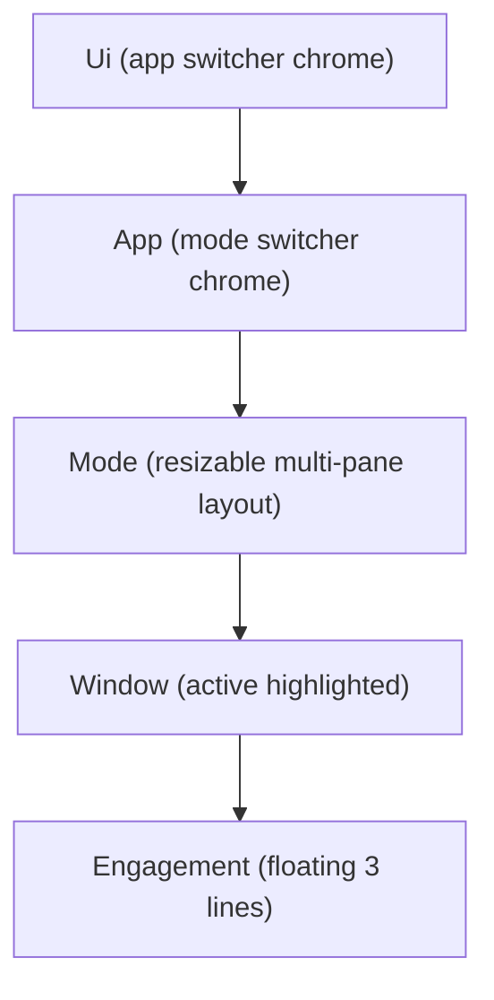

## Context

- The five names are not real components today. Only `Window` exists in `[elements/lib/react/core/index.tsx](elements/lib/react/core/index.tsx)` (region `🔍Window Components`, ~19473). `Ui`, `App`, `Mode`, `Engagement` do not exist.
- The actual shell is runtime/class-driven: `ProductView` in `[elements/lib/framework/renderer/react/index.tsx](elements/lib/framework/renderer/react/index.tsx)` and `PlaygroundView` in `[elements/lib/playground/react/index.tsx](elements/lib/playground/react/index.tsx)`, both building a navbar + Golden Layout `UICanvas` that portals panes into the `@elements/ui` `Window`.
- Runtime classes `ProductRuntime`/`AppRuntime`/`ModeRuntime`/`WindowKindRuntime` live in `[elements/lib/framework/core/index.ts](elements/lib/framework/core/index.ts)` (and a fork in `[elements/lib/playground/core.ts](elements/lib/playground/core.ts)`). These stay (framework = pure TS classes); only the React rendering is replaced.
- Stories live at repo root `[.storybook/stories/elements/ui/](.storybook/stories/elements/ui)` (e.g. `UI.stories.tsx`, `Window.stories.tsx`). Core has pure-React `ResizablePanelGroup`/`ResizablePanel`/`ResizableHandle` (~15215), `Navbar`/`Footer`, `ButtonGroup`, `ActionGroup`, `Toggle`, `Select`, `Input` — enough to build layout without Golden Layout.

## Target composition

All components are pure-React and props-driven, each renders its active child, and each also accepts `children` for manual composition.

## Component API (added to `elements/lib/react/core/index.tsx`)

- `Ui`: `apps: UiAppDescriptor[]`, `activeAppId: string`, `onActiveAppChange?`, plus optional `navbar`/`footer`/`toolbar` slots. Renders app-switcher chrome (reusing `ButtonGroup`) and the active `App`.
- `App`: `modes: AppModeDescriptor[]`, `activeModeId: string`, `onActiveModeChange?`. Renders mode-switcher chrome (reusing `Select`/`ButtonGroup`, shown only when `modes.length > 1`) and the active `Mode`.
- `Mode`: `windows: ModeWindowDescriptor[]`, `activeWindowId: string | null`, `onActiveWindowChange?`, `layout?: WindowLayoutNode`. Lays out all windows simultaneously via a recursive resizable tree (`ResizablePanelGroup`) built from `layout`; falls back to even split. Marks the focused window (active ring/border) and routes focus clicks to `onActiveWindowChange`.
- `Window` (extend existing `WindowConfig`): add `engagement?: EngagementSpec` and `active?: boolean`. Renders the existing body/controls/measures plus `<Engagement>` when `engagement` is set.
- `Engagement`: `options?: EngagementOption[]`, `input?: EngagementInput`, `status?: EngagementStatus[]`. A floating, three-line component: line 1 option buttons (`ButtonGroup`/`Toggle`), line 2 input (`Input` with `onSubmit`), line 3 status items. Positioned as a floating overlay inside the `Window` body (bottom-center), pointer-events enabled.

New pure-data types in core: `WindowLayoutNode` (`row`/`column`/`stack`/`window` with `size`), `EngagementOption`/`EngagementInput`/`EngagementStatus`, and the `*Descriptor` types above. All under a new region `// #region 🧭Ui App Mode` adjacent to the Window region, with emoji docstrings.

## Phases

### Phase 1 — Core components + stories (self-contained, testable in isolation)
Implement the five components, the layout engine, and types in `elements/lib/react/core/index.tsx`. Export them. Add inline `import.meta.vitest` tests in the same file (active-child switching, layout split, engagement line rendering). Add stories: new `Ui.stories.tsx`, `App.stories.tsx`, `Mode.stories.tsx`, `Engagement.stories.tsx` and extend `Window.stories.tsx` with an `engagement` story — all under `.storybook/stories/elements/ui/`, following the `Window.stories.tsx` convention (header region, `@elements/ui` import, `Meta`/`StoryObj`, `play` assertions where useful).

### Phase 2 — Rewire renderers to compose core components
Refactor `PlaygroundView` (`elements/lib/playground/react/index.tsx`) and `ProductView` (`elements/lib/framework/renderer/react/index.tsx`) so they subscribe to the runtime, map runtime state to the new descriptors (`resolveAppState` → `App`/`Mode`/`Window` props, window bodies via the `bodyKey` registry, measures/controls, app/mode lists), and render `<Ui apps=... activeAppId=...>`. Delete the Golden Layout `UICanvas`, `convertWindowLayout*`, portal plumbing, and the `golden-layout` dependency in both `package.json`s. Keep `ProductView`/`PlaygroundView` names and props so consumers stay stable; preserve panels/search/find/footer/mobile features by feeding them into `Ui`'s chrome slots.

### Phase 3 — Consumers, cleanup, validation
Verify/fix the consumers that only build runtimes + render the shell (mostly unaffected): `[spatial/js/renderer-r3f/play/main.tsx](spatial/js/renderer-r3f/play/main.tsx)`, `[elements/lib/board/index.tsx](elements/lib/board/index.tsx)`, `[elements/lib/react/scene/index.tsx](elements/lib/react/scene/index.tsx)`, `[elements/lib/react/topology/index.tsx](elements/lib/react/topology/index.tsx)`, and production `[compose/client/lib/sketchpad/js/index.ts](compose/client/lib/sketchpad/js/index.ts)`. Update `UI.stories.tsx` if shell internals changed. Remove now-dead Golden Layout CSS import in `[elements/lib/styling/js/elements.css](elements/lib/styling/js/elements.css)`. Run lint + vitest for `@elements/ui`, `@elements/framework-react`, `@elements/playground`, and the play bundles; build Storybook; confirm each play host renders (console-verify active-window focus and engagement).

## Ticket / process
Create a new repo ticket (`elements/react` scope) via repo MCP before edits; do not reuse the unrelated `SPATIAL-PLAY-FOUR-WINDOW-QUAD-LAYOUT` ticket. Multi-hour parts (Phase 2 framework vs playground; Phase 3 per-consumer) can be delegated to parallel generalists. No backwards-compat shims (`AppProps` alias and Golden Layout helpers get removed).

## Risks / decisions
- Production sketchpad uses the richer `ProductView` (URI bar, search, find, options/chat panels); these are preserved by mapping into `Ui` chrome slots rather than dropped.
- Replacing Golden Layout removes drag-to-dock/tab-rearrange; the quad/multi-pane resizable layout and active-window focus are kept. Layout persistence (`onLayoutChange`) is reimplemented against the pure-React `WindowLayoutNode` tree.
- Naming follows your spec (`activeWindowId`, `windows`); existing `activeWindowKindId` maps to `activeWindowId` at the renderer boundary.