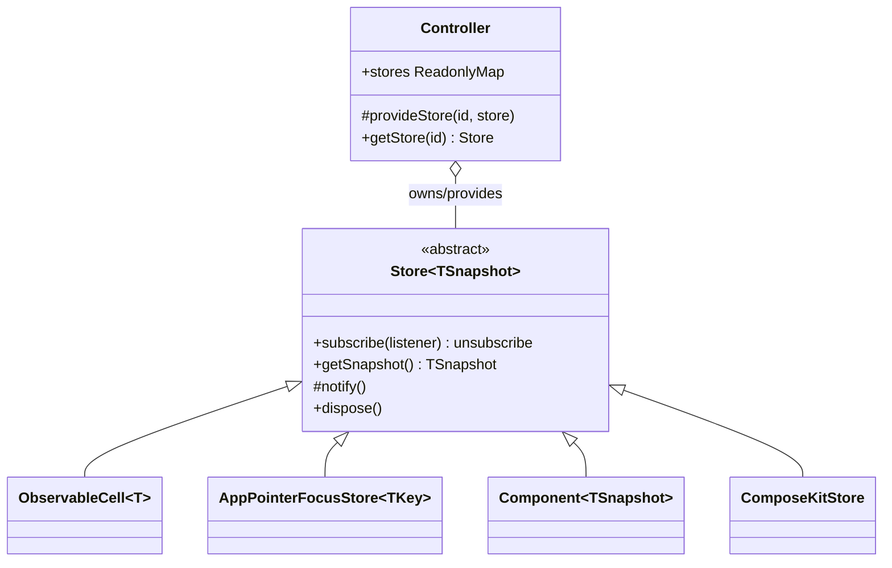

# Unified renderer-neutral Store abstraction

## Goal

Every framework (`core`, `platform`, `playground`) exposes one general way to provide state: an abstract `Store<TSnapshot>` base class that makes **no assumption about the backend** (memory, disk, db, websocket, WASM worker, or a mix). Products `provide` stores through their `Controller`s, and renderers bind through the controller. State is expressed as **pure derived classes**.

## The contract

The renderer-neutral denominator already present everywhere is `subscribe(listener) => unsubscribe` + a snapshot read (`getModel`/`getSnapshot`) + lifecycle `dispose`. We codify it once.

## 1. `@framework/core` — add `Store`, refactor primitives, extend `Controller`

In [framework/core/index.ts](framework/core/index.ts):

- New `//#region 🔖Store`: abstract `Store<TSnapshot>` with a private `listeners: Set<PlatformSubscriber>`, `subscribe(listener): () => void`, protected `notify()`, `dispose()` (clears listeners), and abstract `getSnapshot(): TSnapshot`. No backend coupling.
- Refactor `ObservableCell<T>` (currently lines ~324-349) to `extends Store<T>`; keep `get()/set()/update()` as the in-memory mutation API, implement `getSnapshot()` via the stored value, route mutations through `notify()`.
- Refactor `AppPointerFocusStore<TKey>` (lines ~362-435) to `extends Store<AppPointerFocusSnapshot<TKey>>`, removing the internal `cell` indirection (it becomes the store itself); `getSnapshot()` returns the focus snapshot.
- Extend `Controller` (lines ~457-479) with the **controller-owned store registry**: private `ownedStores: Map<string, Store<unknown>>`, `protected provideStore<T>(id, store): Store<T>`, `getStore<T>(id): Store<T> | undefined`, `get stores(): ReadonlyMap<...>`, and have `dispose()` also dispose every owned store.

## 2. `@framework/platform/core` — `Component` becomes a `Store`

In [framework/product/platform/core/index.ts](framework/product/platform/core/index.ts):

- `Component<TModel>` (lines ~288-320) → `Component<TSnapshot> extends Store<TSnapshot>`. Rename `getModel`→`getSnapshot`, `buildModel`→`buildSnapshot`, `TModel`→`TSnapshot`, drop the internal `modelCell` (the Component is the store), and update `refresh()`/`setModel` accordingly. This also removes the compose-forbidden term `model`.
- Delete the now-redundant `PlatformComponentEntry` interface in `@framework/core` (Component already *is* a `Store`); update `Platform.registerComponent`/`componentsBySurfaceId` typing to `Store`-based entries (it only needs `surfaceId` + the store contract). Update the `Table`/`Puzzle2d`/`Puzzle3d`/`Puzzle5d`/`Cad`/`Panel` subclasses' `buildModel`→`buildSnapshot`.

## 3. Renderers — bind through the controller/store

In [framework/product/platform/renderer/react/index.tsx](framework/product/platform/renderer/react/index.tsx) (and the playground renderer):

- Add a generic, exported `useStore<T>(store: Store<T>): T` hook wrapping `useSyncExternalStore(store.subscribe, store.getSnapshot, store.getSnapshot)`.
- Add `useControllerStore<T>(controller, id)` that resolves a controller-owned store and binds it via `useStore`.
- Replace `useComponentModel` (lines ~1411-1413) with `useStore`; update `getModel()` call sites to `getSnapshot()`.

## 4. Domain stores unified onto `Store`

- **sketchpad / compose-js (WASM worker)** in [compose/client/lib/sketchpad/js/index.ts](compose/client/lib/sketchpad/js/index.ts): replace the ad-hoc `KitHostStore` type + `setSketchpadKitRegistryBridge` (lines ~40-72) with a concrete `class ComposeKitStore extends Store<{ kit: Kit }>` that adapts the `@compose/js` `Session`/`Store` (the WASM web-worker backend). `@compose/js` stays below the framework, so this adapter lives in sketchpad and is `provideStore("kit", …)`-ed by `SketchpadShellController`. The local-UI state (the "stately"-style store in the example) is exposed as a second owned store (an `ObservableCell`/actor-backed `Store`), proving the "two stores, different backends, one product" case.
- **puzzle play products** ([puzzle/5d/play/index.ts](puzzle/5d/play/index.ts), [puzzle/3d/play/index.ts](puzzle/3d/play/index.ts)): the play packages depend on `@framework/playground/core`, so their Controllers `provideStore(...)` the existing domain stores. The lower-level `@puzzle/*/react` packages (`TopologyStore`, `Puzzle3dObjectStore`, `SnapshotStore`) do **not** depend on the framework; rename their `getModel`→`getSnapshot` for contract consistency and keep them as the backend that the play Controllers wrap into `Store`s. React providers (`TopologyStoreProvider`, `Puzzle3dObjectStateProvider`) read the controller-owned store.

## 5. Workflow / validation

- Open a repo-MCP ticket (read `repo://goals` first, associate, `ticket_open`) before editing; close it with a summary at the end.
- Run the affected vitest suites: `@framework/core`, `@framework/platform/*`, `@framework/playground/*`, sketchpad `js`, and the puzzle `play`/`react` packages. Confirm runtime behavior of the sketchpad dual-store and a puzzle play surface with `[DEBUG]` logs before removing them.

## Notes / decisions

- Snapshot read is named `getSnapshot()` everywhere (matches React `useSyncExternalStore`, removes the forbidden `model` term).
- No backwards-compat shims: `PlatformComponentEntry`, `getModel`/`buildModel`, and `KitHostStore` are removed, not aliased.