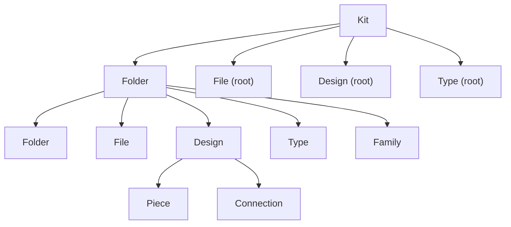

# Kit as a Constrained Virtual File System

## Concept

A kit is a constrained virtual file system. Model it as a single GraphQL interface `FileSystemNode` implemented by the 8 visible kinds, with computed projection fields. Weak entities (geometry/diff/modification) and `Side` are excluded. The existing `owner`/`owns` entity graph stays as-is; the VFS is a separate, constrained read projection plus reparenting writes.

### Node membership and constraints

- `Kit` -> root (`fileSystemParent = null`, `isFileSystemRoot = true`); children = top-level folders + unparented files/designs/types/families.
- `Folder` -> parent is its `Folder` or the `Kit`; children = its subFolders + files + designs + types + families.
- `File` / `Type` / `Family` -> parent is a `Folder` or the `Kit` (root); children = empty.
- `Design` -> parent is a `Folder` or the `Kit`; children = its pieces + connections (flat).
- `Piece` -> parent is always its `Design` (cannot be moved out); children = empty (the piece/connection document stays a separate concern from the VFS).
- `Connection` -> parent is always its `Design`; children = empty even though it owns two `Side`s.

## Layer 1 - GraphQL contract

Files: [schema.golden.graphql](compose/client/schema/graphql/schema.golden.graphql) (authoritative contract), regenerate [schema.graphql](compose/client/schema/graphql/schema.graphql).

- Add a `#region FileSystem` with:
  - `interface FileSystemNode implements Entity & Node` carrying the entity tail (`id`, `hash`, `owner`, `owns`) plus computed: `fileSystemParent: FileSystemNode`, `fileSystemChildren: FileSystemNodeConnection!`, `fileSystemChild(id: ID!): FileSystemNode`, `fileSystemPath: String!`, `fileSystemName: String!`, `isFileSystemRoot: Boolean!`, `fileSystemKind: FileSystemNodeKind!`.
  - `FileSystemNodeEdge` / `FileSystemNodeConnection` relay shells.
  - `enum FileSystemNodeKind { KIT FOLDER FILE DESIGN TYPE FAMILY PIECE CONNECTION }` (uses `kind`, not `type`, per repo rule).
- Add `FileSystemNode` to the `implements` list and append the new fields on `Kit` (l.8873), `Folder` (l.1705), `File` (l.1845), `Type` (l.5460), `Piece` (l.6792), `Connection` (l.6936), `Design` (l.8281), `Family` (l.1582).
- Write surface (existing mechanism): on the kit change-command object add `createFolder(name, path, ...)` and `moveToFolder(nodeId: ID!, folderId: ID)` (null `folderId` => root), plus the operation shells (`CreatedFolder` / `MovedToFolder` + `*Input` + `*Modifications`) mirroring the existing `CreatedDesign` / `DraggedPiece` operation families.

## Layer 2 - Rust store (code-first source of truth)

File: [lib.rs](compose/client/lib/rs/lib.rs) (single monolith; schema is generated from this).

- Folder membership storage (in `pub mod meta` / `pub mod kit`):
  - Give `Folder` (l.2113) the missing `name`/`icon` and an optional parent-folder id; give `File` (l.2071) an optional folder id; add an optional folder id to `Design` (l.3472) and `Type` (l.2725); add a minimal `Family` model with optional folder id.
- Interface + resolvers:
  - Add `FileSystemNodeInterface` async-graphql `Interface` enum over the 8 kinds next to `EntityInterface` (l.11663), and `FileSystemNodeConnection`/`Edge`.
  - Implement the 6 computed resolvers on each of the 8 `#[Object]`/`ComplexObject` impls following the constraint table above (Design children = pieces+connections via existing `pieces`/`connections`; Piece/Connection parent = owning `Design`; Kit/Folder children built from folder-membership maps).
  - Register the new interface/connection types in `build_schema_sync_for` (l.14865).
- Writes through existing mechanism:
  - Add `Operation::CreateFolder` and `Operation::MoveToFolder` variants with their `Scope`/`Input`, `to_diff`/`to_backwards`, applied to the live `KitGraph` via the documented `apply_kit_diff` / `apply_kit_state` path (no bespoke pathway).
  - Add `createFolder` / `moveToFolder` resolvers on the kit command object (next to `create_design`, l.14228) dispatching `Command::ApplyOperation` via `dispatch_wip_wait`.
- Regenerate and validate: run the export test `export_compose_graphql_schema_file` (via the graphql bundle build) and ensure `schema_matches_target_graphql_file` passes (golden strict).

## Layer 3 - compose/js thin client

File: [index.ts](compose/client/lib/js/index.ts) (single monolith; declarative `*_FIELDS` rosters + prototype install).

- Add a shared FileSystem field roster (selections: `fileSystemParent { id fileSystemKind }`, `fileSystemChildren { edges { node { id fileSystemKind } } }`, `fileSystemPath`, `fileSystemName`, `isFileSystemRoot`, `fileSystemKind`) and install it on `Kit`, `Folder`, `File`, `Design`, `Type`, `Piece`, `Connection`, and a new `Family` class. `fileSystemKind` drives construction of the correct entity subclass for parent/children.
- Finish the currently-stubbed `Folder` navigation (`subFolders`/`files`/`types`/`designs`) and add `Kit.folders` to `KIT_FIELDS`; add `Store.folder(id)`.
- Add `createFolder` and `moveToFolder` to `KIT_OPERATIONS` (mirroring the `createDesign` `buildInner` at l.1919) plus `declare` signatures and the auto-installed `on*Changed` subscriptions.

## Out of scope

`@semio-tech/compose-react` is currently a stub (`export {}`); no functional react work required. Sketchpad consumes `@semio-tech/compose-js` directly today, so no extra wiring needed for this change.

## Validation

- Extend the existing Rust tests (`#region Tests` in `lib.rs`) to cover: VFS resolvers per kind, root vs folder placement, design children = pieces+connections, connection children empty, piece parent = design, and the `createFolder`/`moveToFolder` operations (forward + backward diff). Confirm the schema-match test.
- Extend the embedded vitest in `index.ts` (gated by `COMPOSE_JS_RUN_EMBEDDED_TESTS=1`) to create a folder, move a design into it, and assert the projection end-to-end.
- Work inside a repo MCP ticket (open, associate with the most appropriate goal from `repo://goals`, close with a summary of touched files).

