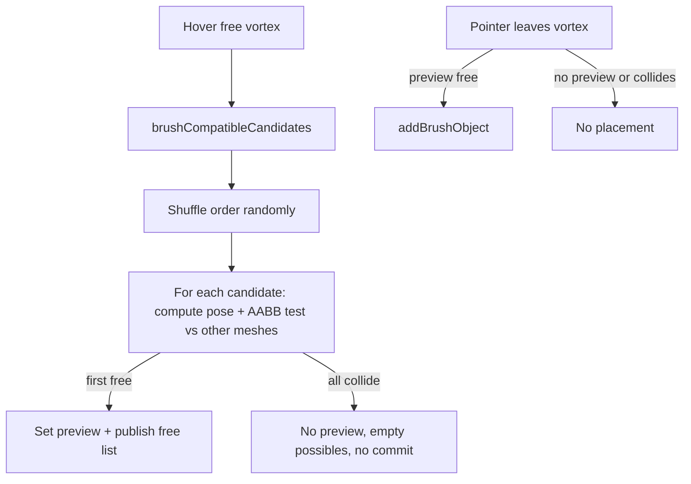

# Brush Collision-Free Suggestions

## Problem

The brush tool in `[puzzle/3d/react/index.tsx](puzzle/3d/react/index.tsx)` already has compatibility ranking (`brushCompatibleCandidates`), pose math (`computeBrushPlacementPose`), and scene AABB overlap (`brushPreviewCollides` + `boxesIntersect`). Engagement **suggestions** (`possibleEngagements` via `buildPuzzle3dPlayEngagement`) and commit behavior are **not** aligned with collision:

| Area                 | Current behavior                                                  | Required                                                         |
| -------------------- | ----------------------------------------------------------------- | ---------------------------------------------------------------- |
| Engagement possibles | All compatibility matches from `brushCompatibleCandidates`        | Only collision-free placements                                   |
| Initial preview      | Ranked index `0`, then reactive `onPreviewCollision` auto-advance | Random compatible order; try until collision-free                |
| Tab / Next           | Cycles full compatible list                                       | Cycles collision-free list only                                  |
| Commit on leave      | Always commits current preview                                    | Skip commit when preview collides or no free candidate           |
| Stack `… top`        | Skips auto-advance on collision                                   | Same collision rules (host still excluded via `excludeObjectId`) |

Relevant code today:

```5940:5943:puzzle/3d/react/index.tsx
      candidatesRef.current = brushCompatibleCandidates(targetCtx, props.kindCatalogs, props.kindCompatibility);
      indexRef.current = 0;
      applyCandidateIndex(fullId, 0);
      publishBrushEngagement();
```

```5837:5842:puzzle/3d/react/index.tsx
  const commitCurrentPreview = reactHostPort.useCallback(() => {
    const preview = puzzle3dBrushUiStore.getSnapshot().preview;
    if (!preview || !props.onBrushPlace) {
      return;
    }
    props.onBrushPlace(brushPlacePayloadFromPreview(preview));
```

## Target behavior (confirmed)



- **Collision target**: new mesh AABB vs all scene object groups except the host object at the vortex (`excludeObjectId` — already passed to `BrushPreviewGhost`).
- **Random try order**: on each `enterTarget`, shuffle the compatible list once (e.g. Fisher–Yates in the `Brush` region), then walk that order for the first free placement and when building the free subset.
- **No placement**: if no candidate is collision-free after mesh-backed checks, clear preview, publish empty `candidates`, do not call `onBrushPlace` on leave.

## Implementation

### 1. Repo ticket

- Read `repo://goals` when MCP is available; associate with running-sketchpad goal (same as `[BRUSH-VORTEX-TOUCH-PLACEMENT](.repo/🎫/26/06/01/BRUSH-VORTEX-TOUCH-PLACEMENT/ticket.json)`).
- **Reopen** `[PUZZLE-3D-BRUSH-TOOL](.repo/🎫/26/05/31/PUZZLE-3D-BRUSH-TOOL/ticket.json)` or open `BRUSH-COLLISION-FREE-SUGGESTIONS` under `26/06/01` if that ticket is considered closed scope.

### 2. Pure helpers in `//#region Brush` (`[puzzle/3d/react/index.tsx](puzzle/3d/react/index.tsx)`)

- `**shuffleBrushCompatibleCandidates(candidates)`\*\* — non-mutating random permutation (injectable RNG in tests).
- **Export `brushPreviewCollides`** (or `brushPlacementCollides`) so vitest can cover it without React.
- `**brushProbeGroupFromPreview(preview, meshRoot)**` — apply `applyObjectPose` + `updateWorldMatrixChain` on a disposable `Group` with a cloned mesh.
- `**brushCandidateCollidesAtPose(reg, preview, excludeObjectId, meshRoot?)**` — uses `brushPreviewCollides`; if catalog GLB is not yet in `styledMeshTemplates` / pool, return `null` meaning **unknown** (not free).
- `**brushCollisionFreeCandidates(args)`\*\* — given shuffled compatible list + target world/context + `kindCatalogs`, returns `{ free, unknownPending }` by probing each candidate’s `brushPreviewFromCandidate` pose.

Mesh probe source: reuse `**styledMeshTemplate(url, "highlighted", gltf.scene, false)**` when the URL is already pooled (same path as `MeshBody`); avoids mounting N ghosts. When `unknownPending`, keep reactive reconciliation (below).

### 3. `BrushSession` refactor (`[puzzle/3d/react/index.tsx](puzzle/3d/react/index.tsx)` ~5801–6020)

Split refs:

- `compatibleCandidatesRef` — full compatibility set (for re-probe when meshes load).
- `placementCandidatesRef` — collision-free subset; **only this** is published to `puzzle3dBrushEngagementSourceRef.candidates` and stored on `BrushUiSnapshot.candidates`.

`**enterTarget`:\*\*

1. `compatible = brushCompatibleCandidates(...)`.
2. `order = shuffleBrushCompatibleCandidates(compatible)`.
3. `free = brushCollisionFreeCandidates(...)` (sync pass).
4. `placementCandidatesRef = free`; `indexRef = 0`.
5. If `free.length === 0`: set `preview: null`, publish empty engagement, **no** `applyCandidateIndex`.
6. Else: `applyCandidateIndex` for `free[0]`.

**Remove** `collisionAdvanceCountRef` / `collisionHandledPreviewKeyRef` and the stack-top early-return in `onPreviewCollision` (replace with reconciliation).

`**reconcilePlacementCandidates` (new):\*\* called from `BrushPreviewGhost` when collision state or mesh load changes:

- Re-run `brushCollisionFreeCandidates` over stored shuffled order.
- Update `placementCandidatesRef`; if current preview’s candidate is no longer in `free`, switch to first free or clear.
- `publishBrushEngagement()`.

`**advanceCandidate` / `retreatCandidate` / `pickCandidate`:\*\* index into `placementCandidatesRef` only.

`**commitCurrentPreview`:** guard with `previewCollidesRef` (maintained by ghost) **or\*\* synchronous re-probe; abort if colliding or `placementCandidatesRef` empty.

`**BrushPreviewGhost`:\*\* on collision change, call `reconcilePlacementCandidates` instead of blind `advanceCandidate()`.

### 4. Engagement UX (`[buildPuzzle3dPlayEngagement](puzzle/3d/react/index.tsx)` ~5463)

- When `brushTargetActive && placementCandidates.length === 0`, add status line e.g. `"No collision-free placement at this connector"`.
- Hint text: clarify Tab cycles **collision-free** alternatives only.
- No play-controller changes required: `[puzzle/3d/play/index.ts](puzzle/3d/play/index.ts)` already delegates to `puzzle3dBrushEngagementSourceRef`.

### 5. Tests (extend existing vitest block in `[puzzle/3d/react/index.tsx](puzzle/3d/react/index.tsx)`)

- `shuffleBrushCompatibleCandidates` — deterministic with seeded RNG.
- `brushPlacementCollides` — two `Group`s with box geometry, overlap / non-overlap.
- `brushCollisionFreeCandidates` — mock registry `collectObjectGroups` + pooled mesh template or stub `meshRoot`.
- `buildPuzzle3dPlayEngagement` — empty `brushCandidates` + `brushTargetActive` shows no brush possibles (tool possibles only).
- Optional: adjust `brushCompatibleCandidates prefers Tambour…` test — ranking remains for compatibility order before shuffle; document that initial pick is random among free, not rank-first.

### 6. Validation

- Run existing puzzle3d react vitest block and play tests (`nx` / `bun` per project scripts).
- Manual play: hover connector with crowded vs empty neighborhood; confirm engagement list excludes colliding kinds, Tab only cycles free kinds, leaving vortex places nothing when all collide.
- `[DEBUG]` logs during manual pass (remove before ticket close).

## Files touched

| File                                                                                                             | Change                                                                       |
| ---------------------------------------------------------------------------------------------------------------- | ---------------------------------------------------------------------------- |
| `[puzzle/3d/react/index.tsx](puzzle/3d/react/index.tsx)`                                                         | Brush region helpers, `BrushSession`, `BrushPreviewGhost`, engagement status |
| `[framework/product/playground/renderer/react/index.tsx](framework/product/playground/renderer/react/index.tsx)` | No change expected (already wires `brushSource.candidates`)                  |
| `[puzzle/3d/play/index.ts](puzzle/3d/play/index.ts)`                                                             | Tests only if engagement empty-state behavior needs assertion                |

## Out of scope

- Catalog AABB metadata (would avoid GLB load dependency; not needed if pool + reconcile handles async load).
- Right-click context menu from the original brush plan (never landed in code).
- Changes to compatibility ranking in `brushCompatibleCandidates` (shuffle happens after rank).
