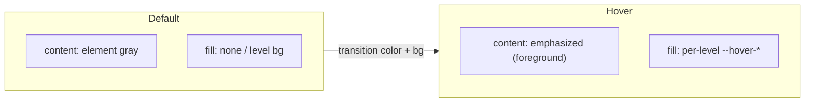

# Normal-Border Default Theming

## Design model

Today most components default content to `text-foreground` (the high-contrast emphasized ink), and hover only changes the per-level background.

New model (keep the per-level mechanism, invert the content emphasis):

- Default content (text / icons / SVG stroke / node stroke + label) = normal-border gray = `--color-element` (`= --border-normal-color = --color-gray`).
- On hover: background fills with the element's existing per-level color (`--hover-base/window/panel/...`) AND content flips to emphasized `--color-emphasized` (`= --border-emphasized-color = --foreground`), with a smooth `transition` on `color` + `background-color`.
- Active / selected (accent) states are unchanged.

No new tokens are required: `text-element` (`--color-element`) and `text-emphasized` (`--color-emphasized`) already exist in the `@theme inline` block of [ui/styling/js/ui.css](ui/styling/js/ui.css) (lines ~808-810). `--foreground` stays meaning "emphasized ink" so all derived tokens (`--accent-foreground`, `--border-emphasized-color`, prose, etc.) remain correct.

## Layer A - Global CSS ([ui/styling/js/ui.css](ui/styling/js/ui.css))

- Extend the existing per-level hover rules (the `[data-slot="navbar"]/[data-slot="footer"]/[data-slot="toolbar-zone"] [data-level="..."]:hover` blocks, ~lines 854-879) to also set `color: var(--border-emphasized-color)` so content flips to emphasized on hover at every level.
- Ensure those interactive elements carry a `transition: color, background-color` so the fill "smoothly blends" (the toolbar item rule already exists; add the transition where missing).
- Tree/side-panel row hovers (`hover:bg-hover-panel` etc.) get the matching content flip via Layer B.

## Layer B - Core components ([ui/react/index.tsx](ui/react/index.tsx))

Swap the leading default `text-foreground` -> `text-element` in the interactive/content base class constants and add the hover flip:

- Centralize the hover flip in `getLevelHoverClass` (~~line 3226): append `hover:text-emphasized` to each returned class, and mirror it in the inline per-level hover maps inside the icon-button/action/button/toggle variants (~~lines 4919-4926, 5123-5127, 5152-5159, 6810-6817).
- Change default content color `text-foreground` -> `text-element` for: icon button base (4919), large icon button (5123), button base (5152), toggle base (6810), tabs trigger (8122), menu/dropdown items (996, 6104, 11945), inputs (5734, 5912, 6755).
- Tree + side-panel text (the surfaces the user called out): `text-foreground` -> `text-element` with row-level emphasis on hover via `group-hover:text-emphasized` / row `hover:text-emphasized`: tree label (4221), `treeItemLabelSlotClassName` (8524), `windowMeasureTreeLeafLabelClass` (3537), control-tree label (11466), `window-measures-title` (11707), tree drag-handle hidden class (9297).
- Leave genuinely emphasized inline content as emphasized: `<strong>`, `<code>`, active labels, `data-[state=on]`/selected accent states, and the emphasized shell strokes (`borderEmphasizedClass`, panel frame) stay on `--foreground`.

## Layer C - Vello graph palette (flow / dag nodes)

- [ui/styling/js/resolve.ts](ui/styling/js/resolve.ts) `serializeGraphVelloThemePaletteJson()`: change defaults from emphasized to normal-border gray and add hovered emphasis:
  - `nodeStroke`, `handleStroke`, `labelFill` -> `themeColorVar("element")` (gray) instead of `emphasized`/`foreground`.
  - `nodeStrokeHovered`, `handleStrokeHovered` -> `themeColorVar("emphasized")`; `nodeFillHovered`/`handleFillHovered` keep the per-level `hover-panel`.
  - Add a new `labelFillHovered` field -> `emphasized`.
- Rust palette + renderer must learn the hovered label color:
  - [mathematical/graph/port/directed/types.rs](mathematical/graph/port/directed/types.rs): add `label_fill_hovered: Color` to `VelloThemePalette` (~~line 307), its `merge_color_field("labelFillHovered")` (~~line 368), and a sensible default (~line 603).
  - The node/label draw path in [mathematical/graph/port/directed/dag/lib.rs](mathematical/graph/port/directed/dag/lib.rs) and [mathematical/graph/port/directed/normal/board_host.rs](mathematical/graph/port/directed/normal/board_host.rs) selects `label_fill_hovered`/`node_stroke_hovered` when a node is hovered.
  - Verify [puzzle/2d/rs/lib.rs](puzzle/2d/rs/lib.rs) and [gis/map/rs/lib.rs](gis/map/rs/lib.rs) consumers compile against the extended struct.

## Layer D - Downstream sweep (tech renderers)

Replace default-content `text-foreground` with `text-element` (+ hover emphasis where interactive), keeping intentional emphasis (`<strong>`, `<code>`, active states):

- [cad/js/renderer/index.tsx](cad/js/renderer/index.tsx) (panel/aside/list defaults, attribute/stat/property body text; keep `<code>`/`<strong>` emphasis), [cad/js/renderer/play/index.tsx](cad/js/renderer/play/index.tsx).
- [puzzle/3d/react/index.tsx](puzzle/3d/react/index.tsx) (menu content base), [puzzle/2d/react/index.tsx](puzzle/2d/react/index.tsx).
- [framework/product/platform/renderer/react/index.tsx](framework/product/platform/renderer/react/index.tsx) (measure rows, active/inactive tab text), [framework/product/playground/renderer/react/index.tsx](framework/product/playground/renderer/react/index.tsx).
- [procedural/react/index.tsx](procedural/react/index.tsx), [infinite/world/r3f/index.tsx](infinite/world/r3f/index.tsx), [compose/client/lib/sketchpad/js/index.ts](compose/client/lib/sketchpad/js/index.ts) and the sketchpad play surface.
- Exclude other technologies (`coda`, `mit-bestand`) per the no-mixing rule.

## Verification

- Run the `@ui` and affected tech vitest suites (including the `serializeGraphVelloThemePaletteJson` test, which must assert the new `labelFillHovered` field) and `cargo`/wasm build for the graph crates.
- Launch the flow and a couple of play pages, hover navbar toggles, window-options toggles, tree rows, and flow nodes; confirm via runtime that resting content is gray and hover fills the level while content turns emphasized with a smooth blend.

## Repo workflow

- Open a new ticket via the repo MCP (read `repo://goals` first to associate the most fitting goal) before editing; keep any temp logs/screens inside the ticket folder; close it with a summary and file list when done.

