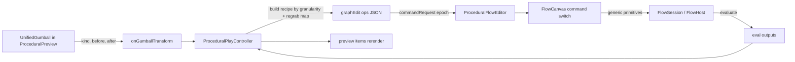

# Gumball To Flow

## Goal

In the procedural 3D preview, show a Rhino-style gumball on the selected geometry. Dragging a handle inserts the correct transform node(s) into the flow graph (`move -> brep.xform.translate`, `rotate -> brep.xform.rotate`, `scale -> brep.xform.scale`), rewires the graph between the geometry node and its consumers, incrementally makes space in the layout, and re-uses/updates the nodes on subsequent drags. A window option controls how granular the generated nodes are (compact params vs. full sliders + vector).

## Architecture / data flow

The preview pane and flow pane are separate windows sharing the procedural play controller. The gumball lives in the preview; mutations reach `FlowSession` via the existing `commandRequest` epoch channel.

## Decisions (from clarification)

- Scope: all three ops (translate, rotate, scale).
- Granularity: configurable via a preview "Transform Detail" window. Levels: `compact` (value baked into node `params`, no extra widgets) and `full` (per-component `inputSlider` -> `brep.vector` -> `brep.xform.translate`; scalar slider -> rotate/scale). Designed as an enum so more levels can be added.
- Re-grab: dragging the same (already-generated) transform updates its sliders/params in place (no new nodes).
- Spacing: incremental local shift, not global `reorganize`.

## 1. Flow generic primitives (Rust) — [flow/core/lib.rs](flow/core/lib.rs)

Add generic, brep-agnostic primitives inside a new `#region GumballEditing` (FlowHost) with matching WASM bindings on `FlowSession`, plus tests in the existing test region:

- Optional explicit id on `WidgetDescriptor` so the client can pre-generate deterministic ids (lets a batched op list reference created nodes). `add_widget` uses it when present.
- `insert_between(anchor_id, anchor_out_port, mid_id, mid_in_port, mid_out_port)`: repoint every synapse leaving `(anchor, anchor_out_port)` to start from `(mid, mid_out_port)`, then connect `anchor -> mid_in_port`. Cycle-checked via existing `would_create_cycle`.
- `make_space(anchor_id, dx, dy)`: shift `layout` of all widgets with `x > anchor.x` by `dx` (and optionally `y`) to open a column for inserted nodes.
- `set_neuron_params(widget_id, params_json)`: set/merge a `Widget::Neuron.params` dict (for compact mode and value updates). Re-uses `input.merge(neuron.params)` eval path confirmed at [neural/engine/lib.rs](neural/engine/lib.rs) line 278.
- Reuse existing `set_slider_value`, `toggle_preview`/`set_preview_off`, `move_widget`.

WASM: expose the new methods in the `#[wasm_bindgen]` `FlowSession` impl (alongside `add_widget`/`connect_ports` at lines ~1714-1748). Rebuild the flow_core wasm artifact after changes.

## 2. Flow batched command (TS) — [flow/react/index.tsx](flow/react/index.tsx)

- Extend `FlowCanvasCommandRequest` and the command `switch` (near line 2097, where `togglePreview` lives) with a generic `graphEdit` case that executes an ordered op list `[{op:"addWidget"|"connectPorts"|"disconnect"|"insertBetween"|"moveWidget"|"makeSpace"|"setPreviewOff"|"setSliderValue"|"setNeuronParams"}]` against `session`, then `evaluate()`. This stays generic (no brep names) so it lives correctly in the flow layer.

## 3. Gumball in the preview — [procedural/react/index.tsx](procedural/react/index.tsx)

- In `ProceduralPreview`, when exactly one geometry item is selected, render `UnifiedGumball` (from `ui/react`) at the item pivot computed from `worldBoundsForPreviewItem` (line 941) center, targeting a proxy `Object3D`.
- `onDragEnd(kind, before, after)`: map handle `kind` -> op (`translate|rotate|scale`), compute the world-space delta (offset vector / axis+angle / factor) relative to the pivot, and forward `{ widgetId, op, delta }` plus the current granularity to `onGumballTransform` (new prop).
- Guard canvas selection while a handle is active (reuse `gumballPointerConsumesCanvasEventRef` pattern from puzzle/cad).

## 4. Granularity window — [procedural/react/index.tsx](procedural/react/index.tsx)

- Add a small "Transform Detail" popover/window in the preview overlay bound to controller state (`compact` | `full`). Default `full`. Passed down to the gumball callback so the controller can build the right recipe.

## 5. Recipe builder + regrab + dispatch — [procedural/play/index.ts](procedural/play/index.ts)

- New controller command `applyGumballTransform({ widgetId, op, delta, granularity })` that:
  - Maintains a `Map<sourceWidgetId, { transformId, valueWidgetIds }>` of gumball-generated nodes.
  - Re-grab/update: if `widgetId` is a transform we generated for `op`, build a `graphEdit` recipe of `setSliderValue`/`setNeuronParams` ops that compose the new delta into existing values (no new nodes).
  - Insert: otherwise generate deterministic ids and a `graphEdit` recipe:
    - `full` translate: 3 `inputSlider` (x/y/z) -> `brep.vector` -> `brep.xform.translate`; rotate/scale: one `inputSlider` -> `angle`/`factor`.
    - `compact`: single `brep.xform.<op>` with `params` (`offset`/`angle`/`factor`).
    - `insertBetween(widgetId, "geometry", transformId, "geometry", "geometry")`, `setPreviewOff([widgetId])`, preview on transform, `makeSpace(widgetId, columnWidth)` and `moveWidget` to place the new column + value widgets.
  - After dispatch, set selection to the new transform id so the next drag re-grabs it.
- Emits the recipe through the existing `commandRequest` state (epoch++), already forwarded to `ProceduralFlowEditor`.

## 6. Playground wiring — [framework/product/playground/renderer/react/index.tsx](framework/product/playground/renderer/react/index.tsx)

- Pass the new `onGumballTransform` from the preview pane into the controller, and ensure the controller's `commandRequest` reaches `ProceduralFlowEditor` (it already accepts `commandRequest`, line ~1573/1636 in `procedural/react`).
- Register any new launch/build entries only if a new executable command is introduced (expected: reuse existing flow wasm build task; verify in `launch.json`).

## 7. Validation

- Rust unit tests in [flow/core/lib.rs](flow/core/lib.rs) for `insert_between` (downstream rewire + anchor connect), `make_space` (x-shift), `set_neuron_params` (eval picks up params), and a translate-insert round trip via fixture JSON.
- Runtime check with `[DEBUG]` logs: drag move -> confirm translate (+vector+sliders) inserted, downstream rewired, preview shows moved geometry, and a second drag updates sliders rather than adding nodes. Confirm rotate/scale analogously.

## Notes / constraints

- Keep brep kind names (`brep.xform.*`, `brep.vector`) only in `procedural`; `flow` stays generic.
- Edit existing files with regions/subregions; extend existing tests (no new test files); no migrations.
