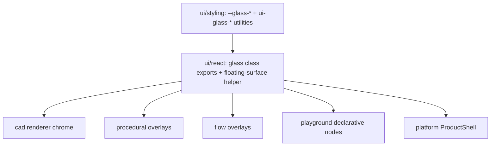

# Unify Glass UI Style

## Recommendation (the "unsure" question)

The canonical glass style already exists and lives in the shared design system, not in CAD:

- CSS utilities `ui-glass-panel | ui-glass-toolbar | ui-glass-menu | ui-glass-window-options` plus the `--glass-*` tokens in [ui/styling/js/ui.css](ui/styling/js/ui.css) (lines ~143-150, ~1298-1352).
- React glass-tier exports (`glassPanelClass`, `glassMenuClass`, `panelGlassFrameClass`, `getGlassSurfaceClass`, `GlassTierProvider`) in [ui/react/index.tsx](ui/react/index.tsx) (~988-1018, ~3387-3400).

The glassy CAD windows the user likes come from `ProductShell` (side panels/toolbars/window-options rail) wrapping the CAD canvas. The actual "modifications" that break "exactly the same styling" are local chrome that bypasses these utilities:

- CAD standalone editor chrome `cadChrome*` uses opaque `bg-popover` / `bg-panel` instead of glass ([cad/js/renderer/index.tsx](cad/js/renderer/index.tsx) ~2002-2008, used ~5728/5761/5809).
- Procedural preview overlay uses hardcoded `zinc-*` and a literal `#18181b` canvas background ([procedural/react/index.tsx](procedural/react/index.tsx) ~846-849, ~1489-1494).

So: keep `@ui` glass as the single source of truth, delete bespoke surfaces, and route every UI through the shared glass classes/tokens.

## Plan

### 1. Establish/confirm shared floating-surface helpers in @ui/react
- Confirm there is a single exported helper for floating menus/popovers backed by `ui-glass-menu` and for aside panels backed by `panelGlassFrameClass`. If a popover surface helper is missing, add one in [ui/react/index.tsx](ui/react/index.tsx) under the existing glass region (reuse `getGlassSurfaceClass`, `borderNormalClass`). No new files.

### 2. CAD: replace `cadChrome*` opaque chrome with shared glass
- In [cad/js/renderer/index.tsx](cad/js/renderer/index.tsx): replace `cadChromePopoverClass`/`cadChromeMenuButtonClass` (selection menu ~5726, suggestions popover ~5809) with the shared glass-menu surface + menu-item classes from `@ui/react`.
- Replace `cadChromePanelAsideClass` (`bg-panel`, ~5761) with the shared `ui-glass-panel` + `panel-chrome-frame` pattern so the aside matches `ProductShell` side panels.
- Remove the now-unused `cadChrome*` constants (greenfield: no compatibility shims).

### 3. Procedural: remove hardcoded colors, use tokens + glass
- Transform-detail overlay (~846-855): swap `border-zinc-700 bg-zinc-950/90 text-zinc-100` and the inner `select` for the shared glass-menu surface + semantic token text/border classes.
- Container `bg-zinc-900` (~1489) -> `bg-canvas`.
- `WorldCanvas background="#18181b"` (~1494) -> resolved token hex via `@ui/styling` (mirror CAD's `SpatialSceneColorPalette` / `resolveSemanticColorHex` approach in [cad/js/renderer/index.tsx](cad/js/renderer/index.tsx) ~1903-1977) so dark/light themes track the design system.

### 4. Flow: audit + align overlays
- Flow HTML overlays already use semantic tokens; verify the context menu/search palette route through the shared glass-menu surface (via `ContextMenuController` in `@ui/react`) and that the canvas container uses `bg-canvas` ([flow/react/index.tsx](flow/react/index.tsx) ~2900). Fix any stragglers to the shared classes.

### 5. Playground/platform: confirm parity
- Spot-check declarative `UiNode` chrome in [framework/product/playground/renderer/react/index.tsx](framework/product/playground/renderer/react/index.tsx) (~688-712 buttons/sections using `bg-background`/`border-border`) and `ProductShell` in [framework/product/platform/renderer/react/index.tsx](framework/product/platform/renderer/react/index.tsx). These already share the system; only adjust if they visibly diverge from the glass surfaces.

### 6. Verify at runtime
- Run the CAD, procedural, flow, and playground/platform play harnesses; visually confirm panels/menus/toolbars render identical frosted glass in both light and dark themes. Per repo rules, confirm via running harness (not assumptions).

## Notes
- Per workspace rules: do this inside a repo MCP ticket (open/reopen first), edit existing files only, structure additions with regions, no extra files, no migrations/adapters.
- Greenfield: delete divergent local styling outright rather than layering overrides.