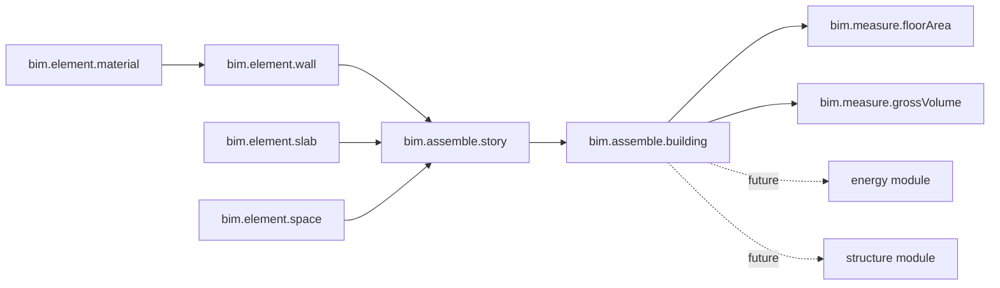

# Procedural BIM Module

## Design decisions (made; not asked)

- Representation: semantic data-only building model (parametric dictionaries), no brep-kernel coupling. Rationale: `flow_core` links exactly one brep kernel and cross-module geometry handle sharing is non-trivial; downstream `energy`/`structure` will consume the semantic model. Building previews as text/JSON (already supported by the flow preview). A future `bim.toGeometry` can add 3D rendering later.
- Scope: schemas `material`, `space`, `wall`, `slab`, `column`, `window`, `story`, `building`; element constructors; assembly operators (`story`, `building`); measure operators (`floorArea`, `grossVolume`) to prove how energy/structure will read the model.
- Template: the kernel-free `math` module, not `brep`.
- Capability convention: each element constructor declares `produces: &["<schema>", "element"]`; assembly inputs use `ChannelSpec::requires("...", &["bim.element.wall"])` (an element-producer token) so any element connects, mirroring brep's pattern. `bim.assemble.story` produces `["story"]`, `bim.assemble.building` produces `["building"]`, measure inputs require a `bim.assemble.building` token.

## 1. New crate `flow/modules/bim/`

Create mirroring `flow/modules/math/`:

- `Cargo.toml`: package `flow_module_bim`, `crate-type = ["rlib","cdylib"]`, `default = ["standalone-wasm"]`; deps `flow_module_wasm`, `neural_engine`, `serde_json` (+ `serde` derive); wasm32 target dep `wasm-bindgen` (optional). No geometry/brep deps.
- `package.json`: name `@semio-tech/flow-module-bim`, `bundleKind: "library"`, `wasm` script `bun nx run @semio-tech/flow-module-bim:wasm`, directory `flow/modules/bim`.
- `project.json`: nx `wasm` target running `bun ./script.ts wasm` with `cwd flow/modules/bim`.
- `script.ts`: `WasmScript` via `runWasmPackWebBuild` with `wasmBaseName: "flow_module_bim"`, pkg files `flow_module_bim*`.
- `lib.rs`: structured with regions (mirroring `flow/modules/math/lib.rs`):
  - `#region Schemas`: `Schema` for `material` (name/density/conductivity/strength), `space` (name/area/height), `wall` (length/height/thickness), `slab` (width/depth/thickness), `column`/`window`, `story` (elevation/height + nested `elements`/`spaces` list), `building` (name + nested `stories` list). Use `FieldSpec::new(..., ValueType::Text/Decimal)` and `ValueType::List(...)`/`ValueType::Schema(...)` for nested members.
  - `#region Elements`: `Operation` impls + constructors `bim.element.material/space/wall/slab/column/window`, each `produces` its schema + `"element"`.
  - `#region Assembly`: `bim.assemble.story` (variadic `elements` via `VariadicSpec` slot + optional `slab`, produces `story` dict embedding a `list` of children), `bim.assemble.building` (variadic `stories`, produces `building`).
  - `#region Measure`: `bim.measure.floorArea` and `bim.measure.grossVolume` reading a `building` dict, producing `number`.
  - `#region Tests`: extend in-file `mod tests` (constructors, assembly nesting, measure math, `build_manifest_json` lists `bim.*`, `evaluate_json`).
  - `#region WasmExt`: `manifest/evaluate/command/activate/deactivate` like `math`.

## 2. Rust workspace + flow_core wiring

- Root `[Cargo.toml](Cargo.toml)` `members`: add `"flow/modules/bim"`.
- `[flow/core/Cargo.toml](flow/core/Cargo.toml)`: add `flow_module_bim = { path = "../modules/bim", default-features = false }`.
- `[flow/core/lib.rs](flow/core/lib.rs)` `flow_registry()` (around line 1024): add `flow_module_bim::register(&mut registry);`.

## 3. TS host wiring `flow/react/index.tsx`

- VITEST init block (lines 20-43): add `initBimSync` import + `initBimSync({ module: readFileSync(.../flow_module_bim_bg.wasm) })`.
- `FLOW_MODULE_LOADERS` (line 202): add `bim: () => loadFlowWasmModule(import("../modules/bim/pkg/flow_module_bim.js"), import("../modules/bim/pkg/flow_module_bim_bg.wasm?url"))`.
- `FLOW_DEFAULT_MODULE_IDS` (line 213): append `"bim"` so it activates in flow + procedural (consistent with `brep`).

## 4. Build/test scripts (add `"bim"` to module lists)

- `[flow/play/script.ts](flow/play/script.ts)`: `moduleWasmScripts` (line 17) + `TestScript` cargo `-p flow_module_bim` (line 60).
- `[procedural/play/script.ts](procedural/play/script.ts)`: `moduleWasmScripts` (line 16).
- `[procedural/react/script.ts](procedural/react/script.ts)`: `moduleWasmScripts` (line 7).

## 5. Vitest/Vite aliases (consistency with `@flow/module-*`)

- `[flow/react/vitest.config.ts](flow/react/vitest.config.ts)`, `[procedural/react/vitest.config.ts](procedural/react/vitest.config.ts)`, `[procedural/play/vitest.config.ts](procedural/play/vitest.config.ts)`: add `@semio-tech/flow-module-bim` -> `flow/modules/bim/pkg/flow_module_bim.js`.
- `[procedural/play/vite.config.ts](procedural/play/vite.config.ts)`: add `@semio-tech/flow-module-bim` alias.

## 6. launch.json

- `[.vscode/launch.json](.vscode/launch.json)`: add `🛠️dev🌊flow🦀module-bim` entry (`bun nx run @semio-tech/flow-module-bim:wasm`, group `3_dev`, order `171.565` between brep `171.56` and test `171.6`); add `flow_module_bim` to the `🛠️dev🌊flow🦀test` cargo command (line 901).

## 7. Ticket + validation (implementation)

- Open a repo MCP ticket (read `repo://goals` first, associate the best goal) before edits; keep temp files inside the ticket folder; close with summary at the end.
- Validate: `cargo test -p flow_module_bim -p flow_core` and the procedural/flow vitest suites; confirm `bim.*` operators appear in `host.catalogueSections()` and evaluate end-to-end (build wall -> assemble story -> assemble building -> measure floorArea) with runtime output.

## Data flow

