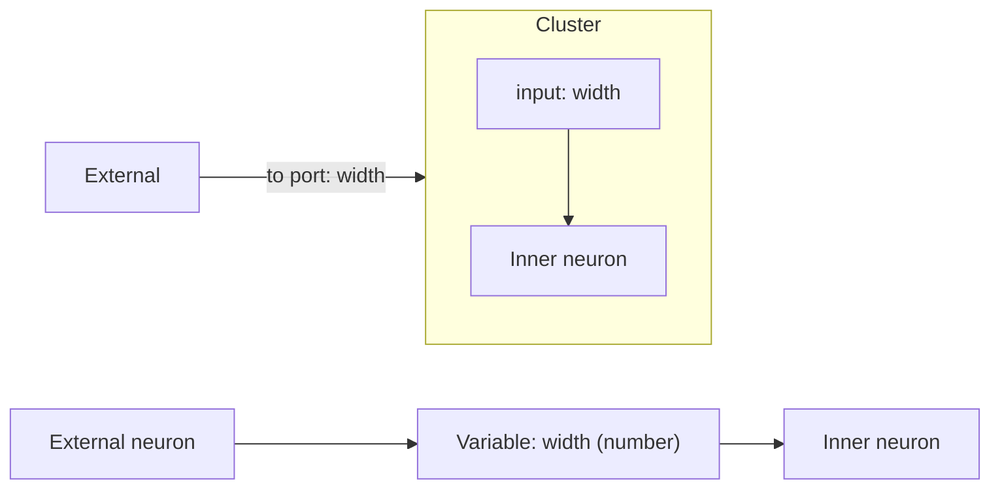

# Flow Variables

## Concept

A **variable** is a named, single-schema dictionary. Runtime: a typed **relay** neuron (one input port, one output port) that forwards a dictionary of its fixed schema. On **collapse**, variables become the cluster's named ports:

- a selected variable with an **external incoming** edge becomes a cluster **input** (named by the variable, typed by its schema);
- a selected variable with an **external outgoing** edge becomes a cluster **output**;
- every crossing edge **not** already going through a variable is **auto-wrapped** with a freshly generated variable (schema inferred from the edge), replacing today's anonymous `__in_N`/`__out_N` neurons.

Schema is **inferred from the connection by default**, but user-overridable via a picker.

## Design decision (contract representation)

Reuse the existing `INPUT_KIND`/`OUTPUT_KIND` boundary-neuron contract inside cluster trees (so `Tree::contract` in [neural/engine/lib.rs](neural/engine/lib.rs) keeps working), but enrich each boundary neuron's `channel`/`operators` params from the variable's `name`/`schema`. A boundary-crossing `Variable` widget is converted to an input/output boundary neuron on collapse and back to a `Variable` widget on explode.

## 1. Neural engine ([neural/engine/lib.rs](neural/engine/lib.rs))

- Add `Registry::schema_ids()` (and a small `(id, name, icon)` accessor) over the existing `schemas` map so the GUI can populate the schema picker.
- No change to `Tree::contract`; `contract_channel` already reads `channel` + `operators` params (lines 584-600). Typed contract comes from setting `operators = [schema]`.

## 2. Core module ([flow/module/core/lib.rs](flow/module/core/lib.rs))

- Register a `core.variable` operator: an identity relay forwarding its single input channel to its output channel (modeled like `Unpack` in [flow/module/dictionary/lib.rs](flow/module/dictionary/lib.rs)). Internal port ids fixed (e.g. input `value`, output `value`); per-instance schema typing is applied by the GUI layer, not the static operator.

## 3. Flow core ([flow/core/lib.rs](flow/core/lib.rs)) - main work

- **Widget enum** (lines 25-61): add `Variable { id, name: String, schema: String }`. Rust exhaustiveness will flag every match site below.
- **Exhaustive match arms**: `widget_chrome` (251), `widget_io_ports` (575) - one input `requires(name,[schema])` + one output `provides(name,[schema])`, `widget_node_size` (606), `widget_to_dag_node` (636), `widget_id_for` (2874), `widget_label`/`widget_display_meta` (label = name, icon e.g. `🔣`).
- `**NodeChrome`\*\* (132): add `Variable` variant for the inline name + schema editor; mirror in [flow/react/index.tsx](flow/react/index.tsx) `FlowNodeChromeV1`.
- `**tree_from_fixture**` (261): map `Variable` to `Neuron { kind: "core.variable", params: { name, schema } }`.
- `**widget_to_inner_neuron**` (1229) / `**build_seeds**` (2135): variable maps to `core.variable`; it is not a source (skip seeding, optionally seed schema default when it has no incoming synapse).
- `**contract_boundary_params**` (1251): change to `(channel_name, schema)` and set `operators` to the schema id instead of hardcoded `core.number`.
- `**collapse_selection**` (2521): replace the anonymous boundary block (2572-2624). For each crossing synapse, resolve the boundary variable: reuse an existing selected `Variable` endpoint, else generate one (`name` like `input1`/`output1`, `schema` inferred). Emit it as an `INPUT_KIND`/`OUTPUT_KIND` boundary neuron via the new `contract_boundary_params(name, schema)`, and wire `cluster_external` to the cluster port named by the variable. A variable with both external-in and external-out yields both an input and an output port.
- `**explode_cluster**` (2680): convert `INPUT_KIND`/`OUTPUT_KIND` boundary neurons (currently dropped at 2719-2721) back into `Variable` widgets and reconnect outer synapses to them.
- **Schema inference helper**: `infer_port_schema(widget_id, port)` reading the `$schema` of the relevant channel from `self.outputs` (eval results) to fill empty variable schemas at collapse time.
- **Catalogue** (`static_catalogue_sections`, 998): add a `Variable` item (Inputs section or a new Variables section).
- **WASM session** (`#region WasmSession`, ~2920): expose `schemasJson()`, `setVariableName(id, name)`, `setVariableSchema(id, schema)`, and handle the `variable` descriptor in the add-widget path (where `inputSlider`/`inputNote` are created).

## 4. Flow React ([flow/react/index.tsx](flow/react/index.tsx))

- `FlowWidgetV1` (523): add `{ kind: "variable"; id; name?; schema? }`; add `FlowNodeChromeV1` variable variant (506).
- Spotlight + catalogue: add a Variable creation entry (`FLOW_SPOTLIGHT_VARIABLE_ITEM`, with the slider/note items ~1692).
- Inline editor: name text field + schema dropdown populated from `session.schemasJson()`, wired to `setVariableName`/`setVariableSchema` (mirror `setSliderValue`/`setNoteText` paths ~1474).
- Rendering of the variable node + its single in/out ports is automatic once core's `widget_io_ports`/`widget_to_dag_node` know the kind.

## 5. Tests (extend existing files, no new test files)

- [flow/core/lib.rs](flow/core/lib.rs) `#region Tests`: collapsing a selection containing variables produces a cluster whose contract inputs/outputs are named by the variables and typed by their schema; crossing edges without variables are auto-wrapped; explode restores `Variable` widgets and reconnects.
- [flow/module/core/lib.rs](flow/module/core/lib.rs) tests: `core.variable` forwards its input unchanged.
- [neural/engine/lib.rs](neural/engine/lib.rs) tests: `schema_ids()` accessor.

## Workflow / build

- Open a repo ticket (associate with the most appropriate goal from `repo://goals`) before editing; keep any temp artifacts inside the ticket folder; close it with a summary when done.
- Build/test via existing `nx`/`script.ts` commands and `launch.json` entries; rebuild the flow WASM module so the new widget kind and session methods are available to React.
