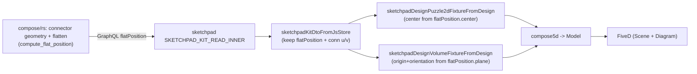

# Link Compose Relative Data Model to Puzzle 5D Absolute Data Model

## Problem (verified)

The Design app already renders compose designs through Puzzle 5D (`compose5d` -> `FiveD`), but the relative->absolute link is broken at the root:

- `compose/rs` `flat_position()` only echoes the stored relative `position` and `flatten` is `not_implemented` ([lib.rs](compose/client/lib/rs/lib.rs) L3703, L3903, L17181). Connected (`linked`) pieces therefore have no absolute pose.
- The compose `Port`/`Connector` model carries **no geometry** (no point/direction) in rs ([lib.rs](compose/client/lib/rs/lib.rs) L2896, L2966) or GraphQL ([schema.golden.graphql](compose/client/schema/graphql/schema.golden.graphql) L4568, L5230), so a 3D flatten is impossible today. `schema.yaml` already intends `port: { position }` ([schema.yaml](compose/client/schema/compose/schema.yaml) L169-173) but it is unimplemented.
- Sketchpad's read query `SKETCHPAD_KIT_READ_INNER` fetches only relative `position`, never `flatPosition`, and drops connection transform/offset params ([index.ts](compose/client/lib/sketchpad/js/index.ts) L10979). The fixture builders fall back to an arbitrary grid for any piece without a stored pose ([index.ts](compose/client/lib/sketchpad/js/index.ts) L12762, L12779).

The full reference algorithm exists in Go (`computeChildPlane` + `FlattenDesignDiff`, [main.go](compose/client/lib/go/main.go) L14107, L14209) and must be ported into rs (the sole owner of domain logic per the layering rules).

## Data flow (target)

## Layer 1 - Compose core: connector geometry

- rs ([lib.rs](compose/client/lib/rs/lib.rs)): add geometry to `Port` (L2896) and/or `Connector` (L2966) matching `schema.yaml` intent: `point` (Point), `direction` (Vector), `t` (Float). Wire them into install/decode (`from_*`), hashing, and the kit DTO read resolvers.
- GraphQL ([schema.golden.graphql](compose/client/schema/graphql/schema.golden.graphql)): add `point`, `direction`, `t` to `Connector` (L5230) and `position`/geometry to `Port` (L4568), mirroring rs exactly (golden schema is generated from rs; keep names/semantics identical per [graphql/AGENTS.md](compose/client/schema/graphql/AGENTS.md)).
- Fixtures/assets: hand-update kit fixtures (e.g. `compose/fixture/**`) so types carry connector geometry; no migration shims (greenfield rules).

## Layer 2 - Compose/rs: flatten (relative -> absolute)

- Implement the spanning forest if not already populated (`parent_piece`/`parent_connection`/`depth`/`path` exist on `Piece` L3642-3644 but are stubbed): BFS from fixed roots over the connection graph.
- Port `computeChildPlane` (matrix/quaternion helpers, gap/shift/rise/rotation/turn/tilt) and the BFS driver from Go `FlattenDesignDiff` into rs as the body of `compute_flat_position` / `flat_position` ([lib.rs](compose/client/lib/rs/lib.rs) L3703, L3903). Output absolute `plane` (origin+xAxis+yAxis) and `center` (u/v) for every piece, fixed and linked, using connector geometry from Layer 1.
- Implement the `flatten` design operation ([lib.rs](compose/client/lib/rs/lib.rs) L17181) to materialize absolute poses onto pieces (non-destructive `flatPosition` is the primary link; destructive `flatten` op is secondary).
- Keep all math in rs only (no flatten in js/react/sketchpad, per [rs/AGENTS.md](compose/client/lib/rs/AGENTS.md)).

## Layer 3 - Sketchpad Design app consumes absolute model

- Extend `SKETCHPAD_KIT_READ_INNER` ([index.ts](compose/client/lib/sketchpad/js/index.ts) L10979) to also select per piece `flatPosition { center { u v } plane { origin { x y z } xAxis { x y z } yAxis { x y z } } }` and per connection `gap shift rise rotation turn tilt u v` (for diagram offsets / future authoring).
- Update `sketchpadKitDtoFromJsStore` ([index.ts](compose/client/lib/sketchpad/js/index.ts) L11060) to retain `flatPosition` on each piece DTO and the connection params.
- Rework `sketchpadPieceDiagramUv` (L12762) and `sketchpadPieceSceneOrigin` (L12779) to read **absolute** `flatPosition.center` (2D u/v) and `flatPosition.plane.origin` (3D origin); drop the grid fallback to a deterministic-only-when-empty path.
- In `sketchpadDesignVolumeFixtureFromDesign` (L12914): derive object `orientation` quaternion from `flatPosition.plane` axes (xAxis, yAxis, zAxis = cross) instead of hardcoded identity, and apply `piece.scale`. This feeds `compose5d` -> `Part3dAspect.orientation/scale` ([puzzle/5d/react/index.tsx](puzzle/5d/react/index.tsx) L522). Add a small plane->quaternion presentation helper (rendering only; plane truth stays in rs).

## Layer 4 - Tests & validation

- rs: extend existing rs test module with flatten unit tests asserting absolute planes/centers match the Go reference for a known design fixture.
- sketchpad: extend the existing in-file test blocks ([index.ts](compose/client/lib/sketchpad/js/index.ts) ~L15652+) covering `sketchpadDesignPuzzle2dFixtureFromDesign` / `sketchpadDesignVolumeFixtureFromDesign` with connected pieces, asserting absolute positions (no grid fallback) and orientation from plane.
- Run the design-render e2e and confirm runtime via `[DEBUG]` logs (per repo rules, do not claim passing without running).

## Notes / conventions

- Open/resume a repo ticket via the repo MCP (associate to the appropriate goal from `repo://goals`); keep temp artifacts under the ticket folder; close with summary + touched files.
- Add code into existing files using `//#region` structuring; no new files; extend existing tests/fixtures in place.
- Register any new runnable command in `launch.json` following existing grouping (likely none new).
